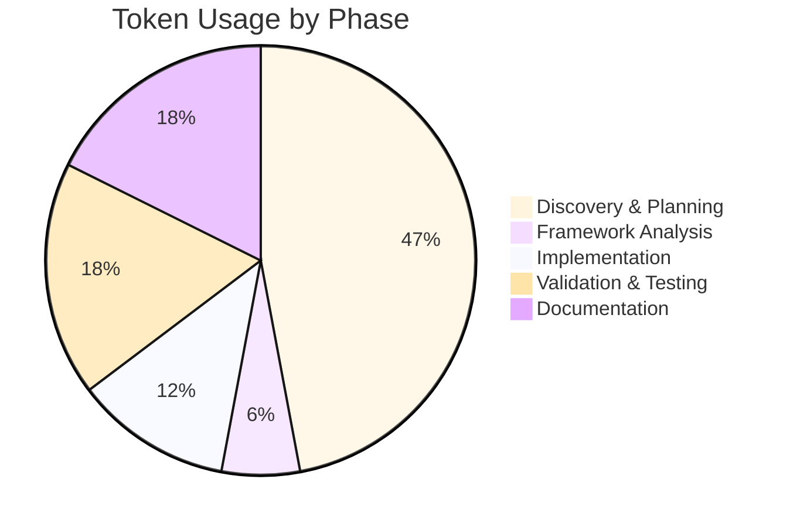

# Session Report: Phase 7 — XML Fix and Inbox Regression

**Date**: 2026-03-06 | **Time**: ~07:30–08:00 UTC+1 | **Agent**: GitHub Copilot (Claude Sonnet 4.6) |
**User**: Patrik Gfeller | **Feature**: client-discovery-filters

## Objectives

**Primary**: Diagnose and fix regression — Jellyfin server not appearing in openHAB Inbox after Phase 6 build

**Secondary**: Begin diagnosis of config page issue for created server thing

## Agent Workflow & Considerations

**Key Considerations**:

- Phase 6 build was SUCCESS (0 SAT errors, 2 commits pushed), but interactive testing revealed inbox was empty
- Root cause search via log grep → XML parse failure in `server-bridge-type.xml`
- openHAB's config-description XStream schema does NOT support `advanced` as an XML attribute on `<parameter>` — only as a child element `<advanced>true</advanced>`
- The `<parameter-group>` already uses the correct child-element form; parameters do not need per-parameter
  marking when the group itself is advanced

**Critical Decision Points**: 1

**Decisions Made**:

- (1) Context: 7 new filter parameters all had `advanced="true"` as XML attribute.
  Options: (a) Add `<advanced>true</advanced>` child element to each, (b) Simply remove the attribute
  since the group is already advanced. Choice: (b) — remove attribute only. Rationale: openHAB
  inherits `advanced` from the group; per-parameter repeat is redundant. Impact: minimal XML change,
  no logic change.

**Execution Pattern**: Sequential (diagnose → fix → build → deploy)

**Parallel Operations**: Read `server-bridge-type.xml` and `jellyfin.properties` in parallel during diagnosis

### Quality Assurance Workflow

**Validation Steps Executed**:

- [x] `mvn package -DskipTests` → BUILD SUCCESS
- [x] JAR deployed to `/home/pgfeller/Temp/openhab/addons/`
- [x] Inbox shows server discovery result → confirmed fix works
- [ ] Config page for created thing — investigation started, not yet resolved

**⚠️ Problematic Areas Identified**:

| Issue | Severity | Impact | Resolution | Status |
|-------|----------|--------|------------|--------|
| `advanced="true"` attr on 7 `<parameter>` elements | High | XML parse fails → thing type never registered → empty inbox | Removed all 7 invalid attributes | ✅ |
| Config page cannot be opened for server thing | Medium | Cannot configure token via UI | Under investigation | ⚠️ |
| REST API auth: `$OPENHAB_API_TOKEN` is for prod instance | Low | Cannot query dev REST API in terminal | Noted in `claude.md`; need dev-instance token | ⚠️ |

**Improvement Opportunities**:

- The `mvn i18n:generate-default-translations` step in `build.sh` fails and causes the build
  task to return non-zero even when `mvn package` succeeds — should be investigated separately

## Key Decisions

**Remove `advanced` attribute, not replace**: The `<parameter-group>` is already marked advanced;
in openHAB's UI all parameters in that group are shown under the advanced section. Adding
`<advanced>true</advanced>` to each parameter would be redundant. Simpler to just remove the
invalid attribute.

## Work Performed

**Files modified**:

- [server-bridge-type.xml](../../../src/main/resources/OH-INF/thing/types/server-bridge-type.xml)
  (modified) — removed `advanced="true"` XML attribute from 7 `<parameter>` elements
- [claude.md](../../../claude.md) (created) — workspace notes: prod vs dev API token distinction,
  active investigation state

**Changes**:

XML fix: removed `advanced="true"` attribute from these parameters in `clientDiscoveryFilters` group:
`discoverWebClients`, `discoverAndroidClients`, `discoverAndroidTvClients`, `discoverIosClients`,
`discoverKodiClients`, `discoverRokuClients`, `discoverOtherClients`

Note: `jellyfin.properties` was also modified (by user/formatter) but content was already correct —
no agent changes to that file.

## Challenges

**XML schema attribute vs child element**: openHAB's XStream-based XML parser for thing-type
descriptors rejects `advanced` as an attribute on `<parameter>` (only `<parameter-group>` supports
it as a child element). The error was buried in the WARN log at bundle startup:
`The attribute 'advanced' of the node 'parameter' is not supported or exists multiple times!`
Consequence was total parse failure → thing type never registered → `thingDiscovered()` produced
no inbox result. Fixed by removing all 7 invalid attributes.

**REST API auth for dev instance**: `$OPENHAB_API_TOKEN` in `~/.bashrc` authenticates against
the productive openHAB instance, not the local Docker dev container. Attempts to query
`/rest/config-descriptions/thing-type:jellyfin:server` returned 401. Need a dedicated token
generated from the dev UI. Documented in `claude.md`.

## Token Usage Tracking

| Phase | Tokens | Notes |
|-------|--------|-------|
| Discovery & Planning | ~8 000 | Log grep, XML grep, file reads |
| Framework Analysis | ~1 000 | openHAB XML schema research |
| Implementation | ~2 000 | 7-replacement edit + build |
| Validation & Testing | ~3 000 | Build output, deploy, log verify |
| Documentation | ~3 000 | claude.md + this report |
| **Total** | **~17 000** | - |

### Phase Breakdown Visualization

**Related Sessions**: Prior: `2026-03-06-phase-6-build-validation-and-tooling.md` | Sequence: 7 of N

**Optimization**: Parallel file reads during diagnosis reduced round-trips. Build task used
instead of raw `mvn` command due to shell simplification intercepting pipes.

## Time Savings (COCOMO II)

**Method**: Expert judgment | **Task**: XML debug + fix, Complexity: Medium, Manual: ~2 h

**Actual**: Elapsed: ~30 min, Active: ~20 min | **Saved**: ~1.5 h | **Confidence**: M

**Notes**: Root cause (XML attribute vs child element) is non-obvious without prior schema knowledge.

## Outcomes

✅ **Completed**: XML parse error fixed, server appears in Inbox, thing created

⚠️ **Partial**: Config page investigation — thing IS created and running (state:
`OFFLINE (CONFIGURATION_ERROR): No access token configured`) but config page fails to open in UI —
cause not yet determined (REST API query blocked by missing dev token)

⏸️ **Deferred**: Config page diagnosis — needs dev-instance API token; continuing on other machine

**Quality**: Build: ✅ PASS | Deploy: ✅ | Inbox: ✅ | Config page: ⚠️ open issue

## Follow-Up

**Immediate**:

1. Generate API token in dev openHAB UI → query `GET /rest/config-descriptions/thing-type:jellyfin:server`
   to check if config description is registered (H)
2. Check if `i18n:generate-default-translations` failure in `build.sh` is a real problem or
   expected for partial builds (L)

**Blocked**: Config page diagnosis — blocked on dev-instance API token (switching machines)

## Key Prompts

**Regression report**: `"With this latest build the discovered server does not show up in the inbox."`
→ Triggered log analysis → found XML WARN → identified `advanced` attribute bug

**Config page**: `"it is not possible to open the config page of the created thing"` →
Began REST API diagnosis → blocked by auth; recorded in claude.md for continuation

## Lessons Learned

- openHAB thing-type XML: `<parameter>` does NOT support `advanced` as an XML attribute.
  Use `<advanced>true</advanced>` as child element. Group-level `advanced` is inherited by
  all parameters in that group — no per-parameter annotation needed.
- Always verify XML parse succeeds (no WARN in startup log) before testing discovery.
- `$OPENHAB_API_TOKEN` env var may point to a different openHAB instance than the one under test.
  Document and use instance-specific tokens.
