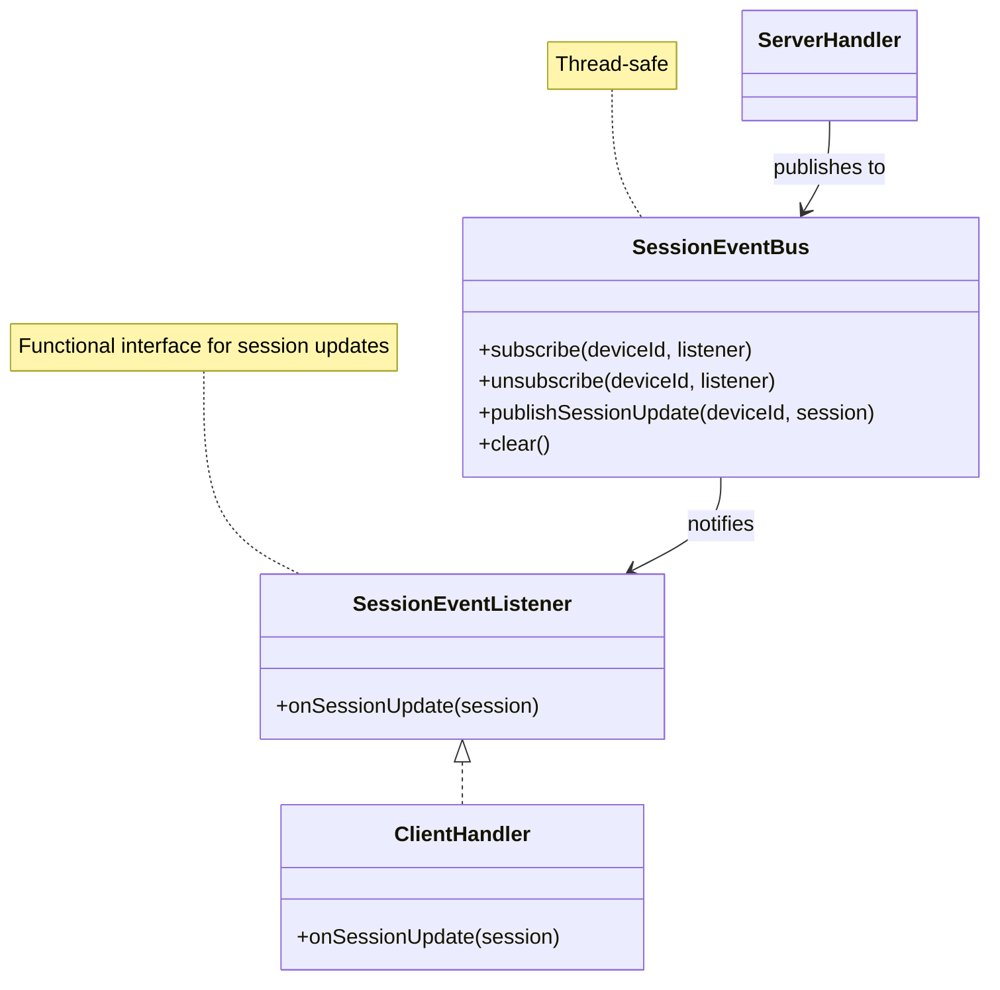

Fixes #17674

- <https://github.com/openhab/openhab-addons/issues/17674>

Replaces draft PR #17757

- <https://github.com/openhab/openhab-addons/pull/17757>

## Minimum Versions for API

| The minimum supported server version | API SDK Version           |
|-----------------------------------------------------------|----------------------------------|
| 10.9.0                                                              | 10.10.3 (Dez 10, 2024) |

## Phase 1 - "Evaluate Generator"

- [x] **Evaluate which generator to use.** As a first joice [Swagger](https://swagger.io) comes into mind, as it is used to create the official JAVA/Kotlin API
  - [x] [Swagger](https://swagger.io)
   The 1st attempt to generate the JAVA API for 10.8 did not work out of the box (well, what did you expect 😉. During the investigation I found a fork of the library; which seems to be more community driven:
   [OpenAPI Generator](https://openapi-generator.tech)
  - [x] [OpenAPI Generator](https://openapi-generator.tech)
    - [x] poc to generate code for multiple server versions
    ➡️ API Version to generate: 10.8.13
    ➡️ API Version to generate: 10.10.7
    - [x] Check if API generation can be integrated into the binding build process
        > A known issue makes it difficult to integrate API generation into the maven pipeline at the moment due to known issue: <https://github.com/OpenAPITools/openapi-generator/issues/18596>
  - [x] create generator configuration for first poc tests/experiments
    - [x] evaluate **[OpenAPI Generator](https://openapi-generator.tech)**: Integration into build process will not be in scope of this PR; instead shell script will be used to generate the code
    - [x] evaluate **[kiota](https://github.com/microsoft/kiota)**<br><br>
     > 🔀 2025-06: **[OpenAPI Generator](https://openapi-generator.tech)** will be used. The latest version can handle current and legacy API definition files. Template support makes it possible to adjust the generated code to our needs (e.g. license info, annotation libraries used, ...). [kiota](https://github.com/microsoft/kiota) does not provide additional value; and I have a personal preference for the alternative 😉.

## Phase 2 - "Server Discovery"

- [x] Understand and evaluate how to discover a server in the (local) network (legacy server)

   ```bash
   echo -e "who is JellyfinServer?" | socat - UDP-DATAGRAM:192.168.0.255:7359,broadcast
   ```

   ```json
   {
     "Address": "http://192.168.0.123:8096",
     "Id": "d1a5e0b9c2f8a7e3d4b6c9f0a1e2b3c7",
     "Name": "Jellyfin",
     "EndpointAddress": null
   }
   ```

- [x] Discuss how to handle generated code
  - Options:
    - Generate API Layer during build
     There was a known issue in the API generator tested during the POC. This prevented proper evaluation. However - even if this issue is now resolved imho there disadvantages following this approach:
      - build process gets more complex using an additional plugin
      - unnecessary build overhead
      - changes in the generator and the generated code would not be noticed
    - Generate and check-in the generated code<br><br>
   > 🔀 2025-09: **Generated API code will be checked-in**
   >
   > I'll mitigate the concern raised in <https://github.com/openhab/openhab-addons/pull/18628#issuecomment-3068632776> by removing all unnecessary generated classes and API versions once the binding is in a working state. This should reduce the size of the code. As it is generated code I assume an in depth review for the initial version is not required. In case the generated code changes in the future (e.g. new API version), it will be easier to compare the differences in case we need support for multiple versions. Due to the mono-repository nature of the add-on repository there are a lot of files.
   >
   > With this approach we reduce the build and runtime dependencies (Kotlin runtime and Android SDK), and are independent of the SDK release cycle.

- [x] **Server Discovery**
  - [X] Test with legacy server
  - [X] Test with current server

    ```log
    2025-07-12 23:57:57.804 [INFO ] [...ServerDiscoveryService] - Server Jellyfin @ http://192.168.0.118:8096
    2025-07-12 23:57:57.804 [INFO ] [...ServerDiscoveryService] - Server laptop @ http://192.168.0.165:8096
    ```

    It is possible to discover legacy and current server versions. Unfortunately I was not able to use the generic SSDP discovery - but had to fall back to a customized broadcast. Maybe this can be improved in the future.
  - [x] Detect Server-Version: Implementation uses generated API and works for "legacy" and most recent servers: 
  - [x] Check if version is supported; and create bridge
  - [x] Investigate possibilities and effort to use different models in the client handler to support "legacy" implementation.
    - [Poll in forum](https://community.openhab.org/t/jellyfin-problems-after-upgrade-to-10-9-no-longer-working-with-10-10/159494/2?u=patrik_gfeller)
      > 🔀 2025-09: **1st implementation will only support the new API**,  the code structure will be designed to support multiple API revisions.

## Phase 3 - "Client Discovery and Handlers"

- [X] Automatically discover clients connected to a server
- [X] Implement client handler (basic functionality)

  The prototype works well - but either we sacrifice responsiveness, or cause a lot of traffic/polling as the current implementation uses polling to detect playback state changes and session updates. This creates a noticeable delay (up to 60 seconds) for users monitoring media playback. Jellyfin's API supports WebSocket connections for real-time updates via `SessionsMessage` events, which can reduce latency to <1 second. As we use a message bus architecture we can prototype/implement the socket approach with polling as a fallback.

  - [x] Task 1: WebSocket Endpoint Research and Documentation
  - [x] Task 2: WebSocketTask Core Implementation
  - [x] Task 3: Message Parsing and Event Distribution
  - [x] Task 4: ServerHandler Integration and Lifecycle Management
  - [x] Task 5: Configuration, Reconnection Logic, and Documentation
  - [x] Task 6: Testing, Validation, and Plan Completion

## Phase 4 - "Client State Management Enhancement"

**Issue Identified:** Current ClientHandler incorrectly ties client status to bridge status only, causing all clients to show ONLINE when server is online, regardless of actual device connectivity.

**Solution:** Implement session presence tracking with timeout detection to accurately reflect device connectivity.

- [ ] Task 1: Core Session Timeout Logic
  - [ ] Add session tracking fields (lastSessionUpdateTimestamp, sessionTimeoutMonitor)
  - [ ] Update initialize() to start timeout monitor (30s interval)
  - [ ] Update onSessionUpdate() to record timestamps
  - [ ] Update bridgeStatusChanged() to check session presence
  - [ ] Add updateClientState() method (bridge + session + timeout checks)
  - [ ] Add checkSessionTimeout() method (mark OFFLINE if >60s)
  - [ ] Update dispose() to cancel monitor

- [ ] Task 2: WebSocket Exclusive Usage
  - [ ] Remove useWebSocket configuration option
  - [ ] Update TaskManager to always prefer WebSocket when CONNECTED
  - [ ] Verify SessionsMessage → SessionEventBus → ClientHandler flow
  - [ ] Test WebSocket fallback to ServerSyncTask

- [ ] Task 3: Testing and Validation
  - [ ] Unit tests for session timeout detection
  - [ ] Integration tests with real devices (TV ON/OFF, phone disconnect)
  - [ ] Performance validation (WebSocket latency <1s)
  - [ ] Update documentation

- [ ] Task 4: PR Description Update and Cleanup
  - [ ] Update PR description with Phase 4 completion
  - [ ] Clean up unused configuration code
  - [ ] Final validation and documentation

**Design Decision:** Use polling to discover new clients, then WebSocket exclusively for real-time updates. No configuration option (simplified architecture).



---

**Future Tasks:**

- [ ] Check if it is possible to make openHAB aware of the discovery mechanism, to offer to install the binding if a Jellyfin server is present in the network Information how to start is available in reply: <https://github.com/openhab/openhab-addons/pull/18628#issuecomment-3357789448>

---

## References

- OpenAPI Generators
  - [Swagger](https://swagger.io)
  - [OpenAPI Generator](https://openapi-generator.tech)
    - [openapi-filter](https://github.com/mermade/openapi-filter#readme)
  - [kiota](https://github.com/microsoft/kiota)
    - [Kiota documentation](https://learn.microsoft.com/en-us/openapi/kiota/)
    - [Microsoft OpenAPI Kiota Generator](https://mcr.microsoft.com/en-us/artifact/mar/openapi/kiota/tags) - Docker Image
- Jellyfin
  - [Jellyfin Kotlin SDK](https://github.com/jellyfin/jellyfin-sdk-kotlin)
  - [Jellyfin Typescript SDK](https://github.com/jellyfin/jellyfin-sdk-typescript)
  - [Jellyfin Forum](https://forum.jellyfin.org)
  - [Jellyfin API Documentation](https://api.jellyfin.org)

### Related Issues & PR's from other projects

- <https://github.com/OpenAPITools/openapi-generator/issues/18596>

- <https://github.com/jellyfin/jellyfin-sdk-kotlin/issues/1006>

- <https://github.com/jellyfin/jellyfin/pull/9764>
