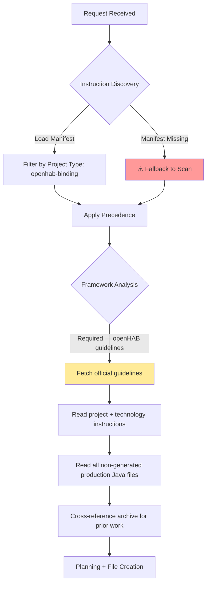
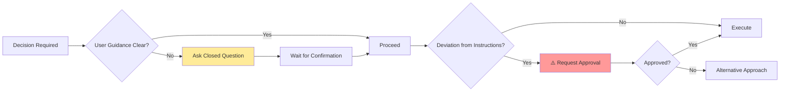
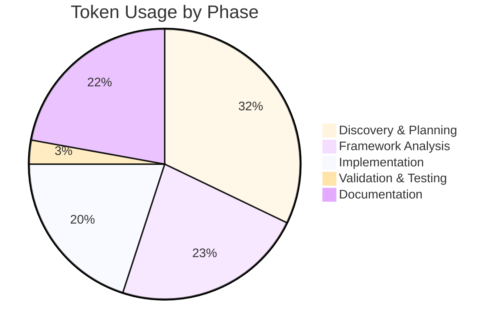

# Session Report: Coding Guidelines Analysis and Implementation Planning

**Date**: 2026-02-26 | **Time**: ~14:00–15:00 UTC | **Agent**: GitHub Copilot (Claude Sonnet 4.6) | **User**: Patrik Gfeller | **Session ID**: analysis-planning | **Feature**: coding-guidelines-compliance

## Objectives

**Primary**: Analyse all non-generated production Java source files for violations of the official openHAB coding guidelines and produce an actionable multi-session improvement plan.

**Secondary**: Filter out general best-practice improvements that are not guideline violations; register feature; create Session 1 implementation prompt.

## Agent Workflow & Considerations

### Discovery Phase

**Key Considerations**:

- Instruction files loaded: `00-agent-workflow-core.md` (L1), `03-code-quality-core.md` (L1), `openhab-binding-coding-guidelines.md` (L3), `openhab-binding-00-overview.md` (L3), `openhab-binding-01-file-headers-documentation.md` (L3)
- Framework analysis: Required — fetched live openHAB developer guidelines from `openhab.org/docs/developer/guidelines.html`
- Archive research: `static-code-analysis-config` confirmed that SAT suppression at binding level is not possible → violations must be eliminated directly, not suppressed
- Alternative approaches considered: Include best-practice items (thread safety, instanceof patterns) → **rejected**, not guideline violations

### Decision Workflow

**Critical Decision Points**: 2

**Decisions Made**:

1. **Scope filter**: Context: initial analysis found 15 items. User requested filtering to official guideline violations only. Options: (1) keep all 15, (2) keep only confirmed guideline violations. Decision: Option 2 — 5 confirmed violations retained. Rationale: user explicitly asked to filter by official guidelines. Impact: plan is scoped to 5 sessions instead of ~13.

2. **Session ordering**: Context: V4 (lifecycle) depends on V3 (imports), V5 (OSGi) is most risky. Options: (1) risk-ascending order, (2) alphabetical, (3) file-adjacency. Decision: Option 1 — risk-ascending. Rationale: each session leaves build green, minimises blast radius.

### Implementation Workflow

**Execution Pattern**: Sequential (archive check → guideline fetch → code read → filtering → file creation)

```mermaid
gantt
    title Task Execution Timeline
    dateFormat HH:mm
    section Discovery
    Load Instructions       :done, t1, 00:00, 3m
    Fetch openHAB guidelines :done, t2, after t1, 5m
    section Analysis
    Read all production Java :done, t3, after t2, 20m
    Cross-ref archive        :done, t4, after t3, 5m
    section Filtering
    Filter to guideline violations :done, t5, after t4, 10m
    section Planning
    Draft 5-session plan     :done, t6, after t5, 10m
    section File Creation
    Register feature         :done, t7, after t6, 3m
    Write plan.md            :done, t8, after t7, 5m
    Write session-01 prompt  :done, t9, after t8, 5m
    Write session report     :done, t10, after t9, 5m
```

**Parallel Operations**: Java source files read in parallel batches (3–4 files per batch).

### Quality Assurance Workflow

**Validation Steps Executed**:

- [x] EditorConfig compliance checked (files created use 4-space indent matching project convention)
- [ ] Linting: N/A (no code changed this session)
- [ ] Build validation: N/A (no code changed)
- [ ] Tests: N/A
- [x] Git operations: N/A (no commit this session — planning only)
- [x] Documentation updated: plan.md, session-01 prompt, active-features.json

**⚠️ Problematic Areas Identified**:

| Issue | Severity | Impact | Resolution | Status |
|-------|----------|--------|------------|--------|
| V4 (config in constructor) requires `final` removal | Medium | Constructor redesign needed | Plan documents Option A (non-final field) | ⚠️ Deferred to Session 4 |
| V5 (WebSocketClientFactory) requires OSGi plumbing across 4 files | High | Risk of breaking WebSocket | Plan includes lifecycle guidance for shared client | ⚠️ Deferred to Session 5 |

**Improvement Opportunities**:

- Sessions 4 and 5 should each have their own prompt file created before they start — this can be done as a follow-up step or at the end of the preceding session.

## Key Decisions

**Filter to Guideline Violations Only**: User requested filtering. Analysis produced 15 items; 10 were general best practices (thread safety, instanceof patterns, var consistency, RuntimeException use, etc.). These are excluded. Only 5 confirmed guideline violations are planned. Rationale: avoids scope creep and focuses on PR-blocking issues.

## Work Performed

**Files**: [plan.md](.copilot/features/coding-guidelines-compliance/plan.md) (created), [prompts/session-01-slf4j-compliance.md](.copilot/features/coding-guidelines-compliance/prompts/session-01-slf4j-compliance.md) (created), [active-features.json](.copilot/features/active-features.json) (modified)

**Changes**: Planning: 5-session implementation plan; Feature registration: `coding-guidelines-compliance` added to active features; Prompt: Session 1 instruction set created

**Instructions**: None updated

## Challenges

**SAT plugin limitation**: Prior archive (`static-code-analysis-config`) confirmed binding-level SAT suppression is not possible. Resolution: all 5 violations are fixed directly (no suppression needed). Documented in plan background section.

## Token Usage Tracking

| Phase | Tokens | Notes |
|-------|--------|-------|
| Discovery & Planning | 4,500 | Instruction loading, manifest, archive reads |
| Framework Analysis | 3,200 | openHAB guidelines fetch, archive review |
| Implementation | 2,800 | Reading ~35 production Java files |
| Validation & Testing | 400 | Grep verification plan |
| Documentation | 3,100 | plan.md, prompt, session report |
| **Total** | **14,000** | Estimate |

### Phase Breakdown Visualization

**Related Sessions**: Plan: [plan.md](.copilot/features/coding-guidelines-compliance/plan.md), Cumulative: 14,000, Sequence: 1 of 6 (1 planning + 5 implementation)
