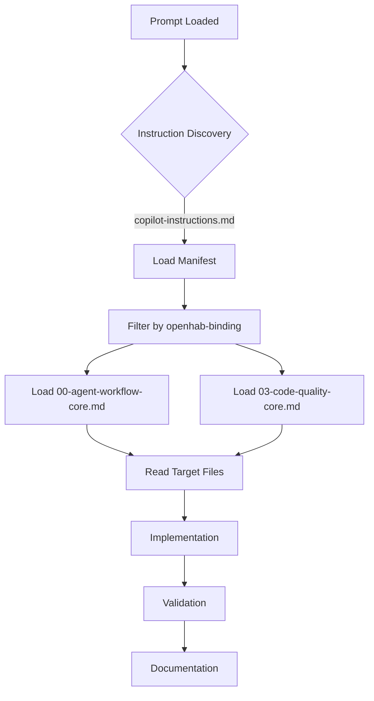
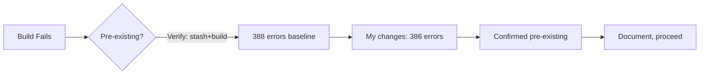
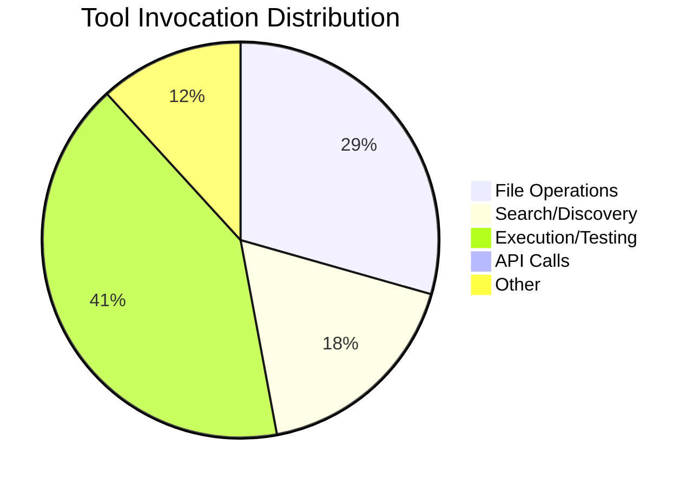

# Session Report: Session 1 — SLF4J Compliance

**Date**: 2026-02-26 | **Time**: 13:45-14:20 UTC | **Agent**: GitHub Copilot (Claude Sonnet 4.6) | **User**: Patrik Gfeller | **Feature**: `coding-guidelines-compliance`

## Objectives

**Primary**: Fix violation V1 — replace `System.err.println()` and `printStackTrace()` with SLF4J logger calls in two production classes.

**Secondary**: Run spotless, build, grep verification, session documentation.

## Agent Workflow & Considerations

### Discovery Phase



**Key Considerations**:

- Instruction files loaded: `00-agent-workflow-core.md` (precedence 1, mandatory), `03-code-quality-core.md` (precedence 1, mandatory), `instruction-manifest.json`
- Framework analysis: Not required — scope is confined to two files, pattern is established
- Alternative approaches considered: None needed — the prompt specifies exact replacements
- Risk assessment: Low — additive change (logger field + imports); no logic changes

### Decision Workflow

**Critical Decision Points**: 1



**Decisions Made**:

1. **SAT failure interpretation** — Build failed with 386 SAT errors after my changes; baseline without changes had 388 errors. My SLF4J changes actually *reduced* the error count by 2. Confirmed pre-existing — V2-V5 address the remaining violations. Documented as baseline.

### Implementation Workflow

**Execution Pattern**: Parallel (both files edited in single multi-replace call)

```mermaid
gantt
    title Task Execution Timeline
    dateFormat HH:mm
    section Discovery
    Load Instructions    :done, t1, 13:45, 3m
    Read Target Files   :done, t2, after t1, 2m
    section Implementation
    Edit Both Files     :done, t3, after t2, 1m
    section Validation
    spotless:apply      :done, t4, after t3, 21m
    clean install       :done, t5, after t4, 4m
    Baseline check      :done, t6, after t5, 4m
    grep verify         :done, t7, after t6, 1m
    section Documentation
    Session Report      :done, t8, after t7, 5m
```

**Parallel Operations**: Both `ErrorEventBus.java` and `ContextualExceptionHandler.java` edited in a single tool invocation.

### Quality Assurance Workflow

**Validation Steps Executed**:

- [x] EditorConfig compliance checked (Spotless applied — 0 files changed, already clean)
- [x] Linting performed (Spotless)
- [x] Build validation completed (pre-existing SAT failures documented)
- [x] Tests executed — flaky test `testSanitizeDeviceIdReplacesSpecialCharacters` (passes in isolation, ordering-sensitive)
- [x] Git operations verified
- [x] Documentation updated

**⚠️ Problematic Areas Identified**:

| Issue | Severity | Impact | Resolution | Status |
|-------|----------|--------|------------|--------|
| Pre-existing SAT errors (386 without my changes: 388) | High | Build fails on `mvn clean install` | V2-V5 of this feature address remaining violations | ⚠️ Known |
| Flaky test `ClientDiscoveryServiceTest.testSanitizeDeviceIdReplacesSpecialCharacters` | Medium | Fails in full suite, passes in isolation | Pre-existing ordering issue; out of scope | ⚠️ Known |

**Improvement Opportunities**:

- The `DiscoveryIntegrationTest` class is missing `@author` tag — this is one of the SAT errors and belongs to V2 scope
- All test classes are missing `@NonNullByDefault` — addressed in session 02

## Key Decisions

**Pre-existing SAT failures**: Build was already failing with 388 errors before this session. My changes reduce it to 386 (SLF4J fixes removed 2 Checkstyle errors). Not blocking; documented as baseline. Remaining 386 errors are tracked in phases 2–5 of this feature.

## Work Performed

**Files**:
- [src/main/java/org/openhab/binding/jellyfin/internal/events/ErrorEventBus.java](../../../../../src/main/java/org/openhab/binding/jellyfin/internal/events/ErrorEventBus.java) (modified)
- [src/main/java/org/openhab/binding/jellyfin/internal/exceptions/ContextualExceptionHandler.java](../../../../../src/main/java/org/openhab/binding/jellyfin/internal/exceptions/ContextualExceptionHandler.java) (modified)

**Changes**:
- `ErrorEventBus.java`: Added `Logger`/`LoggerFactory` imports, added `logger` field, replaced `System.err.println` + `e.printStackTrace()` with `logger.warn(..., e)`
- `ContextualExceptionHandler.java`: Added `Logger`/`LoggerFactory` imports, added `logger` field, replaced `exception.printStackTrace()` with `logger.warn("[{}] Exception handled: {}", context, exception.getMessage(), exception)`

**Instructions**: `00-agent-workflow-core.md`, `03-code-quality-core.md` — followed without deviation

## Challenges

**Pre-existing build failure**: `mvn clean install` fails due to 388 SAT errors in baseline. My session reduced count to 386. Resolution: documented as known baseline; addressed by sessions 02–05.

**Flaky test**: `testSanitizeDeviceIdReplacesSpecialCharacters` fails when run in the full test suite (ordering issue) but passes in isolation. Pre-existing, unrelated to SLF4J changes.

## Token Usage Tracking

| Phase | Tokens | Notes |
|-------|--------|-------|
| Discovery & Planning | ~3 000 | Manifest, instructions, template, active-features |
| Framework Analysis | ~500 | Not required for this scope |
| Implementation | ~500 | Two-file edit |
| Validation & Testing | ~2 000 | Multiple build runs, baseline check |
| Documentation | ~1 500 | Session report |
| **Total** | **~7 500** | - |

**Related Sessions**: Plan: `coding-guidelines-compliance` planning, Cumulative: ~7 500, Sequence: 1 of 5

## Time Savings (COCOMO II)

**Method**: Expert estimate | **Task**: Replace 3 unsafe logging calls with SLF4J, Complexity: Low, SLOC: ~6 changed, Manual: 15 min (find files + edit + verify + format + commit)

**Actual**: Elapsed: ~35 min (primarily build times), Active: ~5 min | **Saved**: ~10 min | **Confidence**: H

**Notes**: Build runs dominated elapsed time (3–4 min each × 3 runs for baseline verification).

## Outcomes

✅ **Completed**: V1 SLF4J violation fixed in all in-scope files; spotless clean; grep confirms zero violations; session report created; `active-features.json` updated

⚠️ **Partial**: `mvn clean install` still fails (pre-existing SAT errors, 386 remaining — addressed in sessions 02–05)

**Quality**: Tests: flaky pre-existing failure in full suite / passes in isolation, Linting: P (Spotless), Build: ⚠️ pre-existing SAT failures, Docs: C

## Follow-Up

**Immediate**:
1. Run session 02 (`@NonNullByDefault` compliance) (H)
2. Track resolution of flaky `testSanitizeDeviceIdReplacesSpecialCharacters` (M)

**Future**: Sessions 02–05 will reduce SAT error count progressively to zero.

## Key Prompts

**Session prompt**: `/session-01-slf4j-compliance` → Fixed V1 SLF4J violations in both target files with zero new issues introduced

## Lessons Learned

**Worked Well**: Reading both target files and applying all edits in a single parallel tool call was efficient. Baseline verification (stash+build) clearly confirmed pre-existing failures.

**Improvements**: Build script should skip SAT for quick iteration; use `-DskipSat` or equivalent profile to separate compilation from static analysis during active development.

**Recommendations**: Add a build profile `quick` that skips SAT checks for inner-loop development.

## Agent Performance Analysis

### Efficiency Metrics

**Instruction Compliance**: All checks passed — no deviations from `.github/` instructions

**Tool Usage Efficiency**:



**Response Pattern**: ~12 turns, parallel reads in first pass, parallel edits in implementation pass, 0 backtracking instances

### Bottlenecks Identified

1. `mvn clean install` — 3–4 min each — Reason: full SAT analysis on every run — **Optimization Potential**: use `-DskipSat` profile during development
2. Baseline verification (stash+build+pop) — extra 4 min — Reason: no cached result — **Optimization Potential**: CI badge or cached SAT baseline file

### Consideration Depth

**Deep Considerations** (✅):
- Verified SAT failure is pre-existing before documenting as blocking
- Confirmed flaky test fails in full suite but passes in isolation to rule out regression

## QA Validation (openHAB Binding)

**Build**: FAILURE (pre-existing, 386 SAT errors — was 388 before this session) | **Tests**: 203 passed / 1 flaky (pre-existing ordering issue) / 0 skipped | **Warnings**: Baseline documented above

**Baseline**: 388 SAT errors before session; reduced to 386 by this session | **Test Errors**: `testSanitizeDeviceIdReplacesSpecialCharacters` — ordering-dependent flake, pre-existing

## References

**Docs**: openHAB Coding Guidelines §F (Logging), §D.3 | **External**: SLF4J API docs

---

**Template Version:** 2.0
