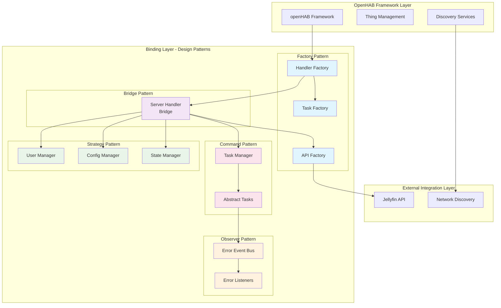
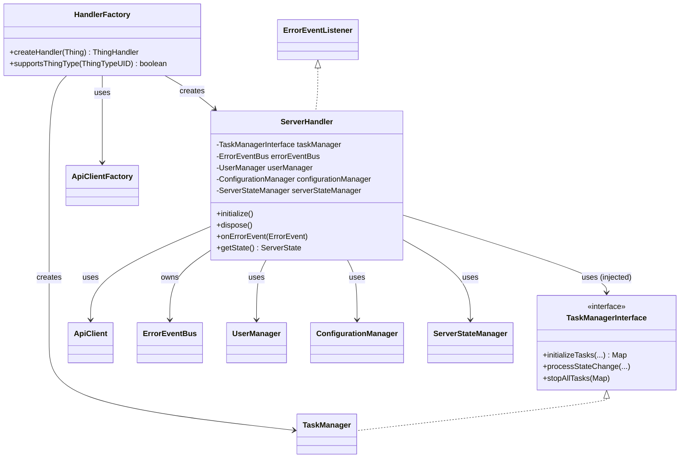
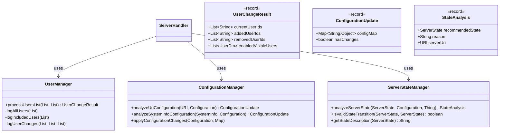
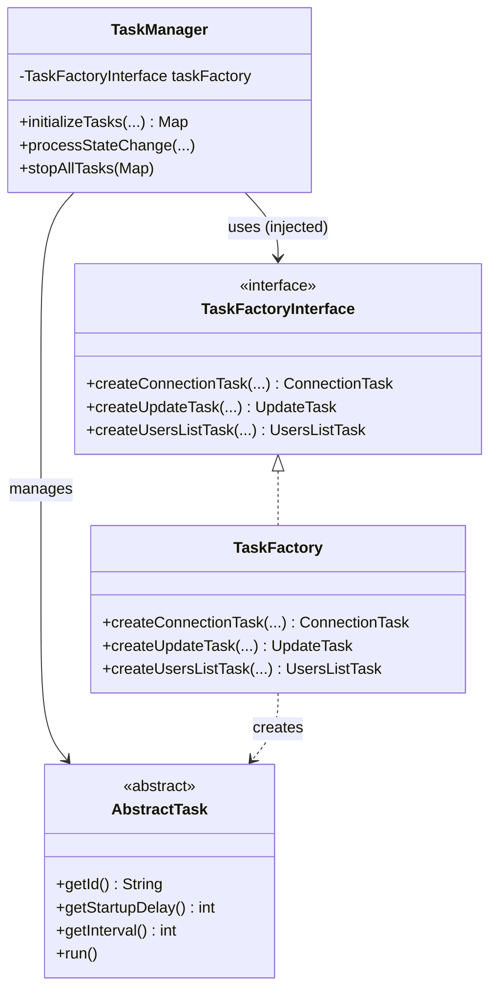
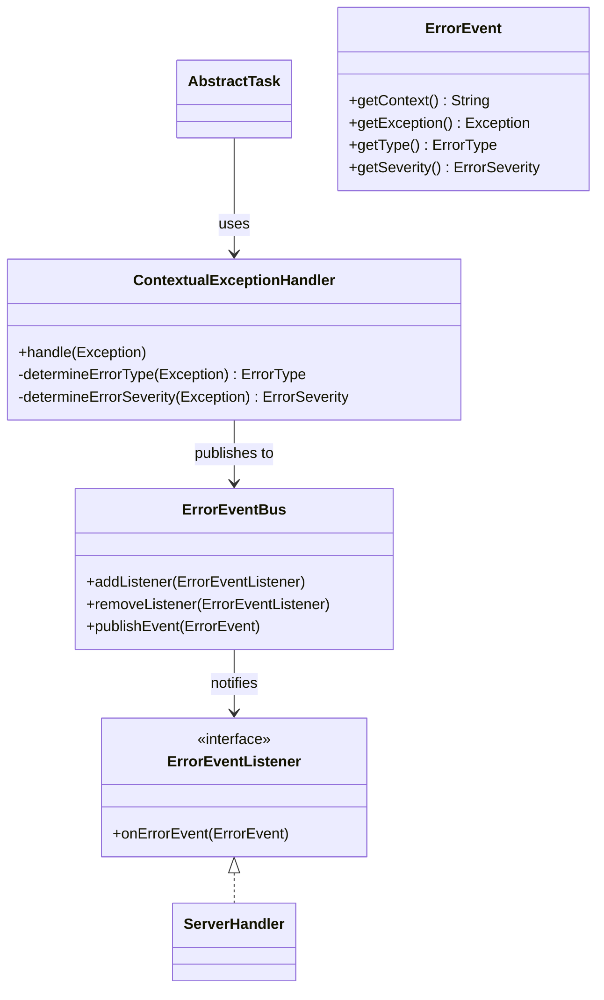
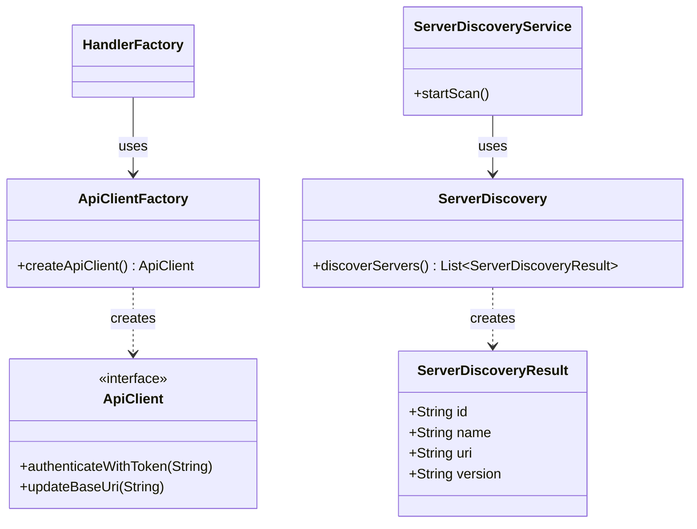

# Jellyfin Binding Contribution Guide

This document provides information for developers who want to contribute to the Jellyfin binding for openHAB.

## Architecture Diagrams

The Jellyfin binding follows a modular architecture with clear separation of concerns.
The following diagrams show different aspects of the system:

### Architectural Patterns Overview

This high-level diagram shows the main architectural patterns and design principles:

### Core Handler Architecture

This diagram shows the main handler structure and dependency injection:

### Utility Classes Architecture

This diagram shows the extracted utility classes that handle specific responsibilities:

### Task Management Architecture

This diagram shows the task management system:

### Error Handling Architecture

This diagram shows the event-driven error handling system:

### Discovery and API Architecture

This diagram shows the discovery services and API communication:

## Key Components

### Core Architecture Components

1. **HandlerFactory**: Creates thing handlers for the binding using proper dependency injection to create TaskFactory, TaskManager, and ServerHandler instances.

2. **ServerHandler**: Main bridge handler for Jellyfin servers that orchestrates server communication and state management.
   Implements `ErrorEventListener` for event-driven error handling and uses utility classes for separation of concerns.

3. **TaskManagerInterface/TaskManager**: Interface and implementation for task management operations, enabling dependency inversion and better testability.
   Acts as the central coordinator for all task-related operations.

4. **TaskFactoryInterface/TaskFactory**: Interface and implementation for creating task instances, enabling better extensibility and testing using instance methods with proper interface implementation.

### Utility Classes (Extracted for Better Maintainability)

1. **UserManager**: Handles user filtering, change detection, and logging.
   Processes user lists from the server and tracks additions/removals of enabled and visible users.

2. **ConfigurationManager**: Manages configuration updates from URIs and SystemInfo.
   Analyzes configuration changes and provides immutable configuration update objects.

3. **ServerStateManager**: Handles server state determination and validation.
   Analyzes server configuration to recommend appropriate states and validates state transitions.

### API and Communication Components

1. **ApiClientFactory/ApiClient**: Creates and provides API client instances for different server versions.
   Handles communication with the Jellyfin server and manages authentication.

2. **ServerDiscoveryService**: Discovers Jellyfin servers on the network using UDP broadcasts.

3. **AbstractTask**: Base class for all tasks that can be scheduled for execution.

### Error Handling Components

1. **ErrorEventBus**: Central event bus for error events using the Observer pattern, providing loose coupling between error producers and consumers.

2. **ContextualExceptionHandler**: Intelligent exception handler that categorizes exceptions by type and severity, then publishes events to the error event bus.

3. **ErrorEvent**: Event object that encapsulates exception information with context, type, and severity for better error handling.

## Architecture Overview

The binding follows a **modular architecture with clean separation of concerns**, **event-driven error handling**, and **dependency injection** for better SOLID compliance:

### Core Design Principles

- **Single Responsibility**: Each class has a focused, well-defined responsibility
- **Open/Closed**: New task types and management strategies can be added without modifying existing code
- **Liskov Substitution**: All tasks extend AbstractTask and can be used interchangeably
- **Interface Segregation**: Focused interfaces (TaskManagerInterface, TaskFactoryInterface, ErrorEventListener)
- **Dependency Inversion**: ServerHandler depends on abstractions, not concrete implementations

### Component Interactions

- **ServerHandler** acts as the main orchestrator, delegating specific responsibilities to utility classes
- **UserManager** processes user lists and tracks changes independently from the main handler logic
- **ConfigurationManager** handles all configuration analysis and updates from various sources
- **ServerStateManager** manages state transitions and validations with clear reasoning
- **TaskManager** integrates **TaskFactoryInterface** to provide a single point of coordination for task creation and management
- **TaskFactory injection** into TaskManager creates cleaner separation: ServerHandler → TaskManager → TaskFactory → Tasks
- **ServerState** enum defines which tasks should be active for each server state
- Tasks are created with **ContextualExceptionHandler** instances for intelligent error categorization
- **ApiClient** provides the communication layer with version-specific implementations

### Utility Class Benefits

- **Improved Maintainability**: Each utility class handles a single responsibility (user management, configuration, state management)
- **Better Testability**: Utility classes can be unit tested independently with mock data
- **Reduced File Size**: Main ServerHandler reduced from 465 to 384 lines while maintaining all functionality
- **Enhanced Readability**: Complex logic is extracted into focused, well-named classes
- **SOLID Compliance**: Each utility class follows Single Responsibility Principle

### Error Handling Architecture (Observer Pattern)

- **ContextualExceptionHandler** categorizes exceptions and publishes **ErrorEvent** objects
- **ErrorEventBus** manages event distribution using thread-safe operations (CopyOnWriteArrayList)
- **ServerHandler** implements **ErrorEventListener** to react to error events with appropriate state changes
- **No circular dependencies**: Tasks → ContextualExceptionHandler → ErrorEventBus → ServerHandler (one-way flow)

### Benefits of Modular Architecture

1. **Enhanced Testability**: All dependencies can be mocked/stubbed through interfaces, and utility classes can be tested independently
2. **Better Extensibility**: New task types and management strategies can be added easily without affecting core handler logic
3. **Improved Maintainability**: Clear separation of concerns with utility classes handling specific responsibilities
4. **SOLID Compliance**: Full adherence to all SOLID principles with Single Responsibility Principle enforced through utility extraction
5. **Reduced Complexity**: Main handler file reduced from 465 to 384 lines while preserving all functionality
6. **Code Reusability**: Utility classes can potentially be reused across different handlers or components

## API Version Support

The Jellyfin binding is designed to work with multiple server API versions.
The current implementation supports:

1. **Current API**: For Jellyfin server versions 10.9.0 and newer (including 10.10.x)

The API client code is automatically generated from the OpenAPI specifications using the OpenAPI Generator.
This approach allows for easier adaptation to API changes and better maintainability compared to using external SDKs.

## Development Workflow

When contributing to this binding, please follow these guidelines:

1. Make sure your code follows the openHAB code style and conventions.
2. Write unit tests for your changes.
3. Update documentation as needed.
4. Submit a pull request with a clear description of your changes.

## AI Agent Development Guidelines

**MANDATORY RULE FOR AI AGENTS**: Every class, interface, enum, or annotation must be created in its own dedicated file.
This is a fundamental Java requirement and helps maintain:

- **Clear organization**: Each file has a single, well-defined purpose
- **Better maintainability**: Changes to one class don't affect others
- **Easier navigation**: Developers can quickly locate specific types
- **Compilation compatibility**: Java requires public types to be in files with matching names
- **Code review efficiency**: Changes are easier to track and review

**Examples:**

- ✅ `TaskManagerInterface.java` contains only the `TaskManagerInterface`
- ✅ `TaskManager.java` contains only the `TaskManager` class
- ✅ `ServerState.java` contains only the `ServerState` enum
- ❌ Multiple classes, interfaces, or enums in a single file

**Exception**: Inner classes, inner interfaces, and inner enums are allowed within their containing class file, but should be used sparingly and only when they are tightly coupled to the containing class.
