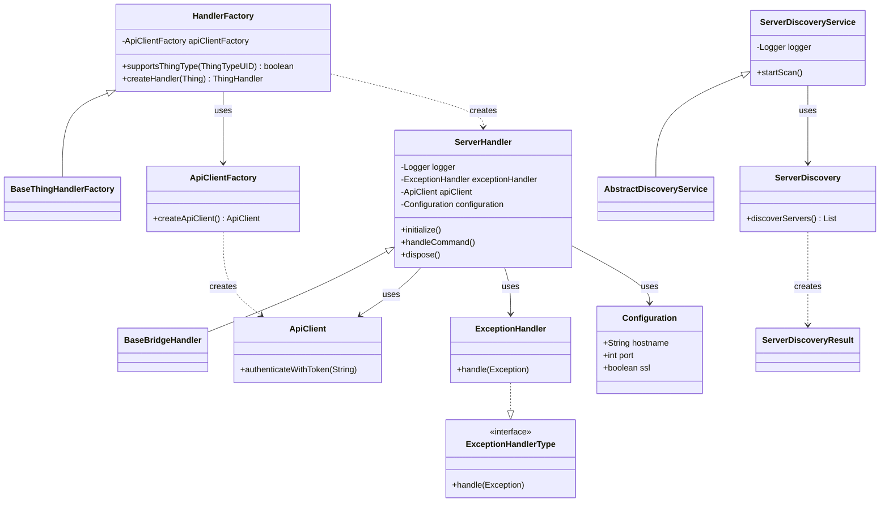

# Jellyfin Binding Contribution Guide

This document provides information for developers who want to contribute to the Jellyfin binding for openHAB.

## Class Diagram

The following diagram shows the main classes and their relationships within the Jellyfin binding:

## Key Components

1. **HandlerFactory**: Creates thing handlers for the binding.
2. **ServerHandler**: Main bridge handler for Jellyfin servers.
3. **ApiClientFactory**: Creates API client instances.
4. **ApiClient**: Handles communication with the Jellyfin server.
5. **ServerDiscoveryService**: Discovers Jellyfin servers on the network.
6. **ExceptionHandler**: Handles exceptions that occur during binding operation.

## Development Workflow

When contributing to this binding, please follow these guidelines:

1. Make sure your code follows the openHAB code style and conventions.
2. Write unit tests for your changes.
3. Update documentation as needed.
4. Submit a pull request with a clear description of your changes.
