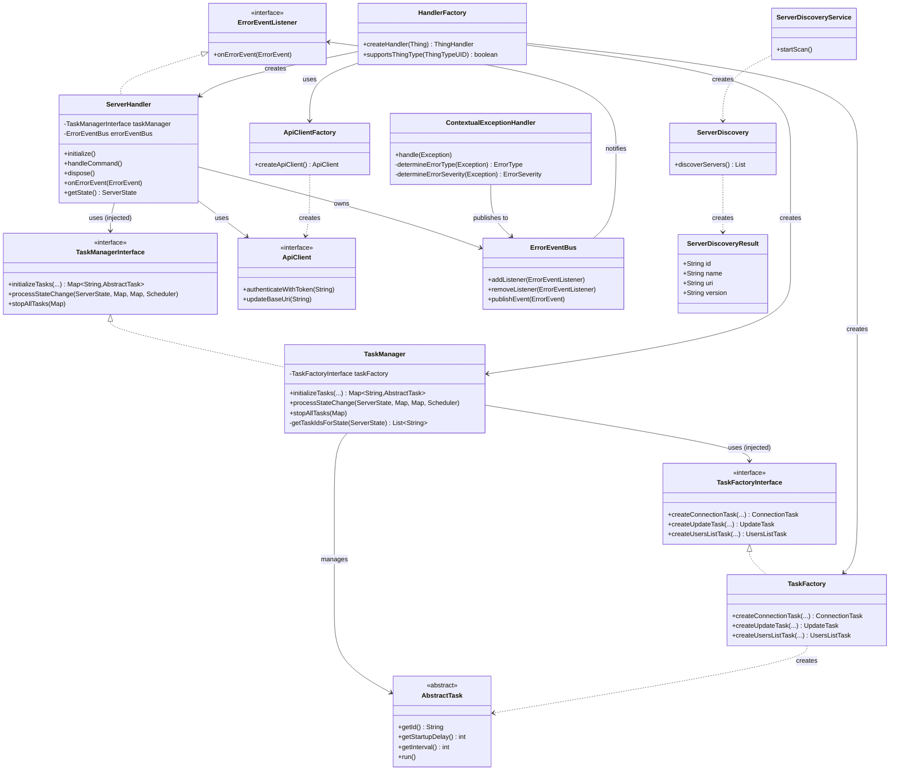

# Jellyfin Binding Contribution Guide

This document provides information for developers who want to contribute to the Jellyfin binding for openHAB.

## Class Diagram

The following diagram shows the main classes and their relationships within the Jellyfin binding:

## Key Components

1. **HandlerFactory**: Creates thing handlers for the binding.
   Uses proper dependency injection to create TaskFactory, TaskManager, and ServerHandler instances.
2. **ServerHandler**: Main bridge handler for Jellyfin servers that orchestrates server communication and state management.
   Implements `ErrorEventListener` for event-driven error handling.
   Uses dependency injection for better testability.
3. **TaskManagerInterface**: Interface for task management operations, enabling dependency inversion and better testability.
4. **TaskManager**: Implementation of TaskManagerInterface that integrates TaskFactory for clean architecture.
   Acts as the central coordinator for all task-related operations including task creation and lifecycle management.
   Uses instance-based approach with dependency injection (no static methods).
5. **TaskFactoryInterface**: Interface for creating task instances, enabling better extensibility and testing.
6. **TaskFactory**: Implementation of TaskFactoryInterface that creates various task instances used for server communication.
   Uses instance methods with proper interface implementation (no static factory pattern).
7. **ApiClientFactory**: Creates API client instances for different API versions.
8. **ApiClient**: Handles communication with the Jellyfin server and manages authentication.
9. **ServerDiscoveryService**: Discovers Jellyfin servers on the network using UDP broadcasts.
10. **AbstractTask**: Base class for all tasks that can be scheduled for execution.
11. **ErrorEventBus**: Central event bus for error events using the Observer pattern, providing loose coupling between error producers and consumers.
12. **ContextualExceptionHandler**: Intelligent exception handler that categorizes exceptions by type and severity, then publishes events to the error event bus.
13. **ErrorEvent**: Event object that encapsulates exception information with context, type, and severity for better error handling.

## Architecture Overview

The binding follows a **state-driven architecture with event-driven error handling** and **dependency injection** for better SOLID compliance:

### Core Design Principles

- **Single Responsibility**: Each class has a focused, well-defined responsibility
- **Open/Closed**: New task types and management strategies can be added without modifying existing code
- **Liskov Substitution**: All tasks extend AbstractTask and can be used interchangeably
- **Interface Segregation**: Focused interfaces (TaskManagerInterface, TaskFactoryInterface, ErrorEventListener)
- **Dependency Inversion**: ServerHandler depends on abstractions, not concrete implementations

### Component Interactions

- **ServerHandler** manages the overall server connection lifecycle and uses injected **TaskManagerInterface** for all task operations
- **TaskManager** integrates **TaskFactoryInterface** to provide a single point of coordination for task creation and management
- **TaskFactory injection** into TaskManager creates cleaner separation: ServerHandler → TaskManager → TaskFactory → Tasks
- **ServerState** enum defines which tasks should be active for each server state
- Tasks are created with **ContextualExceptionHandler** instances for intelligent error categorization
- **ApiClient** provides the communication layer with version-specific implementations

### Error Handling Architecture (Observer Pattern)

- **ContextualExceptionHandler** categorizes exceptions and publishes **ErrorEvent** objects
- **ErrorEventBus** manages event distribution using thread-safe operations (CopyOnWriteArrayList)
- **ServerHandler** implements **ErrorEventListener** to react to error events with appropriate state changes
- **No circular dependencies**: Tasks → ContextualExceptionHandler → ErrorEventBus → ServerHandler (one-way flow)

### Benefits of Improved Architecture

1. **Enhanced Testability**: All dependencies can be mocked/stubbed through interfaces
2. **Better Extensibility**: New task types and management strategies can be added easily
3. **Improved Maintainability**: Clearer separation of concerns with TaskManager as central coordinator
4. **SOLID Compliance**: Full adherence to all SOLID principles
5. **Backward Compatibility**: Adapter pattern ensures existing code continues to work

## API Version Support

The Jellyfin binding is designed to work with multiple server API versions.
The current implementation supports:

1. **Current API**: For Jellyfin server versions 10.9.0 and newer (including 10.10.x)

The API client code is automatically generated from the OpenAPI specifications using the OpenAPI Generator.
This approach allows for easier adaptation to API changes and better maintainability compared to using external SDKs.

## Development Workflow

When contributing to this binding, please follow these guidelines:

1. Make sure your code follows the openHAB code style and conventions.
2. Write unit tests for your changes.
3. Update documentation as needed.
4. Submit a pull request with a clear description of your changes.

## AI Agent Development Guidelines

**MANDATORY RULE FOR AI AGENTS**: Every class, interface, enum, or annotation must be created in its own dedicated file.
This is a fundamental Java requirement and helps maintain:

- **Clear organization**: Each file has a single, well-defined purpose
- **Better maintainability**: Changes to one class don't affect others
- **Easier navigation**: Developers can quickly locate specific types
- **Compilation compatibility**: Java requires public types to be in files with matching names
- **Code review efficiency**: Changes are easier to track and review

**Examples:**

- ✅ `TaskManagerInterface.java` contains only the `TaskManagerInterface`
- ✅ `TaskManager.java` contains only the `TaskManager` class
- ✅ `ServerState.java` contains only the `ServerState` enum
- ❌ Multiple classes, interfaces, or enums in a single file

**Exception**: Inner classes, inner interfaces, and inner enums are allowed within their containing class file, but should be used sparingly and only when they are tightly coupled to the containing class.
