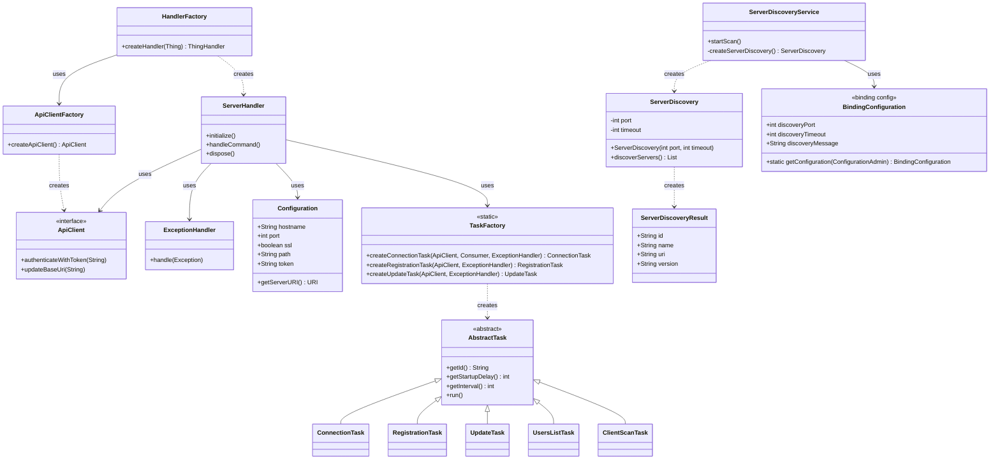

# Jellyfin Binding Contribution Guide

This document provides information for developers who want to contribute to the Jellyfin binding for openHAB.

## Class Diagram

The following diagram shows the main classes and their relationships within the Jellyfin binding:

## Key Components

1. **HandlerFactory**: Creates thing handlers for the binding.
2. **ServerHandler**: Main bridge handler for Jellyfin servers.
3. **ApiClientFactory**: Creates API client instances for different API versions.
4. **ApiClient**: Handles communication with the Jellyfin server and manages authentication.
5. **ServerDiscoveryService**: Discovers Jellyfin servers on the network using UDP broadcasts.
6. **TaskFactory**: Creates various task instances used for server communication.
7. **AbstractTask**: Base class for all tasks that can be scheduled for execution.
8. **BindingConfiguration**: Contains configuration settings for the binding.
9. **ExceptionHandler**: Handles exceptions that occur during binding operation.

## API Version Support

The Jellyfin binding is designed to work with multiple server API versions.
The current implementation supports:

1. **Current API**: For Jellyfin server versions 10.9.0 and newer (including 10.10.x)

The API client code is automatically generated from the OpenAPI specifications using the OpenAPI Generator.
This approach allows for easier adaptation to API changes and better maintainability compared to using external SDKs.

## Development Workflow

When contributing to this binding, please follow these guidelines:

1. Make sure your code follows the openHAB code style and conventions.
2. Write unit tests for your changes.
3. Update documentation as needed.
4. Submit a pull request with a clear description of your changes.
