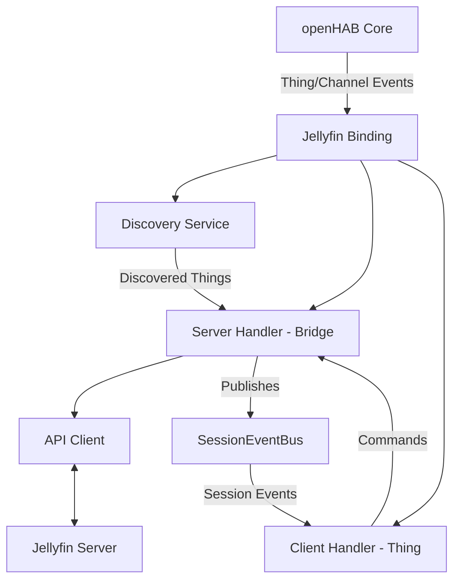
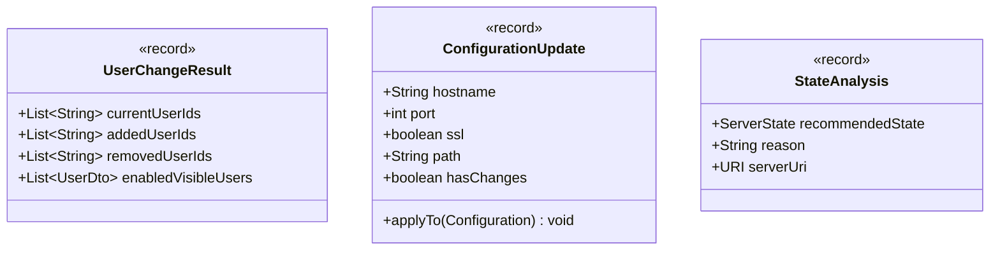

# Architectural Overview

## Table of Contents

- [Architectural Overview](#architectural-overview)
  - [Table of Contents](#table-of-contents)
  - [Overview](#overview)
  - [Architecture Diagram](#architecture-diagram)
  - [Main Components](#main-components)
    - [Server State Transitions](#server-state-transitions)
    - [Record Details](#record-details)
    - [Integration Points](#integration-points)
    - [Key Components (Summary)](#key-components-summary)

## Server State Transitions

The logic for determining the state of a Jellyfin server thing is documented in
detail in [Server State Transitions](architecture/server-state.md).
This includes the rules for transitioning between DISPOSED, DISCOVERED,
CONFIGURED, ERROR, and other states, as well as a Mermaid diagram visualizing
the process.
See the dedicated page for the full transition diagram and rules.

## Overview

The Jellyfin binding integrates the openHAB platform with a Jellyfin media server.
It enables discovery, control, and monitoring of Jellyfin devices and their media
playback states within openHAB.
The binding is structured to separate concerns between discovery, thing handling,
and communication with the Jellyfin server.

## Color Scheme for External Libraries

The architecture diagrams use consistent colors to identify classes from external libraries:

| Color      | Library               | Examples                                                                 |
| ---------- | --------------------- | ------------------------------------------------------------------------ |
| 🟠 Orange | openHAB Core          | `BaseBridgeHandler`, `BaseThingHandler`, `ThingHandler`, `Configuration` |
| 🔵 Blue   | Jetty WebSocket       | `AbstractTask`, `WebSocketListener`, `Session`                           |
| 🟢 Green  | openHAB Generated API | `SessionInfoDto`, `BaseItemDto`, `PlayerStateInfo`                       |

Internal binding classes (white/default) are distinct from external libraries.

## Architecture Diagram

## Main Components

- **Discovery Service**: Detects available Jellyfin servers and devices on the network.
- **Server Handler (Bridge)**: Manages the lifecycle and state of the Jellyfin server
  bridge thing.
  Handles authentication, server polling, and maintains the list of active client
  sessions.
  Publishes session updates to the SessionEventBus.
- **SessionEventBus**: Event bus for distributing session updates from ServerHandler
  to ClientHandler instances.
  Implements the Observer pattern for loose coupling between bridge and things.
- **Client Handler (Thing)**: Manages individual Jellyfin client devices as child
  things of the server bridge.
  Subscribes to SessionEventBus for session updates and updates channels accordingly.
  Delegates commands to the ServerHandler.
- **API Client**: Handles communication with the Jellyfin server using its REST API.

Auto-generated code in `internal.api.generated` is not described here.

For detailed diagrams and explanations, see:

- [Core Handler Architecture](architecture/core-handler.md):
    Overview of handler structure, dependency injection, and WebSocket lifecycle management.
- [WebSocket Architecture](architecture/websocket.md):
    Real-time updates via WebSocket with automatic reconnection, exponential backoff, and polling fallback.
- [Utility Classes Architecture](architecture/utility-classes.md):
    Focused classes for user management, configuration, state analysis, and state calculation.
- [State Calculation Architecture](architecture/state-calculation.md):
    Pure utility for transforming Jellyfin session data into openHAB channel states.
- [Configuration Management Architecture](architecture/configuration-management.md):
    Strategy pattern-based configuration extraction and management system.
- [Task Management Architecture](architecture/task-management.md):
    Task manager and factory design for extensibility, including WebSocket and polling task coordination.
- [Error Handling Architecture](architecture/error-handling.md):
    Event-driven error management using the Observer pattern.
- [Session Event Architecture](architecture/session-events.md):
    Event bus for session updates using the Observer pattern.
- [Discovery Architecture](architecture/discovery.md):
    Network discovery services and result registration.
- [API Architecture](architecture/api.md):
    API client abstraction and communication structure.

## Record Details

The following records are used for immutable data transfer and are detailed here
for clarity.
For their usage, see the
[Utility Classes Architecture](architecture/utility-classes.md).

These records are referenced by utility classes and handlers but are not shown in
the main architecture diagram for clarity.

## Integration Points

- The binding interacts with the openHAB core via thing and channel events.
- It communicates with the external Jellyfin server through the API client.
    The API client is responsible for all protocol-level details.
- Discovery and thing handlers are decoupled to ensure maintainability and
    clarity.

## Key Components (Summary)

- The binding uses a modular architecture with clean separation of concerns.
- Core handler logic is separated from utility classes and task management.
- Utility classes provide focused, testable logic for user management,
  configuration, and state analysis.
- Task management is handled by a dedicated manager and factory, supporting
    extensibility and testability.
- Error handling uses the Observer pattern for decoupled, event-driven error management.

For in-depth details, see the dedicated pages linked above.
