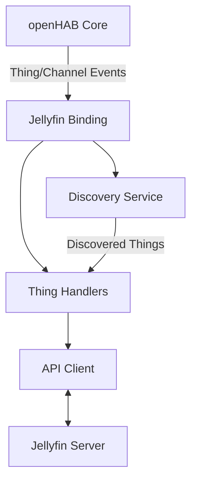
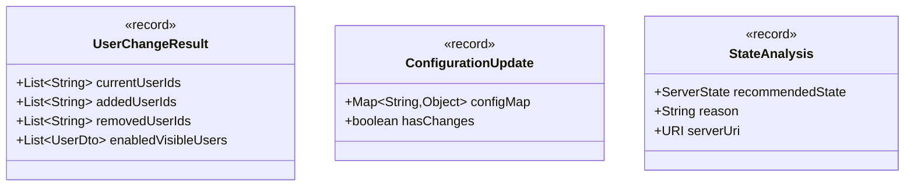

# Architectural Overview

## Table of Contents

- [Architectural Overview](#architectural-overview)
  - [Table of Contents](#table-of-contents)
  - [Overview](#overview)
  - [Architecture Diagram](#architecture-diagram)
  - [Main Components](#main-components)
  - [Record Details](#record-details)
  - [Integration Points](#integration-points)
  - [Key Components (Summary)](#key-components-summary)

## Overview

The Jellyfin binding integrates the openHAB platform with a Jellyfin media server.
It enables discovery, control, and monitoring of Jellyfin devices and their media
playback states within openHAB.
The binding is structured to separate concerns between discovery, thing handling,
and communication with the Jellyfin server.

## Architecture Diagram

```mermaid
flowchart TD
    OH[openHAB Core]
    JB[Jellyfin Binding]
    JD[Discovery Service]
    JH[Thing Handlers]
    JA[API Client]
    JS[Jellyfin Server]

    OH -->|Thing/Channel Events| JB
    JB --> JD
    JB --> JH
    JH --> JA
    JA <--> JS
    JD -->|Discovered Things| JH
    %% Note: Record members are omitted for clarity. See Record Details section.
```

## Main Components

- **Discovery Service**: Detects available Jellyfin servers and devices on the network.
- **Thing Handlers**: Manage the lifecycle and state of Jellyfin things (servers,
  devices, users, etc.).
  They expose channels for interaction.
- **API Client**: Handles communication with the Jellyfin server using its REST API.

Auto-generated code in `internal.api.generated` is not described here.

For detailed diagrams and explanations, see:

- [Core Handler Architecture](architecture/core-handler.md):
    Overview of handler structure and dependency injection.
- [Utility Classes Architecture](architecture/utility-classes.md):
    Focused classes for user management, configuration, and state analysis.
- [Task Management Architecture](architecture/task-management.md):
    Task manager and factory design for extensibility.
- [Error Handling Architecture](architecture/error-handling.md):
    Event-driven error management using the Observer pattern.
- [Discovery Architecture](architecture/discovery.md):
    Network discovery services and result registration.
- [API Architecture](architecture/api.md):
    API client abstraction and communication structure.

## Record Details

The following records are used for immutable data transfer and are detailed here
for clarity.
For their usage, see the
[Utility Classes Architecture](architecture/utility-classes.md).

```mermaid
classDiagram
    class UserChangeResult {
        <<record>>
        +List~String~ currentUserIds
        +List~String~ addedUserIds
        +List~String~ removedUserIds
        +List~UserDto~ enabledVisibleUsers
    }
    class ConfigurationUpdate {
        <<record>>
        +Map~String,Object~ configMap
        +boolean hasChanges
    }
    class StateAnalysis {
        <<record>>
        +ServerState recommendedState
        +String reason
        +URI serverUri
    }
```

These records are referenced by utility classes and handlers but are not shown in
the main architecture diagram for clarity.

## Integration Points

- The binding interacts with the openHAB core via thing and channel events.
- It communicates with the external Jellyfin server through the API client.
    The API client is responsible for all protocol-level details.
- Discovery and thing handlers are decoupled to ensure maintainability and
    clarity.

## Key Components (Summary)

- The binding uses a modular architecture with clean separation of concerns.
- Core handler logic is separated from utility classes and task management.
- Utility classes provide focused, testable logic for user management,
  configuration, and state analysis.
- Task management is handled by a dedicated manager and factory, supporting
    extensibility and testability.
- Error handling uses the Observer pattern for decoupled, event-driven error management.

For in-depth details, see the dedicated pages linked above.
