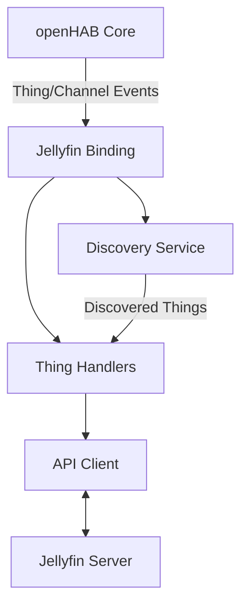

# Architectural Overview

## Table of Contents

- [Architectural Overview](#architectural-overview)
  - [Table of Contents](#table-of-contents)
  - [Overview](#overview)
  - [Architecture Diagram](#architecture-diagram)
  - [Main Components](#main-components)
  - [Integration Points](#integration-points)

## Overview

The Jellyfin binding integrates the openHAB platform with a Jellyfin media server.
It enables discovery, control, and monitoring of Jellyfin devices and their media playback states within openHAB.
The binding is structured to separate concerns between discovery, thing handling, and communication with the Jellyfin server.

## Architecture Diagram

```mermaid
flowchart TD
    OH[openHAB Core]
    JB[Jellyfin Binding]
    JD[Discovery Service]
    JH[Thing Handlers]
    JA[API Client]
    JS[Jellyfin Server]

    OH -->|Thing/Channel Events| JB
    JB --> JD
    JB --> JH
    JH --> JA
    JA <--> JS
    JD -->|Discovered Things| JH
```

## Main Components

- **Discovery Service**: Detects available Jellyfin servers and devices on the network.
- **Thing Handlers**: Manage the lifecycle and state of Jellyfin things (servers, devices, users, etc.) and expose channels for interaction.
- **API Client**: Handles communication with the Jellyfin server using its REST API.

    (Auto-generated code in `internal.api.generated` is not described here.)

## Integration Points

- The binding interacts with the openHAB core via thing and channel events.
- It communicates with the external Jellyfin server through the API client.
    The API client is responsible for all protocol-level details.
- Discovery and thing handlers are decoupled to ensure maintainability and clarity.
