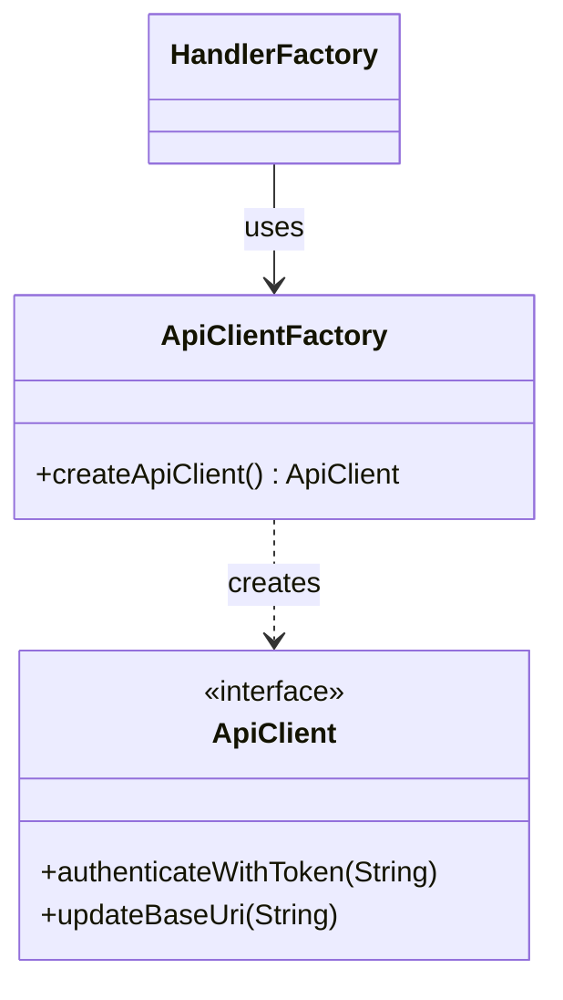

# API Architecture

This page documents the API client and communication structure in the Jellyfin binding.

## Summary

API communication is handled by a factory and client abstraction, supporting
version-specific implementations.
See the [architecture overview](../architecture.md) for context.
