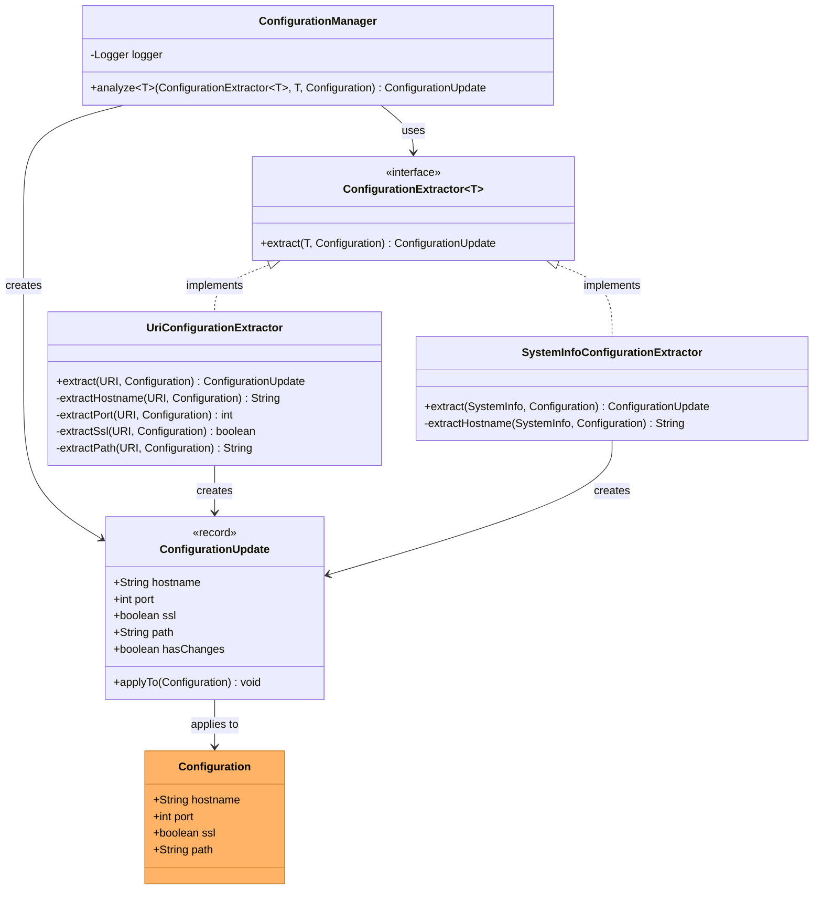

# Configuration Management Architecture

This page documents the configuration management system that handles extraction,
analysis, and application of configuration updates from various sources.

## Table of Contents

- [Configuration Management Architecture](#configuration-management-architecture)
  - [Table of Contents](#table-of-contents)
  - [Overview](#overview)
  - [Architecture Diagram](#architecture-diagram)
  - [Design Pattern](#design-pattern)
  - [Components](#components)
    - [ConfigurationManager](#configurationmanager)
    - [ConfigurationExtractor Interface](#configurationextractor-interface)
    - [ConfigurationUpdate Record](#configurationupdate-record)
    - [Concrete Extractors](#concrete-extractors)
  - [Usage](#usage)
  - [Benefits](#benefits)

## Overview

The configuration management system uses the Strategy pattern to extract
configuration data from different sources (URI, SystemInfo, etc.), analyze
changes against current configuration, and apply updates in a type-safe manner.

This architecture was introduced to replace direct configuration manipulation
with a more maintainable, testable, and extensible approach that separates
configuration extraction logic from configuration management.

## Architecture Diagram



## Design Pattern

The configuration management system implements the **Strategy Pattern**:

- **Context**: `ConfigurationManager` coordinates the extraction process
- **Strategy Interface**: `ConfigurationExtractor<T>` defines the contract
- **Concrete Strategies**: `UriConfigurationExtractor`,
  `SystemInfoConfigurationExtractor`
- **Result**: `ConfigurationUpdate` record contains extracted data and changes

This pattern allows adding new configuration sources without modifying existing
code, following the Open/Closed Principle.

## Components

### ConfigurationManager

The manager coordinates configuration analysis using type-safe extractors.

- Accepts any extractor implementing `ConfigurationExtractor<T>`
- Delegates extraction to the appropriate strategy
- Logs detected changes for debugging
- Returns immutable `ConfigurationUpdate` result

### ConfigurationExtractor Interface

Generic functional interface defining the extraction contract:

```java
@FunctionalInterface
public interface ConfigurationExtractor<T> {
    ConfigurationUpdate extract(T source, Configuration current);
}
```

- Type parameter `T` specifies the source type
- Compares extracted values against current configuration
- Returns `ConfigurationUpdate` with changes flag

### ConfigurationUpdate Record

Immutable record containing extraction results:

- Fields: `hostname`, `port`, `ssl`, `path`, `hasChanges`
- Provides `applyTo(Configuration)` method to apply changes
- Type-safe with null-safety guarantees
- Logged values for debugging

### Concrete Extractors

#### UriConfigurationExtractor

Extracts configuration from URI objects:

- Parses scheme (http/https) to determine SSL setting
- Extracts host, port, and path components
- Compares all fields against current configuration
- Handles missing components by preserving current values

#### SystemInfoConfigurationExtractor

Extracts configuration from Jellyfin SystemInfo:

- Extracts server name as hostname
- Preserves current port, SSL, and path values (not in SystemInfo)
- Only reports changes if hostname differs

## Usage

The configuration manager is used by handlers to analyze and apply configuration
updates:

```java
// Extract from URI
URI discoveredUri = ...;
ConfigurationUpdate update = configurationManager.analyze(
    new UriConfigurationExtractor(),
    discoveredUri,
    currentConfiguration
);

// Apply changes if detected
if (update.hasChanges()) {
    update.applyTo(currentConfiguration);
}
```

## Benefits

- **Extensibility**: New sources can be added by implementing
  `ConfigurationExtractor<T>`
- **Type Safety**: Generic interface ensures compile-time type checking
- **Testability**: Each extractor can be tested independently
- **Immutability**: Record-based results prevent accidental modification
- **Separation of Concerns**: Extraction logic separated from management
- **Logging**: Centralized change logging in the manager
