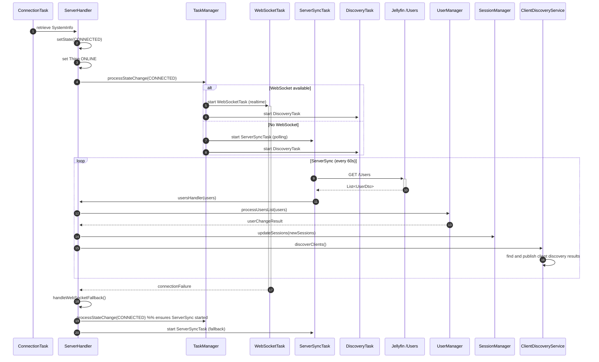

# Connection → CONNECTED → ServerSync / Discovery Sequence 🔧

This diagram shows the interaction flow from initial connection (SystemInfo retrieval) to the handler transitioning to the CONNECTED state and the resulting background tasks (WebSocket vs ServerSync polling and Discovery). It also includes the WebSocket fallback path where ServerSync (polling) is started if the WebSocket fails.

> Diagram source: `connection-state-sequence.mmd` (Mermaid sequence diagram)

---

If you'd like, I can also add a short reference link to `docs/architecture/task-management.md` or `core-handler.md` to make the diagram easier to find. Would you like that? (Yes/No)
