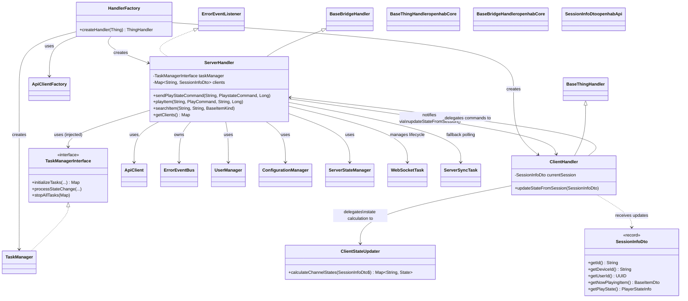

# Core Handler Architecture

This page documents the main handler structure and dependency injection in the
Jellyfin binding.

## Summary

The core handler architecture separates the creation and orchestration of
handlers, task management, and API client instantiation.

### Handler Relationships

- **ServerHandler** (Bridge): Manages server connection, authenticates, and maintains
  a list of active client sessions.
  Acts as a bridge handler for client devices.
  Manages WebSocket connection lifecycle and automatic fallback to polling.
- **ClientHandler** (Thing): Represents individual Jellyfin client devices.
  Receives session state updates from the parent ServerHandler and delegates commands
  back to the server.

### Communication Flow

#### Real-Time Updates (WebSocket)

1. ServerHandler starts WebSocketTask when `useWebSocket=true` (default)
2. WebSocket receives real-time SessionsMessage events from Jellyfin server
3. SessionsMessageHandler parses messages and publishes to SessionEventBus
4. ClientHandler subscribes to SessionEventBus and receives updates
5. ClientHandler calls `updateStateFromSession()` to update channels

#### Polling Updates (Fallback)

1. ServerHandler starts ServerSyncTask when WebSocket is disabled or fails
2. ServerSyncTask polls the Jellyfin server for active sessions (every `refreshSeconds`)
3. For each session, ServerHandler calls `updateStateFromSession()` on the corresponding ClientHandler
4. ClientHandler updates its channels with the session information

#### Command Flow

When a command is sent to a ClientHandler channel, it delegates to ServerHandler
methods like `sendPlayStateCommand()` or `playItem()`.

### WebSocket Lifecycle Management

**Initialization:**

- ServerHandler creates WebSocketTask with fallback callback: `() -> handleWebSocketFallback()`
- TaskManager starts WebSocketTask when state transitions to `CONNECTED`

**Reconnection:**

- Exponential backoff on connection failures: 1→2→4→8→16→32→60s (max 10 attempts)
- Automatic state reset on successful connection

**Fallback:**

- After max retries, WebSocketTask invokes fallback callback
- `handleWebSocketFallback()` stops WebSocket and starts ServerSyncTask for polling
- Polling continues until binding restart

See the [architecture overview](../architecture.md) for context.
