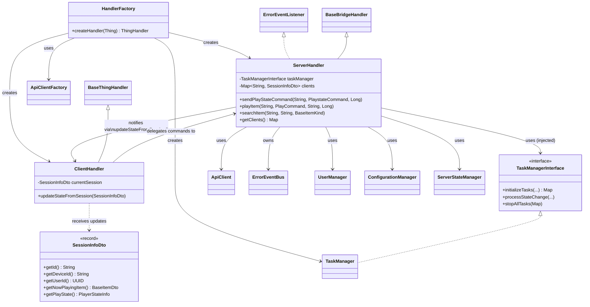

# Core Handler Architecture

This page documents the main handler structure and dependency injection in the
Jellyfin binding.

```mermaid
classDiagram
    %% Core handler relationships
    HandlerFactory --> ServerHandler : creates
    HandlerFactory --> ClientHandler : creates
    HandlerFactory --> TaskManager : creates
    HandlerFactory --> ApiClientFactory : uses
    
    ServerHandler --> TaskManagerInterface : uses (injected)
    ServerHandler --> ApiClient : uses
    ServerHandler --> ErrorEventBus : owns
    ServerHandler --> UserManager : uses
    ServerHandler --> ConfigurationManager : uses
    ServerHandler --> ServerStateManager : uses
    ServerHandler --> ClientHandler : notifies via\nupdateStateFromSession()
    
    ClientHandler --> ServerHandler : delegates commands to
    ClientHandler ..> SessionInfoDto : receives updates
    
    %% Key interfaces
    TaskManagerInterface <|.. TaskManager
    ErrorEventListener <|.. ServerHandler
    BaseBridgeHandler <|-- ServerHandler
    BaseThingHandler <|-- ClientHandler
    
    class HandlerFactory {
        +createHandler(Thing) ThingHandler
    }
    
    class ServerHandler {
        -TaskManagerInterface taskManager
        -Map~String, SessionInfoDto~ clients
        +sendPlayStateCommand(String, PlaystateCommand, Long)
        +playItem(String, PlayCommand, String, Long)
        +searchItem(String, String, BaseItemKind)
        +getClients() Map
    }
    
    class ClientHandler {
        -SessionInfoDto currentSession
        +updateStateFromSession(SessionInfoDto)
    }
    
    class TaskManagerInterface {
        <<interface>>
        +initializeTasks(...) Map
        +processStateChange(...)
        +stopAllTasks(Map)
    }
    
    class SessionInfoDto {
        <<record>>
        +getId() String
        +getDeviceId() String
        +getUserId() UUID
        +getNowPlayingItem() BaseItemDto
        +getPlayState() PlayerStateInfo
    }
```

## Summary

The core handler architecture separates the creation and orchestration of
handlers, task management, and API client instantiation.

### Handler Relationships

- **ServerHandler** (Bridge): Manages server connection, authenticates, and maintains
  a list of active client sessions.
  Acts as a bridge handler for client devices.
- **ClientHandler** (Thing): Represents individual Jellyfin client devices.
  Receives session state updates from the parent ServerHandler and delegates commands
  back to the server.

### Communication Flow

1. ServerHandler polls the Jellyfin server for active sessions
2. For each session, ServerHandler calls `updateStateFromSession()` on the
   corresponding ClientHandler
3. ClientHandler updates its channels with the session information
4. When a command is sent to a ClientHandler channel, it delegates to ServerHandler
   methods like `sendPlayStateCommand()` or `playItem()`

See the [architecture overview](../architecture.md) for context.
