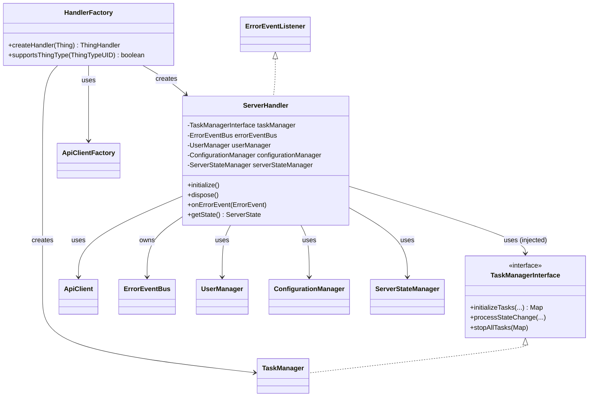

# Core Handler Architecture

This page documents the main handler structure and dependency injection in the Jellyfin binding.

```mermaid
classDiagram
    %% Core handler relationships
    HandlerFactory --> ServerHandler : creates
    HandlerFactory --> TaskManager : creates
    HandlerFactory --> ApiClientFactory : uses
    
    ServerHandler --> TaskManagerInterface : uses (injected)
    ServerHandler --> ApiClient : uses
    ServerHandler --> ErrorEventBus : owns
    ServerHandler --> UserManager : uses
    ServerHandler --> ConfigurationManager : uses
    ServerHandler --> ServerStateManager : uses
    
    %% Key interfaces
    TaskManagerInterface <|.. TaskManager
    ErrorEventListener <|.. ServerHandler
    
    class HandlerFactory {
        +createHandler(Thing) ThingHandler
        +supportsThingType(ThingTypeUID) boolean
    }
    
    class ServerHandler {
        -TaskManagerInterface taskManager
        -ErrorEventBus errorEventBus
        -UserManager userManager
        -ConfigurationManager configurationManager
        -ServerStateManager serverStateManager
        +initialize()
        +dispose()
        +onErrorEvent(ErrorEvent)
        +getState() ServerState
    }
    
    class TaskManagerInterface {
        <<interface>>
        +initializeTasks(...) Map
        +processStateChange(...)
        +stopAllTasks(Map)
    }
```

## Summary

The core handler architecture separates the creation and orchestration of handlers, task management, and API client instantiation.
See the [architecture overview](../architecture.md) for context.
