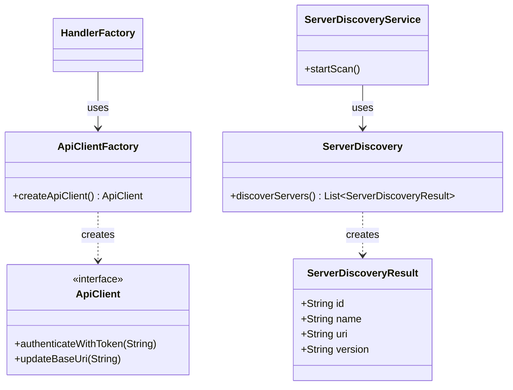

# Discovery and API Architecture

This page documents the discovery services and API communication in the Jellyfin binding.

## Summary

Discovery and API communication are handled by dedicated services and factories.
See the [architecture overview](../architecture.md) for context.
