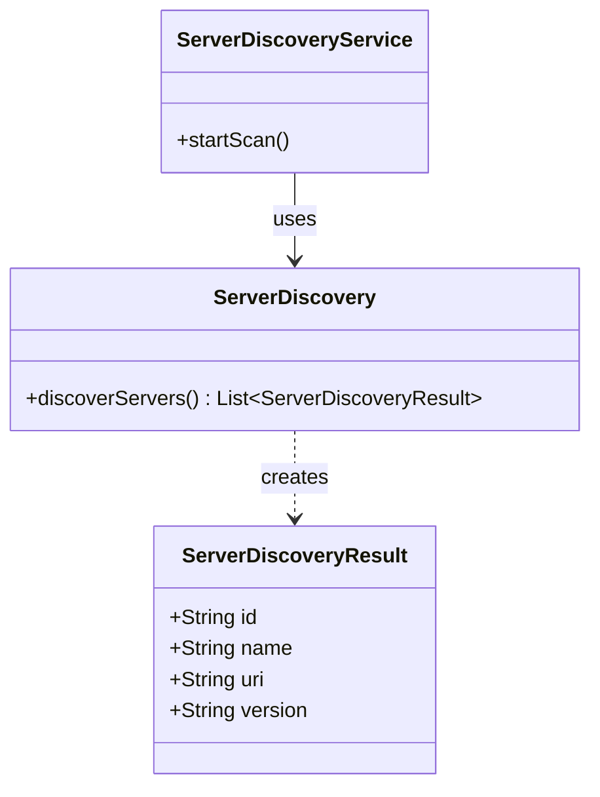
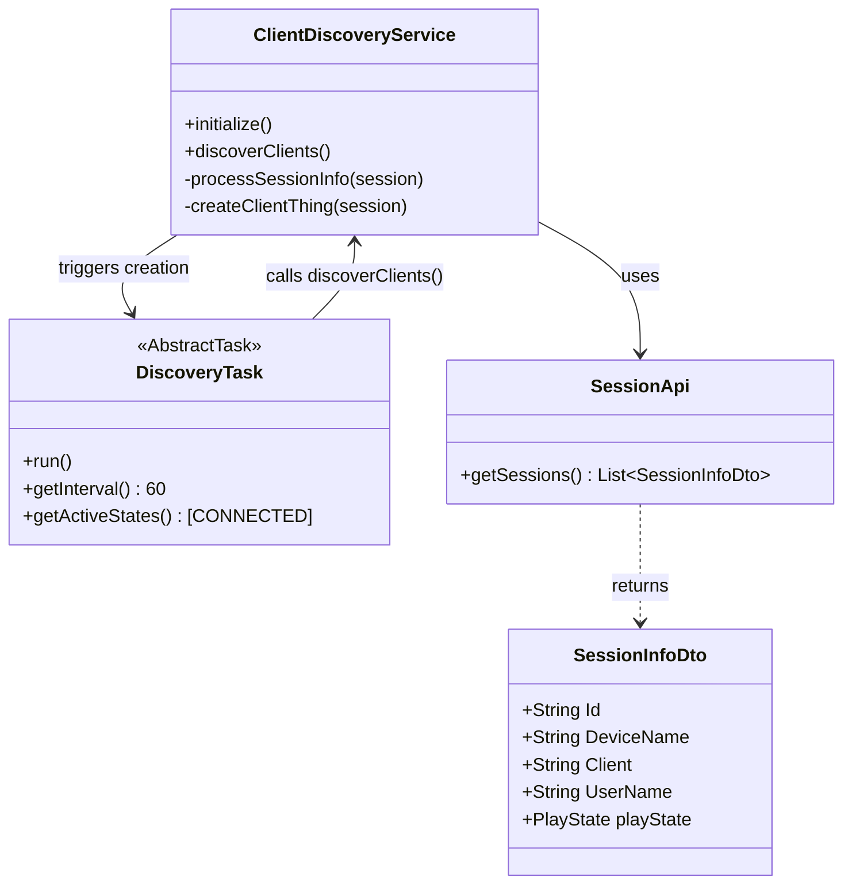
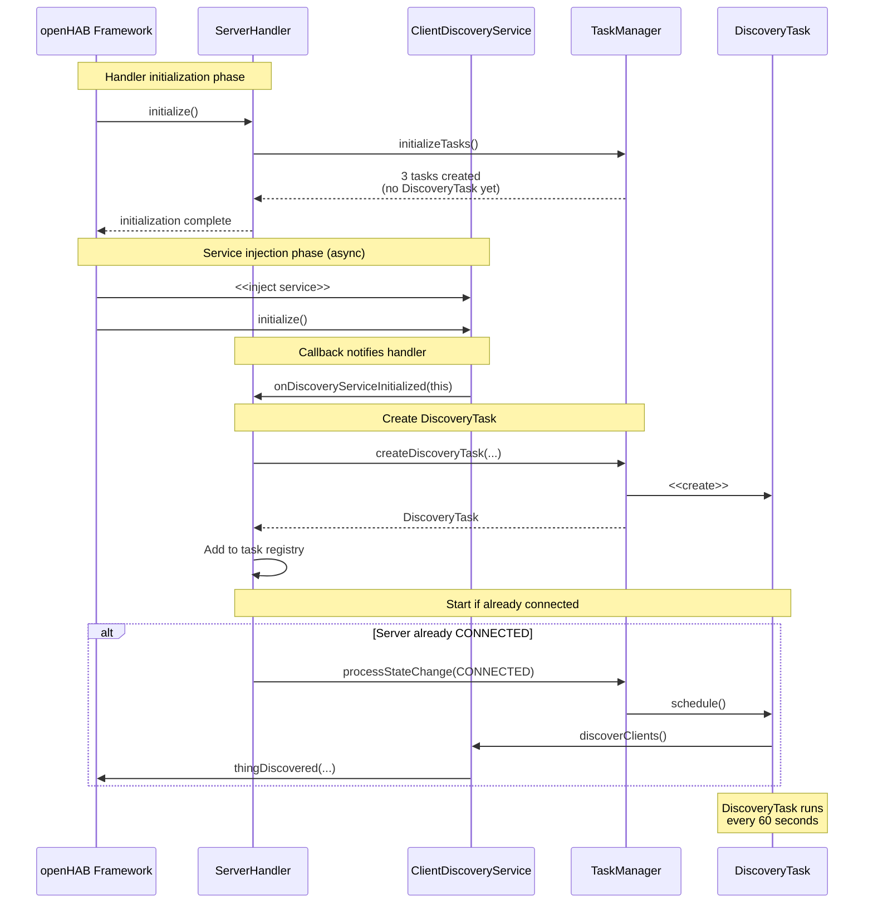

# Discovery Architecture

This page documents the discovery services in the Jellyfin binding.

## Table of Contents

- [Discovery Architecture](#discovery-architecture)
  - [Table of Contents](#table-of-contents)
  - [Overview](#overview)
  - [Server Discovery](#server-discovery)
    - [Server Discovery Architecture](#server-discovery-architecture)
  - [Client Discovery](#client-discovery)
    - [Client Discovery Architecture](#client-discovery-architecture)
    - [Integration with TaskManager](#integration-with-taskmanager)
    - [Async Service Injection](#async-service-injection)
      - [Solution: Callback Pattern](#solution-callback-pattern)
    - [Discovery Task Lifecycle](#discovery-task-lifecycle)
  - [Summary](#summary)

## Overview

The Jellyfin binding implements two types of discovery:

1. **Server Discovery**: Discovers Jellyfin servers on the local network
2. **Client Discovery**: Discovers Jellyfin clients (devices playing media) connected
   to a configured server

## Server Discovery

Server discovery scans the local network to find Jellyfin servers and presents them
to the user for configuration.

### Server Discovery Architecture

Server discovery is manually triggered by the user through the openHAB UI and
creates bridge things (Jellyfin servers) that can be configured.

## Client Discovery

Client discovery automatically detects Jellyfin clients (devices playing media)
connected to a configured Jellyfin server.
This discovery runs continuously in the background when the server is connected.

### Client Discovery Architecture

### Integration with TaskManager

Client discovery is integrated with the TaskManager infrastructure to provide
state-driven automatic discovery.
The `DiscoveryTask` runs every 60 seconds when the
server is in the `CONNECTED` state.

**Key components:**

- **ClientDiscoveryService**: openHAB `ThingHandlerService` that performs discovery
- **DiscoveryTask**: Task that triggers discovery at regular intervals
- **TaskManager**: Manages the `DiscoveryTask` lifecycle based on server state

### Async Service Injection

openHAB's `ThingHandlerService` injection happens asynchronously after the handler
initializes.
This creates a timing challenge: the handler's `initialize()` method
completes before the `ClientDiscoveryService` is available.

#### Solution: Callback Pattern

**Implementation details:**

1. **Service Initialize Override**: `ClientDiscoveryService.initialize()` calls
   `thingHandler.onDiscoveryServiceInitialized(this)`
2. **Handler Callback**: `ServerHandler.onDiscoveryServiceInitialized()` receives
   the discovery service reference
3. **Task Creation**: Handler calls `TaskManager.createDiscoveryTask()` to create
   the `DiscoveryTask`
4. **Registration**: Handler adds `DiscoveryTask` to the task registry
5. **State Check**: If server is already `CONNECTED`, handler triggers
   `processStateChange()` to start the task immediately

This pattern ensures that:

- Discovery service is fully initialized before task creation
- Task creation doesn't block handler initialization
- Discovery starts automatically when server connects
- No polling or timing assumptions needed

### Discovery Task Lifecycle

The `DiscoveryTask` follows the standard task lifecycle managed by `TaskManager`:

1. **Creation**: Task is created when `ClientDiscoveryService` becomes available
   (after async injection)
2. **State-Driven Activation**: Task automatically starts when server transitions
   to `CONNECTED` state
3. **Periodic Execution**: Task runs every 60 seconds while server remains `CONNECTED`
4. **Automatic Deactivation**: Task stops automatically when server transitions
   away from `CONNECTED` state
5. **Disposal**: Task is cancelled and removed when handler is disposed

**Discovery Process:**

1. **Fetch Sessions**: Query Jellyfin API for all active sessions
2. **Filter**: Process only sessions with active playback
3. **Create Things**: Create or update client things in openHAB inbox
4. **Error Handling**: Log errors without stopping the discovery loop

## Summary

The Jellyfin binding provides two discovery mechanisms:

- **Server Discovery**: Manual network scan to find Jellyfin servers
- **Client Discovery**: Automatic background discovery of active Jellyfin clients

Client discovery integrates with the TaskManager infrastructure using a callback
pattern to handle openHAB's asynchronous service injection lifecycle.
This ensures reliable, state-driven automatic discovery without manual scheduling
or timing dependencies.

See the [task management architecture](task-management.md) for details on task
lifecycle and [architecture overview](../architecture.md) for context.
