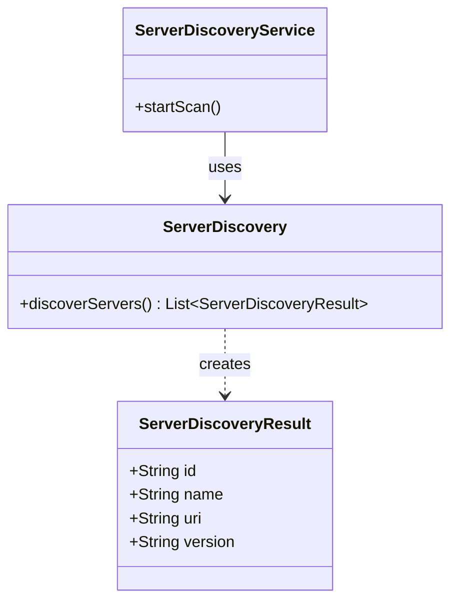

# Discovery Architecture

This page documents the discovery services in the Jellyfin binding.

```mermaid
classDiagram
    ServerDiscoveryService --> ServerDiscovery : uses
    ServerDiscovery ..> ServerDiscoveryResult : creates
    
    class ServerDiscoveryService {
        +startScan()
    }
    
    class ServerDiscovery {
        +discoverServers() List~ServerDiscoveryResult~
    }
    
    class ServerDiscoveryResult {
        +String id
        +String name
        +String uri
        +String version
    }
```

## Summary

Discovery is handled by dedicated services that scan the network and register
found servers.
See the [architecture overview](../architecture.md) for context.
