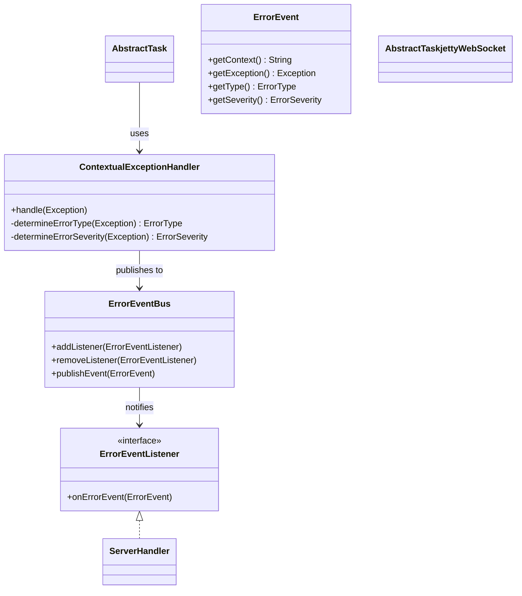

# Error Handling Architecture

This page documents the event-driven error handling system in the Jellyfin binding.

## Summary

The error handling architecture uses the Observer pattern to decouple error reporting
from error handling. Tasks report errors through the `ContextualExceptionHandler`,
which publishes events to the `ErrorEventBus`. The `ServerHandler` subscribes to
these events and handles them appropriately based on severity and type.

See the [architecture overview](../architecture.md) for context.
