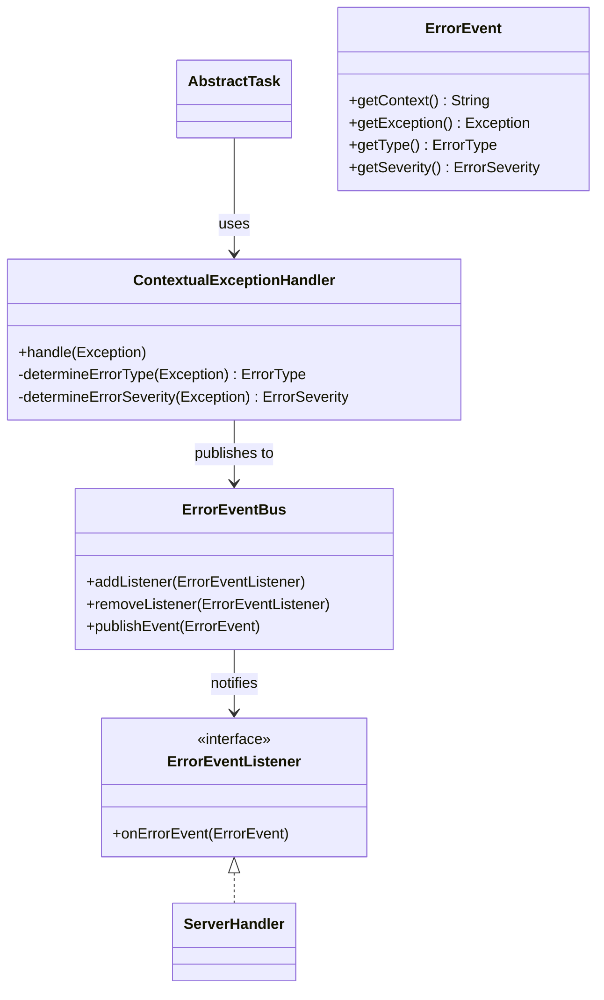

# Error Handling Architecture

This page documents the event-driven error handling system in the Jellyfin binding.

```mermaid
classDiagram
    %% Error handling (Observer pattern)
    AbstractTask --> ContextualExceptionHandler : uses
    ContextualExceptionHandler --> ErrorEventBus : publishes to
    ErrorEventBus --> ErrorEventListener : notifies
    ErrorEventListener <|.. ServerHandler
    
    class ContextualExceptionHandler {
        +handle(Exception)
        -determineErrorType(Exception) ErrorType
        -determineErrorSeverity(Exception) ErrorSeverity
    }
    
    class ErrorEventBus {
        +addListener(ErrorEventListener)
        +removeListener(ErrorEventListener)
        +publishEvent(ErrorEvent)
    }
    
    class ErrorEventListener {
        <<interface>>
        +onErrorEvent(ErrorEvent)
    }
    
    class ErrorEvent {
        +getContext() String
        +getException() Exception
        +getType() ErrorType
        +getSeverity() ErrorSeverity
    }
```

## Summary

Error handling uses the Observer pattern for decoupled, event-driven error management.
See the [architecture overview](../architecture.md) for context.
