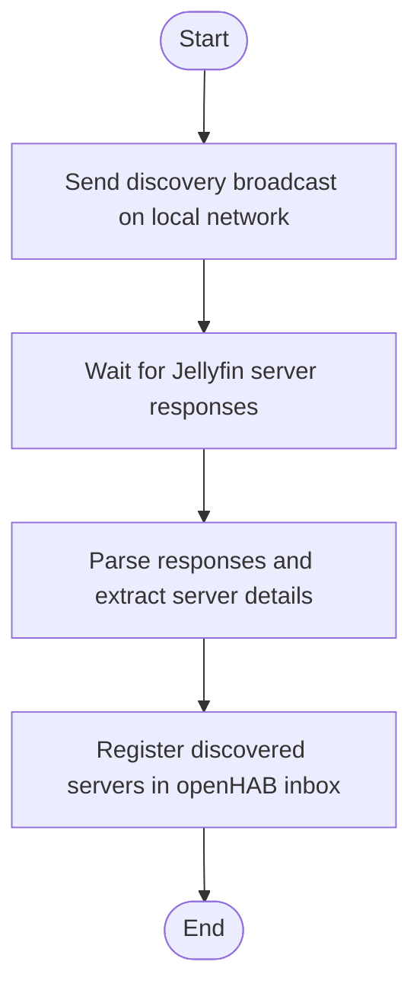

# Jellyfin Server Discovery

## Overview

This document provides a high-level overview of the server discovery process for
Jellyfin servers in the openHAB Jellyfin binding.
For architectural context, see [architecture.md](../architecture.md).

## Discovery Workflow

The binding automatically discovers available Jellyfin servers on the local
network.
The process is designed to be seamless and requires no manual
configuration from the user.

- The binding sends a broadcast message on the local network to discover
  Jellyfin servers.
- Jellyfin servers respond with their details.
- The binding parses these responses and extracts relevant information (e.g.,
  server name, address).
- Discovered servers are registered in the openHAB inbox for easy setup.

## Further Information

For more details on the overall architecture, see [architecture.md](../architecture.md).
