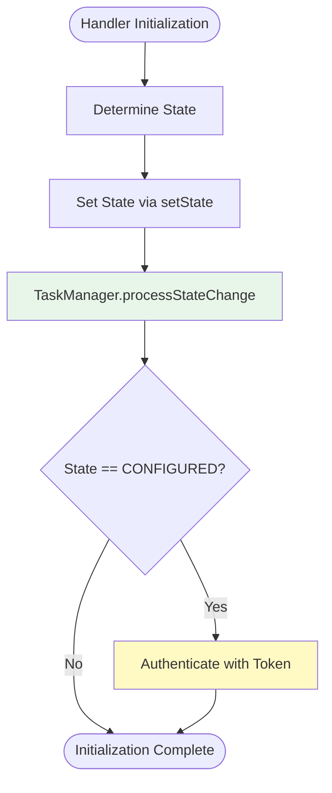
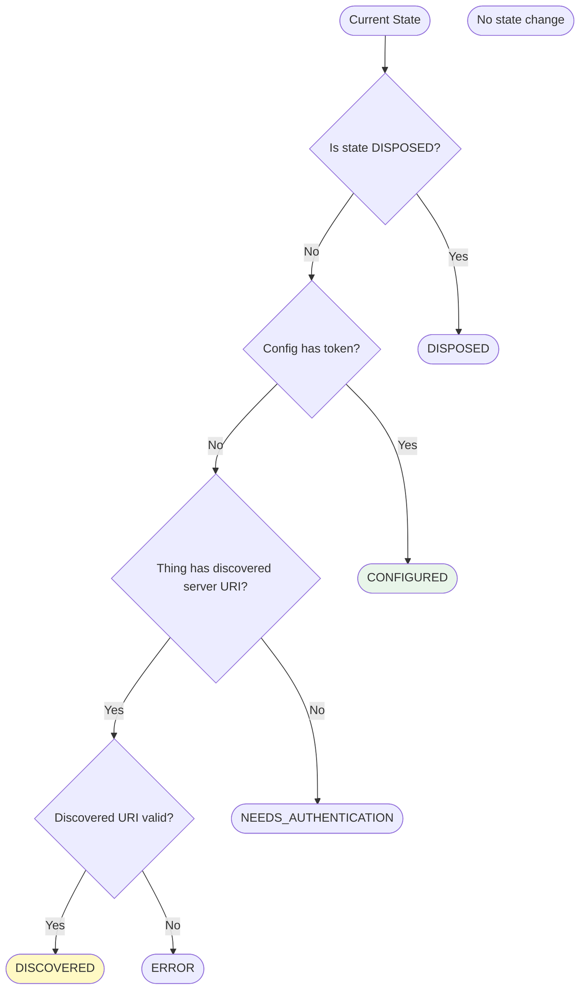

# Server State Transitions

This page documents the state transitions for Jellyfin server things as
determined by the binding logic, including configuration and discovery
scenarios.

## Table of Contents

- [Overview](#overview)
- [State Transition Diagram](#state-transition-diagram)
- [Transition Rules](#transition-rules)
- [Details](#details)

## Overview

The server state is determined by analyzing the current state, thing properties,
and configuration.
State transitions trigger task management operations through the
`TaskManager.processStateChange()` method, which automatically starts and stops
tasks based on the new state.

For detailed information about which tasks are active in each state, see
[Task Management Architecture](task-management.md#tasks-by-server-state).

The main states are:

- **INITIALIZING**: Initial state when the handler is first created.
  No tasks active.
- **DISCOVERED**: The server was found via discovery and has a valid URI property.
  No tasks active.
- **NEEDS_AUTHENTICATION**: Configuration exists but no access token is available.
  No tasks active.
- **CONFIGURED**: The configuration contains a valid access token. `ConnectionTask` is started to establish connection.
- **CONNECTED**: Successfully connected to the server and authenticated. `ServerSyncTask` is started to synchronize server state (users and sessions).
- **ERROR**: An error occurred (invalid URI, authentication failure, etc.).
  All tasks stopped.
- **DISPOSED**: The thing is disposed and no further transitions occur.
  All tasks permanently stopped.

## State Transition Diagram

### State Determination Flow

## Transition Rules

### State Determination

The `determineState()` method analyzes configuration and thing properties to recommend
the appropriate state. **Important**: This method performs pure state analysis without
side effects (no authentication or task management).

1. **DISPOSED**: If the current state is `DISPOSED`, this is final.
2. **CONFIGURED**: If the configuration has a non-blank token, state is `CONFIGURED`.
3. **DISCOVERED**: If the thing has a discovered server URI property and it is valid,
   state is `DISCOVERED`.
4. **NEEDS_AUTHENTICATION**: If no token and no discovered URI, state is
   `NEEDS_AUTHENTICATION`.
5. **ERROR**: If the discovered URI is present but invalid, state is `ERROR`.

### State Transition Actions

The `setState()` method performs the actual state transition and triggers actions:

1. **Updates internal state** field
2. **Calls `TaskManager.processStateChange()`** which starts/stops tasks based on the new state
3. **Logs the state transition** for debugging

### CONFIGURED State Special Handling

When transitioning to `CONFIGURED` state during initialization:

1. `determineState()` returns `ServerState.CONFIGURED`
2. `setState(CONFIGURED)` is called
3. `TaskManager.processStateChange()` **starts all required tasks**
4. `apiClient.authenticateWithToken()` is called **after** tasks are started
5. Tasks can begin executing once authentication completes

## Details

### Implementation

- The logic is implemented in `ServerStateManager.analyzeServerState`.
- State transitions are handled by `ServerHandler.setState()`.
- Task management is coordinated by `TaskManager.processStateChange()`.
- The order of checks in `determineState()` is critical: `DISPOSED` > `CONFIGURED` > `DISCOVERED` > `NEEDS_AUTHENTICATION` > `ERROR`.

### Separation of Concerns

The state management follows these principles:

- **State Determination** (`determineState()`): Pure function with no side effects
- **State Transition** (`setState()`): Updates state and triggers task management
- **Authentication** (`authenticateWithToken()`): Separate action performed after state change
- **Task Management** (`processStateChange()`): Starts/stops tasks based on state

This separation ensures:

- Testability of state logic
- Clear sequence of operations
- No duplicate authentication calls
- Proper task lifecycle management

### Related Documentation

- [Task Management Architecture](task-management.md)
- [Core Handler Architecture](core-handler.md)
- [Utility Classes Architecture](utility-classes.md)
