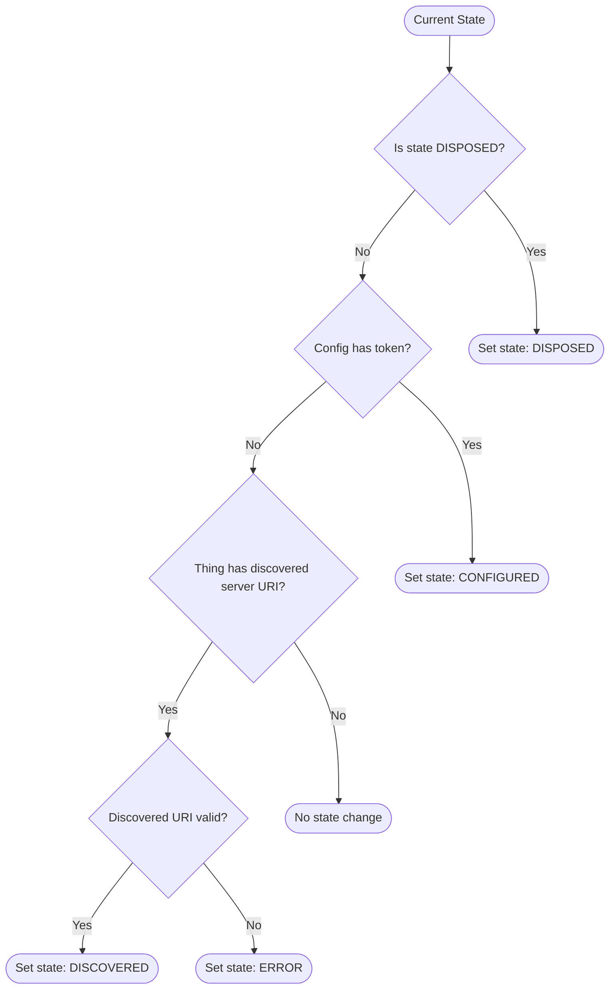

# Server State Transitions

This page documents the state transitions for Jellyfin server things as
determined by the binding logic, including configuration and discovery
scenarios.

## Table of Contents

- [Overview](#overview)
- [State Transition Diagram](#state-transition-diagram)
- [Transition Rules](#transition-rules)
- [Details](#details)

## Overview

The server state is determined by analyzing the current state, thing properties,
and configuration.
The main states are:

- **DISPOSED**: The thing is disposed and no further transitions occur.
- **DISCOVERED**: The server was found via discovery and has a valid URI property.
- **CONFIGURED**: The configuration contains a valid access token.
- **ERROR**: The discovered URI is invalid.
- **Other**: The state remains unchanged if none of the above apply.

## State Transition Diagram

```mermaid
flowchart TD
    Start([Current State])
    CheckDisposed{Is state DISPOSED?}
    CheckConfigured{Config has token?}
    CheckDiscovered{Thing has discovered server URI?}
    CheckUriValid{Discovered URI valid?}
    SetDisposed([Set state: DISPOSED])
    SetConfigured([Set state: CONFIGURED])
    SetDiscovered([Set state: DISCOVERED])
    SetError([Set state: ERROR])
    NoChange([No state change])

    Start --> CheckDisposed
    CheckDisposed -- Yes --> SetDisposed
    CheckDisposed -- No --> CheckConfigured
    CheckConfigured -- Yes --> SetConfigured
    CheckConfigured -- No --> CheckDiscovered
    CheckDiscovered -- No --> NoChange
    CheckDiscovered -- Yes --> CheckUriValid
    CheckUriValid -- Yes --> SetDiscovered
    CheckUriValid -- No --> SetError
```

## Transition Rules

1. **DISPOSED**: If the current state is `DISPOSED`, this is final.
2. **DISCOVERED**: If the thing has a discovered server URI property and it is
    valid, state is `DISCOVERED`.
3. **ERROR**: If the discovered URI is present but invalid, state is `ERROR`.
4. **CONFIGURED**: If the configuration has a non-blank token, state is
    `CONFIGURED`.
5. **No Change**: Otherwise, the state remains unchanged.

## Details

- The logic is implemented in `ServerStateManager.analyzeServerState`.
- The order of checks is critical: `DISPOSED` > `DISCOVERED` > `CONFIGURED` > default.
- See also: [Utility Classes Architecture](utility-classes.md)
