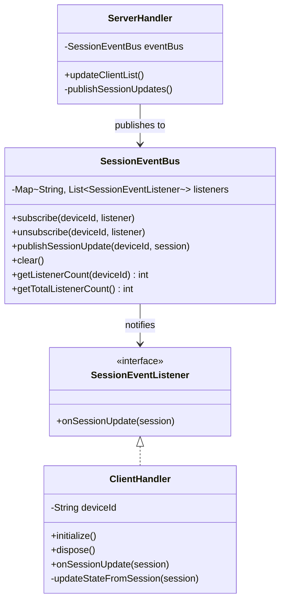

# Session Event Architecture

This page documents the event-driven session update system in the Jellyfin binding.

## Implementation Details

Concrete implementations:

- **ServerHandler**: Manages server-level events, publishes to `SessionEventBus`
- **ClientHandler**: Subscribes to device-specific events, updates channel state
- **SessionEventBus**: Event distribution mechanism (not concrete implementations)

### Implementation Status

**Phase 1**: ✅ COMPLETED (2025-11-30)

- SessionEventBus implemented with full thread safety
- SessionEventListener interface defined
- Comprehensive unit tests (9/9 passing, 100% coverage)
- Concurrency and exception handling validated

See [Event Bus Implementation Plan](../implementation-plan/2025-11-28-event-bus-architecture-implementation.md)
for detailed implementation roadmap.

See the [architecture overview](../architecture.md) for context.
