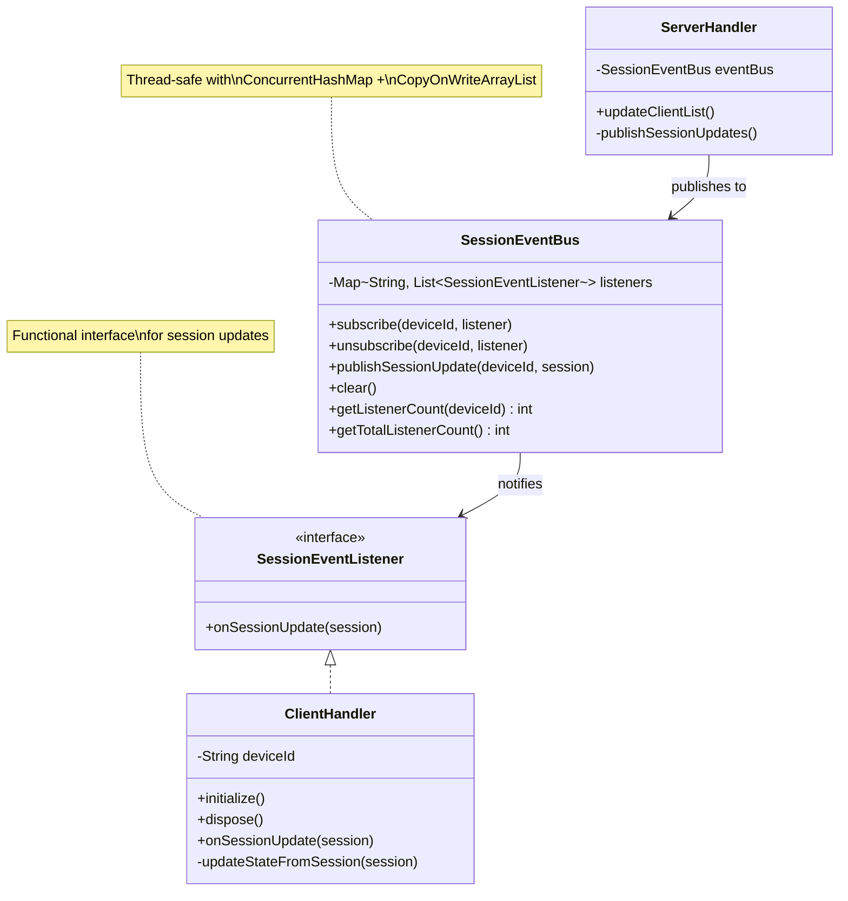

# Session Event Architecture

This page documents the event-driven session update system in the Jellyfin binding.

```mermaid
classDiagram
    %% Session event handling (Observer pattern)
    ServerHandler --> SessionEventBus : publishes to
    SessionEventBus --> SessionEventListener : notifies
    SessionEventListener <|.. ClientHandler
    
    class ServerHandler {
        -SessionEventBus eventBus
        +updateClientList()
        -publishSessionUpdates()
    }
    
    class SessionEventBus {
        -Map~String, List~SessionEventListener~~ listeners
        +subscribe(deviceId, listener)
        +unsubscribe(deviceId, listener)
        +publishSessionUpdate(deviceId, session)
        +clear()
        +getListenerCount(deviceId) int
        +getTotalListenerCount() int
    }
    
    class SessionEventListener {
        <<interface>>
        +onSessionUpdate(session)
    }
    
    class ClientHandler {
        -String deviceId
        +initialize()
        +dispose()
        +onSessionUpdate(session)
        -updateStateFromSession(session)
    }
    
    note for SessionEventBus "Thread-safe with\nConcurrentHashMap +\nCopyOnWriteArrayList"
    note for SessionEventListener "Functional interface\nfor session updates"
```

## Summary

Session event handling uses the Observer pattern for decoupled, event-driven communication
between ServerHandler (publisher) and ClientHandler instances (subscribers).

### Key Features

- **Thread Safety**: Uses `ConcurrentHashMap` for device-to-listener mapping and
  `CopyOnWriteArrayList` for individual listener collections
- **Exception Isolation**: If one listener throws an exception, other listeners still
  receive the event
- **Device-Specific Subscriptions**: Each ClientHandler subscribes only to updates for
  its specific device ID
- **Offline Notifications**: Null session indicates device has gone offline
- **Memory Leak Prevention**: ClientHandlers unsubscribe in `dispose()` method

### Lifecycle

1. **ServerHandler Initialization**: Creates SessionEventBus instance
2. **ClientHandler Initialization**: Subscribes to event bus with its device ID
3. **Session Updates**: ServerHandler publishes session changes to event bus
4. **Event Delivery**: Event bus notifies all subscribed listeners for the device
5. **ClientHandler Disposal**: Unsubscribes from event bus to prevent memory leaks
6. **ServerHandler Disposal**: Clears all subscriptions from event bus

### SOLID Principles

- **Single Responsibility**: SessionEventBus only handles event routing
- **Open/Closed**: New listener types can subscribe without modifying event bus
- **Liskov Substitution**: Any SessionEventListener implementation can subscribe
- **Interface Segregation**: Minimal interface with single method
- **Dependency Inversion**: Both handlers depend on abstractions (SessionEventListener),
  not concrete implementations

### Implementation Status

**Phase 1**: ✅ COMPLETED (2025-11-30)
- SessionEventBus implemented with full thread safety
- SessionEventListener interface defined
- Comprehensive unit tests (9/9 passing, 100% coverage)
- Concurrency and exception handling validated

See [Event Bus Implementation Plan](../implementation-plan/2025-11-28-event-bus-architecture-implementation.md)
for detailed implementation roadmap.

See the [architecture overview](../architecture.md) for context.
