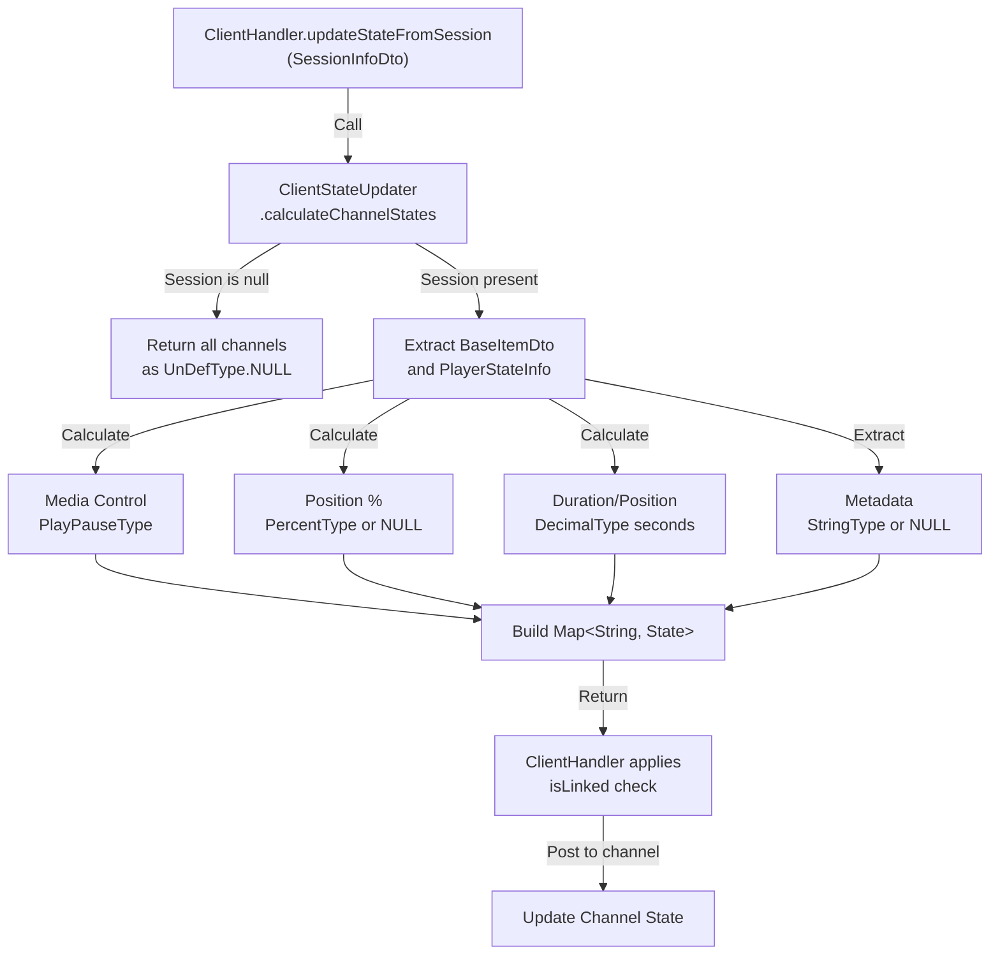

# State Calculation Architecture

This page documents the state calculation utility that transforms Jellyfin session
data into openHAB channel states.

## Overview

`ClientStateUpdater` is a pure utility class that encapsulates all channel state
calculations for Jellyfin client sessions. It decouples state transformation logic
from the thing handler, enabling independent testing and reusability.

## Architecture

```mermaid
classDiagram
    ClientHandler --> ClientStateUpdater : uses
    ClientStateUpdater --> SessionInfoDto : analyzes
    ClientStateUpdater --> BaseItemDto : extracts metadata
    ClientStateUpdater --> PlayerStateInfo : extracts playback state
    ClientStateUpdater --> State : produces

    class ClientHandler {
        +updateStateFromSession(SessionInfoDto)
        -isLinked(String) boolean
    }

    class ClientStateUpdater {
        +calculateChannelStates(SessionInfoDto$) Map~String, State~
        -addStringState(Map, String, Object$) void$
        -addNullStates(Map) void$
    }

    class SessionInfoDto {
        +getNowPlayingItem() BaseItemDto$
        +getPlayState() PlayerStateInfo$
    }

    class BaseItemDto {
        +getId() String$
        +getName() String$
        +getSeriesName() String$
        +getParentIndexNumber() Integer$
        +getIndexNumber() Integer$
        +getGenres() List~String~$
        +getType() BaseItemKind$
    }

    class PlayerStateInfo {
        +getIsPaused() Boolean$
        +getPositionTicks() Long$
    }

    class State {
        <<interface>>
    }

    classStyle SessionInfoDto fill:#99dd99,stroke:#66bb66

    classStyle BaseItemDto fill:#99dd99,stroke:#66bb66

    classStyle PlayerStateInfo fill:#99dd99,stroke:#66bb66
```

## Calculation Flow



## Channel Calculations

### Playback Channels

| Channel                     | Type            | Source                     | Calculation                              |
| --------------------------- | --------------- | -------------------------- | ---------------------------------------- |
| `MEDIA_CONTROL`             | `PlayPauseType` | `PlayerStateInfo.IsPaused` | PLAY if not paused, PAUSE otherwise      |
| `PLAYING_ITEM_PERCENTAGE`   | `PercentType`   | Position/Duration ticks    | `(positionTicks / runTimeTicks) × 100`   |
| `PLAYING_ITEM_SECOND`       | `DecimalType`   | Position ticks             | `Math.round(positionTicks / 10,000,000)` |
| `PLAYING_ITEM_TOTAL_SECOND` | `DecimalType`   | Runtime ticks              | `Math.round(runTimeTicks / 10,000,000)`  |

### Metadata Channels

| Channel         | Type          | Source               | Handling                          |
| --------------- | ------------- | -------------------- | --------------------------------- |
| Metadata fields | `StringType`  | `BaseItemDto` fields | `UnDefType.NULL` if null or blank |
| `SEASON`        | `DecimalType` | `ParentIndexNumber`  | Direct mapping or NULL            |
| `EPISODE`       | `DecimalType` | `IndexNumber`        | Direct mapping or NULL            |
| `GENRES`        | `StringType`  | Genre list           | Joined with `", "` or NULL        |
| `TYPE`          | `StringType`  | Item type            | `.toString()` or NULL             |

## Null Handling Strategy

- **Null session**: All channels → `UnDefType.NULL`
- **Null/blank strings**: String channels → `UnDefType.NULL`
- **Missing BaseItemDto**: All metadata channels → `UnDefType.NULL`
- **Missing PlayerStateInfo**: All playback channels → `UnDefType.NULL`
- **Division by zero protection**: Percentage calculated only if runtime > 0

## Integration with ClientHandler

```java
// Before: ClientHandler contained inline calculations
private void updateStateFromSession(SessionInfoDto session) {
    // ~50 lines of direct channel updates
}

// After: Delegated to utility
private void updateStateFromSession(SessionInfoDto session) {
    Map<String, State> states = ClientStateUpdater.calculateChannelStates(session);
    for (String channelId : states.keySet()) {
        if (isLinked(channelId)) {
            updateState(channelId, states.get(channelId));
        }
    }
}
```

### Benefits

- **Separation of concerns**: State calculations decoupled from thing handler lifecycle
- **Testability**: Utility can be tested without openHAB Thing/Channel infrastructure
- **Reusability**: Logic can be used by other handlers or services
- **Maintainability**: Clear, focused responsibility with minimal dependencies
- **Linking respect**: `isLinked()` check prevents orphaned channel updates

## Design Decisions

1. **Static method**: No instance state; pure function semantics
2. **Map return type**: Enables optional linking and flexible caller control
3. **@Nullable annotations**: Explicit null-safety documentation
4. **Private helpers**: `addStringState()` and `addNullStates()` reduce duplication

## Testing

Unit tests for `ClientStateUpdater` cover:

- Null session handling (all channels → NULL)
- Metadata and playback state extraction
- Type conversions (ticks → seconds, genres join, etc.)
- Edge cases (blank strings, missing fields, zero runtime)

See `ClientStateUpdaterTest` for implementation details.

## Related Documentation

- [Core Handler Architecture](core-handler.md) - Handler lifecycle and integration
- [Utility Classes Architecture](utility-classes.md) - Other extracted utilities
- [Architecture Overview](../architecture.md) - System-level context
