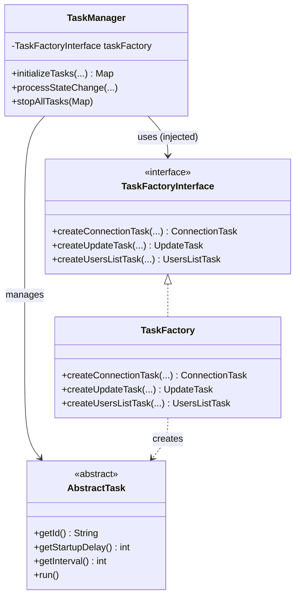

# Task Management Architecture

This page documents the task management system in the Jellyfin binding.

```mermaid
classDiagram
    %% Task management relationships
    TaskManager --> TaskFactoryInterface : uses (injected)
    TaskManager --> AbstractTask : manages
    TaskFactoryInterface <|.. TaskFactory
    TaskFactory ..> AbstractTask : creates
    
    class TaskManager {
        -TaskFactoryInterface taskFactory
        +initializeTasks(...) Map
        +processStateChange(...)
        +stopAllTasks(Map)
    }
    
    class TaskFactoryInterface {
        <<interface>>
        +createConnectionTask(...) ConnectionTask
        +createUpdateTask(...) UpdateTask
        +createUsersListTask(...) UsersListTask
    }
    
    class TaskFactory {
        +createConnectionTask(...) ConnectionTask
        +createUpdateTask(...) UpdateTask
        +createUsersListTask(...) UsersListTask
    }
    
    class AbstractTask {
        <<abstract>>
        +getId() String
        +getStartupDelay() int
        +getInterval() int
        +run()
    }
```

## Summary

Task management is handled by a dedicated manager and factory, supporting extensibility and testability.
See the [architecture overview](../architecture.md) for context.
