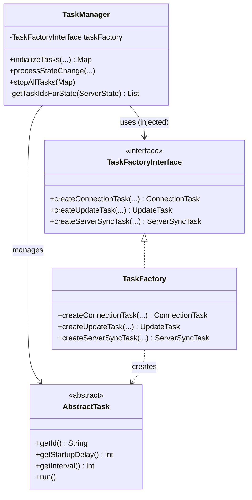
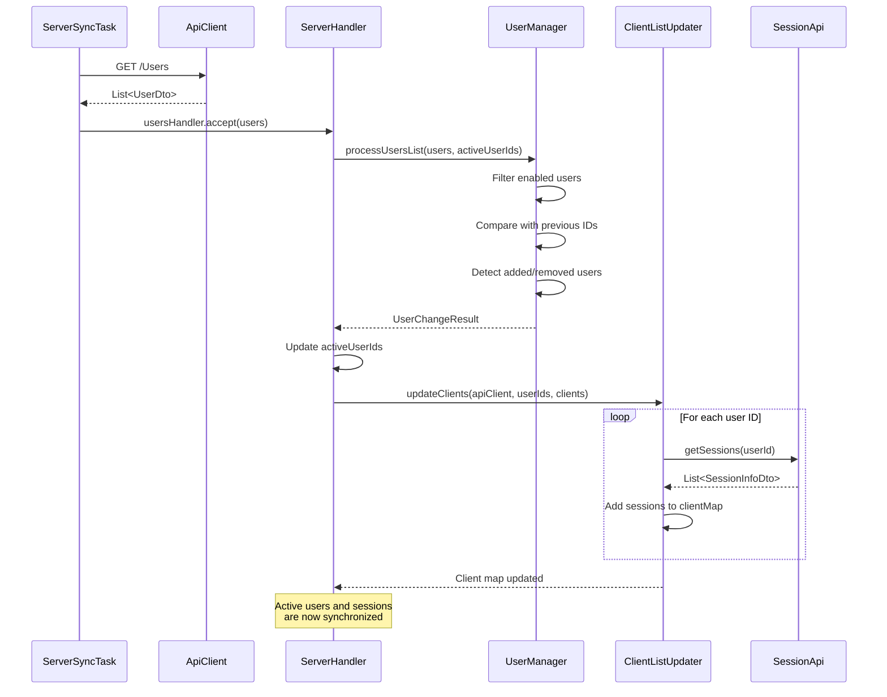

# Task Management Architecture

This page documents the task management system in the Jellyfin binding.

## Table of Contents

- [Task Management Architecture](#task-management-architecture)
  - [Table of Contents](#table-of-contents)
  - [Overview](#overview)
  - [Architecture Diagram](#architecture-diagram)
  - [Tasks by Server State](#tasks-by-server-state)
    - [State-Task Mapping](#state-task-mapping)
    - [Task Lifecycle](#task-lifecycle)
    - [ServerSyncTask Processing Flow](#serversynctask-processing-flow)
  - [Summary](#summary)

## Overview

Task management is handled by a dedicated manager and factory, supporting
extensibility and testability.
The `TaskManager` is responsible for starting and stopping tasks based on the
server handler's current state.

## Architecture Diagram

```mermaid
classDiagram
    %% Task management relationships
    TaskManager --> TaskFactoryInterface : uses (injected)
    TaskManager --> AbstractTask : manages
    TaskFactoryInterface <|.. TaskFactory
    TaskFactory ..> AbstractTask : creates
    
    class TaskManager {
        -TaskFactoryInterface taskFactory
        +initializeTasks(...) Map
        +processStateChange(...)
        +stopAllTasks(Map)
        -getTaskIdsForState(ServerState) List
    }
    
    class TaskFactoryInterface {
        <<interface>>
        +createConnectionTask(...) ConnectionTask
        +createUpdateTask(...) UpdateTask
        +createServerSyncTask(...) ServerSyncTask
    }
    
    class TaskFactory {
        +createConnectionTask(...) ConnectionTask
        +createUpdateTask(...) UpdateTask
        +createServerSyncTask(...) ServerSyncTask
    }
    
    class AbstractTask {
        <<abstract>>
        +getId() String
        +getStartupDelay() int
        +getInterval() int
        +run()
    }
```

## Tasks by Server State

The `TaskManager.processStateChange()` method is called whenever the server handler
transitions to a new state.
This method automatically starts and stops tasks based
on the server's current state.

### State-Task Mapping

The following table shows which tasks are active for each server state:

| Server State             | Active Tasks      | Purpose                                                                 |
| ------------------------ | ----------------- | ----------------------------------------------------------------------- |
| **INITIALIZING**         | None              | Initial state before configuration is analyzed                          |
| **DISCOVERED**           | None              | Server was found via discovery but not yet configured                   |
| **NEEDS_AUTHENTICATION** | None              | Configuration exists but no access token is available                   |
| **CONFIGURED**           | `ConnectionTask`  | Establishes connection and authenticates with the server                |
| **CONNECTED**            | `ServerSyncTask`  | Synchronizes server state (users and sessions) with the handler         |
| **ERROR**                | None              | Error state - tasks stopped until error is resolved                     |
| **DISPOSED**             | None              | Handler is disposed - all tasks permanently stopped                     |

### Task Lifecycle

1. **Initialization**: When the handler initializes, `initializeTasks()` creates all
   available tasks but does not start them.

2. **State Transition**: When `setState()` is called, it triggers
   `TaskManager.processStateChange()` which:
   - Determines which tasks should be active for the new state
   - Stops any running tasks that are not needed
   - Starts any required tasks that are not yet running

3. **CONFIGURED → CONNECTED Transition**:
   - In `CONFIGURED` state, `ConnectionTask` starts running
   - `ConnectionTask` attempts to connect and authenticate
   - On successful authentication, state transitions to `CONNECTED`
   - `ConnectionTask` stops automatically (not needed in `CONFIGURED` state)
   - `ServerSyncTask` starts to synchronize server state (users and sessions)

4. **Disposal**: When the handler is disposed, `stopAllTasks()` is called to
   cancel all scheduled tasks and clear the task registry.

### ServerSyncTask Processing Flow

The following sequence diagram shows how results from `ServerSyncTask` are processed
by the server handler:

```mermaid
sequenceDiagram
    participant Task as ServerSyncTask
    participant API as ApiClient
    participant Handler as ServerHandler
    participant UserMgr as UserManager
    participant Updater as ClientListUpdater
    participant SessionAPI as SessionApi
    
    Task->>API: GET /Users
    API-->>Task: List<UserDto>
    Task->>Handler: usersHandler.accept(users)
    
    Handler->>UserMgr: processUsersList(users, activeUserIds)
    UserMgr->>UserMgr: Filter enabled users
    UserMgr->>UserMgr: Compare with previous IDs
    UserMgr->>UserMgr: Detect added/removed users
    UserMgr-->>Handler: UserChangeResult
    
    Handler->>Handler: Update activeUserIds
    Handler->>Updater: updateClients(apiClient, userIds, clients)
    
    loop For each user ID
        Updater->>SessionAPI: getSessions(userId)
        SessionAPI-->>Updater: List<SessionInfoDto>
        Updater->>Updater: Add sessions to clientMap
    end
    
    Updater-->>Handler: Client map updated
    
    Note over Handler: Active users and sessions<br/>are now synchronized
```

**Key Steps:**

1. **User Retrieval**: `ServerSyncTask` periodically fetches the user list from the Jellyfin server
2. **User Processing**: `UserManager` filters enabled/visible users and detects changes
3. **State Update**: Handler updates its internal `activeUserIds` list
4. **Session Sync**: `ClientListUpdater` retrieves active sessions for each user
5. **Client Map Update**: Session information is stored in the handler's `clients` map

This process ensures that the handler maintains an up-to-date view of all active
users and their current sessions.

## Summary

Task management is handled by a dedicated manager and factory, supporting
extensibility and testability.
The state-driven task lifecycle ensures that only necessary tasks are running,
optimizing resource usage and maintaining proper server communication patterns.

See the [architecture overview](../architecture.md) for context and
[server state transitions](server-state.md) for details on state management.
