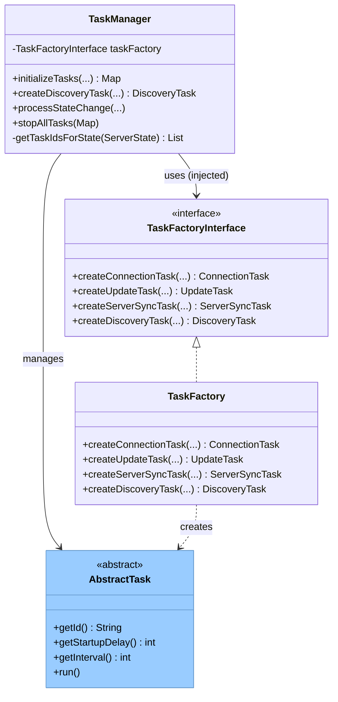

# Task Management Architecture

This page documents the task management system in the Jellyfin binding.

## Table of Contents

- [Task Management Architecture](#task-management-architecture)
  - [Table of Contents](#table-of-contents)
  - [Overview](#overview)
  - [Architecture Diagram](#architecture-diagram)
  - [Tasks by Server State](#tasks-by-server-state)
    - [State-Task Mapping](#state-task-mapping)
    - [Task Lifecycle](#task-lifecycle)
    - [ServerSyncTask Processing Flow](#serversynctask-processing-flow)
  - [Client Discovery Integration](#client-discovery-integration)
    - [Async Service Injection Pattern](#async-service-injection-pattern)
    - [Deferred Task Creation Flow](#deferred-task-creation-flow)
    - [Key Design Decisions](#key-design-decisions)
  - [Summary](#summary)

## Overview

Task management is handled by a dedicated manager and factory, supporting
extensibility and testability.
The `TaskManager` is responsible for starting and stopping tasks based on the
server handler's current state.

## Architecture Diagram

## Tasks by Server State

The `TaskManager.processStateChange()` method is called whenever the server handler
transitions to a new state.
This method automatically starts and stops tasks based
on the server's current state.

### State-Task Mapping

The following table shows which tasks are active for each server state:

| Server State             | Active Tasks                                         | Purpose                                                                           |
| ------------------------ | ---------------------------------------------------- | --------------------------------------------------------------------------------- |
| **INITIALIZING**         | None                                                 | Initial state before configuration is analyzed                                    |
| **DISCOVERED**           | None                                                 | Server was found via discovery but not yet configured                             |
| **NEEDS_AUTHENTICATION** | None                                                 | Configuration exists but no access token is available                             |
| **CONFIGURED**           | `ConnectionTask`                                     | Establishes connection and authenticates with the server                          |
| **CONNECTED**            | `WebSocketTask` OR `ServerSyncTask`, `DiscoveryTask` | Real-time updates via WebSocket (or polling fallback) and discovers clients       |
| **ERROR**                | None                                                 | Error state - tasks stopped until error is resolved                               |
| **DISPOSED**             | None                                                 | Handler is disposed - all tasks permanently stopped                               |

### Task Lifecycle

1. **Initialization**: When the handler initializes, `initializeTasks()` creates
   `ConnectionTask`, `UpdateTask`, and `ServerSyncTask` but does not start them.
   The `DiscoveryTask` is created later when the `ClientDiscoveryService` becomes
   available (see [Client Discovery Integration](#client-discovery-integration)).

2. **State Transition**: When `setState()` is called, it triggers
   `TaskManager.processStateChange()` which:
   - Determines which tasks should be active for the new state
   - Stops any running tasks that are not needed
   - Starts any required tasks that are not yet running

3. **CONFIGURED → CONNECTED Transition**:
   - In `CONFIGURED` state, `ConnectionTask` starts running
   - `ConnectionTask` attempts to connect and authenticate
   - On successful authentication, state transitions to `CONNECTED`
   - `ConnectionTask` stops automatically (not needed in `CONNECTED` state)
   - `ServerSyncTask` starts to synchronize server state (users and sessions)
   - `DiscoveryTask` starts to automatically discover Jellyfin clients (if available)

4. **Disposal**: When the handler is disposed, `stopAllTasks()` is called to
   cancel all scheduled tasks and clear the task registry.

### ServerSyncTask Processing Flow

The following sequence diagram shows how results from `ServerSyncTask` are processed
by the server handler:

**Key Steps:**

1. **User Retrieval**: `ServerSyncTask` periodically fetches the user list from the Jellyfin server
2. **User Processing**: `UserManager` filters enabled/visible users and detects changes
3. **State Update**: Handler updates its internal `activeUserIds` list
4. **Session Sync**: `ClientListUpdater` retrieves all active sessions from the server (using `getSessions(null, ...)`)
   and filters them to include only sessions for enabled/visible users
5. **Client Map Update**: Filtered session information is stored in the handler's `clients` map

This process ensures that the handler maintains an up-to-date view of all active
users and their current sessions.
By retrieving all sessions in a single API call
and filtering client-side, the implementation avoids potential issues with per-user
session queries that may not return all client devices.

## Client Discovery Integration

The `DiscoveryTask` is created differently from other tasks due to the asynchronous
nature of openHAB's `ThingHandlerService` injection lifecycle.

### Async Service Injection Pattern

openHAB injects `ThingHandlerService` instances (like `ClientDiscoveryService`)
asynchronously after the handler's `initialize()` method completes.
This means:

1. **Handler Initialize**: `ServerHandler.initialize()` is called first
2. **Task Initialization**: `TaskManager.initializeTasks()` creates `ConnectionTask`,
   `UpdateTask`, and `ServerSyncTask` (but NOT `DiscoveryTask` yet)
3. **Service Injection**: openHAB framework injects `ClientDiscoveryService`
4. **Service Initialize**: `ClientDiscoveryService.initialize()` is called
5. **Callback**: Discovery service notifies handler via
   `ServerHandler.onDiscoveryServiceInitialized()`
6. **Discovery Task Creation**: Handler calls `TaskManager.createDiscoveryTask()`
   to create the `DiscoveryTask`
7. **Task Registration**: `DiscoveryTask` is added to the task registry
8. **State Check**: If server is already `CONNECTED`, `DiscoveryTask` starts immediately

### Deferred Task Creation Flow

### Key Design Decisions

1. **Callback Pattern**: Discovery service notifies handler when ready, rather than
   handler polling for service availability
2. **Lazy Creation**: `DiscoveryTask` is created only when `ClientDiscoveryService`
   becomes available
3. **State-Driven**: Once created, `DiscoveryTask` follows the same state-driven
   lifecycle as other tasks (active in `CONNECTED` state only)
4. **Automatic Discovery**: Runs every 60 seconds in `CONNECTED` state to detect
   new Jellyfin clients

## Summary

Task management is handled by a dedicated manager and factory, supporting
extensibility and testability.
The state-driven task lifecycle ensures that only necessary tasks are running,
optimizing resource usage and maintaining proper server communication patterns.

The binding manages five task types:

- **ConnectionTask**: Establishes initial connection and authentication (`CONFIGURED` state)
- **UpdateTask**: Updates handler state (as needed by configuration changes)
- **WebSocketTask**: Maintains WebSocket connection for real-time updates (`CONNECTED` state, preferred)
- **ServerSyncTask**: Synchronizes users and sessions via polling (`CONNECTED` state, fallback)
- **DiscoveryTask**: Automatically discovers Jellyfin clients (`CONNECTED` state)

### WebSocket vs Polling Task Selection

In the `CONNECTED` state, the binding prefers WebSocket for real-time updates:

- **WebSocket enabled** (`useWebSocket=true`, default): `WebSocketTask` runs, `ServerSyncTask` does not
- **WebSocket disabled** (`useWebSocket=false`): `ServerSyncTask` runs for polling
- **WebSocket fallback**: After 10 failed reconnection attempts, `WebSocketTask` triggers callback to start `ServerSyncTask`

**Mutual Exclusivity**: `WebSocketTask` and `ServerSyncTask` never run concurrently to avoid duplicate session updates.

The `DiscoveryTask` uses a callback pattern to handle asynchronous service injection,
ensuring proper integration with openHAB's `ThingHandlerService` lifecycle.

See the [architecture overview](../architecture.md) for context and
[server state transitions](server-state.md) for details on state management.
