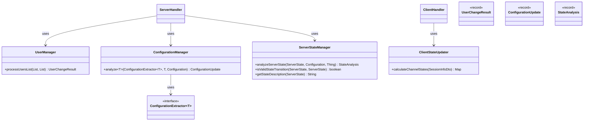
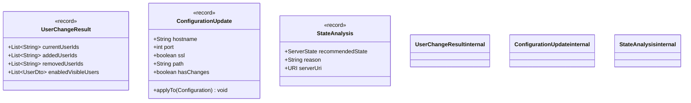

# Utility Classes Architecture

This page documents the extracted utility classes that handle specific
responsibilities in the Jellyfin binding.

## Summary

Utility classes provide focused, testable logic for distinct responsibilities:

- **UserManager**: User list processing and change tracking
- **ConfigurationManager**: Configuration extraction and update analysis (Strategy pattern)
- **ServerStateManager**: Server state transitions and validation
- **ClientStateUpdater**: Jellyfin session state calculation into openHAB channel states

Each utility is designed for independent testing and reusability across handlers
and services.

### Detailed Documentation

- **Configuration Strategy Pattern**: See [Configuration Management Architecture](configuration-management.md)
- **State Calculation Flow**: See [State Calculation Architecture](state-calculation.md)

See the [architecture overview](../architecture.md) for context.

## Record Details

The following records are used for immutable data transfer and are referenced by utility classes and handlers. The class diagram below shows fields for each record.

**Descriptions:**

- **UserChangeResult**: Returned by user synchronization; contains lists of current, added, and removed user IDs and a list of enabled visible user DTOs.
- **ConfigurationUpdate**: Produced by configuration analysis; contains fields describing changes and an `applyTo(Configuration)` helper.
- **StateAnalysis**: Used by `ServerStateManager` to represent a recommended `ServerState`, the reason for the recommendation, and the server URI used.
