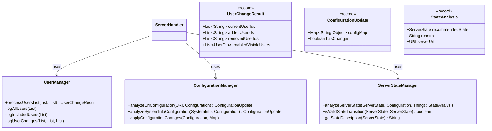

# Utility Classes Architecture

This page documents the extracted utility classes that handle specific responsibilities in the Jellyfin binding.

```mermaid
classDiagram
    %% Utility classes for separation of concerns
    ServerHandler --> UserManager : uses
    ServerHandler --> ConfigurationManager : uses  
    ServerHandler --> ServerStateManager : uses
    
    class UserManager {
        +processUsersList(List, List) UserChangeResult
        -logAllUsers(List)
        -logIncludedUsers(List)
        -logUserChanges(List, List, List)
    }
    
    class ConfigurationManager {
        +analyzeUriConfiguration(URI, Configuration) ConfigurationUpdate
        +analyzeSystemInfoConfiguration(SystemInfo, Configuration) ConfigurationUpdate
        +applyConfigurationChanges(Configuration, Map)
    }
    
    class ServerStateManager {
        +analyzeServerState(ServerState, Configuration, Thing) StateAnalysis
        +isValidStateTransition(ServerState, ServerState) boolean
        +getStateDescription(ServerState) String
    }
    
    %% Records for immutable data transfer
    class UserChangeResult {
        <<record>>
        +List~String~ currentUserIds
        +List~String~ addedUserIds
        +List~String~ removedUserIds
        +List~UserDto~ enabledVisibleUsers
    }
    
    class ConfigurationUpdate {
        <<record>>
        +Map~String,Object~ configMap
        +boolean hasChanges
    }
    
    class StateAnalysis {
        <<record>>
        +ServerState recommendedState
        +String reason
        +URI serverUri
    }
```

## Summary

Utility classes provide focused, testable logic for user management, configuration, and state analysis.
See the [architecture overview](../architecture.md) for context.
