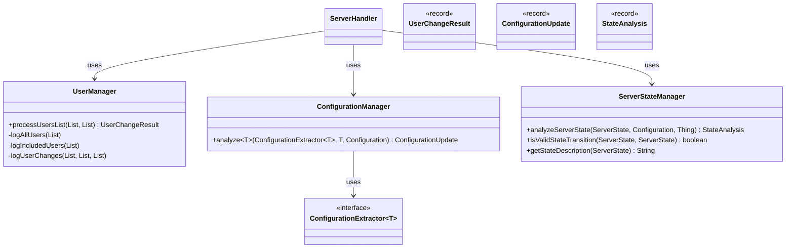

# Utility Classes Architecture

This page documents the extracted utility classes that handle specific
responsibilities in the Jellyfin binding.

```mermaid
classDiagram
    %% Utility classes for separation of concerns
    ServerHandler --> UserManager : uses
    ServerHandler --> ConfigurationManager : uses
    ServerHandler --> ServerStateManager : uses

    class UserManager {
        +processUsersList(List, List) UserChangeResult
        -logAllUsers(List)
        -logIncludedUsers(List)
        -logUserChanges(List, List, List)
    }

    class ConfigurationManager {
        +analyze~T~(ConfigurationExtractor~T~, T, Configuration) ConfigurationUpdate
    }

    class ConfigurationExtractor~T~ {
        <<interface>>
    }

    ConfigurationManager --> ConfigurationExtractor : uses

    class ServerStateManager {
        +analyzeServerState(ServerState, Configuration, Thing) StateAnalysis
        +isValidStateTransition(ServerState, ServerState) boolean
        +getStateDescription(ServerState) String
    }

    %% Records for immutable data transfer (details omitted, see Record Details section)
    class UserChangeResult {
        <<record>>
    }
    class ConfigurationUpdate {
        <<record>>
    }
    class StateAnalysis {
        <<record>>
    }
```

## Summary

Utility classes provide focused, testable logic for user management,
configuration, and state analysis.

The `ConfigurationManager` uses the Strategy pattern with
`ConfigurationExtractor<T>` interface to support multiple configuration sources.
See [Configuration Management Architecture](configuration-management.md) for
detailed documentation.

See the [architecture overview](../architecture.md) for context.
