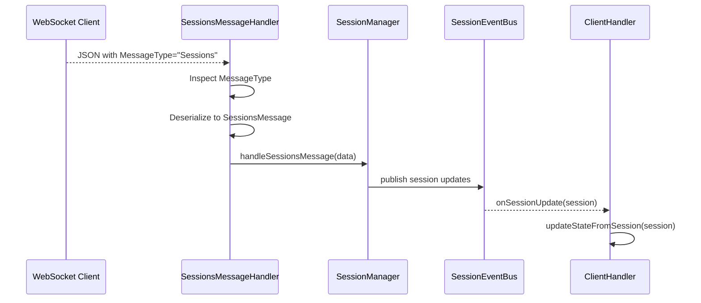

# WebSocket API Integration

This page documents the WebSocket support available in the Jellyfin API for real-time session updates and server messages.

## Overview

The Jellyfin server exposes a WebSocket endpoint for real-time communication, allowing clients to receive session updates without polling. This is significantly more efficient than the traditional 60-second polling mechanism currently used by the binding.

**Benefits of WebSocket integration:**

- **Low latency**: Real-time updates with <1 second latency vs up to 60s with polling
- **Reduced server load**: Eliminates repeated GET requests every 60 seconds
- **Bandwidth efficient**: Only sends data when state changes occur
- **Better UX**: Immediate playback state updates for users

## WebSocket Endpoint

### Connection URL Format

```text
ws://server_host:port/socket?api_key=<api_token>
wss://server_host:port/socket?api_key=<api_token>  (for HTTPS)
```

**Parameters:**

- `server_host`: Jellyfin server hostname or IP
- `port`: Jellyfin server port (typically 8096)
- `api_key`: API authentication token (required)

### Example Connection

For a server at `jellyfin.example.com:8096` with API key `abc123def456`:

```text
wss://jellyfin.example.com:8096/socket?api_key=abc123def456
```

### WebSocket Port Detection

The Jellyfin `/System/Info` endpoint returns a `WebSocketPortNumber` field that indicates the port configured for WebSocket connections. This can be used to dynamically discover the WebSocket port if different from the HTTP port.

## Message Format

### Payload Example

All WebSocket messages include a `MessageType` discriminator. For reliability and to avoid ambiguous oneOf deserialization, the binding inspects `MessageType` directly and deserializes `SessionsMessage` for session updates.

**General message structure (JSON):**

```json
{
  "MessageType": "Sessions",
  "MessageId": "550e8400-e29b-41d4-a716-446655440000",
  "Data": [ ... ]
}
```

## Session Messages (`SessionsMessage`)

The most important message type for the binding is `SessionsMessage`, which provides real-time session/playback updates.

### Message Structure

```json
{
  "MessageType": "Sessions",
  "MessageId": "550e8400-e29b-41d4-a716-446655440000",
  "Data": [
    {
      "PlayState": {
        "PositionTicks": 1234567890,
        "CanSeek": true,
        "IsPaused": false,
        "IsMuted": false,
        "VolumeLevel": 100,
        "AudioStreamIndex": 0,
        "SubtitleStreamIndex": -1,
        "MediaSourceId": "media-source-id",
        "PlayMethod": "DirectPlay",
        "RepeatMode": "RepeatNone",
        "LiveStreamId": null
      },
      "AdditionalUsers": [],
      "Capabilities": { ... },
      "RemoteEndPoint": "192.168.1.100",
      "PlayableMediaTypes": ["Audio", "Video"],
      "Id": "session-id-1",
      "UserId": "user-id-1",
      "UserName": "username",
      "Client": "Jellyfin Web",
      "LastActivityDate": "2025-12-19T10:30:00Z",
      "LastPlaybackCheckIn": "2025-12-19T10:30:00Z",
      "DeviceName": "Web Browser",
      "DeviceId": "device-id-1",
      "ApplicationVersion": "10.11.0",
      "IsActive": true,
      "TranscodingInfo": null,
      "IsSystemSession": false
    }
  ]
}
```

### SessionInfoDto Fields (Primary Interest for Binding)

| Field                | Type            | Description                         |
| -------------------- | --------------- | ----------------------------------- |
| `Id`                 | string          | Unique session identifier           |
| `UserId`             | UUID            | User ID associated with session     |
| `UserName`           | string          | Username                            |
| `Client`             | string          | Client application name             |
| `DeviceName`         | string          | Device name running the client      |
| `DeviceId`           | string          | Unique device identifier            |
| `ApplicationVersion` | string          | Client application version          |
| `IsActive`           | boolean         | Whether session is currently active |
| `LastActivityDate`   | ISO8601         | Last activity timestamp             |
| `PlayState`          | PlayerStateInfo | Current playback state (see below)  |
| `NowPlayingItem`     | BaseItemDto     | Currently playing media item        |

### PlayerStateInfo (Playback Status)

| Field                 | Type        | Description                                                    |
| --------------------- | ----------- | -------------------------------------------------------------- |
| `PositionTicks`       | long        | Current playback position (in ticks, 1 tick = 100 nanoseconds) |
| `CanSeek`             | boolean     | Whether seeking is possible                                    |
| `IsPaused`            | boolean     | Whether playback is paused                                     |
| `IsMuted`             | boolean     | Whether audio is muted                                         |
| `VolumeLevel`         | int         | Volume level (0-100)                                           |
| `PlayMethod`          | PlayMethod  | Enum: `DirectPlay`, `DirectStream`, `Transcode`                |
| `MediaSourceId`       | string      | ID of the media source                                         |
| `AudioStreamIndex`    | int         | Active audio stream index                                      |
| `SubtitleStreamIndex` | int         | Active subtitle stream index (-1 for none)                     |
| `RepeatMode`          | string      | Repeat mode: `RepeatNone`, `RepeatAll`, `RepeatOne`            |

## Other Message Types (Future Enhancement)

The WebSocket API supports additional message types that are not included in the initial implementation but documented for future enhancement:

### Playstate Message

Message type: `Playstate`

Fine-grained playback state change notifications (alternative to SessionsMessage for specific events).

### UserDataChanged Message

Message type: `UserDataChanged`

Notifications when user preferences or watchlist status changes.

### LibraryChanged Message

Message type: `LibraryChanged`

Notifications when media library content is added, modified, or deleted.

### Server System Messages

- **ServerRestarting**: Server is about to restart
- **ServerShuttingDown**: Server is shutting down
- **ForceKeepAlive**: Keep-alive message to maintain WebSocket connection

## Authentication

### API Key Placement

API authentication for WebSocket connections uses **query parameter** authentication (recommended primary method):

```text
ws://server:8096/socket?api_key=<token>
```

The API key is the same token used for HTTP REST API calls and can be obtained from:

1. User profile settings in Jellyfin web UI
2. API key management endpoint: `POST /auth/Keys`
3. Authentication endpoints: `/Users/AuthenticateByName`

### Security Considerations

- WebSocket connections should use `wss://` (secure WebSocket over TLS) in production
- API keys should be treated as secrets and not exposed in logs
- Implement WebSocket connection timeouts to detect stale connections
- Monitor connection failures for authentication issues (401) vs transport issues

## OpenHAB Integration Path

In the context of the openHAB Jellyfin binding:

1. **WebSocketTask**: Manages WebSocket connection lifecycle with automatic reconnection and exponential backoff.
2. **SessionsMessageHandler**: Reads `MessageType` and deserializes `SessionsMessage` directly, avoiding ambiguous oneOf matching.
3. **SessionManager**: Aggregates sessions into a map and updates state.
4. **SessionEventBus**: Receives updates from `SessionManager` and publishes to device-specific channels.
5. **ClientHandler**: Subscribes to its device channel and updates thing channels from session state.
6. **Fallback mechanism**: If WebSocket connection fails after max retries, automatically switches to ServerSyncTask polling.

### Sequence: Sessions message handling



## Connection Management

### Reconnection and Backoff

The binding implements automatic reconnection with exponential backoff for WebSocket failures:

**Backoff Strategy:**

- Initial backoff: 1 second
- Exponential progression: 1s → 2s → 4s → 8s → 16s → 32s → 60s (capped)
- Calculation: `INITIAL_BACKOFF * (1 << (attempts - 1))` with 60s maximum
- Maximum retry attempts: 10

**Connection States:**

- `DISCONNECTED`: No connection, no attempt in progress
- `CONNECTING`: Connection attempt in progress
- `CONNECTED`: Successfully connected and ready
- `FAILED`: Connection failed or closed due to error

**Reconnection Triggers:**

- Non-normal WebSocket close (status code != 1000)
- WebSocket connection errors
- Network timeouts

**State Reset:**

Successful connection resets the reconnection counter and backoff delay to initial values.

### Fallback to Polling

After 10 failed reconnection attempts, the binding automatically falls back to polling mode:

1. **WebSocketTask** invokes fallback callback to ServerHandler
2. **ServerHandler.handleWebSocketFallback()** executes:
   - Stops WebSocket task schedule
   - Disposes WebSocketTask resources
   - Starts ServerSyncTask for periodic polling (using `refreshSeconds` interval)
3. **Polling continues** until binding restart or manual intervention

**Configuration:**

WebSocket can be disabled entirely via the `useWebSocket` parameter (default: `true`):

- `useWebSocket=true`: Use WebSocket with automatic fallback
- `useWebSocket=false`: Use polling only (no WebSocket attempts)

## References

### Internal

- [Core Handler Design](../architecture/core-handler.md)
- [API Integration](../architecture/api.md)
- [Event Bus Architecture](../implementation-plan/2025-11-28/event-bus-architecture-implementation.md)

### Jellyfin Source

- Generated model classes: `SessionsMessage`, `SessionInfoDto`, `PlayerStateInfo`, `PlayMethod`
- Message discriminator mapping: `WebSocketMessage` with `MessageType` mapping (direct `SessionsMessage` parsing in handler)

### Standards

- [RFC 6455 - The WebSocket Protocol](https://tools.ietf.org/html/rfc6455)
- [Jetty WebSocket Client API](https://www.eclipse.org/jetty/documentation/jetty-9/index.html)
