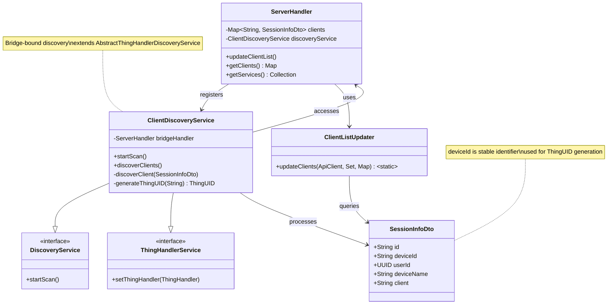
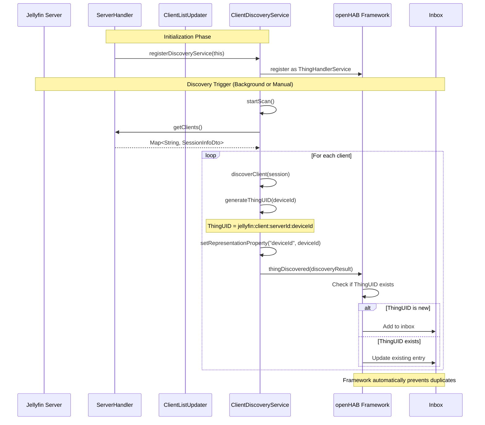
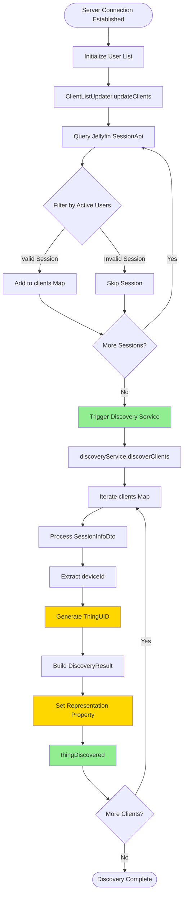
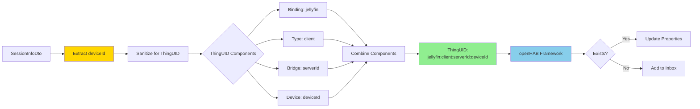
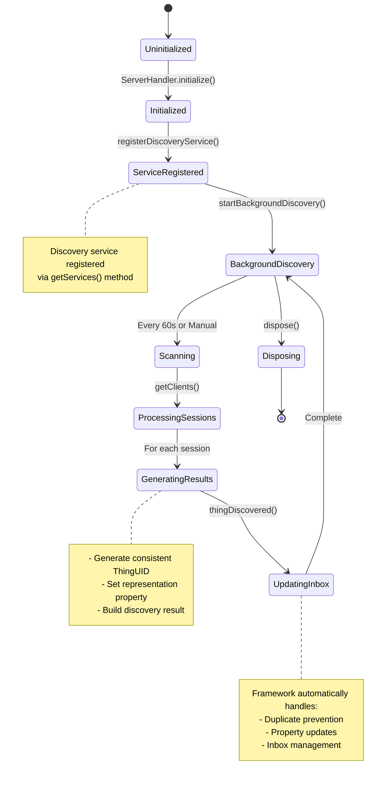

# Discovery Service Implementation Plan

## Overview

This document outlines the implementation plan for adding a proper discovery service to the Jellyfin binding.
The discovery service will automatically discover Jellyfin clients (sessions) and add them to the inbox, avoiding duplicates.

## Problem Statement

Currently, the ServerHandler tracks Jellyfin clients in a `Map<String, SessionInfoDto>` via the `ClientListUpdater`.
However, there's no discovery service that:

1. Automatically adds discovered clients to the openHAB inbox
2. Prevents duplicate entries in the inbox
3. Updates existing things when re-discovered
4. Follows openHAB bridge-bound discovery best practices

## Architecture Overview

### High-Level Component Diagram



### Discovery Flow Sequence Diagram



### Client Update and Discovery Integration



### ThingUID Generation Strategy



### Component Lifecycle and Interaction



## openHAB Discovery Best Practices (from Documentation)

According to openHAB developer documentation:

### Key Principles

1. **Consistent ThingUID Generation**: "The getThingUID method of the discovery service should create a consistent UID every time the same thing gets discovered.
  This way existing discovery results and existing things with this UID will be updated with the properties from the current scan."

2. **Automatic Deduplication**: The framework automatically prevents duplicates when:
   - ThingUID is generated consistently from stable identifiers
   - Representation properties are properly set
   - The same thing generates the same ThingUID on every discovery

3. **No Manual Checking Required**: You do NOT need to manually check if things already exist or are in the inbox.
  The framework handles this automatically through consistent ThingUID generation.

### Bridge-Bound Discovery Pattern

For bridge-bound discovery services:

```java
@Component(scope = ServiceScope.PROTOTYPE, service = ClientDiscoveryService.class)
@NonNullByDefault
public class ClientDiscoveryService extends AbstractThingHandlerDiscoveryService<ServerHandler> {
    // Implementation
}
```

Key requirements:

- Extend `AbstractThingHandlerDiscoveryService<BridgeHandlerType>`
- Use `@Component(scope = ServiceScope.PROTOTYPE)` annotation
- Register via `ServerHandler.getServices()` method
- Implement `startScan()` for active discovery
- Support background discovery (continuous)

## Current Implementation Analysis

### ServerHandler.java

**Location**: `src/main/java/org/openhab/binding/jellyfin/internal/handler/ServerHandler.java`

**Current State**:

- Manages Jellyfin server connection (bridge handler)
- Tracks clients in `Map<String, SessionInfoDto> clients`
- Updates client list via `ClientListUpdater.updateClients()`
- Called from `updateClientList()` method (line 466)

**Key Fields**:

```java
private final Map<String, SessionInfoDto> clients = new ConcurrentHashMap<>();
```

### ClientListUpdater.java

**Location**: `src/main/java/org/openhab/binding/jellyfin/internal/util/client/ClientListUpdater.java`

**Current Behavior**:

- Utility class with static method
- Queries Jellyfin API via `SessionApi.getSessions()`
- Clears and repopulates client map
- Filters sessions by active user IDs

**Current Code**:

```java
public static void updateClients(ApiClient apiClient, Set<String> userIds, Map<String, SessionInfoDto> clientMap) {
    var sessionApi = new SessionApi(apiClient);
    clientMap.clear();
    for (String userId : userIds) {
        try {
            List<SessionInfoDto> sessions = sessionApi.getSessions(UUID.fromString(userId), null, null, null);
            for (SessionInfoDto session : sessions) {
                if (userIds.contains(session.getUserId().toString())) {
                    clientMap.put(session.getId(), session);
                }
            }
        } catch (Exception e) {
            // Log or handle as appropriate in the caller
        }
    }
}
```

### SessionInfoDto.java

**Location**: `src/main/java/org/openhab/binding/jellyfin/internal/api/generated/current/model/SessionInfoDto.java`

**Stable Identifiers Available**:

- `id` (String) - Session ID (unique per session, key in current map)
- `deviceId` (String) - Device ID (stable across sessions for same device)
- `userId` (UUID) - User ID
- `deviceName` (String) - Human-readable device name
- `client` (String) - Client application name
- `deviceType` (String) - Type of device

**Best Identifier for ThingUID**: `deviceId` - This is the most stable identifier as it represents the physical device/client across multiple sessions.

## Implementation Plan

### Step 1: Create ClientDiscoveryService

**New File**: `src/main/java/org/openhab/binding/jellyfin/internal/discovery/ClientDiscoveryService.java`

**Responsibilities**:

- Discover Jellyfin clients from the ServerHandler's client map
- Generate consistent ThingUIDs based on device IDs
- Create DiscoveryResults with appropriate properties
- Support both active scan and background discovery

**Class Structure**:

```java
@Component(scope = ServiceScope.PROTOTYPE, service = ClientDiscoveryService.class)
@NonNullByDefault
public class ClientDiscoveryService extends AbstractThingHandlerDiscoveryService<ServerHandler> {
    
    private static final int DISCOVERY_TIMEOUT_SECONDS = 10;
    private static final int BACKGROUND_DISCOVERY_INTERVAL_SECONDS = 60;
    
    public ClientDiscoveryService() {
        super(ServerHandler.class, CLIENT_SUPPORTED_THING_TYPES, DISCOVERY_TIMEOUT_SECONDS, true);
    }
    
    @Override
    public void initialize() {
        thingHandler.registerDiscoveryService(this);
        super.initialize();
    }
    
    @Override
    protected void startScan() {
        // Trigger immediate client list update and discovery
        discoverClients();
    }
    
    @Override
    protected void startBackgroundDiscovery() {
        // Enable continuous discovery every 60 seconds
        super.startBackgroundDiscovery();
    }
    
    @Override
    protected void stopBackgroundDiscovery() {
        super.stopBackgroundDiscovery();
    }
    
    /**
     * Discovers clients from the ServerHandler's client map.
     * Called by ServerHandler after updating the client list.
     */
    public void discoverClients() {
        ServerHandler handler = thingHandler;
        if (handler == null) {
            return;
        }
        
        ThingUID bridgeUID = handler.getThing().getUID();
        Map<String, SessionInfoDto> clients = handler.getClients();
        
        for (SessionInfoDto session : clients.values()) {
            discoverClient(bridgeUID, session);
        }
    }
    
    private void discoverClient(ThingUID bridgeUID, SessionInfoDto session) {
        // Generate consistent ThingUID from device ID
        String deviceId = session.getDeviceId();
        if (deviceId == null || deviceId.isEmpty()) {
            // Fallback to session ID if device ID not available
            deviceId = session.getId();
        }
        
        ThingUID thingUID = new ThingUID(THING_TYPE_CLIENT, bridgeUID, deviceId);
        
        // Build properties map
        Map<String, Object> properties = new HashMap<>();
        properties.put("deviceId", session.getDeviceId());
        properties.put("deviceName", session.getDeviceName());
        properties.put("deviceType", session.getDeviceType());
        properties.put("client", session.getClient());
        properties.put("userId", session.getUserId().toString());
        properties.put("userName", session.getUserName());
        
        // Create discovery result with representation property
        DiscoveryResult discoveryResult = DiscoveryResultBuilder.create(thingUID)
            .withBridge(bridgeUID)
            .withLabel(session.getDeviceName() + " (" + session.getClient() + ")")
            .withProperties(properties)
            .withRepresentationProperty("deviceId")  // Critical for deduplication
            .build();
        
        // Let framework handle deduplication automatically
        thingDiscovered(discoveryResult);
    }
}
```

**Key Design Decisions**:

1. **ThingUID Generation**: Use `deviceId` as the thing ID component
   - Rationale: Device ID is stable across sessions for the same physical device
   - Fallback to `sessionId` if device ID unavailable
   - Consistent generation ensures automatic deduplication

2. **Representation Property**: Set to `"deviceId"`
   - This tells the framework which property uniquely identifies the thing
   - Framework uses this to prevent duplicates automatically

3. **Background Discovery**: Enable by default
   - Poll client list every 60 seconds
   - Automatically update inbox with new clients
   - Framework handles updates to existing things

4. **No Manual Duplicate Checking**: Trust the framework
   - Same ThingUID → Update existing discovery result
   - Same representation property → Recognize as same device
   - No need to check inbox or thing registry manually

### Step 2: Modify ServerHandler

**File**: `src/main/java/org/openhab/binding/jellyfin/internal/handler/ServerHandler.java`

**Changes Required**:

1. **Add Discovery Service Registration**:

```java
private @Nullable ClientDiscoveryService discoveryService;

public void registerDiscoveryService(ClientDiscoveryService service) {
    this.discoveryService = service;
}

@Override
public Collection<Class<? extends ThingHandlerService>> getServices() {
    return Set.of(ClientDiscoveryService.class);
}
```

2. **Trigger Discovery After Client List Update**:

```java
private void updateClientList() {
    ClientListUpdater.updateClients(apiClient, activeUserIds, clients);
    
    // Trigger discovery after updating client list
    ClientDiscoveryService service = discoveryService;
    if (service != null) {
        service.discoverClients();
    }
}
```

3. **Expose Client Map** (if not already public):

```java
public Map<String, SessionInfoDto> getClients() {
    return Collections.unmodifiableMap(clients);
}
```

### Step 3: Update JellyfinBindingConstants

**File**: `src/main/java/org/openhab/binding/jellyfin/internal/JellyfinBindingConstants.java`

**Add Discovery Support Set**:

```java
// Discovery
public static final Set<ThingTypeUID> CLIENT_SUPPORTED_THING_TYPES = Set.of(THING_TYPE_CLIENT);
```

This constant is referenced by the discovery service to specify which thing types can be discovered.

### Step 4: Testing Strategy

**Manual Testing Steps**:

1. **Initial Discovery**:
   - Start openHAB with Jellyfin binding
   - Add Jellyfin server bridge
   - Verify clients appear in inbox automatically
   - Check that device name and client info are correct

2. **Duplicate Prevention**:
   - Add a client from inbox to things
   - Wait for next discovery cycle (or trigger scan)
   - Verify NO duplicate appears in inbox
   - Verify existing thing is not affected

3. **Client Changes**:
   - Start new session on same device
   - Verify discovery updates existing inbox entry (not new entry)
   - Verify thing properties are updated if thing exists

4. **Multiple Clients**:
   - Start sessions on multiple devices
   - Verify each device gets separate inbox entry
   - Verify no false duplicates

**Expected Behavior**:

- ✅ Each unique device appears once in inbox (by deviceId)
- ✅ Same device re-discovered → updates existing inbox entry
- ✅ Thing created from inbox → no duplicate inbox entry
- ✅ Background discovery continues to work
- ✅ Manual scan triggers immediate discovery

### Step 5: Documentation Updates

**File**: `docs/architecture/discovery.md` (new file)

Create discovery architecture documentation explaining:

- How discovery works
- ThingUID generation strategy
- Representation property usage
- Why deviceId is used as stable identifier
- Relationship between sessions and devices

## Key Takeaways

### What Makes This Work

1. **Consistent ThingUID**: Always `jellyfin:client:<bridge-id>:<device-id>`
2. **Representation Property**: Set to `"deviceId"` to identify uniqueness
3. **Trust the Framework**: Don't manually check inbox or things
4. **Bridge-Bound Pattern**: Extends `AbstractThingHandlerDiscoveryService`
5. **Prototype Scope**: Each bridge gets its own discovery service instance

### What NOT to Do

❌ Don't manually check if thing exists in thing registry
❌ Don't manually check if entry exists in inbox
❌ Don't use session ID for ThingUID (not stable across sessions)
❌ Don't forget to set representation property
❌ Don't use singleton scope for bridge-bound discovery

### Common Pitfalls Avoided

1. **Session vs Device**: Sessions are ephemeral; devices are stable
2. **ID Stability**: Device ID persists across sessions; session ID doesn't
3. **Framework Trust**: openHAB framework handles deduplication automatically
4. **Representation Property**: Critical for framework to recognize same device

## Implementation Order

1. ✅ Create `ClientDiscoveryService.java`
2. ✅ Modify `ServerHandler.java` to register service
3. ✅ Update `JellyfinBindingConstants.java` with discovery constants
4. ✅ Test manually with real Jellyfin server
5. ✅ Document discovery architecture
6. ✅ Add unit tests for ThingUID generation
7. ✅ Add integration tests for discovery lifecycle

## References

- **openHAB Discovery Documentation**: <https://www.openhab.org/docs/developer/bindings/>
- **Example Discovery Services**:
  - `ZoneminderDiscoveryService` - Bridge-bound discovery pattern
  - `CaddxDiscoveryService` - Representation property usage
  - `DeconzThingDiscoveryService` - Comprehensive example
  - `MatterDiscoveryService` - Modern implementation
  
## Success Criteria

✅ Discovery service follows openHAB best practices
✅ No duplicate inbox entries for same device
✅ Existing things not duplicated in inbox
✅ Background discovery updates client list
✅ Manual scan triggers immediate discovery
✅ ThingUID generation is consistent
✅ Representation property correctly identifies devices
✅ Bridge-bound pattern properly implemented
✅ Service registered via ServerHandler.getServices()

---

**Last Updated**: 2025-01-24
**Status**: Ready for Implementation
