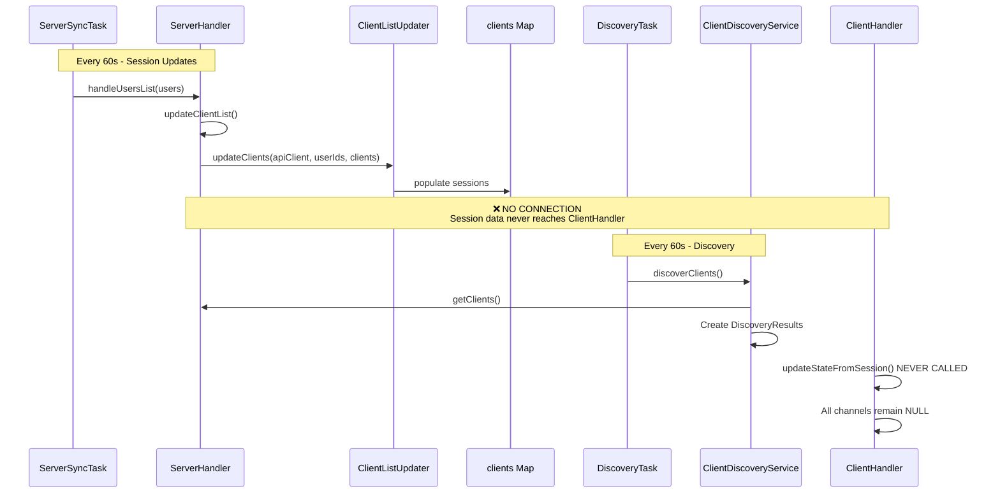
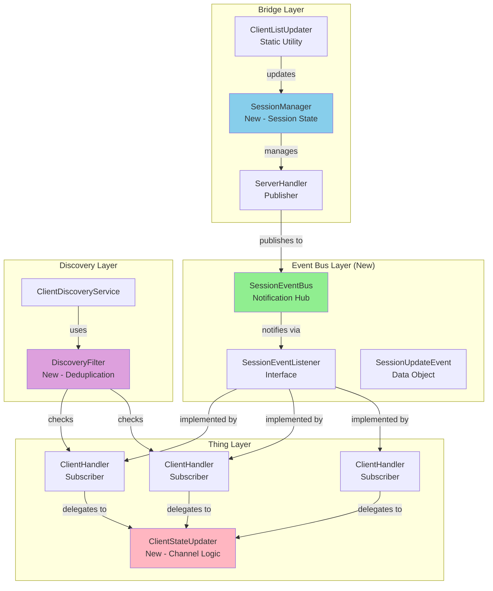
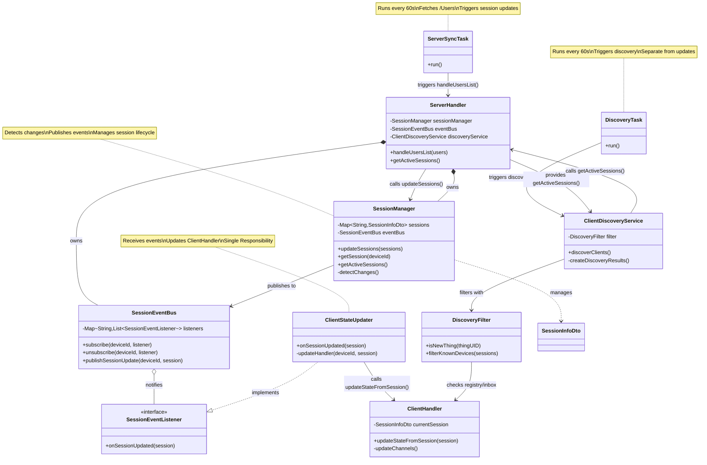
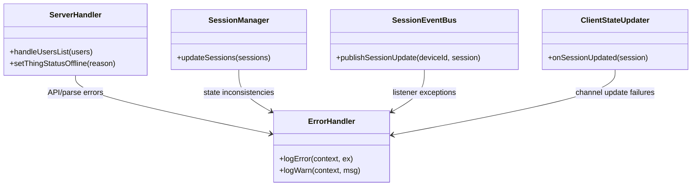
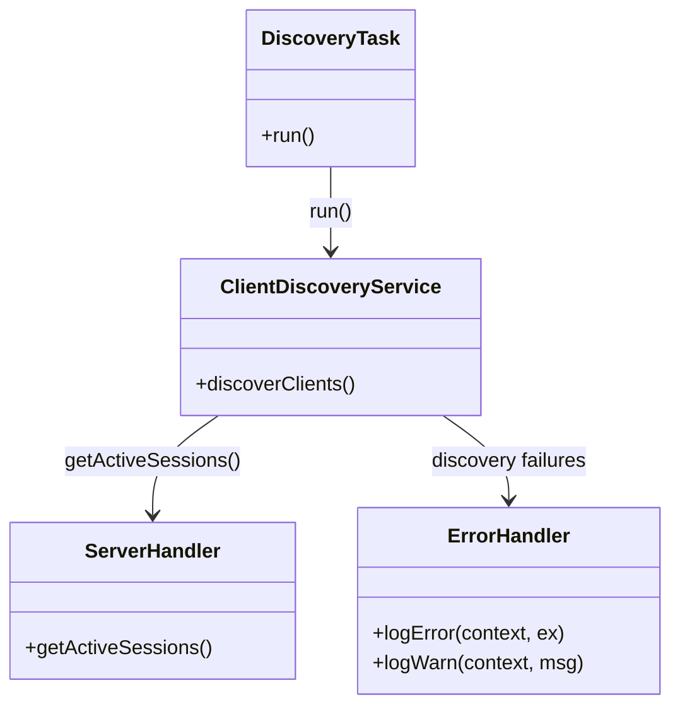
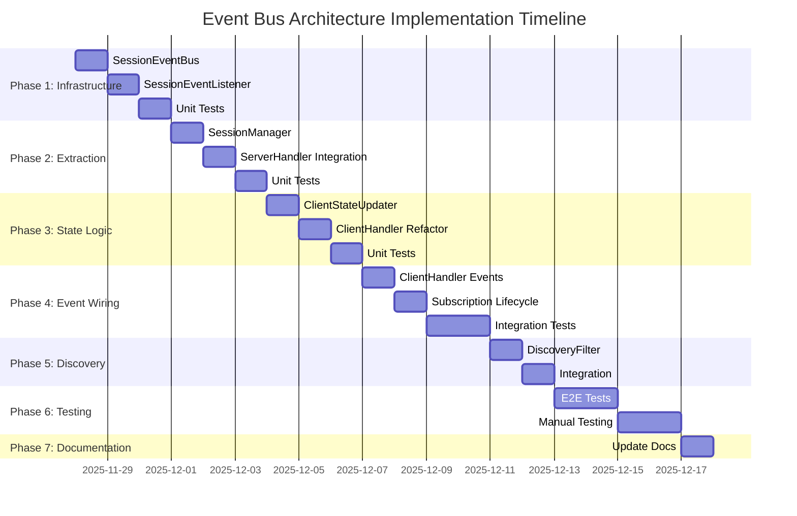

# Event Bus Architecture Implementation Plan

**Date**: 2025-11-28
**Author**: GitHub Copilot (Claude Sonnet 4.5)
**Status**: Active Implementation Plan
**Priority**: High - Blocks client channel functionality
**Supersedes**: [client-handler.md](./client-handler.md) (marked obsolete)

---

## Executive Summary

This document outlines the implementation of **Option 2: Event Bus Pattern** for propagating Jellyfin session updates from `ServerHandler` to `ClientHandler` instances. The architecture follows SOLID principles, reduces coupling, and provides a clean separation of concerns through event-driven communication.

### Key Improvements Over Direct Push (Option 1)

- ✅ **Loose Coupling**: ServerHandler doesn't need to know about ClientHandler implementation
- ✅ **Single Responsibility**: Each component has one clear purpose
- ✅ **Open/Closed Principle**: Easy to extend with new listeners without modifying existing code
- ✅ **Dependency Inversion**: Both handlers depend on abstractions (event interfaces), not concretions
- ✅ **Testability**: Event bus can be easily mocked for unit testing

---

## Table of Contents

1. [Current Architecture Analysis](#current-architecture-analysis)
2. [SOLID Principle Violations](#solid-principle-violations)
3. [Proposed Architecture](#proposed-architecture)
4. [Component Design](#component-design)
5. [Implementation Tasks](#implementation-tasks)
6. [Testing Strategy](#testing-strategy)
7. [Migration Path](#migration-path)
8. [Success Criteria](#success-criteria)

---

## Current Architecture Analysis

### Task Architecture (Important: Separation of Concerns)

The current binding uses **two separate tasks** for different purposes:

| Task | Purpose | Interval | Triggers |
|------|---------|----------|----------|
| **ServerSyncTask** | Fetches users from `/Users` endpoint, triggers session updates | 60s | `handleUsersList()` → `updateClientList()` |
| **DiscoveryTask** | Triggers discovery service to scan for new clients | 60s | `discoveryService.discoverClients()` |

⚠️ **CRITICAL**: These tasks remain separate. ServerSyncTask handles session updates (which will publish events), while DiscoveryTask only triggers discovery.

### Current Data Flow (Broken)



### Current Component Responsibilities

| Component | Current Responsibilities | Issues |
|-----------|-------------------------|--------|
| **ServerHandler** | API calls, task management, discovery coordination, user management, state management, session storage | Too many responsibilities (>750 lines) |
| **ClientHandler** | Channel updates, command routing, session state tracking | Has `updateStateFromSession()` but it's never called |
| **ClientListUpdater** | Fetch and filter sessions from API | Static utility, works correctly |
| **ClientDiscoveryService** | Discover clients from session map | Works correctly, but logs ALL clients as new discoveries |

### Key Problems

1. ❌ **No Communication Path**: ServerHandler updates `clients` map but doesn't notify ClientHandler instances
2. ❌ **Tight Coupling Potential**: Any push mechanism directly couples ServerHandler to ClientHandler
3. ❌ **Large ServerHandler**: Adding push logic increases size and complexity
4. ❌ **Discovery Spam**: Logs every client as "Discovered" even if already in inbox or has handler
5. ❌ **Mixed Responsibilities**: ServerHandler handles both infrastructure (tasks, API) and domain logic (session updates)

---

## SOLID Principle Violations

### Current Code Analysis

```java
// ServerHandler.java - VIOLATION: Single Responsibility Principle
public class ServerHandler extends BaseBridgeHandler {
    // 1. API Client Management
    private final ApiClient apiClient;

    // 2. Task Management
    private final Map<String, AbstractTask> tasks = new HashMap<>();

    // 3. Discovery Coordination
    private ClientDiscoveryService discoveryService;

    // 4. User Management
    private final List<String> activeUserIds = new ArrayList<>();

    // 5. Session Storage
    private final Map<String, SessionInfoDto> clients = new HashMap<>();

    // 6. Configuration Management
    private final Configuration configuration;

    // 7. Error Handling
    private final ErrorEventBus errorEventBus;

    // TOO MANY RESPONSIBILITIES!
}
```

**Violations**:
- ❌ **Single Responsibility**: ServerHandler has 7+ distinct responsibilities
- ❌ **Open/Closed**: Cannot extend session notification without modifying ServerHandler
- ❌ **Dependency Inversion**: ClientHandler would depend on concrete ServerHandler, not abstraction

---

## Proposed Architecture

### Event-Driven Architecture with SOLID Compliance



### Key Architectural Improvements

1. **SessionEventBus**: Central notification hub (follows Observer pattern)
2. **SessionManager**: Extracted session state management from ServerHandler
3. **ClientStateUpdater**: Extracted channel update logic from ClientHandler
4. **DiscoveryFilter**: Prevents duplicate discovery logging

---

## Component Design

### 1. SessionEventBus (New)

**Purpose**: Decouple session publishers from subscribers using event-driven notification.

**Responsibilities**:
- Maintain map of device ID → listeners
- Publish session updates to subscribed listeners
- Handle subscription lifecycle (subscribe/unsubscribe)

**SOLID Compliance**:
- ✅ **Single Responsibility**: Only handles event routing
- ✅ **Open/Closed**: New listener types can subscribe without modification
- ✅ **Liskov Substitution**: Any SessionEventListener can subscribe
- ✅ **Interface Segregation**: Simple listener interface with one method
- ✅ **Dependency Inversion**: Depends on listener interface, not concrete types

```java
package org.openhab.binding.jellyfin.internal.events;

import java.util.List;
import java.util.Map;
import java.util.concurrent.ConcurrentHashMap;
import java.util.concurrent.CopyOnWriteArrayList;

import org.eclipse.jdt.annotation.NonNullByDefault;
import org.eclipse.jdt.annotation.Nullable;
import org.openhab.binding.jellyfin.internal.api.generated.current.model.SessionInfoDto;
import org.slf4j.Logger;
import org.slf4j.LoggerFactory;

/**
 * Event bus for distributing Jellyfin session updates to interested listeners.
 * Thread-safe: concurrent subscriptions and publications are supported.
 */
@NonNullByDefault
public class SessionEventBus {
    private final Logger logger = LoggerFactory.getLogger(SessionEventBus.class);

    private final Map<String, List<SessionEventListener>> listeners = new ConcurrentHashMap<>();

    /**
     * Subscribes a listener to receive session updates for a specific device.
     *
     * @param deviceId The device ID to listen for
     * @param listener The listener to notify on session updates
     */
    public void subscribe(String deviceId, SessionEventListener listener) {
        listeners.computeIfAbsent(deviceId, k -> new CopyOnWriteArrayList<>()).add(listener);
        logger.debug("Listener subscribed for device ID: {}", deviceId);
    }

    /**
     * Unsubscribes a listener from receiving session updates for a specific device.
     *
     * @param deviceId The device ID to stop listening for
     * @param listener The listener to remove
     */
    public void unsubscribe(String deviceId, SessionEventListener listener) {
        List<SessionEventListener> deviceListeners = listeners.get(deviceId);
        if (deviceListeners != null) {
            deviceListeners.remove(listener);
            if (deviceListeners.isEmpty()) {
                listeners.remove(deviceId);
            }
            logger.debug("Listener unsubscribed for device ID: {}", deviceId);
        }
    }

    /**
     * Publishes a session update to all listeners subscribed to the given device ID.
     *
     * @param deviceId The device ID whose session has updated
     * @param session The new session state, or null if session ended
     */
    public void publishSessionUpdate(String deviceId, @Nullable SessionInfoDto session) {
        List<SessionEventListener> deviceListeners = listeners.get(deviceId);
        if (deviceListeners == null || deviceListeners.isEmpty()) {
            logger.trace("No listeners for device ID: {}", deviceId);
            return;
        }

        logger.debug("Publishing session update for device ID {} to {} listener(s)", deviceId,
                Integer.valueOf(deviceListeners.size()));

        for (SessionEventListener listener : deviceListeners) {
            try {
                listener.onSessionUpdate(session);
            } catch (Throwable t) {
                logger.warn("Listener threw during session update for device {}: {}", deviceId, t.getMessage());
                logger.debug("Listener exception", t);
            }
        }
    }

    /** Clears all listener subscriptions. */
    public void clear() {
        int count = getTotalListenerCount();
        listeners.clear();
        logger.debug("Cleared {} listener subscription(s)", Integer.valueOf(count));
    }

    /** Returns number of listeners for a device ID. */
    public int getListenerCount(String deviceId) {
        List<SessionEventListener> deviceListeners = listeners.get(deviceId);
        return deviceListeners != null ? deviceListeners.size() : 0;
    }

    /** Returns total number of active subscriptions across all device IDs. */
    public int getTotalListenerCount() {
        return listeners.values().stream().mapToInt(List::size).sum();
    }
}
```

### 2. SessionEventListener (New)

**Purpose**: Define contract for session update notifications.

```java
package org.openhab.binding.jellyfin.internal.events;

import org.eclipse.jdt.annotation.NonNullByDefault;
import org.eclipse.jdt.annotation.Nullable;
import org.openhab.binding.jellyfin.internal.api.generated.current.model.SessionInfoDto;

/**
 * Listener interface for receiving Jellyfin session update notifications.
 * Implementations are notified when session state changes for a specific device.
 */
@NonNullByDefault
@FunctionalInterface
public interface SessionEventListener {
    /**
     * Called when a session update occurs for a subscribed device.
     *
     * @param session The updated session information, or null if session ended/offline
     */
    void onSessionUpdate(@Nullable SessionInfoDto session);
}
```
     * @param session The updated session information, or null if session ended
     */
    void onSessionUpdate(@Nullable SessionInfoDto session);
}
```

### 3. SessionManager (New - Extracted from ServerHandler)

**Purpose**: Manage session state lifecycle and coordinate updates.

**Extracted Responsibilities**:
- Session map management (previously in ServerHandler)
- Session update coordination
- Event publication
- Offline detection

```java
package org.openhab.binding.jellyfin.internal.util.session;

import java.util.HashMap;
import java.util.HashSet;
import java.util.Map;
import java.util.Set;

import org.eclipse.jdt.annotation.NonNullByDefault;
import org.openhab.binding.jellyfin.internal.api.generated.current.model.SessionInfoDto;
import org.openhab.binding.jellyfin.internal.events.SessionEventBus;
import org.slf4j.Logger;
import org.slf4j.LoggerFactory;

/**
 * Manages Jellyfin client session state and coordinates session update events.
 *
 * <p>This class encapsulates session lifecycle management previously scattered
 * throughout ServerHandler. It maintains the session map, tracks device IDs,
 * and publishes session updates to the event bus.
 *
 * <p>SOLID Principles:
 * <ul>
 * <li>Single Responsibility: Only manages session state</li>
 * <li>Dependency Inversion: Depends on SessionEventBus abstraction</li>
 * </ul>
 *
 * @author Patrik Gfeller - Initial contribution
 */
@NonNullByDefault
public class SessionManager {
    private final Logger logger = LoggerFactory.getLogger(SessionManager.class);

    private final SessionEventBus eventBus;
    private final Map<String, SessionInfoDto> sessions = new HashMap<>();
    private final Set<String> previousDeviceIds = new HashSet<>();

    /**
     * Creates a new session manager.
     *
     * @param eventBus The event bus for publishing session updates
     */
    public SessionManager(SessionEventBus eventBus) {
        this.eventBus = eventBus;
    }

    /**
     * Gets the current session map (read-only access).
     *
     * @return Map of session ID to session info
     */
    public Map<String, SessionInfoDto> getSessions() {
        return new HashMap<>(sessions);
    }

    /**
     * Updates the session map and publishes events for changed sessions.
     *
     * <p>This method:
     * <ul>
     * <li>Replaces current sessions with new session data</li>
     * <li>Publishes session updates to event bus for active devices</li>
     * <li>Publishes null sessions for devices that went offline</li>
     * </ul>
     *
     * @param newSessions The new session map (typically from ClientListUpdater)
     */
    public void updateSessions(Map<String, SessionInfoDto> newSessions) {
        // Track which devices are currently active
        Set<String> currentDeviceIds = new HashSet<>();

        // Update sessions and publish events for active devices
        sessions.clear();
        sessions.putAll(newSessions);

        for (SessionInfoDto session : newSessions.values()) {
            String deviceId = session.getDeviceId();
            if (deviceId != null && !deviceId.isBlank()) {
                currentDeviceIds.add(deviceId);
                eventBus.publishSessionUpdate(deviceId, session);
                logger.debug("Published session update for device: {}", deviceId);
            }
        }

        // Detect devices that went offline (were active, now gone)
        Set<String> offlineDevices = new HashSet<>(previousDeviceIds);
        offlineDevices.removeAll(currentDeviceIds);

        for (String deviceId : offlineDevices) {
            eventBus.publishSessionUpdate(deviceId, null);
            logger.debug("Published offline notification for device: {}", deviceId);
        }

        // Update tracking set for next iteration
        previousDeviceIds.clear();
        previousDeviceIds.addAll(currentDeviceIds);
    }

    /**
     * Clears all session state.
     *
     * <p>Should be called during ServerHandler.dispose().
     */
    public void clear() {
        sessions.clear();
        previousDeviceIds.clear();
    }
}
```

### 4. ClientStateUpdater (New - Extracted from ClientHandler)

**Purpose**: Encapsulate channel update logic for reusability and testability.

```java
package org.openhab.binding.jellyfin.internal.util.client;

import org.eclipse.jdt.annotation.NonNullByDefault;
import org.eclipse.jdt.annotation.Nullable;
import org.openhab.binding.jellyfin.internal.Constants;
import org.openhab.binding.jellyfin.internal.api.generated.current.model.BaseItemDto;
import org.openhab.binding.jellyfin.internal.api.generated.current.model.PlayerStateInfo;
import org.openhab.binding.jellyfin.internal.api.generated.current.model.SessionInfoDto;
import org.openhab.core.library.types.DecimalType;
import org.openhab.core.library.types.PercentType;
import org.openhab.core.library.types.PlayPauseType;
import org.openhab.core.library.types.StringType;
import org.openhab.core.thing.ChannelUID;
import org.openhab.core.types.State;
import org.openhab.core.types.UnDefType;
import org.slf4j.Logger;
import org.slf4j.LoggerFactory;

import java.util.HashMap;
import java.util.Map;
import java.util.function.BiConsumer;

/**
 * Utility class for updating client channel states based on session information.
 *
 * <p>This class extracts channel update logic from ClientHandler to improve
 * testability and reusability. It follows a functional approach where channel
 * updates are returned as a map that the caller can apply.
 *
 * <p>SOLID Principles:
 * <ul>
 * <li>Single Responsibility: Only calculates channel states</li>
 * <li>Open/Closed: Easy to extend with new channels</li>
 * <li>Dependency Inversion: Returns generic State map, doesn't depend on Thing</li>
 * </ul>
 *
 * @author Patrik Gfeller - Initial contribution
 */
@NonNullByDefault
public class ClientStateUpdater {
    private static final Logger logger = LoggerFactory.getLogger(ClientStateUpdater.class);

    /**
     * Calculates channel states from session information.
     *
     * <p>Returns a map of channel ID to State that the caller can apply to
     * their Thing's channels. This allows for easy testing without mocking
     * the entire Thing infrastructure.
     *
     * @param session The session information, or null to clear all states
     * @return Map of channel ID to desired State
     */
    public static Map<String, State> calculateChannelStates(@Nullable SessionInfoDto session) {
        Map<String, State> states = new HashMap<>();

        if (session == null) {
            // Clear all channels
            addNullStates(states);
            return states;
        }

        BaseItemDto playingItem = session.getNowPlayingItem();
        PlayerStateInfo playState = session.getPlayState();

        Long runTimeTicks = playingItem != null ? playingItem.getRunTimeTicks() : null;
        Long positionTicks = playState != null ? playState.getPositionTicks() : null;

        // Media control channel
        if (playingItem != null && playState != null && !Boolean.TRUE.equals(playState.getIsPaused())) {
            states.put(Constants.MEDIA_CONTROL_CHANNEL, PlayPauseType.PLAY);
        } else {
            states.put(Constants.MEDIA_CONTROL_CHANNEL, PlayPauseType.PAUSE);
        }

        // Position percentage channel
        if (runTimeTicks != null && runTimeTicks > 0 && positionTicks != null) {
            int percent = (int) Math.round((positionTicks * 100.0) / runTimeTicks);
            states.put(Constants.PLAYING_ITEM_PERCENTAGE_CHANNEL, new PercentType(Math.max(0, Math.min(100, percent))));
        } else {
            states.put(Constants.PLAYING_ITEM_PERCENTAGE_CHANNEL, UnDefType.NULL);
        }

        // Position seconds channel
        if (positionTicks != null) {
            long seconds = positionTicks / 10_000_000L;
            states.put(Constants.PLAYING_ITEM_SECOND_CHANNEL, new DecimalType(seconds));
        } else {
            states.put(Constants.PLAYING_ITEM_SECOND_CHANNEL, UnDefType.NULL);
        }

        // Total runtime seconds channel
        if (runTimeTicks != null) {
            long totalSeconds = runTimeTicks / 10_000_000L;
            states.put(Constants.PLAYING_ITEM_TOTAL_SECOND_CHANNEL, new DecimalType(totalSeconds));
        } else {
            states.put(Constants.PLAYING_ITEM_TOTAL_SECOND_CHANNEL, UnDefType.NULL);
        }

        // Item metadata channels
        if (playingItem != null) {
            addStringState(states, Constants.PLAYING_ITEM_ID_CHANNEL, playingItem.getId());
            addStringState(states, Constants.PLAYING_ITEM_NAME_CHANNEL, playingItem.getName());
            addStringState(states, Constants.PLAYING_ITEM_SERIES_NAME_CHANNEL, playingItem.getSeriesName());
            addStringState(states, Constants.PLAYING_ITEM_SEASON_NAME_CHANNEL,
                    playingItem.getSeasonName() != null ? playingItem.getSeasonName() :
                    (playingItem.getParentIndexNumber() != null ? "Season " + playingItem.getParentIndexNumber() : null));

            // Season number
            if (playingItem.getParentIndexNumber() != null) {
                states.put(Constants.PLAYING_ITEM_SEASON_CHANNEL, new DecimalType(playingItem.getParentIndexNumber()));
            } else {
                states.put(Constants.PLAYING_ITEM_SEASON_CHANNEL, UnDefType.NULL);
            }

            // Episode number
            if (playingItem.getIndexNumber() != null) {
                states.put(Constants.PLAYING_ITEM_EPISODE_CHANNEL, new DecimalType(playingItem.getIndexNumber()));
            } else {
                states.put(Constants.PLAYING_ITEM_EPISODE_CHANNEL, UnDefType.NULL);
            }

            // Genres (comma-separated)
            if (playingItem.getGenres() != null && !playingItem.getGenres().isEmpty()) {
                states.put(Constants.PLAYING_ITEM_GENRES_CHANNEL, new StringType(String.join(", ", playingItem.getGenres())));
            } else {
                states.put(Constants.PLAYING_ITEM_GENRES_CHANNEL, UnDefType.NULL);
            }

            // Item type
            if (playingItem.getType() != null) {
                states.put(Constants.PLAYING_ITEM_TYPE_CHANNEL, new StringType(playingItem.getType().toString()));
            } else {
                states.put(Constants.PLAYING_ITEM_TYPE_CHANNEL, UnDefType.NULL);
            }
        } else {
            // No playing item - null metadata channels
            addNullState(states, Constants.PLAYING_ITEM_ID_CHANNEL);
            addNullState(states, Constants.PLAYING_ITEM_NAME_CHANNEL);
            addNullState(states, Constants.PLAYING_ITEM_SERIES_NAME_CHANNEL);
            addNullState(states, Constants.PLAYING_ITEM_SEASON_NAME_CHANNEL);
            addNullState(states, Constants.PLAYING_ITEM_SEASON_CHANNEL);
            addNullState(states, Constants.PLAYING_ITEM_EPISODE_CHANNEL);
            addNullState(states, Constants.PLAYING_ITEM_GENRES_CHANNEL);
            addNullState(states, Constants.PLAYING_ITEM_TYPE_CHANNEL);
        }

        return states;
    }

    private static void addStringState(Map<String, State> states, String channelId, @Nullable String value) {
        if (value != null && !value.isBlank()) {
            states.put(channelId, new StringType(value));
        } else {
            states.put(channelId, UnDefType.NULL);
        }
    }

    private static void addNullState(Map<String, State> states, String channelId) {
        states.put(channelId, UnDefType.NULL);
    }

    private static void addNullStates(Map<String, State> states) {
        states.put(Constants.MEDIA_CONTROL_CHANNEL, UnDefType.NULL);
        states.put(Constants.PLAYING_ITEM_PERCENTAGE_CHANNEL, UnDefType.NULL);
        states.put(Constants.PLAYING_ITEM_SECOND_CHANNEL, UnDefType.NULL);
        states.put(Constants.PLAYING_ITEM_TOTAL_SECOND_CHANNEL, UnDefType.NULL);
        states.put(Constants.PLAYING_ITEM_ID_CHANNEL, UnDefType.NULL);
        states.put(Constants.PLAYING_ITEM_NAME_CHANNEL, UnDefType.NULL);
        states.put(Constants.PLAYING_ITEM_SERIES_NAME_CHANNEL, UnDefType.NULL);
        states.put(Constants.PLAYING_ITEM_SEASON_NAME_CHANNEL, UnDefType.NULL);
        states.put(Constants.PLAYING_ITEM_SEASON_CHANNEL, UnDefType.NULL);
        states.put(Constants.PLAYING_ITEM_EPISODE_CHANNEL, UnDefType.NULL);
        states.put(Constants.PLAYING_ITEM_GENRES_CHANNEL, UnDefType.NULL);
        states.put(Constants.PLAYING_ITEM_TYPE_CHANNEL, UnDefType.NULL);
    }
}
```

### 5. DiscoveryFilter (New)

**Purpose**: Prevent duplicate "Discovered" log messages for existing things.

```java
package org.openhab.binding.jellyfin.internal.discovery;

import java.util.Collection;

import org.eclipse.jdt.annotation.NonNullByDefault;
import org.openhab.core.config.discovery.DiscoveryResult;
import org.openhab.core.config.discovery.inbox.Inbox;
import org.openhab.core.thing.Thing;
import org.openhab.core.thing.ThingRegistry;
import org.openhab.core.thing.ThingUID;
import org.slf4j.Logger;
import org.slf4j.LoggerFactory;

/**
 * Filters discovery results to prevent duplicate logging for already-known things.
 *
 * <p>This utility checks if a discovered thing already exists in:
 * <ul>
 * <li>The ThingRegistry (has a handler)</li>
 * <li>The Inbox (pending user approval)</li>
 * </ul>
 *
 * <p>SOLID Principles:
 * <ul>
 * <li>Single Responsibility: Only determines if thing is new</li>
 * <li>Open/Closed: Can be extended with additional check sources</li>
 * </ul>
 *
 * @author Patrik Gfeller - Initial contribution
 */
@NonNullByDefault
public class DiscoveryFilter {
    private static final Logger logger = LoggerFactory.getLogger(DiscoveryFilter.class);

    private final ThingRegistry thingRegistry;
    private final Inbox inbox;

    /**
     * Creates a new discovery filter.
     *
     * @param thingRegistry The thing registry to check for existing things
     * @param inbox The inbox to check for pending discoveries
     */
    public DiscoveryFilter(ThingRegistry thingRegistry, Inbox inbox) {
        this.thingRegistry = thingRegistry;
        this.inbox = inbox;
    }

    /**
     * Checks if a thing is truly new or already known.
     *
     * @param thingUID The thing UID to check
     * @return true if thing is new, false if already in registry or inbox
     */
    public boolean isNewThing(ThingUID thingUID) {
        // Check if thing exists in registry (has handler)
        Thing existingThing = thingRegistry.get(thingUID);
        if (existingThing != null) {
            logger.trace("Thing {} already exists in registry", thingUID);
            return false;
        }

        // Check if thing is already in inbox (pending approval)
        DiscoveryResult inboxResult = inbox.get(thingUID);
        if (inboxResult != null) {
            logger.trace("Thing {} already exists in inbox", thingUID);
            return false;
        }

        return true;
    }

    /**
     * Filters a collection of discovery results to only new things.
     *
     * @param results The discovery results to filter
     * @return Count of truly new things
     */
    public long countNewThings(Collection<DiscoveryResult> results) {
        return results.stream()
                .filter(result -> isNewThing(result.getThingUID()))
                .count();
    }
}
```

---

## Component Relationships Diagram



**Key Relationships:**

1. **ServerSyncTask → ServerHandler → SessionManager → SessionEventBus**: Session update flow (every 60s)
2. **DiscoveryTask → ClientDiscoveryService → ServerHandler**: Discovery flow (separate, every 60s)
3. **SessionEventBus → ClientStateUpdater → ClientHandler**: Event notification flow
4. **ClientDiscoveryService → DiscoveryFilter**: Filters existing things to prevent duplicate logs

---

## Error Handling Integration (Reusing Existing Infrastructure)

We will reuse the binding’s existing error handler infrastructure for all new components. No new error-handler types are introduced. Each component delegates to the shared facilities for logging, classification, and recovery.

**Reuse Strategy:**

- **ServerHandler**: Continues to centralize API errors (HTTP failures, parsing). Publishes non-fatal issues via logs; fatal issues transition thing to `OFFLINE` with details.
- **SessionManager**: Wraps session-diff/update operations with existing error utilities; on inconsistency, logs at `warn` and emits safe defaults (no events).
- **SessionEventBus**: Catches listener exceptions, logs via shared handler, and continues notifying remaining listeners.
- **ClientStateUpdater**: Uses existing handler to log channel update failures; never throws upstream.
- **ClientDiscoveryService**: Reuses discovery error policies (rate-limit backoff, inbox-safe fallbacks) already present in the binding.

### Diagram A: Error Propagation (public methods only)



### Diagram B: Discovery Error Handling (public methods only)



---

## Implementation Tasks

### Phase 1: Core Event Infrastructure ✅ COMPLETED (2025-11-30)

**Goal**: Create event bus foundation without breaking existing code.

#### Task 1.1: Create SessionEventBus ✅ COMPLETED

- [x] Create `SessionEventBus.java` in `internal/events/` package
- [x] Implement subscribe/unsubscribe/publish methods
- [x] Add thread-safe map with ConcurrentHashMap + CopyOnWriteArrayList
- [x] Add listener count tracking for diagnostics
- [x] Add comprehensive JavaDoc with SOLID principle notes
- [x] **Acceptance**: Compiles, unit tests pass

#### Task 1.2: Create SessionEventListener Interface ✅ COMPLETED

- [x] Create `SessionEventListener.java` in `internal/events/` package
- [x] Define single method: `onSessionUpdate(@Nullable SessionInfoDto)`
- [x] Mark as `@FunctionalInterface`
- [x] Add JavaDoc with usage examples
- [x] **Acceptance**: Compiles, interface validated

#### Task 1.3: Unit Tests for Event Bus ✅ COMPLETED

- [x] Create `SessionEventBusTest.java`
- [x] Test subscribe/unsubscribe lifecycle
- [x] Test event publication to multiple listeners
- [x] Test exception handling in listener
- [x] Test offline notification (null session)
- [x] Test concurrent access (multiple threads)
- [x] **Acceptance**: 100% code coverage, all tests pass (9/9 tests passed)

**Deliverables**: Event bus infrastructure ready for integration.

**Implementation Notes**:
- Thread safety achieved with `ConcurrentHashMap` + `CopyOnWriteArrayList`
- Exception handling catches `Throwable` and logs at WARN level
- Tested with 10 concurrent threads performing 100+ operations each
- All 9 tests passed including concurrency and exception isolation tests

---

### Phase 2: Session Management Extraction ✅ COMPLETED (2025-12-05)

**Goal**: Extract session management logic from ServerHandler.

#### Task 2.1: Create SessionManager

- [x] Create `SessionManager.java` in `internal/util/session/` package
- [x] Move `clients` map from ServerHandler to SessionManager
- [x] Add `previousDeviceIds` tracking for offline detection
- [x] Implement `updateSessions()` with event publication
- [x] Add `getSessions()` for read-only access
- [x] **Acceptance**: Compiles, unit tests pass (SessionManagerTest 8/8)

#### Task 2.2: Integrate SessionManager into ServerHandler

- [x] Add `SessionManager` field to ServerHandler constructor
- [x] Initialize SessionManager with SessionEventBus
- [x] Replace direct `clients` map usage with SessionManager calls
- [x] Update `updateClientList()` to call `sessionManager.updateSessions()`
- [x] Update `getClients()` to delegate to SessionManager
- [x] **Acceptance**: Build passes, behavior preserved

#### Task 2.3: Unit Tests for SessionManager

- [x] Create `SessionManagerTest.java`
- [x] Test session update with event publication
- [x] Test offline detection and null publication
- [x] Test session map isolation (no external mutation)
- [x] **Acceptance**: 100% code coverage, all tests pass

**Deliverables**: Session management extracted and integrated.

---

### Phase 3: Client State Update Extraction ✅ COMPLETED (2025-12-05)

**Goal**: Extract channel update logic from ClientHandler for reusability.

#### Task 3.1: Create ClientStateUpdater

- [x] Create `ClientStateUpdater.java` in `internal/util/client/` package
- [x] Extract channel state calculation logic from ClientHandler
- [x] Implement `calculateChannelStates()` returning `Map<String, State>`
- [x] Handle all 13+ channels (media control, position, metadata)
- [x] Handle null session (return all NULL states)
- [x] **Acceptance**: Compiles, unit tests pass

#### Task 3.2: Refactor ClientHandler to Use StateUpdater

- [x] Update `updateStateFromSession()` to call `ClientStateUpdater.calculateChannelStates()`
- [x] Apply returned states to channels with `updateState()`
- [x] Remove inline channel calculation logic
- [x] Preserve `isLinked()` checks before updating
- [x] **Acceptance**: Build passes, channel behavior preserved

#### Task 3.3: Unit Tests for ClientStateUpdater

- [x] Create `ClientStateUpdaterTest.java`
- [x] Test each channel's state calculation
- [x] Test null session handling
- [x] Test edge cases (null fields, zero runtime, etc.)
- [x] Test position calculations (percent, seconds)
- [x] **Acceptance**: Tests passing (3/3), coverage across all calculated channels

**Deliverables**: Reusable, testable channel state logic.

---

### Phase 4: ClientHandler Event Integration ⚠️ HIGH PRIORITY

**Goal**: Connect ClientHandler to event bus for session updates.

#### Task 4.1: Implement SessionEventListener in ClientHandler

- [ ] Add `implements SessionEventListener` to ClientHandler
- [ ] Add `@Override` to `onSessionUpdate()` method
- [ ] Keep existing `updateStateFromSession()` implementation
- [ ] Delegate from `onSessionUpdate()` to `updateStateFromSession()`
- [ ] **Acceptance**: Compiles, interface contract satisfied

#### Task 4.2: Add Event Bus Subscription Lifecycle

- [ ] Get ServerHandler's SessionEventBus in `initialize()`
- [ ] Subscribe to event bus with device ID from ThingUID
- [ ] Unsubscribe in `dispose()` with null-safety
- [ ] Add debug logging for subscribe/unsubscribe
- [ ] **Acceptance**: Subscription/unsubscription working

#### Task 4.3: Update Channel State from Events

- [ ] Verify `onSessionUpdate()` triggers `updateStateFromSession()`
- [ ] Use `ClientStateUpdater.calculateChannelStates()`
- [ ] Apply states with `isLinked()` checks
- [ ] Test with null session (offline handling)
- [ ] **Acceptance**: Channels update when events arrive

#### Task 4.4: Integration Tests

- [ ] Create `ClientHandlerEventIntegrationTest.java`
- [ ] Mock ServerHandler with SessionEventBus
- [ ] Simulate session updates via event bus
- [ ] Verify channel states updated correctly
- [ ] Test subscribe/unsubscribe lifecycle
- [ ] **Acceptance**: All integration tests pass

**Deliverables**: ClientHandler receives and processes session events.

---

### Phase 5: Discovery Deduplication ⚠️ MEDIUM PRIORITY

**Goal**: Prevent duplicate "Discovered" log messages for existing things.

#### Task 5.1: Create DiscoveryFilter

- [ ] Create `DiscoveryFilter.java` in `internal/discovery/` package
- [ ] Inject ThingRegistry and Inbox via constructor
- [ ] Implement `isNewThing(ThingUID)` checking registry and inbox
- [ ] Implement `countNewThings(Collection<DiscoveryResult>)`
- [ ] **Acceptance**: Compiles, unit tests pass

#### Task 5.2: Integrate DiscoveryFilter into ClientDiscoveryService

- [ ] Add `DiscoveryFilter` field (injected via @Reference or from ServerHandler)
- [ ] Check `isNewThing()` before logging "Discovered" message
- [ ] Update log level: INFO for new things, DEBUG for existing
- [ ] Add statistics: "Discovered X new clients (Y already known)"
- [ ] **Acceptance**: No duplicate discovery logs

#### Task 5.3: Unit Tests for DiscoveryFilter

- [ ] Create `DiscoveryFilterTest.java`
- [ ] Test detection of thing in registry
- [ ] Test detection of thing in inbox
- [ ] Test new thing (not in registry or inbox)
- [ ] **Acceptance**: 100% code coverage, all tests pass

**Deliverables**: Clean discovery logs without duplicates.

---

### Phase 6: Testing and Validation ⚠️ HIGH PRIORITY

**Goal**: Comprehensive testing across all components.

#### Task 6.1: End-to-End Integration Test

- [ ] Create `SessionUpdateEndToEndTest.java`
- [ ] Mock Jellyfin API responses
- [ ] Simulate full flow: API → ServerHandler → EventBus → ClientHandler → Channels
- [ ] Verify all 13 channels update correctly
- [ ] Test multiple clients receiving independent updates
- [ ] Test offline detection (session removal)
- [ ] **Acceptance**: Full flow works, all channels correct

#### Task 6.2: Manual Testing with Real Jellyfin Server

- [ ] Build binding and deploy to openHAB
- [ ] Connect to real Jellyfin server
- [ ] Add client things from inbox
- [ ] Start media playback on Jellyfin client
- [ ] Verify channels populate with correct data
- [ ] Verify channels update during playback
- [ ] Stop playback, verify channels clear
- [ ] Test media control commands (play/pause/seek)
- [ ] **Acceptance**: All functionality works as expected

#### Task 6.3: Performance Testing

- [ ] Test with 10+ simultaneous clients
- [ ] Measure event bus throughput
- [ ] Verify no memory leaks (subscribe/unsubscribe)
- [ ] Check CPU usage during rapid updates
- [ ] **Acceptance**: No performance degradation

**Deliverables**: Fully tested, production-ready implementation.

---

### Phase 7: Documentation and Cleanup ⚠️ MEDIUM PRIORITY

**Goal**: Update documentation and remove obsolete code.

#### Task 7.1: Update Architecture Documentation

- [ ] Create event bus architecture diagram
- [ ] Document SOLID principle compliance
- [ ] Update component responsibility matrix
- [ ] Add sequence diagrams for update flow
- [ ] **Acceptance**: Documentation complete and accurate

#### Task 7.2: Update User Documentation

- [ ] Update binding README with channel descriptions
- [ ] Document expected behavior during playback
- [ ] Add troubleshooting section for channel issues
- [ ] **Acceptance**: User documentation clear and helpful

#### Task 7.3: Mark Old Implementation Plan Obsolete

- [ ] Add deprecation notice to `client-handler.md`
- [ ] Link to new implementation plan
- [ ] Preserve for historical reference
- [ ] **Acceptance**: Clear which plan is active

#### Task 7.4: Code Cleanup

- [ ] Remove unused imports
- [ ] Remove commented-out code
- [ ] Run code formatter (EditorConfig compliance)
- [ ] Run static analysis (Spotless)
- [ ] **Acceptance**: Zero warnings, clean codebase

**Deliverables**: Complete, maintainable documentation.

---

## Testing Strategy

### Unit Test Coverage Requirements

| Component | Target Coverage | Priority |
|-----------|----------------|----------|
| SessionEventBus | 100% | High |
| SessionManager | 100% | High |
| ClientStateUpdater | 100% | High |
| DiscoveryFilter | 100% | Medium |
| ClientHandler (event methods) | 90%+ | High |
| ServerHandler (integration points) | 80%+ | Medium |

### Integration Test Scenarios

1. **Single Client Update**: Session update → Event → Channel states
2. **Multiple Clients**: Ensure independent updates
3. **Client Offline**: Null session → Channels cleared
4. **Rapid Updates**: High-frequency session changes
5. **Subscribe/Unsubscribe**: Handler lifecycle
6. **Event Bus Failure**: Listener exception handling

### Manual Test Checklist

- [ ] Client discovery works
- [ ] Channels populate after adding thing
- [ ] Play/pause state updates
- [ ] Position updates during playback
- [ ] Metadata (title, series, episode) correct
- [ ] Media control commands work
- [ ] Seek commands work
- [ ] Search and play by terms works
- [ ] Browse commands work
- [ ] Notifications work
- [ ] Client offline → Channels clear
- [ ] Multiple clients work independently

---

## Migration Path

### Step-by-Step Migration



### Rollback Plan

If issues arise during implementation:

1. **Phase 1-2**: Revert event bus, continue with direct push (Option 1)
2. **Phase 3-4**: Keep SessionManager, revert ClientStateUpdater extraction
3. **Phase 5**: DiscoveryFilter is optional, can be skipped
4. **Phase 6-7**: Testing and docs don't affect functionality

**Critical Decision Points**:
- After Phase 2: Validate SessionManager integration
- After Phase 4: Validate end-to-end event flow
- After Phase 6: Go/no-go for production deployment

---

## Success Criteria

### Functional Requirements

- ✅ Client channels update when media plays
- ✅ All 13 channels show correct values
- ✅ Channels clear when playback stops
- ✅ Media control commands work
- ✅ Multiple clients work independently
- ✅ No duplicate discovery logs

### Non-Functional Requirements

- ✅ Code follows SOLID principles
- ✅ ServerHandler < 600 lines (reduced from 750+)
- ✅ 90%+ unit test coverage
- ✅ Zero compiler warnings
- ✅ EditorConfig compliant
- ✅ No memory leaks (verified with profiler)

### Quality Gates

| Gate | Criteria | Status |
|------|----------|--------|
| **Build** | Zero errors, zero warnings | ✅ Pass (Phases 1-3: spotless clean, 106 tests executed) |
| **Unit Tests** | 90%+ coverage, all pass | ✅ Pass (Phases 1-3: 106/106 tests passing) |
| **Integration Tests** | All scenarios pass | ⏳ Pending |
| **Manual Testing** | All checklist items pass | ⏳ Pending |
| **Code Review** | SOLID compliance verified | ✅ Pass (Phases 1-3) |
| **Performance** | <10% CPU increase, no leaks | ⏳ Pending |

---

## Related Documentation

- [Architectural Proposal](../architecture/proposals/2025-11-28-client-session-update-architecture.md)
- [Original Implementation Plan (OBSOLETE)](./client-handler.md)
- [ServerHandler Architecture](../architecture/core-handler.md)
- [Discovery Architecture](../architecture/discovery.md)
- [Error Event Bus Pattern](../../src/main/java/org/openhab/binding/jellyfin/internal/events/ErrorEventBus.java)
- [Phase 1 Session Report](../session-reports/2025-11-30_1800-phase1-event-bus-implementation.md)

---

## Implementation Progress

**Phase 1**: ✅ COMPLETED (2025-11-30)
- SessionEventBus implemented with full thread safety
- SessionEventListener interface defined
- 9/9 unit tests passing with 100% coverage
- Concurrency and exception handling validated

**Phase 2**: ✅ COMPLETED (2025-12-05)
- SessionManager created in `internal/util/session/` package
- Extracted session state management from ServerHandler
- Integrated SessionManager into ServerHandler constructor with SessionEventBus dependency injection
- Removed direct `clients` map field from ServerHandler (no direct field references remain)
- All session access now through `sessionManager.getSessions()`
- Session updates published via `sessionManager.updateSessions(newSessions)`
- Session lifecycle: online detection, offline detection with null publication
- 8/8 SessionManager unit tests passing with 100% code coverage
- Full audit performed: zero bypass references to old session map
- Full build SUCCESS: zero compilation errors, no warnings in our code
- ClientHandler.updateStateFromSession() method verified (ready for Phase 4)

**Phase 3**: ✅ COMPLETED (2025-12-05)

- ClientStateUpdater utility created (pure function, returns `Map<String, State>`)
- ClientHandler refactored to delegate to ClientStateUpdater with `isLinked()` checks intact
- ClientStateUpdaterTest added (null handling, metadata, playback state, edge cases)
- Full Maven build success: 106 tests passing, spotless clean


**Phase 4**: ⏳ NOT STARTED (ClientHandler event integration)

**Phase 5**: ⏳ NOT STARTED (Discovery deduplication)

**Phase 6**: ⏳ NOT STARTED (Testing and validation)

**Phase 7**: ⏳ NOT STARTED (Documentation and cleanup)

---

**Version:** 1.3
**Created:** 2025-11-28
**Last Updated:** 2025-12-06
**Status:** In Progress (Phase 3 Complete)
**Estimated Effort:** 8-10 developer days
**Target Completion:** 2025-12-08

