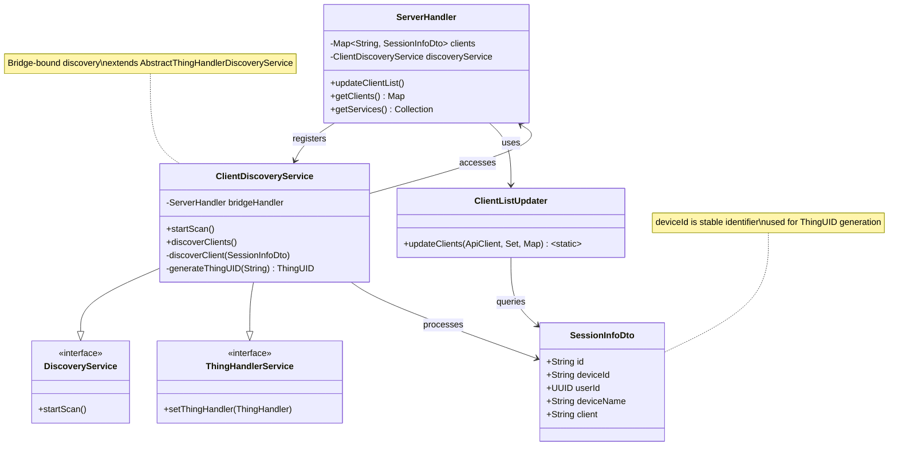
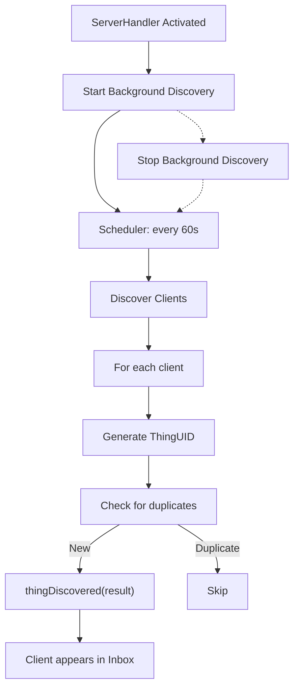

# Client Discovery Implementation Plan

## 1. Overview

Background client discovery enables the binding to automatically detect Jellyfin clients at regular intervals, ensuring new clients are added to the openHAB inbox without manual scans.
Background client discovery enables the binding to automatically detect Jellyfin clients at
regular intervals, ensuring new clients are added to the openHAB inbox without manual scans

---

## 2. Objectives

- Periodically scan for Jellyfin clients (default: every 60 seconds)
- Add new clients to the inbox via `thingDiscovered()`
- Avoid duplicate discoveries
- Cleanly start/stop background discovery with handler lifecycle
- Ensure thread safety and resource management

---

## 3. Implementation Steps

### 3.1. Scheduling

- Use a scheduler (e.g., `ScheduledExecutorService`) to run discovery every 60 seconds.
- Start scheduling in `startBackgroundDiscovery()`.
- Cancel scheduling in `stopBackgroundDiscovery()`.

### 3.2. Discovery Logic

- On each interval, call the client discovery method.
- For each discovered client:
  - Generate a unique `ThingUID`
  - Create a `DiscoveryResult`
  - Call `thingDiscovered(result)`

### 3.3. Deduplication

- Track discovered clients (e.g., by ThingUID or deviceId).
- Only add new clients not already present in the inbox.

### 3.4. Error Handling

- Catch and log exceptions during discovery.
- Ensure scheduler continues after recoverable errors.

### 3.5. Lifecycle Integration

- Start background discovery when handler is activated.
- Stop background discovery when handler is disposed.

---

## 4. Architecture Diagram

## 5. Sequence Diagram

---

**Version:** 1.1
**Last Updated:** 2025-11-14
**Last update:** GitHub Copilot
**Agent:** GitHub Copilot (GPT-4.1, User: pgfeller)
