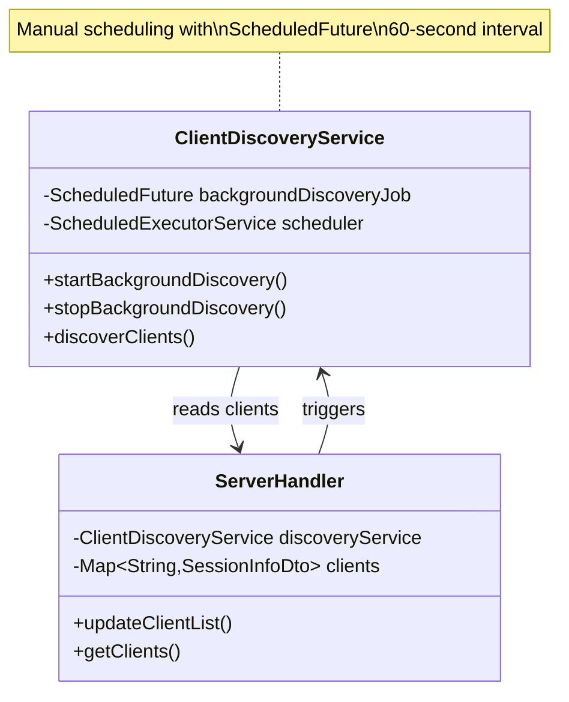
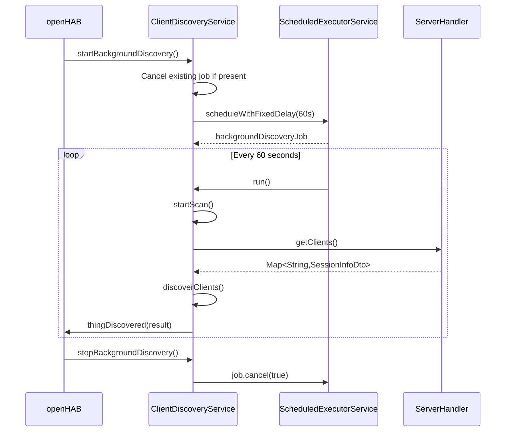
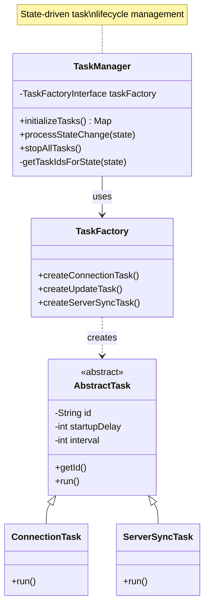
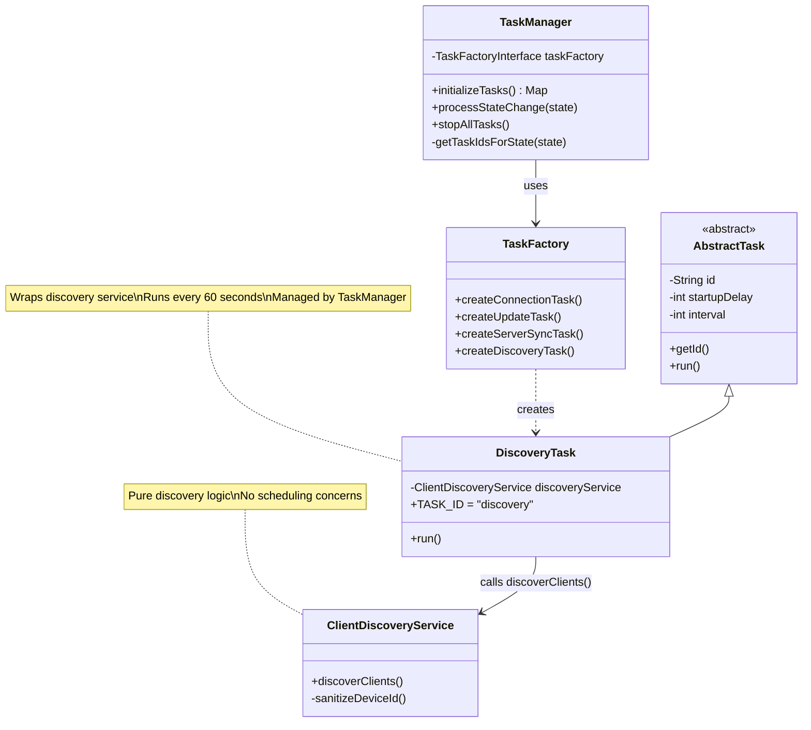
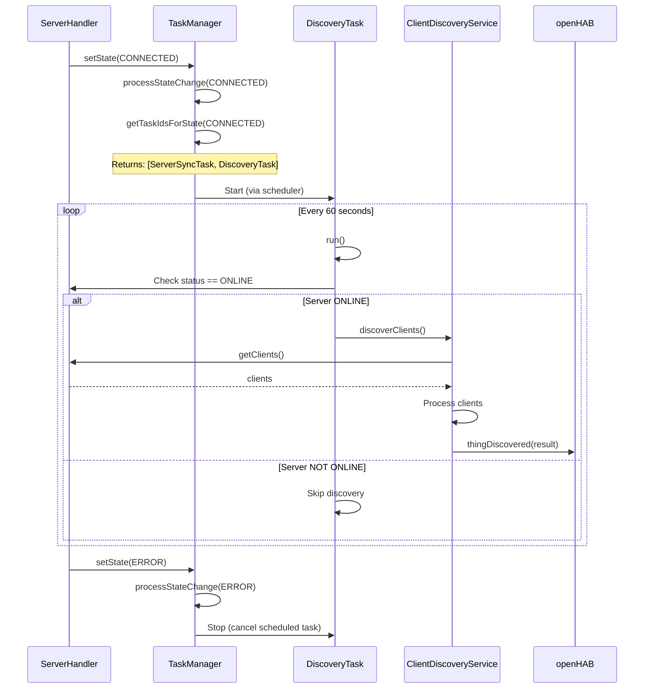

# Discovery Task Integration Proposal

**Date**: 2025-11-15  
**Author**: GitHub Copilot  
**Status**: Proposal for Review  
**Related**: [Background Discovery Implementation](../architecture/discovery.md), [Task Management](../architecture/task-management.md)

## Table of Contents

- [Discovery Task Integration Proposal](#discovery-task-integration-proposal)
  - [Table of Contents](#table-of-contents)
  - [Executive Summary](#executive-summary)
  - [Current Implementation Analysis](#current-implementation-analysis)
    - [Current Discovery Architecture](#current-discovery-architecture)
    - [Current Task Management Architecture](#current-task-management-architecture)
    - [Key Differences](#key-differences)
  - [Proposed Integration Architecture](#proposed-integration-architecture)
    - [Architecture Overview](#architecture-overview)
    - [Integration Strategy](#integration-strategy)
  - [Detailed Design](#detailed-design)
    - [1.
      Create DiscoveryTask](#1-create-discoverytask)
    - [2.
      Extend TaskFactory](#2-extend-taskfactory)
    - [3.
      Update TaskManager State Mapping](#3-update-taskmanager-state-mapping)
    - [4.
      Simplify ClientDiscoveryService](#4-simplify-clientdiscoveryservice)
    - [5.
      Update ServerHandler Integration](#5-update-serverhandler-integration)
  - [Benefits Analysis](#benefits-analysis)
    - [Architectural Benefits](#architectural-benefits)
    - [Code Quality Benefits](#code-quality-benefits)
    - [Operational Benefits](#operational-benefits)
  - [Migration Path](#migration-path)
    - [Phase 1: Create Task Infrastructure (Low Risk)](#phase-1-create-task-infrastructure-low-risk)
    - [Phase 2: Integrate Task into TaskManager (Medium Risk)](#phase-2-integrate-task-into-taskmanager-medium-risk)
    - [Phase 3: Remove Manual Scheduling (Low Risk)](#phase-3-remove-manual-scheduling-low-risk)
  - [Testing Strategy](#testing-strategy)
    - [Unit Tests](#unit-tests)
    - [Integration Tests](#integration-tests)
    - [Manual Testing](#manual-testing)
  - [Risks and Mitigations](#risks-and-mitigations)
  - [Alternative Approaches](#alternative-approaches)
    - [Option A: Keep Current Implementation (Status Quo)](#option-a-keep-current-implementation-status-quo)
    - [Option B: Partial Integration](#option-b-partial-integration)
    - [Option C: Full Integration (Recommended)](#option-c-full-integration-recommended)
  - [Recommendation](#recommendation)
  - [Implementation Checklist](#implementation-checklist)
  - [References](#references)

## Executive Summary

This proposal recommends integrating the background client discovery functionality into the existing Task Management infrastructure.
The current implementation uses manual `ScheduledFuture` management within `ClientDiscoveryService`, while the binding already has a robust task management system used for server synchronization tasks.

**Key Benefits:**

- ✅ Unified task lifecycle management
- ✅ Consistent state-driven scheduling
- ✅ Improved testability and maintainability
- ✅ Reduced code duplication
- ✅ Better alignment with existing architecture

**Effort Estimate:** 2-3 hours (Low risk, incremental migration possible)

## Current Implementation Analysis

### Current Discovery Architecture

The current implementation manages background discovery independently:



**Current Flow:**



**Issues with Current Implementation:**

1. **Duplicate Scheduling Logic**: Manually implements what TaskManager already provides
2. **State Disconnection**: Not integrated with server state transitions
3. **Lifecycle Coupling**: Mixed concerns (discovery logic + scheduling management)
4. **Testing Complexity**: Must mock ScheduledExecutorService for testing
5. **Inconsistent Pattern**: Other periodic operations use TaskManager

### Current Task Management Architecture

The task management system provides centralized lifecycle management:



**Current State-Task Mapping:**

| Server State | Active Tasks |
|--------------|--------------|
| CONFIGURED | ConnectionTask |
| CONNECTED | ServerSyncTask |
| Other states | None |

### Key Differences

| Aspect | Current Discovery | Task Management |
|--------|------------------|-----------------|
| Scheduling | Manual ScheduledFuture | Automatic via TaskManager |
| State Integration | None | State-driven lifecycle |
| Factory Pattern | N/A | TaskFactory creates tasks |
| Testing | Mock scheduler | Mock task behavior |
| Lifecycle | Manual start/stop | Automatic with state changes |

## Proposed Integration Architecture

### Architecture Overview

The proposed architecture integrates discovery into the existing task infrastructure:



**Integrated Flow:**



### Integration Strategy

**Phase 1: Parallel Implementation**

- Create `DiscoveryTask` alongside existing manual scheduling
- Add to `TaskFactory`
- Test independently
- **No breaking changes**

**Phase 2: Integrate with TaskManager**

- Update `getTaskIdsForState()` to include discovery
- Initialize task in `ServerHandler`
- Verify state transitions work correctly
- **Keep manual scheduling as fallback**

**Phase 3: Remove Manual Scheduling**

- Remove `backgroundDiscoveryJob` field from `ClientDiscoveryService`
- Remove `startBackgroundDiscovery()` and `stopBackgroundDiscovery()` overrides
- **Breaking change** (but internal only)

## Detailed Design

### 1. Create DiscoveryTask

**New File:** `src/main/java/org/openhab/binding/jellyfin/internal/handler/tasks/DiscoveryTask.java`

```java
package org.openhab.binding.jellyfin.internal.handler.tasks;

import org.eclipse.jdt.annotation.NonNullByDefault;
import org.openhab.binding.jellyfin.internal.discovery.ClientDiscoveryService;
import org.openhab.binding.jellyfin.internal.handler.ServerHandler;
import org.openhab.binding.jellyfin.internal.types.ExceptionHandlerType;
import org.openhab.core.thing.ThingStatus;
import org.slf4j.Logger;
import org.slf4j.LoggerFactory;

/**
 * Task for discovering Jellyfin client devices.
 * 
 * This task periodically triggers the discovery service to scan for connected clients.
 * Discovery only runs when the server handler is ONLINE to avoid unnecessary API calls.
 * 
 * @author Patrik Gfeller - Initial contribution
 */
@NonNullByDefault
public class DiscoveryTask extends AbstractTask {
    private static final Logger logger = LoggerFactory.getLogger(DiscoveryTask.class);
    
    public static final String TASK_ID = "discovery";
    private static final int STARTUP_DELAY_SEC = 60;
    private static final int INTERVAL_SEC = 60;
    
    private final ServerHandler serverHandler;
    private final ClientDiscoveryService discoveryService;
    private final ExceptionHandlerType exceptionHandler;
    
    /**
     * Creates a new discovery task.
     * 
     * @param serverHandler The server handler providing server status
     * @param discoveryService The discovery service to trigger
     * @param exceptionHandler Handler for exceptions during discovery
     */
    public DiscoveryTask(ServerHandler serverHandler, 
                        ClientDiscoveryService discoveryService,
                        ExceptionHandlerType exceptionHandler) {
        super(TASK_ID, STARTUP_DELAY_SEC, INTERVAL_SEC);
        this.serverHandler = serverHandler;
        this.discoveryService = discoveryService;
        this.exceptionHandler = exceptionHandler;
    }
    
    @Override
    public void run() {
        try {
            ThingStatus status = serverHandler.getThing().getStatus();
            
            if (status != ThingStatus.ONLINE) {
                logger.trace("Server not online (status: {}), skipping discovery", status);
                return;
            }
            
            logger.trace("Running periodic client discovery");
            discoveryService.discoverClients();
            
        } catch (Exception e) {
            exceptionHandler.handle(e);
        }
    }
}
```

### 2. Extend TaskFactory

**Modified File:** `TaskFactoryInterface.java`

```java
public interface TaskFactoryInterface {
    // ... existing methods ...
    
    /**
     * Creates a discovery task for client device discovery.
     * 
     * @param serverHandler The server handler to check status
     * @param discoveryService The discovery service to trigger
     * @param exceptionHandler The handler for exceptions
     * @return A configured discovery task
     */
    DiscoveryTask createDiscoveryTask(ServerHandler serverHandler,
                                     ClientDiscoveryService discoveryService,
                                     ExceptionHandlerType exceptionHandler);
}
```

**Modified File:** `TaskFactory.java`

```java
public class TaskFactory implements TaskFactoryInterface {
    // ... existing methods ...
    
    @Override
    public DiscoveryTask createDiscoveryTask(ServerHandler serverHandler,
                                             ClientDiscoveryService discoveryService,
                                             ExceptionHandlerType exceptionHandler) {
        return new DiscoveryTask(serverHandler, discoveryService, exceptionHandler);
    }
}
```

### 3. Update TaskManager State Mapping

**Modified File:** `TaskManager.java` - Update `getTaskIdsForState()`

```java
private List<String> getTaskIdsForState(ServerState serverState) {
    switch (serverState) {
        case CONFIGURED:
            return List.of(ConnectionTask.TASK_ID);
        case CONNECTED:
            // When connected, run sync task AND discovery task
            return List.of(ServerSyncTask.TASK_ID, DiscoveryTask.TASK_ID);
        case DISCOVERED:
        case NEEDS_AUTHENTICATION:
            return List.of();
        case INITIALIZING:
        case ERROR:
        case DISPOSED:
        default:
            return List.of();
    }
}
```

**Modified File:** `TaskManager.java` - Update `initializeTasks()`

```java
public Map<String, AbstractTask> initializeTasks(
        ApiClient apiClient,
        ErrorEventBus errorEventBus,
        ServerHandler serverHandler,
        ClientDiscoveryService discoveryService,
        Consumer<SystemInfo> connectionHandler,
        Consumer<List<UserDto>> usersHandler) {
    
    // ... existing task creation ...
    
    // Create discovery task
    tasks.put(DiscoveryTask.TASK_ID, 
        taskFactory.createDiscoveryTask(
            serverHandler,
            discoveryService,
            new ContextualExceptionHandler(errorEventBus, "DiscoveryTask")
        )
    );
    
    logger.debug("Initialized {} tasks: {}", tasks.size(), String.join(", ", tasks.keySet()));
    return tasks;
}
```

### 4. Simplify ClientDiscoveryService

**Modified File:** `ClientDiscoveryService.java`

```java
/**
 * The {@link ClientDiscoveryService} discovers Jellyfin client devices connected to a Jellyfin server.
 * 
 * Background discovery is handled by the task management infrastructure via {@link DiscoveryTask}.
 * This service focuses purely on the discovery logic without managing scheduling.
 */
@Component(scope = ServiceScope.PROTOTYPE, service = ClientDiscoveryService.class)
@NonNullByDefault
public class ClientDiscoveryService extends AbstractThingHandlerDiscoveryService<ServerHandler> {
    private static final Logger logger = LoggerFactory.getLogger(ClientDiscoveryService.class);

    public ClientDiscoveryService() throws IllegalArgumentException {
        super(ServerHandler.class, DISCOVERABLE_CLIENT_THING_TYPES, DISCOVERY_RESULT_TTL_SEC, false);
    }

    @Override
    protected void startScan() {
        ThingStatus serverStatus = thingHandler.getThing().getStatus();
        if (serverStatus != ThingStatus.ONLINE) {
            logger.debug("Server handler {} is not online (status: {}), skipping client discovery",
                    thingHandler.getThing().getLabel(), serverStatus);
            return;
        }

        logger.debug("Starting client discovery scan for server {}", thingHandler.getThing().getLabel());
        discoverClients();
    }
    
    // Remove startBackgroundDiscovery() override - handled by DiscoveryTask
    // Remove stopBackgroundDiscovery() override - handled by TaskManager
    // Remove backgroundDiscoveryJob field - no longer needed
    
    /**
     * Discovers Jellyfin client devices from the server handler's client list.
     * 
     * This method is called by:
     * - Manual scan triggers (UI)
     * - DiscoveryTask (background discovery every 60 seconds)
     * - Server handler (when client list updates)
     */
    public void discoverClients() {
        // ... existing discovery logic unchanged ...
    }
    
    private String sanitizeDeviceId(String deviceId) {
        // ... existing sanitization logic unchanged ...
    }
}
```

### 5. Update ServerHandler Integration

**Modified File:** `ServerHandler.java`

```java
public class ServerHandler extends BaseThingHandler implements ThingHandlerService {
    
    // ... existing fields ...
    
    @Override
    public void initialize() {
        // ... existing initialization ...
        
        // Initialize task manager with discovery service
        availableTasks = taskManager.initializeTasks(
            apiClient,
            errorEventBus,
            this,                    // ServerHandler instance
            discoveryService,         // ClientDiscoveryService instance
            this::handleConnection,
            this::handleUsersList
        );
        
        // ... rest of initialization ...
    }
    
    // Remove manual discovery trigger from updateClientList() if desired
    // (discovery is now automatic via DiscoveryTask)
}
```

## Benefits Analysis

### Architectural Benefits

| Benefit | Impact | Notes |
|---------|--------|-------|
| **Unified Lifecycle** | High | All periodic tasks managed consistently |
| **State Integration** | High | Discovery respects server state transitions |
| **Separation of Concerns** | High | Discovery logic separated from scheduling |
| **Factory Pattern** | Medium | Consistent task creation via factory |
| **Dependency Injection** | Medium | Cleaner dependencies, better testability |

### Code Quality Benefits

| Benefit | Impact | Measurement |
|---------|--------|-------------|
| **Code Reduction** | ~30 lines removed | Remove manual scheduling code |
| **Complexity Reduction** | Medium | No manual ScheduledFuture management |
| **Test Coverage** | Improved | Mock task behavior, not scheduler |
| **Maintainability** | High | Single pattern for all periodic operations |
| **Consistency** | High | All tasks follow same pattern |

### Operational Benefits

| Benefit | Impact | Description |
|---------|--------|-------------|
| **Predictable Behavior** | High | Discovery follows state machine |
| **Resource Management** | Medium | Automatic cleanup on state change |
| **Error Handling** | Improved | Consistent exception handling |
| **Logging** | Improved | Unified task logging |
| **Debugging** | Improved | Single point to trace task execution |

## Migration Path

### Phase 1: Create Task Infrastructure (Low Risk)

**Steps:**

1. Create `DiscoveryTask.java`
2. Add factory methods to `TaskFactoryInterface` and `TaskFactory`
3. Add unit tests for `DiscoveryTask`
4. **No changes to existing behavior**

**Verification:**

- Unit tests pass
- Build succeeds
- No runtime changes

**Time Estimate:** 30 minutes

### Phase 2: Integrate Task into TaskManager (Medium Risk)

**Steps:**

1. Update `TaskManager.initializeTasks()` to create discovery task
2. Update `TaskManager.getTaskIdsForState()` to include discovery in CONNECTED state
3. Update `ServerHandler.initialize()` to pass discovery service
4. Run integration tests
5. **Keep existing manual scheduling as fallback**

**Verification:**

- Background discovery still works
- State transitions trigger discovery start/stop
- Manual scan still works
- No duplicate discoveries

**Time Estimate:** 1 hour

### Phase 3: Remove Manual Scheduling (Low Risk)

**Steps:**

1. Remove `backgroundDiscoveryJob` field from `ClientDiscoveryService`
2. Remove `startBackgroundDiscovery()` override
3. Remove `stopBackgroundDiscovery()` override
4. Update constructor to `autoStart = false`
5. Update documentation

**Verification:**

- Background discovery continues working via task
- Manual scan continues working
- No warnings or errors in logs
- All tests pass

**Time Estimate:** 30 minutes

## Testing Strategy

### Unit Tests

**New Test:** `DiscoveryTaskTest.java`

```java
@Test
void testRun_ServerOnline_TriggersDiscovery() {
    // Arrange
    when(serverHandler.getThing().getStatus()).thenReturn(ThingStatus.ONLINE);
    
    // Act
    discoveryTask.run();
    
    // Assert
    verify(discoveryService, times(1)).discoverClients();
}

@Test
void testRun_ServerOffline_SkipsDiscovery() {
    // Arrange
    when(serverHandler.getThing().getStatus()).thenReturn(ThingStatus.OFFLINE);
    
    // Act
    discoveryTask.run();
    
    // Assert
    verify(discoveryService, never()).discoverClients();
}
```

**Updated Test:** `TaskManagerTest.java`

```java
@Test
void testProcessStateChange_Connected_StartsDiscoveryTask() {
    // Verify DiscoveryTask is started when state changes to CONNECTED
}
```

### Integration Tests

**Test Scenarios:**

1. ✅ Discovery starts automatically when server goes ONLINE
2. ✅ Discovery stops when server goes OFFLINE
3. ✅ Discovery stops when server enters ERROR state
4. ✅ Manual scan still works independently
5. ✅ No duplicate discoveries (task vs manual trigger)
6. ✅ Multiple servers have independent discovery tasks

### Manual Testing

**Test Plan:**

1. Start openHAB with Jellyfin binding
2. Configure server thing (should be CONNECTED)
3. Wait 60 seconds, verify clients appear in inbox
4. Trigger manual scan, verify immediate discovery
5. Stop Jellyfin server, verify discovery stops
6. Restart Jellyfin server, verify discovery resumes
7. Add second server, verify independent discovery

## Risks and Mitigations

| Risk | Impact | Probability | Mitigation |
|------|--------|-------------|------------|
| **Breaking existing functionality** | High | Low | Incremental migration, keep fallback in Phase 2 |
| **State transition timing** | Medium | Low | Extensive state machine testing |
| **Duplicate discoveries** | Low | Medium | Coordinate with existing manual triggers |
| **Performance impact** | Low | Low | Task already runs at 60s interval |
| **Testing complexity** | Low | Low | Mock task behavior, simpler than mocking scheduler |

## Alternative Approaches

### Option A: Keep Current Implementation (Status Quo)

**Pros:**

- ✅ No migration effort
- ✅ No risk of breaking changes
- ✅ Already working

**Cons:**

- ❌ Inconsistent with other tasks
- ❌ More complex code
- ❌ Harder to test
- ❌ Manual lifecycle management

**Recommendation:** ❌ Not recommended - misses architectural improvement opportunity

### Option B: Partial Integration

Create `DiscoveryTask` but keep manual scheduling as primary mechanism.

**Pros:**

- ✅ Can test task pattern
- ✅ Low risk
- ✅ Incremental

**Cons:**

- ❌ Two implementations to maintain
- ❌ Doesn't realize full benefits
- ❌ Confusing architecture

**Recommendation:** ⚠️ Only as temporary step during migration

### Option C: Full Integration (Recommended)

Complete integration into task management system.

**Pros:**

- ✅ Unified architecture
- ✅ Simplified code
- ✅ Better testability
- ✅ State integration
- ✅ Consistent pattern

**Cons:**

- ⚠️ Requires migration effort (2-3 hours)
- ⚠️ Needs thorough testing

**Recommendation:** ✅ **Recommended** - Best long-term solution

## Recommendation

**Proceed with Full Integration (Option C)** using the three-phase migration path:

1. **Phase 1** (30 min): Create task infrastructure without behavioral changes
2. **Phase 2** (1 hour): Integrate task, keep manual scheduling as fallback
3. **Phase 3** (30 min): Remove manual scheduling after verification

**Total Effort:** 2-3 hours  
**Risk Level:** Low (incremental, testable, reversible)  
**Long-term Value:** High (unified architecture, better maintainability)

## Implementation Checklist

**Phase 1: Task Infrastructure**

- [ ] Create `DiscoveryTask.java` with unit tests
- [ ] Add factory method to `TaskFactoryInterface`
- [ ] Implement factory method in `TaskFactory`
- [ ] Verify build succeeds
- [ ] Run existing tests (no failures)

**Phase 2: Integration**

- [ ] Update `TaskManager.initializeTasks()` signature
- [ ] Update `TaskManager.getTaskIdsForState()` for CONNECTED
- [ ] Update `ServerHandler.initialize()` call
- [ ] Add integration tests
- [ ] Manual testing: verify background discovery works
- [ ] Manual testing: verify state transitions work

**Phase 3: Cleanup**

- [ ] Remove `backgroundDiscoveryJob` from `ClientDiscoveryService`
- [ ] Remove `startBackgroundDiscovery()` override
- [ ] Remove `stopBackgroundDiscovery()` override
- [ ] Change constructor parameter to `autoStart = false`
- [ ] Update documentation
- [ ] Final manual testing
- [ ] Commit changes

## References

- [Task Management Architecture](../architecture/task-management.md)
- [Discovery Architecture](../architecture/discovery.md)
- [Server State Transitions](../architecture/server-state.md)
- [AbstractTask Implementation](../../src/main/java/org/openhab/binding/jellyfin/internal/handler/tasks/AbstractTask.java)
- [ClientDiscoveryService Current Implementation](../../src/main/java/org/openhab/binding/jellyfin/internal/discovery/ClientDiscoveryService.java)

---

**Version:** 1.0  
**Last Updated:** 2025-11-15  
**Last update:** GitHub Copilot  
**Agent:** GitHub Copilot (GPT-4.1, User: pgfeller)
