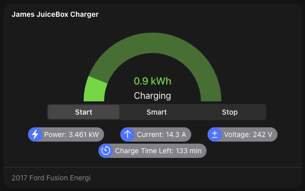

# JuiceNet Binding

The JuiceNet binding will interface with the cloud portal to get status and manage your JuiceBox EV charger(s).
In addition to getting the status of various items from the EV charger, it is also possible to start and stop charging sessions.

## Supported Things

This binding supports the following things:

| thing               | type    | description                  |
|----------           |-------- |------------------------------ |
| JuiceNet Account    | Bridge  | This represents the cloud account to interface with the JuiceNet API.  |
| JuiceBox EV Charger | Device  | This interfaces to a specific JuiceBox EV charger associated with the JuiceNet account. |

This binding should work with multiple JuiceBox EV chargers associated with the account, however it is currently only tested with a single EV charger.

### Discovery

Once a JuiceNet Account bridge has been created, any JuiceBox EV Chargers associated with this account will be discovered.

### Thing Configuration

The configuration required is to create a JuiceNet account thing and fill in the appropriate API token.
The API token can be found on the Account page at <https://home.juice.net/Manage>.

A JuiceBox EV Charger requires a unitID which can also be found in the device settings at the JuiceNet web page.

## Channels

| channel           | type                      | read-only | description                  |
|----------         |--------                   |---------  | ------- |
| name              | String                    | Y         | Name of device.|
| chargingState     | String                    | N         | Current charging state (Start Charging, Smart Charging, Stop Charging). |
| state             | String                    | Y         | This is the current device state (Available, Plugged-In, Charging, Error, Disconnected).  |
| message           | String                    | Y         | This is a message detailing the state of the EV charger. |
| override          | Switch                    | Y         | Smart charging is overridden. |
| chargingTimeLeft  | Number:Time               | Y         | Charging time left (seconds). |
| plugUnplugTime    | DateTime                  | Y         | Last time of either plug-in or plug-out. |
| targetTime        | DateTime                  | N         | “Start charging” start time, or time to start when overriding smart charging. |
| unitTime          | DateTime                  | Y         | Current time on the unit. |
| temperature       | Number:Temperature        | Y         | Current temperature at the unit. |
| currentLimit      | Number:ElectricCurrent    | N         | Max charging current allowed. |
| current           | Number:ElectricCurrent    | Y         | Current charging current. |
| voltage           | Number:ElectricPotential  | Y         | Current voltage. |
| energy            | Number:Energy             | Y         | Current amount of energy poured to the vehicle. |
| savings           | Number                    | Y         | Current session EV savings. |
| power             | Number:Power              | Y         | Current charging power. |
| secondsCharging   | Number:Time               | Y         | Charging time since plug-in time. |
| energyAtPlugin    | Number:Energy             | Y         | Energy value at the plugging time. |
| energyToAdd       | Number:Energy             | N         | Amount of energy to be added in current session. |
| lifetimeEnergy    | Number:Energy             | Y         | Total energy delivered to vehicles during lifetime. |
| lifetimeSavings   | Number                    | Y         | EV driving saving during lifetime. |
| gasCost           | Number                    | Y         | Cost of gasoline used in savings calculations. |
| fuelConsumption   | Number                    | Y         | Miles per gallon used in savings calculations. |
| ecost             | Number                    | Y         | Cost of electricity from utility company. (currency/kWh) |
| energyPerMile     | Number                    | Y         | Energy per mile. |
| carDescription    | String                    | Y         | Car description of vehicle currently or last charged. |
| carBatterySize    | Number:Energy             | Y         | Car battery pack size. |
| carBatteryRange   | Number:Length             | Y         | Car range. |
| carChargingRate   | Number:Power              | Y         | Car charging rate. |

## Full Example

### Things File

If configuring the binding with manual configuration an example thing file looks like this:

```java
Bridge juicenet:account:myaccount [ apiToken="xxxx-xxxx-xxxx-xxxx-xxxxx" ] {
    Thing device JamesCharger [ unitID="xxxxxxx" ]
}
```

### Items File

An example of an items file is here.

```java
String                  JuiceNet_Name               "Name"                                                      { channel="juicenet:device:myaccount:JamesCharger:name" }
String                  JuiceNet_State              "Device State"                                              { channel="juicenet:device:myaccount:JamesCharger:state" }
String                  JuiceNet_ChargingState      "Charging State"                                            { channel="juicenet:device:myaccount:JamesCharger:chargingState" }
String                  JuiceNet_Message            "State Message"                                             { channel="juicenet:device:myaccount:JamesCharger:message" }
Switch                  JuiceNet_Override           "Override State"                                            { channel="juicenet:device:myaccount:JamesCharger:override" }
DateTime                JuiceNet_PlutUnplugTime     "Plug/Unplug Time [%1$tB %1$te, %1$tY %1$tl:%1$tM %1$tp]"   { channel="juicenet:device:myaccount:JamesCharger:plugUnplugTime" }
DateTime                JuiceNet_TargetTime         "Target Time [%1$tB %1$te, %1$tY %1$tl:%1$tM %1$tp]"        { channel="juicenet:device:myaccount:JamesCharger:targetTime" }
Number:Time             JuiceNet_ChargingTimeLeft   "Charging Time Left [%.0f %unit%]"                          { channel="juicenet:device:myaccount:JamesCharger:chargingTimeLeft" }
DateTime                JuiceNet_UnitTime           "Unit Time [%1$tB %1$te, %1$tY %1$tl:%1$tM %1$tp]"          { channel="juicenet:device:myaccount:JamesCharger:unitTime" }
Number:Temperature      JuiceNet_Temperature        "Temperature [%.0f %unit%]"                                 { channel="juicenet:device:myaccount:JamesCharger:temperature" }
Number:ElectricCurrent  JuiceNet_CurrentLimit       "Current Limit [%d %unit%]"                                 { channel="juicenet:device:myaccount:JamesCharger:currentLimit" }
Number:ElectricCurrent  JuiceNet_Current            "Current [%.1f %unit%]"                                     { channel="juicenet:device:myaccount:JamesCharger:current" }
Number:ElectricPotential JuiceNet_Voltage           "Voltage [%d %unit%]"                                       { channel="juicenet:device:myaccount:JamesCharger:voltage" }
Number:Energy           JuiceNet_Energy             "Current Energy [%.1f %unit%]"                              { channel="juicenet:device:myaccount:JamesCharger:energy" }
Number:Power            JuiceNet_Power              "Charging Power [%.2f %unit%]"                              { channel="juicenet:device:myaccount:JamesCharger:power" }
Number                  JuiceNet_Savings            "Savings [$%.2f]"                                           { channel="juicenet:device:myaccount:JamesCharger:savings" }
Number:Time             JuiceNet_ChargingTime       "Charging Time [%.0f %unit%]"                               { channel="jjuicenet:device:myaccount:JamesCharger:chargingTime" }
Number:Energy           JuiceNet_EnergyToAdd        "Energy to Add [%.2f %unit%]"                               { channel="juicenet:device:myaccount:JamesCharger:energyToAdd" }
Number:Energy           JuiceNet_EnergyAtPlugin     "Energy at Plugin [%.2f %unit%]"                            { channel="juicenet:device:myaccount:JamesCharger:energyAtPlugin" }
Number:Energy           JuiceNet_LifetimeEnergy     "Lifetime Energy [%.2f %unit%]"                             { channel="juicenet:device:myaccount:JamesCharger:lifetimeEnergy" }
Number                  JuiceNet_GasCost            "Gas Cost [$%.2f]"                                          { channel="juicenet:device:myaccount:JamesCharger:gasCost" }
Number                  JuiceNet_FuelConsumption    "Fuel consumption [%.1f %unit%]"                            { channel="juicenet:device:myaccount:JamesCharger:fuelConsumption" }
Number                  JuiceNet_Ecost              "Utility Energy Cost [$%.2f]"                               { channel="juicenet:device:myaccount:JamesCharger:ecost" }
Number                  JuiceNet_LifetimeSavings    "Lifetime Savings [$%.2f]"                                  { channel="juicenet:device:myaccount:JamesCharger:lifetimeSavings" }
Number:Power            JuiceNet_EnergyPerMile      "Energy Hours Per Mile [%.2f %unit%]"                       { channel="juicenet:device:myaccount:JamesCharger:energyPerMile" }
String                  JuiceNet_CarDescription     "Car Description"                                           { channel="juicenet:device:myaccount:JamesCharger:carDescription" }
Number:Length           JuiceNet_CarBatteryRange    "Mileage Range [%d %unit%]"                                 { channel="juicenet:device:myaccount:JamesCharger:carBatteryRange" }
Number:Energy           JuiceNet_CarBatterySize     "Car Battery Pack Size [%.2f %unit%]"                       { channel="juicenet:device:myaccount:JamesCharger:carBatterySize" }
Number:Power            JuiceNet_CarChargineRage    "Car Charging Rate [%.2f %unit%]"                           { channel="juicenet:device:myaccount:JamesCharger:carChargingRate" }

```

## Widget

The following custom widget can be used with this binding.



```yaml
uid: widget_JuiceBox
tags: []
props:
  parameters:
    - description: Prefix for the items with the data
      label: Item prefix
      name: prefix
      required: false
      type: TEXT
  parameterGroups: []
timestamp: May 10, 2021, 2:38:55 PM
component: f7-card
config:
  title: =items[props.prefix + "_Name"].state
  style:
    border-radius: var(--f7-card-expandable-border-radius)
    --f7-card-header-border-color: none
slots:
  default:
    - component: f7-card-content
      slots:
        default:
          - component: f7-row
            config:
              class:
                - display-flex
                - align-content-stretch
                - align-items-center
            slots:
              default:
                - component: f7-gauge
                  config:
                    type: semicircle
                    size: 270
                    value: =Number.parseFloat(items[props.prefix + "_CurrentEnergy"].state) / Number.parseFloat(items[props.prefix + "_CarBatteryPackSize"].state)
                    bg-color: transparent
                    border-bg-color: '=(items[props.prefix + "_DeviceState"].state === "charging") ? "#577543" : (items[props.prefix + "_DeviceState"].state === "plugged") ? "#8f6c2f" : "#595959"'
                    border-color: '=(items[props.prefix + "_DeviceState"].state === "charging") ? "#90d164" : (items[props.prefix + "_DeviceState"].state === "plugged") ? "#ed9c11" : "#adadad"'
                    borderWidth: 40
                    value-text: =items[props.prefix + "_CurrentEnergy"].displayState
                    value-text-color: '=(items[props.prefix + "_DeviceState"].state === "charging") ? "#90d164" : (items[props.prefix + "_DeviceState"].state === "plugged") ? "#ed9c11" : "#adadad"'
                    value-font-size: 20
                    value-font-weight: 500
                    label-text: =items[props.prefix + "_DeviceState"].displayState
                    label-text-color: white
                    label-font-size: 18
                    label-font-weight: 400
                    noBorder: true
                    outline: true
          - component: f7-row
            config:
              class:
                - display-flex
                - justify-content-center
                - align-content-stretch
                - align-items-center
                - margin-left
            slots:
              default:
                - component: f7-segmented
                  config:
                    strong: true
                    style:
                      width: 80%
                  slots:
                    default:
                      - component: oh-button
                        config:
                          text: Start
                          color: blue
                          size: 24
                          active: =(items[props.prefix + "_ChargingState"].state === "start")
                          action: command
                          actionItem: =props.prefix + "_ChargingState"
                          actionCommand: start
                      - component: oh-button
                        config:
                          text: Smart
                          color: blue
                          size: 24
                          active: =(items[props.prefix + "_ChargingState"].state === 'smart')
                          action: command
                          actionItem: =props.prefix + "_ChargingState"
                          actionCommand: smart
                      - component: oh-button
                        config:
                          text: Stop
                          color: blue
                          size: 24
                          active: =(items[props.prefix + "_ChargingState"].state === "stop")
                          action: command
                          actionItem: =props.prefix + "_ChargingState"
                          actionCommand: stop
          - component: f7-row
            config:
              class:
                - display-flex
                - justify-content-space-evenly
                - align-content-stretch
                - align-items-center
                - height: 40px
              style:
                --f7-chip-font-size: 14px
                --f7-chip-height: 28px
                padding-top: 12px
            slots:
              default:
                - component: f7-chip
                  config:
                    visible: =(items[props.prefix + "_DeviceState"].state === "charging")
                    text: '="Power: " + items[props.prefix + "_ChargingPower"].state'
                    iconF7: bolt_fill
                    media-bg-color: blue
                    bg-color: gray
                    label: hello
                    style:
                      padding-rightc: 12px
                - component: f7-chip
                  config:
                    visible: =(items[props.prefix + "_DeviceState"].state === "charging")
                    text: '="Current: " + items[props.prefix + "_Current"].state'
                    iconF7: arrow_up_circl
                    media-bg-color: blue
                    bg-color: gray
                - component: f7-chip
                  config:
                    text: '="Voltage: " + items[props.prefix + "_Voltage"].state'
                    iconF7: plusminus
                    media-bg-color: blue
                    bg-color: gray
                - component: f7-chip
                  config:
                    visible: =(items[props.prefix + "_ChargingState"].state === 'smart')
                    text: '="Charge at: " + items[props.prefix + "_TargetTime"].displayState'
                    iconF7: clock
                    media-bg-color: blue
                    bg-color: gray
                - component: f7-chip
                  config:
                    visible: =(items[props.prefix + "_DeviceState"].state === 'charging')
                    text: '="Charge Time Left: " + items[props.prefix + "_ChargingTimeLeft"].displayState'
                    iconF7: timer
                    media-bg-color: blue
                    bg-color: gray
    - component: f7-card-footer
      slots:
        default:
          - component: Label
            config:
              text: =items[props.prefix + "_CarDescription"].state
```
