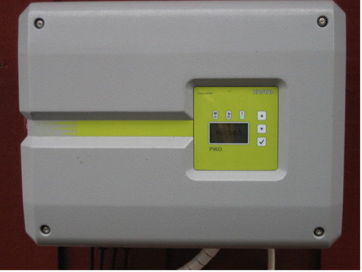

# Kostal Inverter Binding

Scrapes the web interface of the inverter for the metrics of the supported channels below.





## Supported Things

### First generation devices (PIKO)

Tested with Kostal Inverter PIKO but might work with other inverters from Kostal too.

### Second generation devices (PIKO 10-20, PIKO NEW GENERATION)

Tested with Kostal Inverter PIKO 10-20, PIKO NEW GENERATION.

### Third generation devices (PIKO IQ / PLENTICORE plus)

This implementation was tested for the current KOSTAL PIKO PLENTICORE plus and PIKO IQ devices.
All of these devices contain the same communication board (SCB = **S**mart**C**onnection**B**oard)

Currently supported things are:

- PIKO IQ 4.2
- PIKO IQ 5.5
- PIKO IQ 7.0
- PIKO IQ 8.5
- PIKO IQ 10.0
- PLENTICORE plus 4.2 (with or without battery attached)
- PLENTICORE plus 5.5 (with or without battery attached)
- PLENTICORE plus 7.0 (with or without battery attached)
- PLENTICORE plus 8.5 (with or without battery attached)
- PLENTICORE plus 10.0 (with or without battery attached)

Others may be supported (like future devices using the same SCB or offering the same Web API, branded OEM devices, ...), but they were not tested!

Kostal bindings to third generation devices require Java's strong cryptography to be enabled in order to establish connections. In case you are allowed to use
strong cryptography in your country, you can achieve this by modifying the $JAVA_HOME/jre/lib/security/java.security file (find the line _crypto.policy=limited_ and set it to _unlimited_).
If you're using the official openHAB docker image you may also enable Java's strong cryptography by specifying an environment variable _CRYPTO_POLICY="unlimited"_.

## Discovery

None

## Channels

### First generation devices (PIKO)

- acPower
- totalEnergy
- dayEnergy
- status
- str1Voltage
- str1Current
- str2Voltage
- str2Current
- l1Voltage
- l1Power
- l2Voltage
- l2Power
- l3Voltage
- l3Power

### Second generation devices (PIKO 10-20, PIKO NEW GENERATION)

| Channel Type ID                          | Item Type                | Description                                                                      | Read Write |
|------------------------------------------|--------------------------|----------------------------------------------------------------------------------|:----------:|
| device-local-grid-output-power           | Number:Power             | Current output power to the grid                                                 |     R      |
| statistic-yield-day-second-gen           | Number:Energy            | Total produced power today                                                       |     R      |
| statistic-yield-total-second-gen         | Number:Energy            | Total produced power                                                             |     R      |
| device-local-operating-status            | Number:Dimensionless     | Current operating status, 0 = Standby, 3 = WO-IDLE                               |     R      |
| device-local-grid-voltage-l1             | Number:ElectricPotential | Current output voltage to the grid, L1                                           |     R      |
| device-local-grid-current-l1             | Number:ElectricCurrent   | Current output current to the grid, L1                                           |     R      |
| device-local-grid-power-l1               | Number:Power             | Current output power to the grid, L1                                             |     R      |
| device-local-grid-voltage-l2             | Number:ElectricPotential | Current output voltage to the grid, L2                                           |     R      |
| device-local-grid-current-l2             | Number:ElectricCurrent   | Current output current to the grid, L2                                           |     R      |
| device-local-grid-power-l2               | Number:Power             | Current output power to the grid, L2                                             |     R      |
| device-local-grid-voltage-l3             | Number:ElectricPotential | Current output voltage to the grid, L3                                           |     R      |
| device-local-grid-current-l3             | Number:ElectricCurrent   | Current output current to the grid, L3                                           |     R      |
| device-local-grid-power-l3               | Number:Power             | Current output power to the grid, L3                                             |     R      |
| device-local-dc-power-pv                 | Number:Power             | Current power from all solar panels                                              |     R      |
| device-local-dc1-voltage                 | Number:ElectricPotential | Current voltage from solar panels, Dc1                                           |     R      |
| device-local-dc1-current                 | Number:ElectricCurrent   | Current current from solar panels, Dc1                                           |     R      |
| device-local-dc1-power                   | Number:Power             | Current power from solar panels, Dc1                                             |     R      |
| device-local-dc2-voltage                 | Number:ElectricPotential | Current voltage from solar panels, Dc2                                           |     R      |
| device-local-dc2-current                 | Number:ElectricCurrent   | Current current from solar panels, Dc2                                           |     R      |
| device-local-dc2-power                   | Number:Power             | Current power from solar panels, Dc2                                             |     R      |
| device-local-dc3-voltage                 | Number:ElectricPotential | Current voltage from solar panels, Dc3                                           |     R      |
| device-local-dc3-current                 | Number:ElectricCurrent   | Current current from solar panels, Dc3                                           |     R      |
| device-local-dc3-power                   | Number:Power             | Current power from solar panels, Dc3                                             |     R      |
| device-local-akt-home-consumption-solar  | Number:Power             | Current consumption from solar panels                                            |     R      |
| device-local-akt-home-consumption-bat    | Number:Power             | Current consumption from battery                                                 |     R      |
| device-local-akt-home-consumption-grid   | Number:Power             | Current consumption from grid                                                    |     R      |
| device-local-phase-sel-home-consump-l1   | Number:Power             | Current home consumption, L1                                                     |     R      |
| device-local-phase-sel-home-consump-l2   | Number:Power             | Current home consumption, L2                                                     |     R      |
| device-local-phase-sel-home-consump-l3   | Number:Power             | Current home consumption, L3                                                     |     R      |
| device-local-grid-freq                   | Number:Frequency         | Current frequency on grid                                                        |     R      |
| device-local-grid-cos-phi                | Number:Angle             | Current power factor on grid                                                     |     R      |
| statistic-home-consumption-day           | Number:Energy            | Total home consumption today                                                     |     R      |
| statistic-own-consumption-day            | Number:Energy            | Total own consumption today                                                      |     R      |
| statistic-own-cons-rate-day              | Number:Dimensionless     | Total own consumption rate today                                                 |     R      |
| statistic-autonomy-degree-day            | Number:Dimensionless     | Total autonomy degree today                                                      |     R      |
| statistic-home-consumption-total         | Number:Energy            | Total home consumption                                                           |     R      |
| statistic-own-consumption-total          | Number:Energy            | Total own consumption                                                            |     R      |
| statistic-operating-time-total           | Number:Time              | Total operating time                                                             |     R      |
| device-local-current                     | Number:ElectricCurrent   | Current                                                                          |     R      |
| device-local-current-dir                 | Number:Dimensionless     | Current direction of loading/unloading the battery                               |     R      |
| device-local-charge-cycles               | Number:Dimensionless     | Total number of charge cycles                                                    |     R      |
| device-local-battery-temperature         | Number:Temperature       | Battery current temperature                                                      |     R      |
| device-local-loginterval                 | Number:Time              | Value for loginterval                                                            |     R      |
| device-local-s0-inpulse-cnt              | Number:Dimensionless     | S0-pulse counter                                                                 |     R      |
| statistic-own-cons-rate-total            | Number:Dimensionless     | Total own comsumption rate                                                       |     R      |
| statistic-autonomy-degree-total          | Number:Dimensionless     | Total autonomy degree                                                            |     R      |
| device-local-battery-voltage             | Number:ElectricPotential | Battery current voltage                                                          |     R      |
| device-local-bat-state-of-charge         | Number:Dimensionless     | Battery current charge state                                                     |     R      |
| device-local-self-consumption            | Number:Power             | Current self consumption                                                         |     R      |
| device-local-battery-usage-consumption   | Number:Power             | Battery usage consumption                                                        |     R      |
| device-local-smart-battery-control       | Switch                   | Smart battery control                                                            |     R      |
| device-local-shadow-management           | Number:Dimensionless     | Shadow management                                                                |     R      |
| device-local-external-module-control     | Number:Dimensionless     | External module control                                                          |     R      |

The following Channels are writeable

| Channel Type ID                          | Item Type                | Description                                                                      | Read Write |
|------------------------------------------|--------------------------|----------------------------------------------------------------------------------|:----------:|
| device-local-battery-usage-consumption-set| String                  | Battery usage consumption level for power-consumption from battery, value = 100 (W)                                                                                                                                                         |     W      |
| device-local-battery-usage-strategy-set  | String                   | Battery usage strategy, Value = 1 = Automatic, Value = 2 = Automatic economical  |     W      |
| device-local-smart-battery-control-set   | Switch                   | Smart battery control, Value = OFF / ON                                          |     W      |
| device-local-battery-charge-time-from-set| String                   | Battery charge time from, Value = 00:00                                          |     W      |
| device-local-battery-charge-time-to-set  | String                   | Battery charge time to, Value = 23:59                                            |     W      |
| device-local-max-depth-of-discharge-set  | String                   | Max depth of discharge (SoC), Value = 10                                         |     W      |
| device-local-shadow-management-set       | String                   | Shadow management, Value = 0 = No shadow management enabled, Value = 1 = Shadow management enabled for DC-Input String 1, Value = 2 = Shadow  management enabled for DC-Input String 2,  Value = 3 = Shadow management enabled for DC-Input String 1 and 2               |     W      |
| device-local-external-module-control-set | String                   | External module control, Value = 0 = Not Activated, Value = 1 = Activated                                        |     W      |

### Third generation devices (PIKO IQ / PLENTICORE plus)

| Channel Type ID                          | Item Type                | Description                                                                      | Read Write |
|------------------------------------------|--------------------------|----------------------------------------------------------------------------------|:----------:|
| deviceLocalDCPower                       | Number:Energy            | Current DC power of the inverter                                                 |      R     |
| deviceLocalHomeconsumptionFromBattery    | Number:Energy            | Current home consumption obtained from the battery                               |      R     |
| deviceLocalHomeconsumptionFromGrid       | Number:Energy            | Current home consumption obtained from the grid                                  |      R     |
| deviceLocalOwnconsumption                | Number:Energy            | Current own comsumption                                                          |      R     |
| deviceLocalHomeconsumptionFromPV         | Number:Energy            | Current home consumption obtained from photovoltaic                              |      R     |
| deviceLocalHomeconsumptionTotal          | Number:Energy            | Current total homeconsumption                                                    |      R     |
| deviceLocalLimitEVUAbsolute              | Number:Energy            | Permitted feed-in quantity as absolute value as specified by the energy supplier |      R     |
| deviceLocalLimitEVURelativ               | Number:Dimensionless     | Permitted feed-in quantity as relative value as specified by the energy supplier |      R     |
| deviceLocalWorktime                      | Number:Time              | Uptime of the inverter                                                           |      R     |
| deviceLocalACPhase1CurrentAmperage       | Number:ElectricCurrent   | Amperage of phase 1                                                              |      R     |
| deviceLocalACPhase1CurrentPower          | Number:Energy            | Power of phase 1                                                                 |      R     |
| deviceLocalACPhase1CurrentVoltage        | Number:ElectricPotential | Voltage of phase 1                                                               |      R     |
| deviceLocalACPhase2CurrentAmperage       | Number:ElectricCurrent   | Amperage of phase 2                                                              |      R     |
| deviceLocalACPhase2CurrentPower          | Number:Energy            | Power of phase 2                                                                 |      R     |
| deviceLocalACPhase2CurrentVoltage        | Number:ElectricPotential | Voltage of phase 2                                                               |      R     |
| deviceLocalACPhase3CurrentAmperage       | Number:ElectricCurrent   | Amperage of phase 3                                                              |      R     |
| deviceLocalACPhase3CurrentPower          | Number:Energy            | Power of phase 3                                                                 |      R     |
| deviceLocalACPhase3CurrentVoltage        | Number:ElectricPotential | Voltage of phase 3                                                               |      R     |
| deviceLocalACCurrentPower                | Number:Energy            | Current AC power of the inverter                                                 |      R     |
| deviceLocalBatteryLoadingCycles          | Number:Dimensionless     | Amount of loading cycles done by the battery                                     |      R     |
| deviceLocalBatteryFullChargeCapacity     | Number:ElectricCharge    | Capacity of the battery if charged fully                                         |      R     |
| deviceLocalBatteryAmperage               | Number:ElectricCurrent   | Current amperage of the battery                                                  |      R     |
| deviceLocalBatteryPower                  | Number:Energy            | Current battery charge                                                           |      R     |
| deviceLocalBatteryStageOfCharge          | Number:Dimensionless     | Current battery charge status                                                    |      R     |
| deviceLocalBatteryVoltage                | Number:ElectricPotential | Current voltage of the battery                                                   |      R     |
| deviceLocalPVString1Amperage             | Number:ElectricCurrent   | Current amperage of photovoltaic string 1                                        |      R     |
| deviceLocalPVString1Power                | Number:Energy            | Current power of photovoltaic string 1                                           |      R     |
| deviceLocalPVString1Voltage              | Number:ElectricPotential | Current voltage of photovoltaic string 1                                         |      R     |
| deviceLocalPVString2Amperage             | Number:ElectricCurrent   | Current amperage of photovoltaic string 2                                        |      R     |
| deviceLocalPVString2Power                | Number:Energy            | Current power of photovoltaic string 2                                           |      R     |
| deviceLocalPVString2Voltage              | Number:ElectricPotential | Current voltage of photovoltaic string 2                                         |      R     |
| deviceLocalPVString3Amperage             | Number:ElectricCurrent   | Current amperage of photovoltaic string 3                                        |      R     |
| deviceLocalPVString3Power                | Number:Energy            | Current power of photovoltaic string 3                                           |      R     |
| deviceLocalPVString3Voltage              | Number:ElectricPotential | Current voltage of photovoltaic string 3                                         |      R     |
| SCBEventErrorCountMc                     | Number:Dimensionless     | Number of errors reported by the main controller                                 |      R     |
| SCBEventErrorCountSFH                    | Number:Dimensionless     | Number of errors reported by the grid interface controller                       |      R     |
| SCBEventErrorCountSCB                    | Number:Dimensionless     | Number of errors reported by the smart communication board                       |      R     |
| SCBEventWarningCountSCB                  | Number:Dimensionless     | Number of warnings reported by the smart communication board                     |      R     |
| statisticAutarkyDay                      | Number:Dimensionless     | Autarky ratio of this day                                                        |      R     |
| statisticAutarkyMonth                    | Number:Dimensionless     | Autarky ratio of this month                                                      |      R     |
| statisticAutarkyTotal                    | Number:Dimensionless     | Autarky ratio overall                                                            |      R     |
| statisticAutarkyYear                     | Number:Dimensionless     | Autarky ratio of this year                                                       |      R     |
| statisticCo2SavingDay                    | Number:Mass              | Savings in Co2 emissions today                                                   |      R     |
| statisticCo2SavingMonth                  | Number:Mass              | Savings in Co2 emissions this month                                              |      R     |
| statisticCo2SavingTotal                  | Number:Mass              | Savings in Co2 emissions overall                                                 |      R     |
| statisticCo2SavingYear                   | Number:Mass              | Savings in Co2 emissions this year                                               |      R     |
| statisticHomeconsumptionDay              | Number:Energy            | Home consumption today                                                           |      R     |
| statisticHomeconsumptionMonth            | Number:Energy            | Home consumption this month                                                      |      R     |
| statisticHomeconsumptionTotal            | Number:Energy            | Home consumption overall                                                         |      R     |
| statisticHomeconsumptionYear             | Number:Energy            | Home consumption this year                                                       |      R     |
| statisticHomeconsumptionFromBatteryDay   | Number:Energy            | Home consumption obtained from the battery today                                 |      R     |
| statisticHomeconsumptionFromBatteryMonth | Number:Energy            | Home consumption obtained from the battery this month                            |      R     |
| statisticHomeconsumptionFromBatteryTotal | Number:Energy            | Home consumption obtained from the battery overall                               |      R     |
| statisticHomeconsumptionFromBatteryYear  | Number:Energy            | Home consumption obtained from the battery this year                             |      R     |
| statisticHomeconsumptionFromGridDay      | Number:Energy            | Home consumption obtained from the grid today                                    |      R     |
| statisticHomeconsumptionFromGridMonth    | Number:Energy            | Home consumption obtained from the grid this month                               |      R     |
| statisticHomeconsumptionFromGridTotal    | Number:Energy            | Home consumption obtained from the grid overall                                  |      R     |
| statisticHomeconsumptionFromGridYear     | Number:Energy            | Home consumption obtained from the grid this year                                |      R     |
| statisticHomeconsumptionFromPVDay        | Number:Energy            | Home consumption obtained from the photovoltaic plant today                      |      R     |
| statisticHomeconsumptionFromPVMonth      | Number:Energy            | Home consumption obtained from the photovoltaic plant this month                 |      R     |
| statisticHomeconsumptionFromPVTotal      | Number:Energy            | Home consumption obtained from the photovoltaic plant overall                    |      R     |
| statisticHomeconsumptionFromPVYear       | Number:Energy            | Home consumption obtained from the photovoltaic plant this year                  |      R     |
| statisticOwnconsumptionRateDay           | Number:Dimensionless     | Percentage of electricity demand covered by photovoltaics today                  |      R     |
| statisticOwnconsumptionRateMonth         | Number:Dimensionless     | Percentage of electricity demand covered by photovoltaics this month             |      R     |
| statisticOwnconsumptionRateTotal         | Number:Dimensionless     | Percentage of electricity demand covered by photovoltaics overall                |      R     |
| statisticOwnconsumptionRateYear          | Number:Dimensionless     | Percentage of electricity demand covered by photovoltaics this year              |      R     |
| statisticYieldDay                        | Number:Energy            | Yield of the photovoltaic plant today                                            |      R     |
| statisticYieldMonth                      | Number:Energy            | Yield of the photovoltaic plant this month                                       |      R     |
| statisticYieldTotal                      | Number:Energy            | Yield of the photovoltaic plant overall                                          |      R     |
| statisticYieldYear                       | Number:Energy            | Yield of the photovoltaic plant this year                                        |      R     |

## Thing Configuration

### First generation devices (PIKO)

demo.things

```java
Thing kostalinverter:kostalinverter:inverter [ url="http://192.168.0.128" ]
```

If the thing goes online then the connection to the web interface is successful.
In case it is offline you should see an error message.
You optionally can define a `userName` and a `password` parameter if the access to the webinterface is protected and a desired `refreshInterval` (the time interval between updates, default 60 seconds).

### Second generation devices (PIKO 10-20, PIKO NEW GENERATION)

Second generation inverters require 4 mandatory parameters and 1 optional (hasBattery):

| Parameter                | Description                                            | Type    |  Unit   | Default value | Example value |
|--------------------------|--------------------------------------------------------|---------|---------|---------------|---------------|
| url                      | Host name or IP address of your device                 | Text    | ---     | ---           | 192.168.0.2   |
| username                 | Username for your inverter                             | Text    | ---     | ---           | myUsername    |
| password                 | Password for your inverter                             | Text    | ---     | ---           | myPassword    |
| refreshInterval          | Pollingintervall of your inverter                      | Integer | Seconds | 60            | 60            |
| hasBattery               | Type of PIKO 10-20 inverter, with or without battery   | boolean | ---     | --            | false/true    |

demo.things

```java
Thing kostalinverter:piko1020:mypiko1020 [ url="http://'inverter-ip'", username="'myUsername'", password="'myPassword'", refreshInterval=60, hasBattery=false]
```

You can define which type of PIKO10-20 inverter you will connect to with parameter hasBattery.

### Third generation devices (PIKO IQ / PLENTICORE plus)

All third generation inverters require to define 3 mandatory configuration parameters:

| Parameter                | Description                                            | Type    |  Unit   | Default value | Example value |
|--------------------------|--------------------------------------------------------|---------|---------|---------------|---------------|
| url                      | Host name or IP address of your device                 | Text    | ---     | ---           | 192.168.1.2   |
| userPassword             | Password you configured on the inverters web front end | Text    | ---     | ---           | myPassword    |
| refreshInternalInSeconds | Defines how often the device is polled for new values  | Integer | Seconds | 30            | 30            |

If you are using the hostname instead of the IP address, please make sure your DNS is configuration correctly!
The refresh interval should be chosen wisely.
To small interval may led to high workload for the inverter.
It is recommended to use an interval of 30 seconds.

Full sample of thing configuration:

```java
Thing kostalinverter:PLENTICOREPLUS100WITHBATTERY:MyPlentiCore100WithBattery [ url = "192.168.1.2", userPassword="myPassword", refreshInternalInSeconds="30"]
```

## Items

### First generation devices (PIKO)

demo.items:

```java
Number:Power SolarPower "Solar power [%.1f %unit%]" <energy> { channel="kostalinverter:kostalinverter:inverter:acPower" }
Number:Energy SolarEnergyDay "Solar day energy [%.3f %unit%]" <energy> { channel="kostalinverter:kostalinverter:inverter:dayEnergy" }
Number:Energy SolarTotalEnergy "Solar total energy [%.3f %unit%]" <energy> { channel="kostalinverter:kostalinverter:inverter:totalEnergy" }
String SolarStatus "Solar status [%s]" <energy> { channel="kostalinverter:kostalinverter:inverter:status" }
```

### Second generation devices (PIKO NEW GENERATION)

demo.items:

```java
Number:Power                GridOutputPower             "Grid Output Power"                         <energy> { channel="kostalinverter:piko1020:mypiko1020:gridOutputPower" }
Number:Energy               YieldDaySecondGen           "PV Output Power Day"                       <energy> { channel="kostalinverter:piko1020:mypiko1020:yieldDaySecondGen" }
Number:Energy               YieldTotalSecondGen         "PV Output Power Total"                     <energy> { channel="kostalinverter:piko1020:mypiko1020:yieldTotalSecondgen" }  
Number:Dimensionless        OperatingStatus             "Operating Status"                          <energy> { channel="kostalinverter:piko1020:mypiko1020:operatingStatus" }
Number:ElectricPotential    GridVoltageL1               "Grid Voltage L1"                           <energy> { channel="kostalinverter:piko1020:mypiko1020:gridVoltageL1" }
Number:ElectricCurrent      GridCurrentL1               "Grid Current L1"                           <energy> { channel="kostalinverter:piko1020:mypiko1020:gridCurrentL1" }
Number:Power                GridPowerL1                 "Grid Power L1"                             <energy> { channel="kostalinverter:piko1020:mypiko1020:gridPowerL1" }
Number:ElectricPotential    GridVoltageL2               "Grid Voltage L2"                           <energy> { channel="kostalinverter:piko1020:mypiko1020:gridVoltageL2" }
Number:ElectricCurrent      GridCurrentL2               "Grid Current L2"                           <energy> { channel="kostalinverter:piko1020:mypiko1020:gridCurrentL2" }
Number:Power                GridPowerL2                 "Grid Power L2"                             <energy> { channel="kostalinverter:piko1020:mypiko1020:gridPowerL2" }
Number:ElectricPotential    GridVoltageL3               "Grid Voltage L3"                           <energy> { channel="kostalinverter:piko1020:mypiko1020:gridVoltageL3" }
Number:ElectricCurrent      GridCurrentL3               "Grid Current L3"                           <energy> { channel="kostalinverter:piko1020:mypiko1020:gridCurrentL3" }
Number:Power                GridPowerL3                 "Grid Power L3"                             <energy> { channel="kostalinverter:piko1020:mypiko1020:gridPowerL3" }
Number:Power                DcPvPower                   "DC Power Pv"                               <energy> { channel="kostalinverter:piko1020:mypiko1020:dcPowerPV" }
Number:ElectricPotential    Dc1Voltage                  "DC1 Voltage"                               <energy> { channel="kostalinverter:piko1020:mypiko1020:dc1Voltage" }
Number:ElectricCurrent      Dc1Current                  "DC1 Current"                               <energy> { channel="kostalinverter:piko1020:mypiko1020:dc1Current" }
Number:Power                Dc1Power                    "DC1 Power"                                 <energy> { channel="kostalinverter:piko1020:mypiko1020:dc1Power" }
Number:ElectricPotential    Dc2Voltage                  "DC2 Voltage"                               <energy> { channel="kostalinverter:piko1020:mypiko1020:dc2Voltage" }
Number:ElectricCurrent      Dc2Current                  "DC2 Current"                               <energy> { channel="kostalinverter:piko1020:mypiko1020:dc2Current" }
Number:Power                Dc2Power                    "DC2 Power"                                 <energy> { channel="kostalinverter:piko1020:mypiko1020:dc2Power" }
Number:ElectricPotential    Dc3Voltage                  "DC3 Voltage"                               <energy> { channel="kostalinverter:piko1020:mypiko1020:dc3Voltage" }
Number:ElectricCurrent      Dc3Current                  "DC3 Current"                               <energy> { channel="kostalinverter:piko1020:mypiko1020:dc3Current" }
Number:Power                Dc3Power                    "DC3 Power"                                 <energy> { channel="kostalinverter:piko1020:mypiko1020:dc3Power" }
Number:Power                AktHomeConsumptionSolar     "Akt Home Consumption Solar"                <energy> { channel="kostalinverter:piko1020:mypiko1020:aktHomeConsumptionSolar" }
Number:Power                AktHomeConsumptionBat       "Akt Home Consumption Battery"              <energy> { channel="kostalinverter:piko1020:mypiko1020:aktHomeConsumptionBat" }
Number:Power                AktHomeConsumptionGrid      "Akt Home Consumption Grid"                 <energy> { channel="kostalinverter:piko1020:mypiko1020:aktHomeConsumptionGrid" }
Number:Power                PhaseSelHomeConsumpL1       "Phase Sel Home Consump L1"                 <energy> { channel="kostalinverter:piko1020:mypiko1020:phaseSelHomeConsumpL1" }
Number:Power                PhaseSelHomeConsumpL2       "Phase Sel Home Consump L2"                 <energy> { channel="kostalinverter:piko1020:mypiko1020:phaseSelHomeConsumpL2" }
Number:Power                PhaseSelHomeConsumpL3       "Phase Sel Home Consump L3"                 <energy> { channel="kostalinverter:piko1020:mypiko1020:phaseSelHomeConsumpL3" }
Number:Frequency            GridFreq                    "Grid Freq"                                 <energy> { channel="kostalinverter:piko1020:mypiko1020:gridFreq" }
Number:Angle                GridCosPhi                  "Grid Cos Phi"                              <energy> { channel="kostalinverter:piko1020:mypiko1020:gridCosPhi" }
Number:Energy               HomeConsumptionDay          "Home Consumption Day"                      <energy> { channel="kostalinverter:piko1020:mypiko1020:homeConsumptionDay" } 
Number:Energy               OwnConsumptionDay           "Own Consumption Day"                       <energy> { channel="kostalinverter:piko1020:mypiko1020:ownConsumptionDay" } 
Number:Dimensionless        OwnConsRateDay              "Own Cons Rate Day"                         <energy> { channel="kostalinverter:piko1020:mypiko1020:ownConsRateDay" } 
Number:Dimensionless        AutonomyDegreeDay           "Autonomy Degree Day"                       <energy> { channel="kostalinverter:piko1020:mypiko1020:autonomyDegreeDay" }
Number:Energy               HomeConsumptionTotal        "Home Consumption Total"                    <energy> { channel="kostalinverter:piko1020:mypiko1020:homeConsumptionTotal" } 
Number:Energy               OwnConsumptionTotal         "Own Consumption Total"                     <energy> { channel="kostalinverter:piko1020:mypiko1020:ownConsumptionTotal" } 
Number:Time                 OperatingTimeTotal          "Operating Time Total"                      <energy> { channel="kostalinverter:piko1020:mypiko1020:operatingTimeTotal" }
Number:ElectricCurrent      Current                     "Current"                                   <energy> { channel="kostalinverter:piko1020:mypiko1020:current" }
Number:Dimensionless        CurrentDir                  "Current Dir"                               <energy> { channel="kostalinverter:piko1020:mypiko1020:currentDir" }
Number:Dimensionless        ChargeCycles                "Charge Cycles"                             <energy> { channel="kostalinverter:piko1020:mypiko1020:chargeCycles" }
Number:Temperature          BatteryTemperature          "BatteryTemperature"                        <energy> { channel="kostalinverter:piko1020:mypiko1020:batteryTemperature" }
Number:Time                 Loginterval                 "Log Interval"                              <energy> { channel="kostalinverter:piko1020:mypiko1020:loginterval" }
Number:Dimensionless        S0InPulseCnt                "S0 InPulse Cnt"                            <energy> { channel="kostalinverter:piko1020:mypiko1020:s0InPulseCnt" }
Number:Dimensionless        OwnConsRateTotal            "Own Cons Rate Total"                       <energy> { channel="kostalinverter:piko1020:mypiko1020:ownConsRateTotal" } 
Number:Dimensionless        AutonomyDegreeTotal         "Autonomy Degree Total"                     <energy> { channel="kostalinverter:piko1020:mypiko1020:autonomyDegreeTotal" } 
Number:ElectricPotential    BatteryVoltage              "Battery Voltage"                           <energy> { channel="kostalinverter:piko1020:mypiko1020:batteryVoltage" }
Number:Dimensionless        BatStateOfCharge            "Bat State Of Charge"                       <energy> { channel="kostalinverter:piko1020:mypiko1020:batStateOfCharge" }
Number:Power                SelfConsumption             "Self Consumption"                          <energy> { channel="kostalinverter:piko1020:mypiko1020:selfConsumption" }
Number:Dimensionless        BatteryUsageConsumption     "Battery Usage Consumption"                 <energy> { channel="kostalinverter:piko1020:mypiko1020:batteryUsageConsumption" }
Switch                      SmartBatteryControl         "Smart Battery Control"                     <energy> { channel="kostalinverter:piko1020:mypiko1020:smartBatteryControl" }
Number:Dimensionless        MaxDepthOfDischarge         "Max Depth Of Discharge"                    <energy> { channel="kostalinverter:piko1020:mypiko1020:maxDepthOfDischarge" }
Number:Dimensionless        ShadowManagement            "Shadow Management"                         <energy> { channel="kostalinverter:piko1020:mypiko1020:shadowManagement" }
Number:Dimensionless        ExternalModuleControl       "External Module Control"                   <energy> { channel="kostalinverter:piko1020:mypiko1020:externalModuleControl" }           


```

### Third generation devices (PIKO IQ / PLENTICORE plus)

demo.items:

```java
Number:Energy                MyPlentiCore100WithBattery_DEVICE_LOCAL_DC_POWER                         <energy> { channel="kostalinverter:PLENTICOREPLUS100WITHBATTERY:MyPlentiCore100WithBattery:deviceLocalDCPower"}
Number:Energy                MyPlentiCore100WithBattery_DEVICE_LOCAL_HOMECONSUMPTION_FROM_BATTERY     <energy> { channel="kostalinverter:PLENTICOREPLUS100WITHBATTERY:MyPlentiCore100WithBattery:deviceLocalHomeconsumptionFromBattery"}
Number:Energy                MyPlentiCore100WithBattery_DEVICE_LOCAL_HOMECONSUMPTION_FROM_GRID        <energy> { channel="kostalinverter:PLENTICOREPLUS100WITHBATTERY:MyPlentiCore100WithBattery:deviceLocalHomeconsumptionFromGrid"}
Number:Energy                MyPlentiCore100WithBattery_DEVICE_LOCAL_OWNCONSUMPTION                   <energy> { channel="kostalinverter:PLENTICOREPLUS100WITHBATTERY:MyPlentiCore100WithBattery:deviceLocalOwnconsumption"}
Number:Energy                MyPlentiCore100WithBattery_DEVICE_LOCAL_HOMECONSUMPTION_FROM_PV          <energy> { channel="kostalinverter:PLENTICOREPLUS100WITHBATTERY:MyPlentiCore100WithBattery:deviceLocalHomeconsumptionFromPV"}
Number:Energy                MyPlentiCore100WithBattery_DEVICE_LOCAL_HOMECONSUMPTION_TOTAL            <energy> { channel="kostalinverter:PLENTICOREPLUS100WITHBATTERY:MyPlentiCore100WithBattery:deviceLocalHomeconsumptionTotal"}
Number:Energy                MyPlentiCore100WithBattery_DEVICE_LOCAL_LIMIT_EVU_ABSOLUTE               <energy> { channel="kostalinverter:PLENTICOREPLUS100WITHBATTERY:MyPlentiCore100WithBattery:deviceLocalLimitEVUAbsolute"}
Number:Dimensionless         MyPlentiCore100WithBattery_DEVICE_LOCAL_LIMIT_EVU_RELATIV                <energy> { channel="kostalinverter:PLENTICOREPLUS100WITHBATTERY:MyPlentiCore100WithBattery:deviceLocalLimitEVURelativ"}
Number:Time                  MyPlentiCore100WithBattery_DEVICE_LOCAL_WORKTIME                         <energy> { channel="kostalinverter:PLENTICOREPLUS100WITHBATTERY:MyPlentiCore100WithBattery:deviceLocalWorktime"}
Number:ElectricCurrent       MyPlentiCore100WithBattery_DEVICE_LOCAL_AC_PHASE_1_CURRENT_AMPERAGE      <energy> { channel="kostalinverter:PLENTICOREPLUS100WITHBATTERY:MyPlentiCore100WithBattery:deviceLocalACPhase1CurrentAmperage"}
Number:Energy                MyPlentiCore100WithBattery_DEVICE_LOCAL_AC_PHASE_1_CURRENT_POWER         <energy> { channel="kostalinverter:PLENTICOREPLUS100WITHBATTERY:MyPlentiCore100WithBattery:deviceLocalACPhase1CurrentPower"}
Number:ElectricPotential     MyPlentiCore100WithBattery_DEVICE_LOCAL_AC_PHASE_1_CURRENT_VOLTAGE       <energy> { channel="kostalinverter:PLENTICOREPLUS100WITHBATTERY:MyPlentiCore100WithBattery:deviceLocalACPhase1CurrentVoltage"}
Number:ElectricCurrent       MyPlentiCore100WithBattery_DEVICE_LOCAL_AC_PHASE_2_CURRENT_AMPERAGE      <energy> { channel="kostalinverter:PLENTICOREPLUS100WITHBATTERY:MyPlentiCore100WithBattery:deviceLocalACPhase2CurrentAmperage"}
Number:Energy                MyPlentiCore100WithBattery_DEVICE_LOCAL_AC_PHASE_2_CURRENT_POWER         <energy> { channel="kostalinverter:PLENTICOREPLUS100WITHBATTERY:MyPlentiCore100WithBattery:deviceLocalACPhase2CurrentPower"}
Number:ElectricPotential     MyPlentiCore100WithBattery_DEVICE_LOCAL_AC_PHASE_2_CURRENT_VOLTAGE       <energy> { channel="kostalinverter:PLENTICOREPLUS100WITHBATTERY:MyPlentiCore100WithBattery:deviceLocalACPhase2CurrentVoltage"}
Number:ElectricCurrent       MyPlentiCore100WithBattery_DEVICE_LOCAL_AC_PHASE_3_CURRENT_AMPERAGE      <energy> { channel="kostalinverter:PLENTICOREPLUS100WITHBATTERY:MyPlentiCore100WithBattery:deviceLocalACPhase3CurrentAmperage"}
Number:Energy                MyPlentiCore100WithBattery_DEVICE_LOCAL_AC_PHASE_3_CURRENT_POWER         <energy> { channel="kostalinverter:PLENTICOREPLUS100WITHBATTERY:MyPlentiCore100WithBattery:deviceLocalACPhase3CurrentPower"}
Number:ElectricPotential     MyPlentiCore100WithBattery_DEVICE_LOCAL_AC_PHASE_3_CURRENT_VOLTAGE       <energy> { channel="kostalinverter:PLENTICOREPLUS100WITHBATTERY:MyPlentiCore100WithBattery:deviceLocalACPhase3CurrentVoltage"}
Number:Energy                MyPlentiCore100WithBattery_DEVICE_LOCAL_AC_CURRENT_POWER                 <energy> { channel="kostalinverter:PLENTICOREPLUS100WITHBATTERY:MyPlentiCore100WithBattery:deviceLocalACCurrentPower"}
Number:Dimensionless         MyPlentiCore100WithBattery_DEVICE_LOCAL_BATTERY_LOADING_CYCLES           <energy> { channel="kostalinverter:PLENTICOREPLUS100WITHBATTERY:MyPlentiCore100WithBattery:deviceLocalBatteryLoadingCycles"}
Number:ElectricCharge        MyPlentiCore100WithBattery_DEVICE_LOCAL_BATTERY_FULL_CHARGE_CAPACITY     <energy> { channel="kostalinverter:PLENTICOREPLUS100WITHBATTERY:MyPlentiCore100WithBattery:deviceLocalBatteryFullChargeCapacity"}
Number:ElectricCurrent       MyPlentiCore100WithBattery_DEVICE_LOCAL_BATTERY_AMPERAGE                 <energy> { channel="kostalinverter:PLENTICOREPLUS100WITHBATTERY:MyPlentiCore100WithBattery:deviceLocalBatteryAmperage"}
Number:Energy                MyPlentiCore100WithBattery_DEVICE_LOCAL_BATTERY_POWER                    <energy> { channel="kostalinverter:PLENTICOREPLUS100WITHBATTERY:MyPlentiCore100WithBattery:deviceLocalBatteryPower"}
Number:Dimensionless         MyPlentiCore100WithBattery_DEVICE_LOCAL_BATTERY_STATE_OF_CHARGE          <energy> { channel="kostalinverter:PLENTICOREPLUS100WITHBATTERY:MyPlentiCore100WithBattery:deviceLocalBatteryStageOfCharge"}
Number:ElectricPotential     MyPlentiCore100WithBattery_DEVICE_LOCAL_BATTERY_VOLTAGE                  <energy> { channel="kostalinverter:PLENTICOREPLUS100WITHBATTERY:MyPlentiCore100WithBattery:deviceLocalBatteryVoltage"}
Number:ElectricCurrent       MyPlentiCore100WithBattery_DEVICE_LOCAL_PVSTRING_1_AMPERAGE              <energy> { channel="kostalinverter:PLENTICOREPLUS100WITHBATTERY:MyPlentiCore100WithBattery:deviceLocalPVString1Amperage"}
Number:Energy                MyPlentiCore100WithBattery_DEVICE_LOCAL_PVSTRING_1_POWER                 <energy> { channel="kostalinverter:PLENTICOREPLUS100WITHBATTERY:MyPlentiCore100WithBattery:deviceLocalPVString1Power"}
Number:ElectricPotential     MyPlentiCore100WithBattery_DEVICE_LOCAL_PVSTRING_1_VOLTAGE               <energy> { channel="kostalinverter:PLENTICOREPLUS100WITHBATTERY:MyPlentiCore100WithBattery:deviceLocalPVString1Voltage"}
Number:ElectricCurrent       MyPlentiCore100WithBattery_DEVICE_LOCAL_PVSTRING_2_AMPERAGE              <energy> { channel="kostalinverter:PLENTICOREPLUS100WITHBATTERY:MyPlentiCore100WithBattery:deviceLocalPVString2Amperage"}
Number:Energy                MyPlentiCore100WithBattery_DEVICE_LOCAL_PVSTRING_2_POWER                 <energy> { channel="kostalinverter:PLENTICOREPLUS100WITHBATTERY:MyPlentiCore100WithBattery:deviceLocalPVString2Power"}
Number:ElectricPotential     MyPlentiCore100WithBattery_DEVICE_LOCAL_PVSTRING_2_VOLTAGE               <energy> { channel="kostalinverter:PLENTICOREPLUS100WITHBATTERY:MyPlentiCore100WithBattery:deviceLocalPVString2Voltage"}
Number:Dimensionless         MyPlentiCore100WithBattery_SCB_EVENT_ERROR_COUNT_MC                      <energy> { channel="kostalinverter:PLENTICOREPLUS100WITHBATTERY:MyPlentiCore100WithBattery:SCBEventErrorCountMc"}
Number:Dimensionless         MyPlentiCore100WithBattery_SCB_EVENT_ERROR_COUNT_SFH                     <energy> { channel="kostalinverter:PLENTICOREPLUS100WITHBATTERY:MyPlentiCore100WithBattery:SCBEventErrorCountSFH"}
Number:Dimensionless         MyPlentiCore100WithBattery_SCB_EVENT_ERROR_COUNT_SCB                     <energy> { channel="kostalinverter:PLENTICOREPLUS100WITHBATTERY:MyPlentiCore100WithBattery:SCBEventErrorCountSCB"}
Number:Dimensionless         MyPlentiCore100WithBattery_SCB_EVENT_WARNING_COUNT_SCB                   <energy> { channel="kostalinverter:PLENTICOREPLUS100WITHBATTERY:MyPlentiCore100WithBattery:SCBEventWarningCountSCB"}
Number:Dimensionless         MyPlentiCore100WithBattery_STATISTIC_AUTARKY_DAY                         <energy> { channel="kostalinverter:PLENTICOREPLUS100WITHBATTERY:MyPlentiCore100WithBattery:statisticAutarkyDay"}
Number:Dimensionless         MyPlentiCore100WithBattery_STATISTIC_AUTARKY_MONTH                       <energy> { channel="kostalinverter:PLENTICOREPLUS100WITHBATTERY:MyPlentiCore100WithBattery:statisticAutarkyMonth"}
Number:Dimensionless         MyPlentiCore100WithBattery_STATISTIC_AUTARKY_TOTAL                       <energy> { channel="kostalinverter:PLENTICOREPLUS100WITHBATTERY:MyPlentiCore100WithBattery:statisticAutarkyTotal"}
Number:Dimensionless         MyPlentiCore100WithBattery_STATISTIC_AUTARKY_YEAR                        <energy> { channel="kostalinverter:PLENTICOREPLUS100WITHBATTERY:MyPlentiCore100WithBattery:statisticAutarkyYear"}
Number:Mass                  MyPlentiCore100WithBattery_STATISTIC_CO2SAVING_DAY                       <energy> { channel="kostalinverter:PLENTICOREPLUS100WITHBATTERY:MyPlentiCore100WithBattery:statisticCo2SavingDay"}
Number:Mass                  MyPlentiCore100WithBattery_STATISTIC_CO2SAVING_MONTH                     <energy> { channel="kostalinverter:PLENTICOREPLUS100WITHBATTERY:MyPlentiCore100WithBattery:statisticCo2SavingMonth"}
Number:Mass                  MyPlentiCore100WithBattery_STATISTIC_CO2SAVING_TOTAL                     <energy> { channel="kostalinverter:PLENTICOREPLUS100WITHBATTERY:MyPlentiCore100WithBattery:statisticCo2SavingTotal"}
Number:Mass                  MyPlentiCore100WithBattery_STATISTIC_CO2SAVING_YEAR                      <energy> { channel="kostalinverter:PLENTICOREPLUS100WITHBATTERY:MyPlentiCore100WithBattery:statisticCo2SavingYear"}
Number:Energy                MyPlentiCore100WithBattery_STATISTIC_HOMECONSUMPTION_DAY                 <energy> { channel="kostalinverter:PLENTICOREPLUS100WITHBATTERY:MyPlentiCore100WithBattery:statisticHomeconsumptionDay"}
Number:Energy                MyPlentiCore100WithBattery_STATISTIC_HOMECONSUMPTION_MONTH               <energy> { channel="kostalinverter:PLENTICOREPLUS100WITHBATTERY:MyPlentiCore100WithBattery:statisticHomeconsumptionMonth"}
Number:Energy                MyPlentiCore100WithBattery_STATISTIC_HOMECONSUMPTION_TOTAL               <energy> { channel="kostalinverter:PLENTICOREPLUS100WITHBATTERY:MyPlentiCore100WithBattery:statisticHomeconsumptionTotal"}
Number:Energy                MyPlentiCore100WithBattery_STATISTIC_HOMECONSUMPTION_YEAR                <energy> { channel="kostalinverter:PLENTICOREPLUS100WITHBATTERY:MyPlentiCore100WithBattery:statisticHomeconsumptionYear"}
Number:Energy                MyPlentiCore100WithBattery_STATISTIC_HOMECONSUMPTION_FROM_BATTERIE_DAY   <energy> { channel="kostalinverter:PLENTICOREPLUS100WITHBATTERY:MyPlentiCore100WithBattery:statisticHomeconsumptionFromBatteryDay"}
Number:Energy                MyPlentiCore100WithBattery_STATISTIC_HOMECONSUMPTION_FROM_BATTERIE_MONTH <energy> { channel="kostalinverter:PLENTICOREPLUS100WITHBATTERY:MyPlentiCore100WithBattery:statisticHomeconsumptionFromBatteryMonth"}
Number:Energy                MyPlentiCore100WithBattery_STATISTIC_HOMECONSUMPTION_FROM_BATTERIE_TOTAL <energy> { channel="kostalinverter:PLENTICOREPLUS100WITHBATTERY:MyPlentiCore100WithBattery:statisticHomeconsumptionFromBatteryTotal"}
Number:Energy                MyPlentiCore100WithBattery_STATISTIC_HOMECONSUMPTION_FROM_BATTERIE_YEAR  <energy> { channel="kostalinverter:PLENTICOREPLUS100WITHBATTERY:MyPlentiCore100WithBattery:statisticHomeconsumptionFromBatteryYear"}
Number:Energy                MyPlentiCore100WithBattery_STATISTIC_HOMECONSUMPTION_FROM_GRID_DAY       <energy> { channel="kostalinverter:PLENTICOREPLUS100WITHBATTERY:MyPlentiCore100WithBattery:statisticHomeconsumptionFromGridDay"}
Number:Energy                MyPlentiCore100WithBattery_STATISTIC_HOMECONSUMPTION_FROM_GRID_MONTH     <energy> { channel="kostalinverter:PLENTICOREPLUS100WITHBATTERY:MyPlentiCore100WithBattery:statisticHomeconsumptionFromGridMonth"}
Number:Energy                MyPlentiCore100WithBattery_STATISTIC_HOMECONSUMPTION_FROM_GRID_TOTAL     <energy> { channel="kostalinverter:PLENTICOREPLUS100WITHBATTERY:MyPlentiCore100WithBattery:statisticHomeconsumptionFromGridTotal"}
Number:Energy                MyPlentiCore100WithBattery_STATISTIC_HOMECONSUMPTION_FROM_GRID_YEAR      <energy> { channel="kostalinverter:PLENTICOREPLUS100WITHBATTERY:MyPlentiCore100WithBattery:statisticHomeconsumptionFromGridYear"}
Number:Energy                MyPlentiCore100WithBattery_STATISTIC_HOMECONSUMPTION_FROM_PV_DAY         <energy> { channel="kostalinverter:PLENTICOREPLUS100WITHBATTERY:MyPlentiCore100WithBattery:statisticHomeconsumptionFromPVDay"}
Number:Energy                MyPlentiCore100WithBattery_STATISTIC_HOMECONSUMPTION_FROM_PV_MONTH       <energy> { channel="kostalinverter:PLENTICOREPLUS100WITHBATTERY:MyPlentiCore100WithBattery:statisticHomeconsumptionFromPVMonth"}
Number:Energy                MyPlentiCore100WithBattery_STATISTIC_HOMECONSUMPTION_FROM_PV_TOTAL       <energy> { channel="kostalinverter:PLENTICOREPLUS100WITHBATTERY:MyPlentiCore100WithBattery:statisticHomeconsumptionFromPVTotal"}
Number:Energy                MyPlentiCore100WithBattery_STATISTIC_HOMECONSUMPTION_FROM_PV_YEAR        <energy> { channel="kostalinverter:PLENTICOREPLUS100WITHBATTERY:MyPlentiCore100WithBattery:statisticHomeconsumptionFromPVYear"}
Number:Dimensionless         MyPlentiCore100WithBattery_STATISTIC_OWNCONSUMPTION_RATE_DAY             <energy> { channel="kostalinverter:PLENTICOREPLUS100WITHBATTERY:MyPlentiCore100WithBattery:statisticOwnconsumptionRateDay"}
Number:Dimensionless         MyPlentiCore100WithBattery_STATISTIC_OWNCONSUMPTION_RATE_MONTH           <energy> { channel="kostalinverter:PLENTICOREPLUS100WITHBATTERY:MyPlentiCore100WithBattery:statisticOwnconsumptionRateMonth"}
Number:Dimensionless         MyPlentiCore100WithBattery_STATISTIC_OWNCONSUMPTION_RATE_TOTAL           <energy> { channel="kostalinverter:PLENTICOREPLUS100WITHBATTERY:MyPlentiCore100WithBattery:statisticOwnconsumptionRateTotal"}
Number:Dimensionless         MyPlentiCore100WithBattery_STATISTIC_OWNCONSUMPTION_RATE_YEAR            <energy> { channel="kostalinverter:PLENTICOREPLUS100WITHBATTERY:MyPlentiCore100WithBattery:statisticOwnconsumptionRateYear"}
Number:Energy                MyPlentiCore100WithBattery_STATISTIC_YIELD_DAY                           <energy> { channel="kostalinverter:PLENTICOREPLUS100WITHBATTERY:MyPlentiCore100WithBattery:statisticYieldDay"}
Number:Energy                MyPlentiCore100WithBattery_STATISTIC_YIELD_MONTH                         <energy> { channel="kostalinverter:PLENTICOREPLUS100WITHBATTERY:MyPlentiCore100WithBattery:statisticYieldMonth"}
Number:Energy                MyPlentiCore100WithBattery_STATISTIC_YIELD_TOTAL                         <energy> { channel="kostalinverter:PLENTICOREPLUS100WITHBATTERY:MyPlentiCore100WithBattery:statisticYieldTotal"}
Number:Energy                MyPlentiCore100WithBattery_STATISTIC_YIELD_YEAR                          <energy> { channel="kostalinverter:PLENTICOREPLUS100WITHBATTERY:MyPlentiCore100WithBattery:statisticYieldYear"}

```

### Rules

Second generation devices (PIKO 10-20, PIKO NEW GENERATION)
Ex. Set Smart battery control OFF with cron trigger:

```yaml
triggers:
   id: "1"
    configuration:
      cronExpression: 0 0/2 * * * ? *
    type: timer.GenericCronTrigger
conditions: []
actions:
   inputs: {}
    id: "2"
    configuration:
      type: application/vnd.openhab.dsl.rule
      script: KOSTALPIKO1020_SmartBatteryControlSet.sendCommand("OFF")
    type: script.ScriptAction
```
