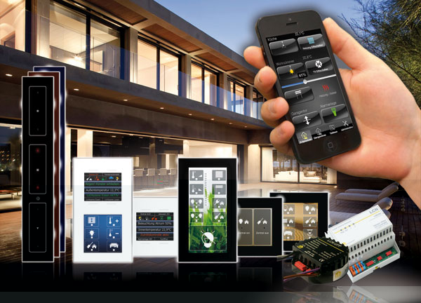

# LCN Binding

[Local Control Network (LCN)](http://www.lcn.eu) is a building automation system for small and very large installations.
It is capable of controlling lights, shutters, access control etc. and can process data from several sensor types.
It has been introduced in 1992.

A broad range of glass key panels, displays, remote controls, sensors and in- and outputs exist.  
The system can handle up to 30,000 bus members, called modules.
LCN modules are available for DIN rail and in-wall mounting and feature versatile interfaces. The bus modules and most of the accessories are developed, manufactured and assembled in Germany.

Bus members are inter-connected via a free wire in the standard NYM cable. Wireless components are available, though.



This binding uses TCP/IP to access the LCN bus via the software LCN-PCHK (Windows/Linux) or the DIN rail device LCN-PKE.
**This means 1 unused LCN-PCHK license or a LCN-PKE is required**

## LCN Overview

LCN modules and their connecting peripherals are explained in the following.

### LCN Modules

Active LCN components connected to the LCN bus are called *LCN modules*.
LCN modules are addressed by their numeric id: Valid range is 5..254

In larger buildings, a second topologic layer is added: *segments*.
Valid range is 5..128 or 0 (= no segments exist) or 3 (= target all segments)

LCN modules within the **same** segment can be grouped: Valid range is 5..254 or 3 (= target all groups)

### LCN Firmware Versions

Each LCN module has a feature-set based on its firmware version.
This version is written as follows: \[year since 1990\]\[month\]\[day\]

Each component is written in hexadecimal with 2 characters. Examples:

- 090101 = 1. january 1990
- 0D0C01 = 1. december 2003
- 170206 = 6. feb. 2013

### LCN Dimmer Outputs

LCN modules support 2 to 4 dimmer output ports (number depends on firmware version).
If the module hardware type doesn't feature physical dimmer outputs, the outputs can still be used as virtual.

Status values are always in percent.
Modules since 170206 have a 0.5%-steps resolution. Older modules have a 2%-steps resolution.

The time it takes the output port to reach its setpoint is called *ramp*.

### LCN Variables

LCN modules support:

- 3 or 12 (since 170206) analog variables for general purpose
- 2 regulators with configurable setpoints
- 5 or 4x4 (since 170206) thresholds (trigger levels)
- 4 S0-input counters (since 170206, LCN-BU4L must be connected)

### LCN Regulators (additions to variables)

LCN modules have 2 regulators.
Each one has a setpoint and uses one variable as its value source.
A regulator can be locked, so that the target actuator keeps switched off, also if the value source is in control range.

### LCN Thresholds

LCN modules since firmware 170206 have 4 threshold registers. Each threshold register comprises 4 thresholds.

A threshold register uses one variable as its value source (see [LCN Variables](#lcn-variables)).
Arbitrary LCN commands can be send into the bus, when the value-source falls below a threshold or exceeds one.
A threshold can be locked, so that the configured LCN command is not fired, also if the value source passes the threshold.

### LCN Relays

LCN modules support 8 relays. If no hardware relays are connected, the relays can still be used as virtual.

### LCN Binary Sensors

LCN modules support 8 binary sensors (e.g. motion detectors; hardware periphery must be connected).
  
### LCN LEDs (legacy name: *lamps*)

12x multi-state variables can be used for logic operations or visualization (hardware periphery must be connected).

Values: OFF, ON, BLINK, FLICKER

### LCN Logic Operations (legacy name: *sums*)

4x multi-state variables each representing the result of a logic operation of the associated LEDs.

Values: NOT (all LEDs off), OR (some LEDs on), AND (all LEDs on)

### LCN Keys

LCN keys are data-points in the module with bound commands.
LCN modules support 3 ("A-C") or 4 ("A-D") key-tables (number depends on firmware version).

Each key-table holds 8 keys. Examples: A1, A7, D8

Each key has 3 command types: HIT(press), MAKE(long press), BREAK(long press release)

These keys can be locked. The bound (LCN-)commands cannot be executed, then.

### LCN Access Control & Remote Controls

LCN can interface several transponder readers and finger print sensors, used for access control.

Remote controls can not only be used for triggering commands, but also for access control, by evaluating the transmitted serial number.

## Supported Things

### Thing: LCN Module

Any LCN module that should be controlled or visualized, need to be added to openHAB as a *Thing*.

LCN modules with firmware versions 120612 (2008) and 170602 (2013) were tested with this binding.
No known features/changes that need special handling were added until now (2020).
Modules with older and newer firmware should work, too.
The module hardware types (e.g. LCN-SH, LCN-HU, LCN-UPP, ...) are compatible to each other and can therefore be handled all in the same way.

Thing ID: `module`

| Name        | Description                                                    | Type    | Required |
|-------------|----------------------------------------------------------------|---------|----------|
| `moduleId`  | The module ID, configured in LCN-PRO                           | Integer | Yes      |
| `segmentId` | The segment ID the module is in (0 if no segments are present) | Integer | Yes      |

openHAB's discovery function can be used to add LCN modules automatically.
See [Discover LCN Modules](#discover-lcn-modules).

### Thing: LCN PCK Gateway

PCK is the protocol spoken over TCP/IP with a PCK gateway to communicate with the LCN bus.
Examples for PCK gateways are the *LCN-PCHK* software running on Windows or Linux and the DIN rail mounting device *LCN-PKE*.

For each LCN bus, interfaced to openHAB, a PCK gateway needs to be added to openHAB as a *Thing*.

Several PCK gateways can be added to openHAB to control multiple LCN busses in distinct locations. 

The minimum recommended version is LCN-PCHK 2.8 (older versions will also work, but lack some functionality).
Visit [https://www.lcn.eu](https://www.lcn.eu) for updates.

Thing ID: `pckGateway`

| Name        | Description                                                                                                | Type    | Required |
|-------------|------------------------------------------------------------------------------------------------------------|---------|----------|
| `hostname`  | Hostname or IP address of the LCN-PCHK gateway                                                             | String  | Yes      |
| `port`      | TCP port of the LCN-PCHK gateway (default:4114)                                                            | Integer | Yes      |
| `username`  | Username configured within LCN-PCHK Monitor                                                                | String  | Yes      |
| `password`  | Password configured within LCN-PCHK Monitor                                                                | String  | Yes      |
| `mode`      | Dimmer resolution: `native50` or `native200` See below.                                                    | String  | Yes      |
| `timeoutMs` | Period after which an LCN command is resent, when no acknowledge has been received (in ms) (default: 3500) | Integer | Yes      |

> **IMPORTANT:** You need to configure the dimmer output resolution. This setting is valid for the **whole** LCN bus.<br />
The setting is either 0-50 steps or 0-200 steps.
It **has to be the same** as in the parameterizing software **LCN-PRO** under Options/Settings/Expert Settings.
See the following screenshot.


When using a wrong dimmer output setting, dimming the outputs will result in unintended behavior.

### Thing: LCN Group

LCN modules can be assigned to groups with the programming software *LCN-PRO*.

To send commands to an LCN group, the group needs to be added to openHAB as a *Thing*.

One LCN module within the group is used to represent the status of the whole group.
For example, when a Dimmer Output is controlled via a LCN group *Thing*, openHAB will always visualize the state of the Dimmer Output of the chosen module. The states of the other modules in the group are ignored for visualization.

Thing ID: `group`

| Name        | Description                                                                                                                                  | Type    | Required |
|-------------|----------------------------------------------------------------------------------------------------------------------------------------------|---------|----------|
| `groupId`   | The group number, configured in LCN-PRO                                                                                                      | Integer | Yes      |
| `moduleId`  | The module ID of any module in the group. The state of this module is used for visualization of the group as representative for all modules. | Integer | Yes      |
| `segmentId` | The segment ID of all modules in this group (0 if no segments are present)                                                                   | Integer | Yes      |

The `groupId` must match the previously configured group number in the programming software *LCN-PRO*.

## Discovery

### Discover LCN Modules

Basic data of LCN modules can be read out by openHAB.
To do so, simply start openHAB's discovery.

If not all LCN modules get listed on the first run, click on the refresh button to start another scan.

When adding a module by discovery, the new *Thing*'s UID will be the module's serial number.

### Discover PCK Gateways

PCK gateways in the LAN can be found automatically by openHAB. This is done by UDP multicast messages on port 4220.
The discovery works only if the firewall of the PCK gateway is not configured too strictly.
This means on Windows PCs, that the network must be configured as 'private' and not as 'public'.
Also, some network switches may block multicast packets.
Unfortunately, *LCN-PCHK* listens only on the first network interface of the computer for discovery packets.
If your PCK gateway has multiple network interfaces, *LCN-PCHK* may listen on the wrong interface and fails to respond to the discovery request.

Discovery has successfully been tested with LCN-PCHK 3.2.2 running on a Raspberry Pi with Raspbian and openHAB running on Windows 10.

If discovery fails, you can add a PCK gateway manually. See [Thing: PCK Gateway](#thing-lcn-pck-gateway).

Please be aware that you **have to configure** username, password and the dimmer output resolution also if you use discovery.
See [Thing: PCK Gateway](#thing-lcn-pck-gateway).

When adding a PCK gateway by discovery, the new *Thing*'s UID is the MAC address of the device, running the PCK gateway.

## Supported LCN Features and openHAB Channels

The following table lists all features of LCN and their mappings to openHAB Channels. These Channels are available for the *Things* LCN module (`module`) and LCN group (`group`). The PCK gateway (`pckGateway`) has no Channels.

Although, there are many **Not implemented** entries, the vast majority of LCN features can be used with openHAB:<br />
If a special command is needed, the [Hit Key](#hit-key) action (German: "Sende Taste") can be used to hit a module's key virtually and execute an arbitrary command.

| LCN Feature (English)           | LCN Feature (German)             | Channel                | IDs  | Type                           | Description                                                                                                                   |
|---------------------------------|----------------------------------|------------------------|------|--------------------------------|-------------------------------------------------------------------------------------------------------------------------------|
| Dimmer Output Control Single    | Ausgang                          | output                 | 1-4  | Dimmer, Switch                 | Sets the dimming value of an output with a given ramp.                                                                        |
| Relay                           | Relais                           | relay                  | 1-8  | Switch                         | Controls a relay and visualizes its state.                                                                                    |
| Visualize Binary Sensor         | Binärsensor anzeigen             | binarysensor           | 1-8  | Contact                        | Visualizes the state of a binary sensor.                                                                                      |
| LED Control                     | LED-Steuerung                    | led                    | 1-12 | Text (ON, OFF, BLINK, FLICKER) | Controls an LED and visualizes its current state.                                                                             |
| Visualize Logic Operations      | Logik Funktion anzeigen          | logic                  | 1-4  | Text (NOT, OR, AND)            | Visualizes the result of the logic operation.                                                                                 |
| Motor/Shutter on Dimmer Outputs | Motor/Rollladen an Ausgängen     | rollershutteroutput    | 1-4  | Rollershutter                  | Control roller shutters on dimmer outputs                                                                                     |
| Motor/Shutter on Relays         | Motor/Rollladen an Relais        | rollershutterrelay     | 1-4  | Rollershutter                  | Control roller shutters on relays                                                                                             |
| Variables                       | Variable anzeigen                | variable               | 1-12 | Number                         | Sets and visualizes the value of a variable.                                                                                  |
| Regulator Set Setpoint          | Regler Sollwert ändern           | rvarsetpoint           | 1-2  | Number                         | Sets and visualizes the setpoint of a regulator.                                                                              |
| Regulator Lock                  | Regler sperren                   | rvarlock               | 1-2  | Switch                         | Locks a regulator and visualizes its locking state.                                                                           |
| Set Thresholds in Register 1    | Schwellwert in Register 1 ändern | thresholdregister1     | 1-4  | Number                         | Sets and visualizes a threshold in the given threshold register.                                                              |
| Set Thresholds in Register 2    | Schwellwert in Register 2 ändern | thresholdregister2     | 1-4  | Number                         | Sets and visualizes a threshold in the given threshold register.                                                              |
| Set Thresholds in Register 3    | Schwellwert in Register 3 ändern | thresholdregister3     | 1-4  | Number                         | Sets and visualizes a threshold in the given threshold register.                                                              |
| Set Thresholds in Register 4    | Schwellwert in Register 4 ändern | thresholdregister4     | 1-4  | Number                         | Sets and visualizes a threshold in the given threshold register.                                                              |
| Visualize S0 Counters           | S0-Zähler anzeigen               | s0input                | 1-4  | Number                         | Visualizes the value of a S0 counter.                                                                                         |
| Lock Keys Table A               | Sperre Tastentabelle A           | keylocktablea          | 1-8  | Switch                         | Locks a key on the given key table and visualizes its state.                                                                  |
| Lock Keys Table B               | Sperre Tastentabelle B           | keylocktableb          | 1-8  | Switch                         | Locks a key on the given key table and visualizes its state.                                                                  |
| Lock Keys Table C               | Sperre Tastentabelle C           | keylocktablec          | 1-8  | Switch                         | Locks a key on the given key table and visualizes its state.                                                                  |
| Lock Keys Table D               | Sperre Tastentabelle D           | keylocktabled          | 1-8  | Switch                         | Locks a key on the given key table and visualizes its state.                                                                  |
| Dimmer Output Flicker           | Ausgang: Flackern                | N/A                    | N/A  | N/A                            | Action "flickerOutput": Let a dimmer output flicker for a given count of flashes.                                             |
| Dynamic Text                    | Dynamischer Text                 | N/A                    | N/A  | N/A                            | Action: "sendDynamicText": Sends custom text to an LCN-GTxD display.                                                          |
| Send Keys                       | Sende Tasten                     | N/A                    | N/A  | N/A                            | Action: "hitKey": Hits a key of a key table in an LCN module. Can be used to execute commands, not supported by this binding. |
| Dimmer Output Control Multiple  | Mehrere Ausgänge steuern         | output                 | 1-4  | Dimmer, Switch                 | Control multiple outputs simultaneously. See below.                                                                           |
| Transponder                     | Transponder                      | code#transponder       |      | Trigger                        | Receive transponder messages                                                                                                  |
| Remote Control                  | Fernbedienung                    | code#remotecontrolkey  |      | Trigger                        | Receive commands from remote control                                                                                          |
| Access Control                  | Zutrittskontrolle                | code#remotecontrolcode |      | Trigger                        | Receive serial numbers from remote control                                                                                    |
| Remote Control Battery Low      | Fernbedienung Batterie schwach   | code#remotecontrolbatterylow | | Trigger                       | Triggered when the sending remote control has a low battery                                                                   |
| Status Message                  | Statusmeldungen                  | -                      | -    | -                              | Automatically done by OpenHAB Binding                                                                                         |
| Audio Beep                      | Audio Piepen                     | -                      | -    | -                              | Not implemented                                                                                                               |
| Audio LCN-MRS                   | Audio LCN-MRS                    | -                      | -    | -                              | Not implemented                                                                                                               |
| Count/Compute                   | Zählen/Rechnen                   | -                      | -    | -                              | Not implemented                                                                                                               |
| DALI                            | DALI                             | -                      | -    | -                              | Not implemented                                                                                                               |
| Dimmer Output Memory Toggle     | Ausgang: Memory Taster           | -                      | -    | -                              | Not implemented                                                                                                               |
| Dimmer Output Ramp Stop         | Ausgang: Rampe Stop              | -                      | -    | -                              | Not implemented                                                                                                               |
| Dimmer Output Relative          | Ausgang: Relativ                 | -                      | -    | -                              | Not implemented                                                                                                               |
| Dimmer Output Stairway          | Ausgang: Treppenhauslicht        | -                      | -    | -                              | Not implemented                                                                                                               |
| Dimmer Output Timer             | Ausgang: Timer (Kurzzeit)        | -                      | -    | -                              | Not implemented                                                                                                               |
| Display Set Language            | Display-Sprache setzen           | -                      | -    | -                              | Not implemented                                                                                                               |
| Dynamic Groups                  | Dynamische Gruppen               | -                      | -    | -                              | Not implemented                                                                                                               |
| Free Input                      | Freie Eingabe                    | -                      | -    | -                              | Not implemented                                                                                                               |
| LED Brightness                  | LED-Helligkeit                   | -                      | -    | -                              | Not implemented                                                                                                               |
| LED Test                        | LED-Test                         | -                      | -    | -                              | Not implemented                                                                                                               |
| LED Transform                   | LED-Umwandlung                   | -                      | -    | -                              | Not implemented                                                                                                               |
| Light Scenes                    | Lichtszenen                      | -                      | -    | -                              | Not implemented                                                                                                               |
| Lock Keys by Time (Table A)     | Sperre (Zeit) Tasten (Tabelle A) | -                      | -    | -                              | Not implemented                                                                                                               |
| Lock Outputs by Time            | Sperre (Zeit) Ausgänge           | -                      | -    | -                              | Not implemented                                                                                                               |
| Lock Relays                     | Sperre Relais                    | -                      | -    | -                              | Not implemented                                                                                                               |
| Lock Thresholds                 | Sperre Schwellwerte              | -                      | -    | -                              | Not implemented                                                                                                               |
| Motor Position                  | Motor Position                   | -                      | -    | -                              | Not implemented                                                                                                               |
| Relay Timer                     | Relais-Timer                     | N/A                    | N/A  | N/A                            | Action: "startRelayTimer": Starts a relay timer for the given relay number with the given duration in milliseconds.                                                                                           |
| Send Keys Delayed               | Sende Tasten verzögert           | -                      | -    | -                              | Not implemented                                                                                                               |
| Set S0 Counters                 | S0-Zähler setzen                 | -                      | -    | -                              | Not implemented                                                                                                               |
| Status Command                  | Statuskommandos                  | -                      | -    | -                              | Not implemented                                                                                                               |

**For some *Channel*s a unit should be configured for visualization.** By default the native LCN value is used.

S0 counter Channels need to be the pulses per kWh configured. If the value is left blank, a default value of 1000 pulses/kWh is set.

The Rollershutter Channels provide the boolean parameter `invertUpDown`, which can be set to 'true' if the Up/Down wires are interchanged.

### Transponder

LCN transponder readers can be integrated in openHAB e.g. for access control.
The transponder function must be enabled in the module's I-port properties within *LCN-PRO*.
 
Example: When the transponder card with the ID "12ABCD" is seen by the reader connected to LCN module "17B308349E", the item "M10_Relay7" is switched on:

```
rule "My Transponder"
when
    Channel "lcn:module:b827ebfea4bb:17B308349E:code#transponder" triggered "12ABCD"
then
    M10_Relay7.sendCommand(ON)
end
```

### Remote Control

To evaluate commands from LCN remote controls (e.g. LCN-RT or LCN-RT16), the module's I-port behavior must be configured as "IR access control" within *LCN-PRO*:


#### Remote Control Keys

The trigger *Channel* `lcn:module:<pckThing>:<moduleThing>:code#remotecontrolkey` can be used to execute commands, when a specific key on a remote control is pressed:

```
rule "Remote Control Key 3 on Layer 1 hit"
when
    Channel "lcn:module:b827ebfea4bb:17B3073D6A:code#remotecontrolkey" triggered "A3:HIT"
then
    M10_Relay7.sendCommand(ON)
end
```

`A3` is key 3 on the first layer. `B1` is key 1 on the second layer etc.. After the colon follows the LCN "hit type" HIT, MAKE or BREAK (German: kurz, lang, los).

#### Remote Control used as Access Control

The serial number of a remote control can be used for access control via the channel `lcn:module:<pckThing>:<moduleThing>:code#remotecontrolcode`. See the following example:

```
rule "Remote Control Key 3 on Layer 1 hit (only executed for serial number AB1234)"
when
    Channel "lcn:module:b827ebfea4bb:17B3073D6A:code#remotecontrolcode" triggered "AB1234:A3:HIT" or
    Channel "lcn:module:b827ebfea4bb:17B3073D6A:code#remotecontrolcode" triggered "AB1234:A3:MAKE"
then
    M10_Relay7.sendCommand(ON)
end
```

The command will be executed when the remote control button A3 is either pressed short or long.

## Dimmer Outputs with Ramp and Multiple Outputs

The *output* profile can be used to control multiple dimmer outputs of the *same* module simultaneously or control a dimmer output with a ramp (slowly dimming).

The optional *ramp* parameter must be float or integer.
The lowest value is 0.25, which corresponds to 0.25s. The highest value is 486s.
When no *ramp* parameter is specified or no profile is configured, the ramp is 0 (behavior like a switch).
The ramp parameter is not available for Color *Item*s.

```
// Dim output 2 in 0.25s 
Switch M10_Output2 {channel="lcn:module:b827ebfea4bb:17B4196847:output#2"[profile="lcn:output", ramp=0.25]} // with ramp of 0.25s (smallest value)
// Dim output 3 in 486s
Dimmer M10_Output3 {channel="lcn:module:b827ebfea4bb:17B4196847:output#3"[profile="lcn:output", ramp=486]}  // with ramp of 486s (biggest value)
```

The optional parameters *controlAllOutputs* and *controlOutputs12* can be used to control multiple outputs simultaneously.
Please note that the combination of these parameters with the *ramp* parameter is limited:

```
// Control outputs 1+2 simultaneously. Status of Output 1 is visualized. Only ramps of 0s or 0.25s are supported.
Dimmer M10_Outputs12a {channel="lcn:module:b827ebfea4bb:17B4196847:output#1"[profile="lcn:output", controlOutputs12=true]}
Dimmer M10_Outputs12b {channel="lcn:module:b827ebfea4bb:17B4196847:output#1"[profile="lcn:output", controlOutputs12=true, ramp=0.25]}
// Control all outputs simultaneously. Status of Output 1 is visualized.
Dimmer M10_OutputAll1 {channel="lcn:module:b827ebfea4bb:17B4196847:output#1"[profile="lcn:output", controlAllOutputs=true, ramp=0]} // ramp only since firmware 180501
Dimmer M10_OutputAll2 {channel="lcn:module:b827ebfea4bb:17B4196847:output#1"[profile="lcn:output", controlAllOutputs=true, ramp=0.25]} // ramp compatibility: all
Dimmer M10_OutputAll3 {channel="lcn:module:b827ebfea4bb:17B4196847:output#1"[profile="lcn:output", controlAllOutputs=true, ramp=0.5]} // ramp only since firmware 180501
```

## Actions

Actions are special commands that can be sent to LCN modules or LCN groups.

### Hit Key

This *Action* virtually hits a key of a key table in an LCN module.
Simply spoken, OpenHab acts as a push button switch connected to an LCN module.

This *Action* can be used to execute commands which are not natively supported by this binding.
The function can be programmed via the software *LCN-PRO* onto a key in a module's key table.
Then, the programmed key can be "hit" by this *Action* and the command will be executed.

When programming a "Hit Key" *Action*, the following parameters need to be set:

*table* - The module's key table: A, B, C or D<br />
*key* - The number of the key within the key table: 1-8<br />
*action* - The key's action: HIT (German: "kurz"), MAKE ("lang") or BREAK ("los")

```
rule "Hit key C4 hourly"
when
    Time cron "0 0 * * * ?"
then
    val actions = getActions("lcn","lcn:module:b827ebfea4bb:17B4196847")
    actions.hitKey("C", 4, "HIT")
end
```

### Dynamic Text

This *Action* can be used to send custom texts to an LCN-GTxD display.
To make this function work, the row of the display has to be configured to allow dynamic text within *LCN-PRO*:


When programming a "Dynamic Text" *Action*, the following parameters need to be set:

*row* - The number of the row in the display: 1-4<br />
*text* - The text to be displayed (UTF-8)

The length of the text may not exceed 60 bytes of characters.
Bear in mind that unicode characters can take more than one byte (e.g. umlauts (äöü) take two bytes).

```
rule "Send dynamic Text to GT10D hourly"
when
    Time cron "0 0 * * * ?"
then
    val actions = getActions("lcn","lcn:module:b827ebfea4bb:17B3073D6A")
    actions.sendDynamicText(1, "Test 123 CO₂ öäü߀") // row 1
end
```

### Flicker Output

This *Action* realizes the LCN command "Output: Flicker" (German: "Ausgang: Flackern").
The command let a dimmer output flash a given number of times. This feature can be used e.g. for alert signals or visual door bells.

When programming a "Flicker Output" *Action*, the following parameters need to be set:

*output* - The dimmer output number: 1-4<br />
*depth* - The depth of the flickering: 0-2 (0=25% 1=50% 2=100% Example: When the output is fully on (100%), and 0 is selected, flashes will dim from 100% to 75% and back)<br />
*ramp* - The duration/ramp of one flash: 0-2 (0=2sec 1=1sec 2=0.5sec)<br />
*count* - The number of flashes: 1-15

This action has also effect, if the given output is off. The output will be dimmed from 0% to *depth* and back, then.

```
rule "Flicker output 1 when window opens"
when
    Item M10_BinarySensor5 changed to OPEN 
then
    val actions = getActions("lcn","lcn:module:b827ebfea4bb:17B4196847")
    // output=1, depth=2=100%, ramp=0=2s, count=3
    actions.flickerOutput(1, 2, 0, 3)
end
```

### Relay Timer

This *Action* realizes the LCN commmand "Relay Timer" (German: "Relais-Timer").
The command switches the given relay immediately to on and after a given time back to off.

When programming a "Relay Timer" *Action*, the following parameters need to be set:

*relayNumber* - The relay number: 1-8<br />
*duration* - Timer duration in milliseconds: 30-240.000 ms<br />

```
rule "Start relay timer for led driver when dummy switch changed"
when
    Item Dummy_Switch changed 
then
    val actions = getActions("lcn","lcn:module:b827ebfea4bb:17B4196847")
    // relayNumber=3, duration=90
    actions.startRelayTimer(3,90)
end
```


## Caveat and Limitations

LCN segments are supported by this binding, but could not be tested, due to lack of hardware.

LEDs do not support the *OnOffCommand* and respectively the *Switch* Item type, because they have the additional states *BLINK* and *FLICKER*. They must be configured as *String* Item. When used in rules, the parameter must be of type string. Example: `M10_LED1.sendCommand("ON")`. Note the quotation marks.

## Full Example

Config .items

```
// Dimmer Outputs
Dimmer M10_Output1 {channel="lcn:module:b827ebfea4bb:17B4196847:output#1"}
Switch M10_Output2 {channel="lcn:module:b827ebfea4bb:17B4196847:output#2"[profile="lcn:output", ramp=0.25]} // with ramp of 0.25s (smallest value)
Dimmer M10_Output3 {channel="lcn:module:b827ebfea4bb:17B4196847:output#3"[profile="lcn:output", ramp=486]}  // with ramp of 486s (biggest value)

// Dimmer Outputs: Control all simultaneously. Status of Output 1 is visualized.
Dimmer M10_OutputAll1 {channel="lcn:module:b827ebfea4bb:17B4196847:output#1"[profile="lcn:output", controlAllOutputs=true, ramp=0]}    // ramp=0: only since firmware 180501
Dimmer M10_OutputAll2 {channel="lcn:module:b827ebfea4bb:17B4196847:output#1"[profile="lcn:output", controlAllOutputs=true, ramp=0.25]} // ramp=0.25: compatibility: all firmwares
Dimmer M10_OutputAll3 {channel="lcn:module:b827ebfea4bb:17B4196847:output#1"[profile="lcn:output", controlAllOutputs=true, ramp=0.5]}  // ramp>=0.5: only since firmware 180501

// Dimmer Outputs: Control outputs 1+2 simultaneously. Status of Output 1 is visualized. Only ramps of 0s or 0.25s are supported.
Dimmer M10_Outputs12b {channel="lcn:module:b827ebfea4bb:17B4196847:output#1"[profile="lcn:output", controlOutputs12=true, ramp=0.25]}

// Dimmer Outputs: RGB Control
Color M10_Color {channel="lcn:module:b827ebfea4bb:17B4196847:output#color"[profile="lcn:output"]} 

// Roller Shutter on Output 1+2
Rollershutter M10_RollershutterOutput1 {channel="lcn:module:b827ebfea4bb:17B4196847:rollershutteroutput#1"}

// Relays
Switch M10_Relay1 {channel="lcn:module:b827ebfea4bb:17B4196847:relay#1"}

// Roller Shutter on Relays 1+2
Rollershutter M10_RollershutterRelay1 {channel="lcn:module:b827ebfea4bb:17B4196847:rollershutterrelay#1"}

// LEDs
String M10_LED1 {channel="lcn:module:b827ebfea4bb:17B4196847:led#1"}
String M10_LED2 {channel="lcn:module:b827ebfea4bb:17B4196847:led#2"}

// Logic Operations (legacy name: "Sums")
String M10_Logic1 {channel="lcn:module:b827ebfea4bb:17B4196847:logic#1"}
String M10_Logic2 {channel="lcn:module:b827ebfea4bb:17B4196847:logic#2"[profile="transform:MAP", function="alertSystem.map"]}
// conf/transform/alertSystem.map:
// NOT=All windows are closed
// OR=Some windows are open
// AND=All windows are open

// Binary Sensors
Contact M10_BinarySensor1 {channel="lcn:module:b827ebfea4bb:17B4196847:binarysensor#1"}

// Variables
// The units of the variables must also be set in the Channels configuration, to be visualized correctly.
Number:Temperature M10_Variable1 "[%.1f %unit%]" <temperature> {channel="lcn:module:b827ebfea4bb:17B4196847:variable#1"} // Temperature in °C
Number:Temperature M10_Variable2 "[%.1f °F]" <temperature> {channel="lcn:module:b827ebfea4bb:17B4196847:variable#2"} // Temperature in °F
Number M10_Variable3 "[%d ppm]" <temperature> {channel="lcn:module:b827ebfea4bb:17B4196847:variable#3"}              // Indoor air quality in ppm
Number M10_Variable4 "[%d lx]"    {channel="lcn:module:b827ebfea4bb:17B4196847:variable#4"}                          // Illuminance in Lux
Number:Illuminance M10_Variable5 "[%.1f klx]" {channel="lcn:module:b827ebfea4bb:17B4196847:variable#5"}              // Illuminance in kLux
Number M10_Variable6 "[%.1f mA]"  {channel="lcn:module:b827ebfea4bb:17B4196847:variable#6"}                          // Electrical current in mA
Number M10_Variable7 "[%.1f V]"   {channel="lcn:module:b827ebfea4bb:17B4196847:variable#7"}                          // Voltage in V
Number M10_Variable8 "[%.1f m/s]" {channel="lcn:module:b827ebfea4bb:17B4196847:variable#8"}                          // Wind speed in m/s
Number M10_Variable9 "[%.1f °]"  {channel="lcn:module:b827ebfea4bb:17B4196847:variable#9"}                           // position of the sun (azimuth or elevation) in °
Number M10_Variable10 "[%d W]"    {channel="lcn:module:b827ebfea4bb:17B4196847:variable#10"}                         // Current power of an S0 input in W
Number:Power M10_Variable11 "[%.1f kW]" {channel="lcn:module:b827ebfea4bb:17B4196847:variable#11"}                   // Current power of an S0 input in kW

// Regulators
Number:Temperature M10_R1VarSetpoint "[%.1f %unit%]" <temperature> {channel="lcn:module:b827ebfea4bb:17B4196847:rvarsetpoint#1"} // Temperature in °C
Switch M10_R1VarLock {channel="lcn:module:b827ebfea4bb:17B4196847:rvarlock#1"} // Lock state of R1Var

// Thresholds
Number:Temperature M10_ThresholdRegister1_Threshold1 "[%.1f %unit%]" {channel="lcn:module:b827ebfea4bb:17B4196847:thresholdregister1#1"} // Temperature in °C
Number:Temperature M10_ThresholdRegister4_Threshold2 "[%.1f %unit%]" {channel="lcn:module:b827ebfea4bb:17B4196847:thresholdregister4#2"} // Temperature in °C

// S0 Counters
Number:Energy M10_S0Counter1 "[%.1f kWh]" {channel="lcn:module:b827ebfea4bb:17B4196847:s0input#1"}

// Key Locks
Switch M10_KeyLockA1 {channel="lcn:module:b827ebfea4bb:17B4196847:keylocktablea#1"}
Switch M10_KeyLockD5 {channel="lcn:module:b827ebfea4bb:17B4196847:keylocktabled#5"}
```

Config .sitemap

```
sitemap lcn label="My home automation" {
    Frame label="Demo Items" {
        // Dimmer Outputs
        Default item=M10_Output1 label="Output 1"
        Default item=M10_Output2 label="Output 2"
        Default item=M10_Output3 label="Output 3"
        
        // Dimmer Outputs: Control all simultaneously. Status of Output 1 is visualized.
        Default item=M10_OutputAll1 label="All Outputs ramp=0 since firmware 180501"
        Default item=M10_OutputAll2 label="All Outputs ramp=250ms all firmwares"
        Default item=M10_OutputAll3 label="All Outputs ramp>=500ms since firmware 180501"
        
        // Dimmer Outputs: Control outputs 1+2 simultaneously. Status of Output 1 is visualized. Only ramps of 0s or 0.25s are supported.
        Default item=M10_Outputs12a label="Outputs 1+2 Ramp=0"
        Default item=M10_Outputs12b label="Outputs 1+2 Ramp=0.25s"
        
        // Dimmer Outputs: RGB Control
        Colorpicker item=M10_Color
        
        // Roller Shutter on Outputs 1+2
        Default item=M10_RollershutterOutput1 label="Roller Shutter on Output 1+2"
        
        // Relays
        Default item=M10_Relay1 label="Relay 1"
        
        // Roller Shutter on Relays
        Default item=M10_RollershutterRelay1 label="Roller Shutter on Relay 1-2"
        
        // LEDs
        Switch item=M10_LED1 label="LED 1" mappings=[ON=ON, OFF=OFF] // Don't display "Blink" or "Flicker"
        Switch item=M10_LED2 label="LED 2"
        
        // Logic Operations (legacy name: "Sums")
        Default item=M10_Logic1 label="Logic Operation 1"
        Default item=M10_Logic2 label="Logic Operation 2"
        
        // Binary Sensors
        Default item=M10_BinarySensor1 label="Binary Sensor 1" 
        
        // Variables
        Setpoint item=M10_Variable1 label="Variable 1"
        Default item=M10_Variable2 label="Variable 2"
        Default item=M10_Variable3 label="Variable 3"
        Default item=M10_Variable4 label="Variable 4"
        Default item=M10_Variable5 label="Variable 5"
        Default item=M10_Variable6 label="Variable 6"
        Default item=M10_Variable7 label="Variable 7"
        Default item=M10_Variable8 label="Variable 8"
        Default item=M10_Variable9 label="Variable 9"
        Default item=M10_Variable10 label="Variable 10"
        Default item=M10_Variable11 label="Variable 11"
        
        // Regulators
        Setpoint item=M10_R1VarSetpoint label="R1Var Setpoint" step=1 minValue=-10.0
        Default item=M10_R1VarLock label="R1Var Lock"  // Lock state of R1Var
        
        // Thresholds
        Setpoint item=M10_ThresholdRegister1_Threshold1 label="Threshold Register 1 Threshold 1"
        Setpoint item=M10_ThresholdRegister4_Threshold2 label="Threshold Register 4 Threshold 2"
        
        // S0 Counters
        Default item=M10_S0Counter1 label="S0 Counter 1"
        
        // Key Locks
        Default item=M10_KeyLockA1 label="Locked State Key A1"
        Default item=M10_KeyLockD5 label="Locked State Key D5"
    }   
}
```
