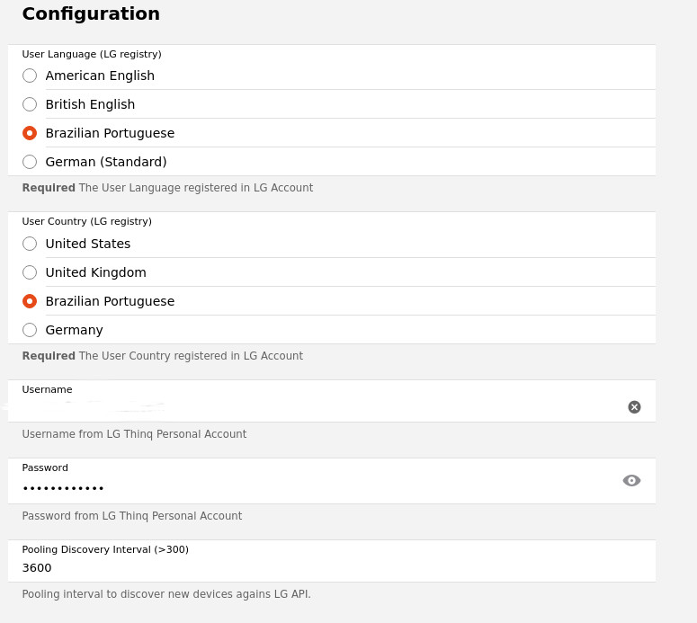

# LG ThinQ Bridge & Things

This binding was developed to integrate de OpenHab framework to LG ThinQ API. Currently, only Air Conditioners (API V1 & V2) are supported, but this binding is under construction to support others LG ThinQ Device Kinds.
The ThinQ Bridge is necessary to work as a hub/bridge to discovery and first configure the LG ThinQ devices related with the LG's user account.
Then, the first thing is to create the LG ThinQ Bridge and then, it will discovery all Things you have related in your LG Account.

## Supported Things
LG ThinQ Devices V1 & V2 (currently only Air Conditioners are supported, but it's planned to support the other kinds as well)

## Discovery

This Bridge discovery Air Conditioner Things related to the user's account. To force the immediate discovery, you can disable & enable the bridge 

## Binding Configuration

The binding is represented by a bridge (LG GatewayBridge) and you must configure the following parameters:

| Bridge Parameter           | Description                                                                                                                                                                                        | Constraints                       |
|----------------------------|----------------------------------------------------------------------------------------------------------------------------------------------------------------------------------------------------|-----------------------------------|
| User Language              | User language configured for the LG's account. Actually we have an limited number of language values available. If you need some specific, please let me know                                      | en-US, en-GB, pt-BR, de-DE, da-DK |
| User Country               | User country configured for the LG's account. Actually we have an limited number of language values available. If you need some specific, please let me know                                       | US, UK, BR, DE and DK             |
| LG User name               | The LG user's account (normally an email)                                                                                                                                                          |                                   |
| LG Password                | The LG user's password                                                                                                                                                                             |                                   |
| Pooling Discovery Interval | It the time (in seconds) that the bridge wait to try to fetch de devices registered to the user's account and, if find some new device, will show available to link. Please, choose some long time | greater than 300 seconds          |

## Thing Configuration

For now, only Air Conditioners are supported and must implement versions 1 or 2 of LG API (currently, there are only this 2 versions). We are working hard to release in a next version supportability for others devices like: refrigerators, washing machines, etc.
There is currently no configuration available, as it is automatically obtained by the bridge discovery process.

## Channels

LG ThinQ Air Conditioners support the following channels to interact with the OpenHab automation framework:

| channel            | type             | description                                                                                                                                               |
|--------------------|------------------|-----------------------------------------------------------------------------------------------------------------------------------------------------------|
| Target Temperature | Temperature      | Defines the desired target temperature for the device                                                                                                     |
| Temperature        | Temperature      | Read-Only channel that indicates the current temperature informed by the device                                                                           |
| Fan Speed          | Number (Labeled) | This channel let you choose the current label value for the fan speed (Low, Medium, High, Auto, etc.). These values are pre-configured in discovery time. |
| Operation Mode     | Number (Labeled) | Defines device's operation mode (Fan, Cool, Dry, etc). These values are pre-configured at discovery time.                                                 |
| Power              | Switch           | Define the device's current power state.                                                                                                                  |

**Important:** this binding will always interact with the LG API server to get information about the device. This is the Smart ThinQ way to work, there is no other way (like direct access) to the devices. Hence, some side effects will happen in the following situations:
1. **Internet Link** - if you OpenHab server doesn't have a good internet connection this binding will not work properly! In the same way, if the internet link goes down, your Things and Bridge going to be Offline as well, and you won't be able to control the devices though OpenHab until the link comes back.
2. **LG ThinQ App** - if you've already used the LG ThinQ App to control your devices and hold it constantly activated in your mobile phone, you may experience some instability because the App (and Binding) will try to lock the device in LG ThinQ API Server to get it's current state. In the app, you may see some information in the device informing that "The device is being used by other" (something like this) and in the OpenHab, the thing can go Offline for a while.
3. **Pooling time** - both Bridge and Thing use pooling strategy to get the current state information about the registered devices. Note that the Thing pooling time is internal and can't be changed (please, don't change in the source code) and the Bridge can be changed for something greater than 300 seconds, and it's recommended long pooling periods for the Bridge because the discovery process fetch a lot of information from the LG API Server, depending on the number of devices you have registered in your account. 
About this last point, it's important to know that LG API is not Open & Public, i.e, only LG Official Partners with some agreement have access to their support and documentations. This binding was a hard (very hard actually) work to dig and reverse engineering in the LG's ThinQ API protocol. Because this, you must respect the hardcoded pool period to do not put your account in LG Blacklist.

## Thanks and Inspirations

This binding was inspired in the work of some brave opensource community people. I got some tips and helps from their codes:
* Adrian Sampson - [Wideq Project](https://github.com/sampsyo/wideq): I think it is the first reverse engineering of ThinQ protocol made in Python, but only works (currently) for API V1.
* Ollo69 - [LG ThinQ Integration for Home Assistant](https://github.com/ollo69/ha-smartthinq-sensors): Ollo69 took the Adrian code and refactor it to support API V2 in an HA plugin.

## Be nice!
If you like the binding, why don't you support me by buying me a coffee?
It would certainly motivate me to further improve this work or to create new others cool bindings for OpenHab !

For openHAB 4.0 just enter

mvn clean install -pl :org.openhab.binding.lgthinq

for openHAB 3.4.x enter

mvn clean install -pl :org.openhab.binding.lgthinq -Dohc.version=3.4.0 -Doh.java.version=11 -Dkaraf.version=4.3.7
Just be carefull, the clean command deletes the content of the target folder, so you’d better copy files before issuing the second command.
Only culprit, the openHAB 3 Binding version is still named

org.openhab.binding.lgthinq-4.0.0-SNAPSHOT.jar
So you need to manually change it to

org.openhab.binding.lgthinq-3.4.5-SNAPSHOT.jar
