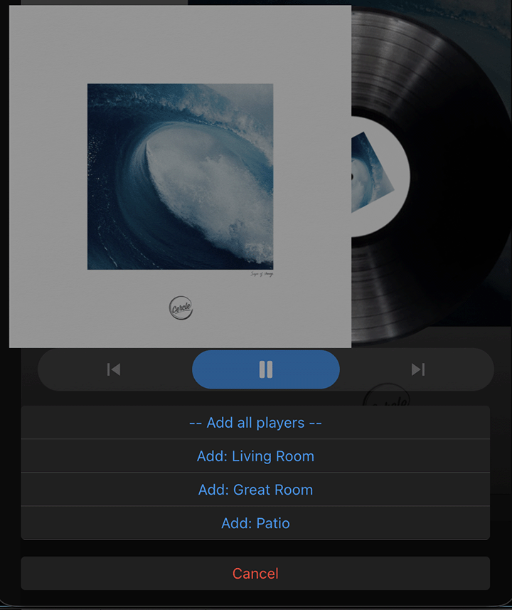

# LinkPlay Binding

This binding integrates audio devices based on the LinkPlay platform.
LinkPlay is a popular Wi-Fi audio module used by many manufacturers to enable streaming capabilities in their speakers and audio devices.
The binding allows you to control playback, adjust volume, switch inputs, configure equalizer settings, and create multi-room audio groups.

## Supported Manufacturers

The following is a subset of manufacturers and their models known to use the LinkPlay platform:

| Brand             | Models                                                                  |
|-------------------|-------------------------------------------------------------------------|
| WiiM              | WiiM Mini, WiiM Pro / Pro Plus, WiiM Amp, WiiM Solo, WiiM Ultra, others |
| Arylic            | A50, S50 Pro / S50 Pro+, Up2Stream series                               |
| Magnat            | MMS 730 Network Streamer                                                |
| Hall Audio        | Linkplay-based Audio Streamers                                          |
| Advanced Acoustic | WTX-MicroStreamer                                                       |
| Octavio           | Octavio Stream                                                          |

Any device using the LinkPlay streaming platform should be supported by this binding, regardless of the manufacturer.

## Supported Things

This binding supports the following thing type:

- `player` - Represents a single LinkPlay-based audio player (Thing Type UID: `linkplay:player`)

## Discovery

The binding supports automatic discovery of LinkPlay devices via UPnP.
Devices are discovered on the local network if they advertise themselves as UPnP MediaRenderer/MediaServer devices with AVTransport and RenderingControl services.

## Binding Configuration

This binding does not require any binding-level configuration.
All configuration is done at the thing level.

## Thing Configuration

### `player` Thing Configuration

The LinkPlay player thing can be configured either through automatic discovery (recommended) or manually.

| Name            | Type    | Description                           | Default | Required | Advanced |
|-----------------|---------|---------------------------------------|---------|----------|----------|
| udn             | text    | Unique Device Name (UDN)              | N/A     | yes      | no       |

The UDN is used as the unique identifier for the device and is auto-populated during discovery.

## Channels

The binding provides the following channel groups and channels:

### Playback Channel Group

Controls and monitors playback state and volume.

| Channel ID         | Item Type    | Read/Write | Description                                          |
|--------------------|--------------|------------|------------------------------------------------------|
| control            | Player       | RW         | Control playback (PLAY, PAUSE, NEXT, PREVIOUS)       |
| state              | String       | R          | Current playback state (PLAYING, PAUSED, STOPPED, BUFFERING) |
| position           | Number:Time  | R          | Current track position                               |
| duration           | Number:Time  | R          | Total track duration                                 |
| repeat-shuffle-mode| Number       | RW         | Loop, shuffle or single-track mode (-1=Off, 0=Repeat One, 1=Repeat All, 2=Shuffle All) |
| eq-preset          | String       | R          | Name of the active EQ preset                         |
| volume             | Dimmer       | RW         | Main volume (0-100%)                                 |
| mute               | Switch       | RW         | Mutes or unmutes the device                          |

### Track Metadata Channel Group

Displays information about the currently playing track.

| Channel ID         | Item Type    | Read/Write | Description                                          |
|--------------------|--------------|------------|------------------------------------------------------|
| track-title        | String       | R          | Current track title                                  |
| track-artist       | String       | R          | Current track artist                                 |
| track-album        | String       | R          | Current track album                                  |
| track-uri          | String       | R          | Current track uri                                  |
| album-art-url      | String       | R          | URL of the current album artwork                     |
| album-art          | Image        | R          | Album artwork image                                  |
| sample-rate        | Number       | R          | Sample rate of the playing track (Hz)                |
| bit-depth          | Number       | R          | Bit depth of the playing track                       |
| bit-rate           | Number       | R          | Bit rate of the playing track (kbps)                 |

### Source Selection Channel Group

Manages input sources and connections.

| Channel ID             | Item Type | Read/Write | Description                                       |
|------------------------|-----------|------------|---------------------------------------------------|
| source                 | String    | RW         | Active input source (wifi, bluetooth, line-in, optical, udisk, HDMI) |
| bluetooth-connected    | Switch    | R          | Indicates if a Bluetooth device is connected      |
| bluetooth-paired-device| String    | R          | MAC address of the paired Bluetooth device        |
| line-in-active         | Switch    | R          | True when line-in source is selected              |

### Equalizer & Output Channel Group

Controls equalizer settings and audio output configuration.

| Channel ID              | Item Type | Read/Write | Description                                       |
|-------------------------|-----------|------------|---------------------------------------------------|
| enabled                 | Switch    | RW         | Equalizer on/off                                  |
| preset                  | String    | R          | Name of the active EQ preset                      |
| band                    | Number    | RW         | Gain value of an EQ frequency band (-12 to 12 dB) |
| output-hardware-mode    | String    | R          | Active audio output (SPDIF, AUX, COAX)            |
| channel-balance         | Number    | RW         | Stereo balance (-1.0 left to 1.0 right)           |
| spdif-switch-delay-ms   | Number    | RW         | SPDIF sample-rate switch delay (0-3000ms)         |

### Multi-room Channel Group

Enables multi-room audio grouping features.

| Channel ID | Item Type | Read/Write | Description                                          |
|------------|-----------|------------|------------------------------------------------------|
| volume     | Dimmer    | RW         | Volume level for all grouped devices                 |
| mute       | Switch    | RW         | Mutes or unmutes all grouped devices                 |
| active     | Switch    | R          | Indicates if the device is part of a group           |
| leader     | Switch    | R          | Indicates if the device is a leader of a group       |
| join       | String    | W          | Join another player's group (send player Thing UID)  |
| leave      | String    | W          | Leave this player's group                            |
| manage     | String    | W          | Add or remove members from this player's group       |
| ungroup    | Switch    | W          | Ungroup all devices                                  |

### Device Channel Group

Controls device-specific settings.

| Channel ID          | Item Type    | Read/Write | Description                                       |
|---------------------|--------------|------------|---------------------------------------------------|
| led-enabled         | Switch       | RW         | Enables or disables the status LED                |
| touch-keys-enabled  | Switch       | RW         | Enables or disables touch controls                |
| shutdown-timer      | Number:Time  | RW         | Seconds until automatic shutdown                  |
| reboot              | Switch       | W          | Sends a reboot command (ON to trigger)            |
| factory-reset       | Switch       | W          | Restores factory defaults (ON to trigger)         |

### Presets Channel Group

Manages stored presets (stations, playlists, etc.).

| Channel ID | Item Type | Read/Write | Description                                          |
|------------|-----------|------------|------------------------------------------------------|
| count      | Number    | R          | Number of presets stored on the device               |
| play       | Number    | W          | Play the chosen preset number (1-12)                 |

### Preset1-12 Channel Groups

Each preset (1-12) has the following channels:

| Channel ID | Item Type | Read/Write | Description                                          |
|------------|-----------|------------|------------------------------------------------------|
| name       | String    | R          | Name of the stored preset                            |
| url        | String    | R          | URL associated with the preset                       |
| source     | String    | R          | Source type of the preset (e.g., tunein, udisk)      |
| pic-url    | String    | R          | Artwork URL for the preset                           |
| pic        | Image     | R          | Artwork image for the preset                         |
| play       | Switch    | W          | Play the preset (ON to trigger)                      |

## Audio Sink Playback

LinkPlay devices will register as audio sinks and can be used to play audio streams from openHAB.

## Full Example

### Thing Configuration

```java
Thing linkplay:player:living_room "Living Room Speaker" [ udn="1234567890-abcd-1234-abcd-123456790" ]
Thing linkplay:player:bedroom "Bedroom Speaker" [ udn="0987654321-abcd-4321-abcd-0987654321" ]
```

### Item Configuration

```java
// Playback controls
Player          LivingRoom_Control           "Control"                { channel="linkplay:player:living_room:playback#control" }
String          LivingRoom_State             "Playback State [%s]"    { channel="linkplay:player:living_room:playback#state" }
Dimmer          LivingRoom_Volume            "Volume [%d %%]"         { channel="linkplay:player:living_room:playback#volume" }
Switch          LivingRoom_Mute              "Mute"                   { channel="linkplay:player:living_room:playback#mute" }
Number          LivingRoom_RepeatMode        "Repeat Mode"            { channel="linkplay:player:living_room:playback#repeat-shuffle-mode" }

// Track metadata
String          LivingRoom_TrackTitle        "Title [%s]"             { channel="linkplay:player:living_room:metadata#track-title" }
String          LivingRoom_TrackArtist       "Artist [%s]"            { channel="linkplay:player:living_room:metadata#track-artist" }
String          LivingRoom_TrackAlbum        "Album [%s]"             { channel="linkplay:player:living_room:metadata#track-album" }
Image           LivingRoom_AlbumArt          "Album Art"              { channel="linkplay:player:living_room:metadata#album-art" }
Number          LivingRoom_SampleRate        "Sample Rate [%d Hz]"    { channel="linkplay:player:living_room:metadata#sample-rate" }

// Source selection
String          LivingRoom_Source            "Input Source [%s]"      { channel="linkplay:player:living_room:input#source" }
Switch          LivingRoom_BTConnected       "Bluetooth Connected"    { channel="linkplay:player:living_room:input#bluetooth-connected" }

// Equalizer
Switch          LivingRoom_EQEnabled         "EQ Enabled"             { channel="linkplay:player:living_room:equalizer#enabled" }
String          LivingRoom_EQPreset          "EQ Preset [%s]"         { channel="linkplay:player:living_room:equalizer#preset" }

// Multi-room
Switch          LivingRoom_MRActive          "Multi-room Active"      { channel="linkplay:player:living_room:multiroom#active" }
Switch          LivingRoom_MRLeader          "Multi-room Leader"      { channel="linkplay:player:living_room:multiroom#leader" }
String          LivingRoom_JoinGroup         "Join Group"             { channel="linkplay:player:living_room:multiroom#join" }
Switch          LivingRoom_Ungroup           "Ungroup"                { channel="linkplay:player:living_room:multiroom#ungroup" }

// Device
Switch          LivingRoom_LED               "Status LED"             { channel="linkplay:player:living_room:device#led-enabled" }
Switch          LivingRoom_TouchKeys         "Touch Controls"         { channel="linkplay:player:living_room:device#touch-keys-enabled" }

// Presets
Number          LivingRoom_PresetCount       "Preset Count [%d]"      { channel="linkplay:player:living_room:presets#count" }
Number          LivingRoom_PlayPreset        "Play Preset"            { channel="linkplay:player:living_room:presets#play" }
String          LivingRoom_Preset1Name       "Preset 1 [%s]"          { channel="linkplay:player:living_room:preset1#name" }
Switch          LivingRoom_Preset1Play       "Play Preset 1"          { channel="linkplay:player:living_room:preset1#play" }
```

### Sitemap Configuration

```perl
sitemap linkplay label="LinkPlay Audio" {
    Frame label="Living Room Speaker" {
        Default item=LivingRoom_Control
        Text item=LivingRoom_State
        Slider item=LivingRoom_Volume
        Switch item=LivingRoom_Mute
        
        Text label="Now Playing" {
            Text item=LivingRoom_TrackTitle
            Text item=LivingRoom_TrackArtist
            Text item=LivingRoom_TrackAlbum
            Image item=LivingRoom_AlbumArt
            Text item=LivingRoom_SampleRate
        }
        
        Selection item=LivingRoom_Source mappings=[wifi="WiFi", bluetooth="Bluetooth", "line-in"="Line-in", optical="Optical"]
        
        Text label="Equalizer" {
            Switch item=LivingRoom_EQEnabled
            Text item=LivingRoom_EQPreset
        }
        
        Text label="Multi-room" {
            Text item=LivingRoom_MRActive
            Text item=LivingRoom_MRLeader
            Switch item=LivingRoom_Ungroup
        }
        
        Text label="Presets" {
            Text item=LivingRoom_PresetCount
            Switch item=LivingRoom_Preset1Play label="Play Preset 1: [%s]" icon="soundvolume"
        }
    }
}
```

## Multi-room Audio (Grouping)

LinkPlay devices support multi-room audio grouping, allowing you to play synchronized audio across multiple speakers.
Groups use a leader/member architecture where one device acts as the group leader and controls playback for all members.

### Group Architecture

- **Leader**: The device that controls playback for the entire group. Only one leader per group.
- **Members** (also called "slaves" in the LinkPlay protocol): Devices that follow the leader's playback state.
- A device can be a leader of its own group, a member of another group, or standalone (not in any group).

### Group Status Channels

| Channel | Description |
|---------|-------------|
| `multiroom#active` | Read-only. Indicates if the device is part of a group (as leader or member) |
| `multiroom#leader` | Read-only. Indicates if the device is the leader of a group |

### Creating and Managing Groups

#### Dynamic Command Options in Main UI

The binding automatically populates the `join` and `manage` channels with labeled options for all discovered LinkPlay devices, allowing you to select devices by their friendly names to add or remove from a group.
In the MainUI this allows you to use an Item tied to a `join` or `manage` channel to display an options menu to select from (use the "Command Options" action type) thats automatically populated with available players.



The command options are dynamically updated as:

- New devices are discovered
- Devices join or leave groups
- Device names change

For the **`join` channel**: Available devices that are not currently in a group are shown with their friendly names.

For the **`manage` channel**: The binding also provides these additional options:

- `"-- Add all players --"` - Add all discovered devices to this group
- `"-- Remove all players --"` - Remove all members and disband the group (shown only when leading a group)
- `"Add: [Device Name]"` - Add a specific device to the group
- `"Remove: [Device Name]"` - Remove a specific device from the group (shown only for current members)

#### Join a Group (Using the `join` Channel) using rules

In addition to using the MainUI to provide selectable options, you can use rules to have one player join another player's group, send the **Thing UID** of the leader to the joining device's `multiroom#join` channel:

```java
// Make bedroom speaker join living room's group
rule "Join Living Room Group"
when
    Item JoinButton changed to ON
then
    Bedroom_JoinGroup.sendCommand("linkplay:player:living_room")  // Thing UID of living room speaker
end
```

**Note**: In the Main UI, you can select from a dropdown of available devices instead of entering Thing UIDs manually.

Special command:

- `"LEAVE"` - Leave the current group

#### Manage Members (Using the `manage` Channel) Rule

The `manage` channel provides advanced group management from the leader's perspective:

```java
// Add a specific member to this leader's group
LivingRoom_ManageGroup.sendCommand("linkplay:player:bedroom")  // Thing UID of device to add

// Remove a member (if already in the group, it gets kicked out)
LivingRoom_ManageGroup.sendCommand("linkplay:player:bedroom")  // Toggles membership

// Add ALL discovered LinkPlay devices to this group (Play Everywhere)
LivingRoom_ManageGroup.sendCommand("ADD_ALL")

// Leave/disband the group
LivingRoom_ManageGroup.sendCommand("LEAVE")
```

#### Leave a Group (Using the `leave` or `ungroup` Channels) Rule

Any device can leave its current group:

```java
// Using the leave channel (String type)
Bedroom_LeaveGroup.sendCommand("LEAVE")

// Using the ungroup channel (Switch type) - triggers on any command
Bedroom_Ungroup.sendCommand(ON)
```

When a leader leaves/ungroups, the entire group is disbanded.

### Playback Synchronization

When devices are in a group:

1. **Playback Control**: Only the leader's playback controls are active. Member devices mirror the leader's state.
2. **Synchronized Channels**: The following channels are automatically synchronized from leader to all members:
   - `playback#control` - Player control commands
   - `playback#state` - Playback state (PLAYING, PAUSED, etc.)
   - `playback#position` - Track position
   - `playback#duration` - Track duration
   - `playback#repeat-shuffle-mode` - Repeat/shuffle mode
   - `metadata#track-title` - Track title
   - `metadata#track-artist` - Track artist
   - `metadata#track-album` - Track album
   - `metadata#album-art-url` - Album art URL
   - `metadata#album-art` - Album art image
   - `metadata#sample-rate` - Sample rate
   - `metadata#bit-depth` - Bit depth
   - `metadata#bit-rate` - Bit rate

3. **Independent Channels**: Each device maintains its own settings for:
   - Individual volume (`playback#volume`)
   - Individual mute (`playback#mute`)
   - Device settings (LED, touch controls, etc.)

### Group Volume Control

The leader device provides special channels to control volume for all grouped devices simultaneously:

| Channel | Type | Description |
|---------|------|-------------|
| `multiroom#volume` | Dimmer | Set volume level (0-100%) for all members in the group |
| `multiroom#mute` | Switch | Mute or unmute all members in the group |

### Example: Creating a Whole-House Audio System

```java
// Items
String  LivingRoom_JoinGroup     "Join Group"      { channel="linkplay:player:living_room:multiroom#join" }
String  LivingRoom_ManageGroup   "Manage Members"  { channel="linkplay:player:living_room:multiroom#manage" }
Switch  LivingRoom_MRActive      "In Group"        { channel="linkplay:player:living_room:multiroom#active" }
Switch  LivingRoom_MRLeader      "Is Leader"       { channel="linkplay:player:living_room:multiroom#leader" }
Dimmer  LivingRoom_MRVolume      "Group Volume"    { channel="linkplay:player:living_room:multiroom#volume" }
Switch  LivingRoom_MRMute        "Group Mute"      { channel="linkplay:player:living_room:multiroom#mute" }

String  Bedroom_JoinGroup        "Join Group"      { channel="linkplay:player:bedroom:multiroom#join" }
String  Kitchen_JoinGroup        "Join Group"      { channel="linkplay:player:kitchen:multiroom#join" }

// Rules (if not using the Main UI to provide a command option menu)
rule "Play Everywhere"
when
    Item PlayEverywhereButton changed to ON
then
    // Make living room the leader and add all devices
    LivingRoom_ManageGroup.sendCommand("ADD_ALL")
end

rule "Group Living Room and Bedroom"
when
    Item GroupLRBedroomButton changed to ON
then
    // Make bedroom join living room's group
    Bedroom_JoinGroup.sendCommand("linkplay:player:living_room")  // Living room Thing UID
end

rule "Separate All Speakers"
when
    Item UngroupAllButton changed to ON
then
    // Each device leaves its group
    Bedroom_JoinGroup.sendCommand("LEAVE")
    Kitchen_JoinGroup.sendCommand("LEAVE")
    LivingRoom_ManageGroup.sendCommand("LEAVE")
end

rule "Set Party Mode Volume"
when
    Item PartyModeButton changed to ON
then
    // Set volume for all grouped speakers at once
    LivingRoom_MRVolume.sendCommand(70)
end
```
