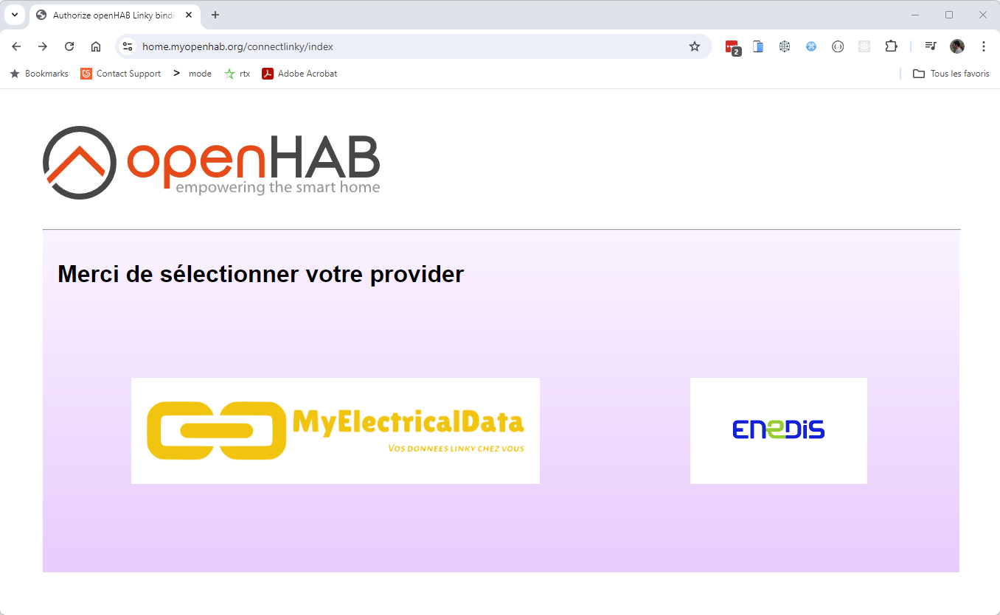
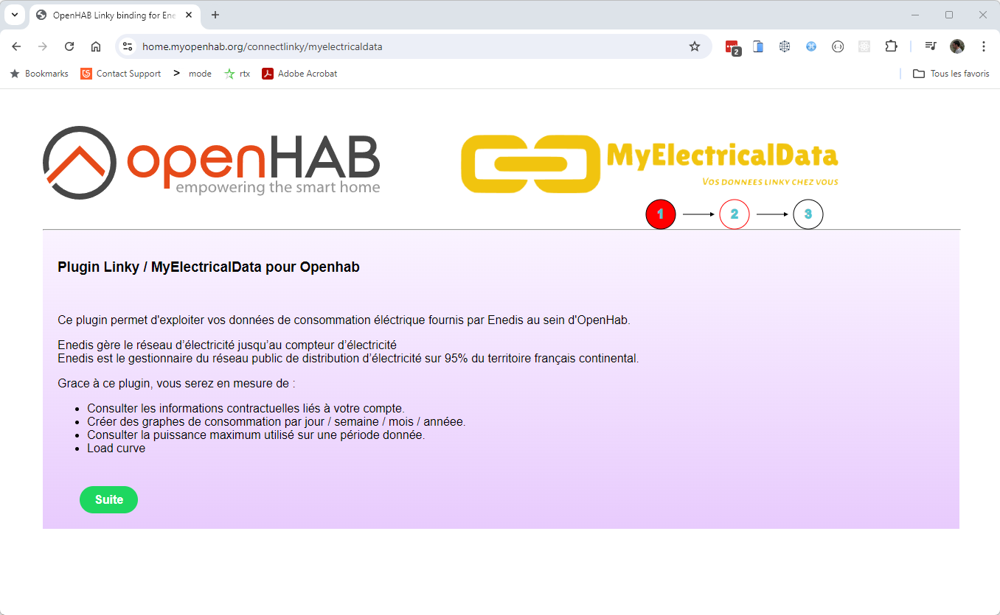
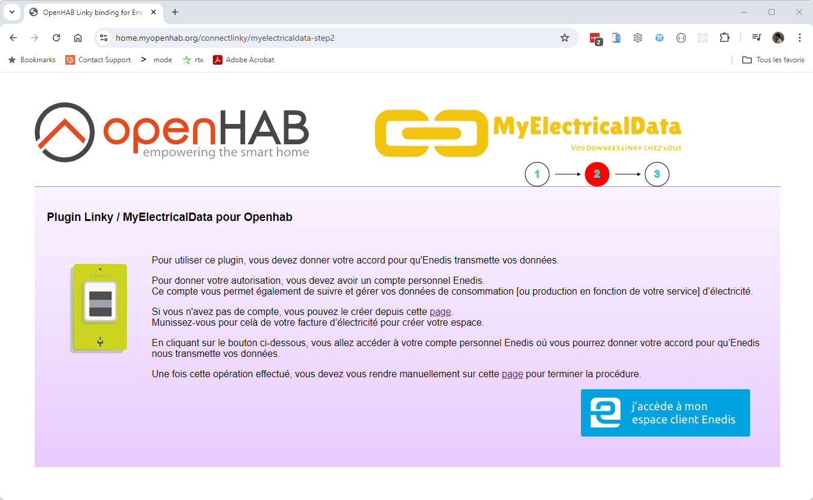
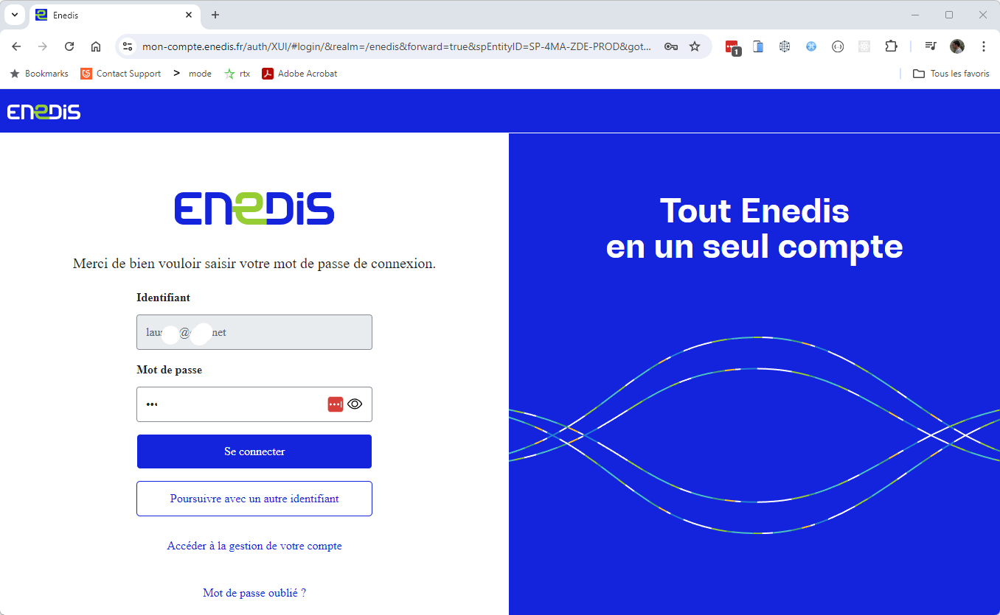
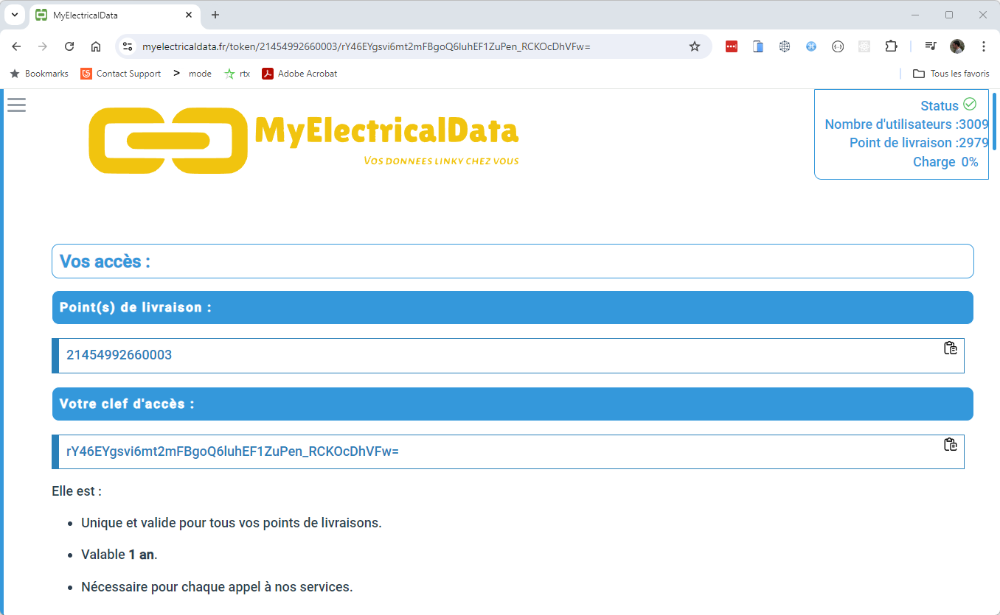
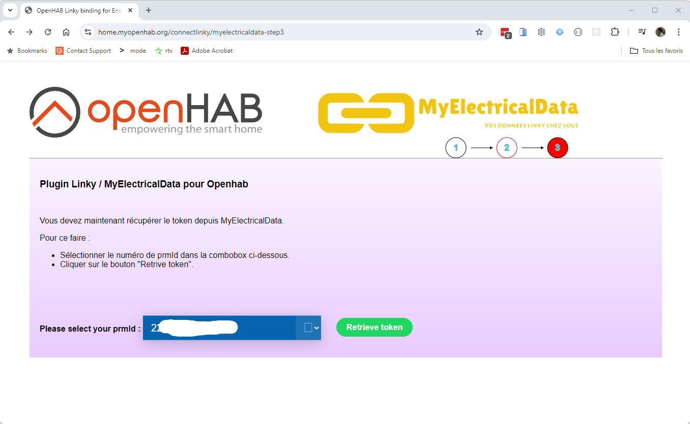
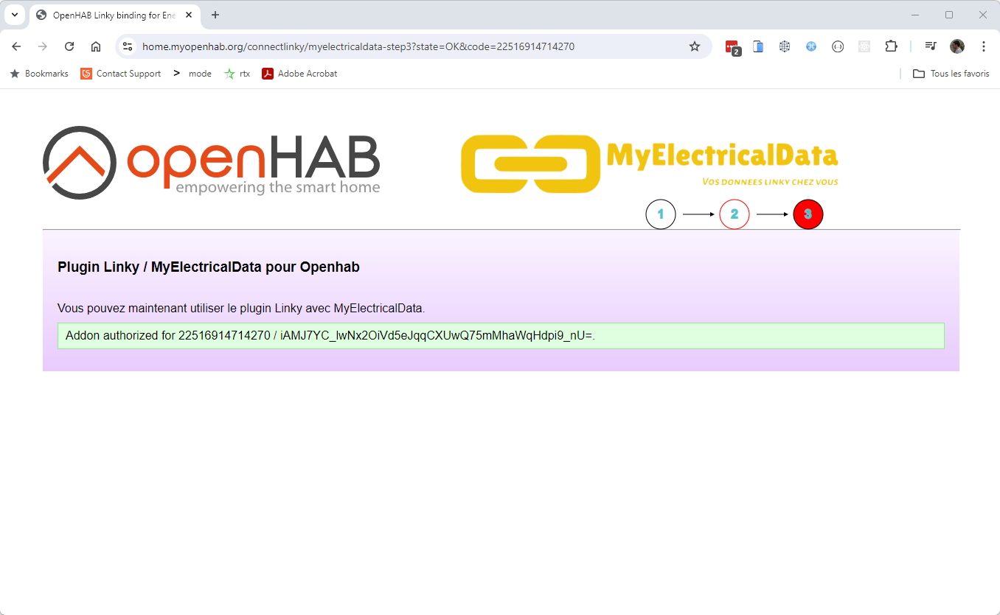
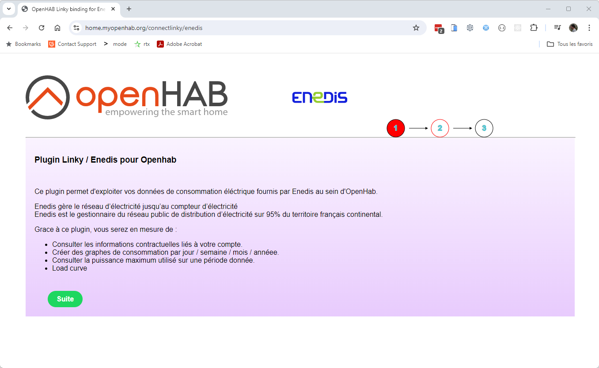
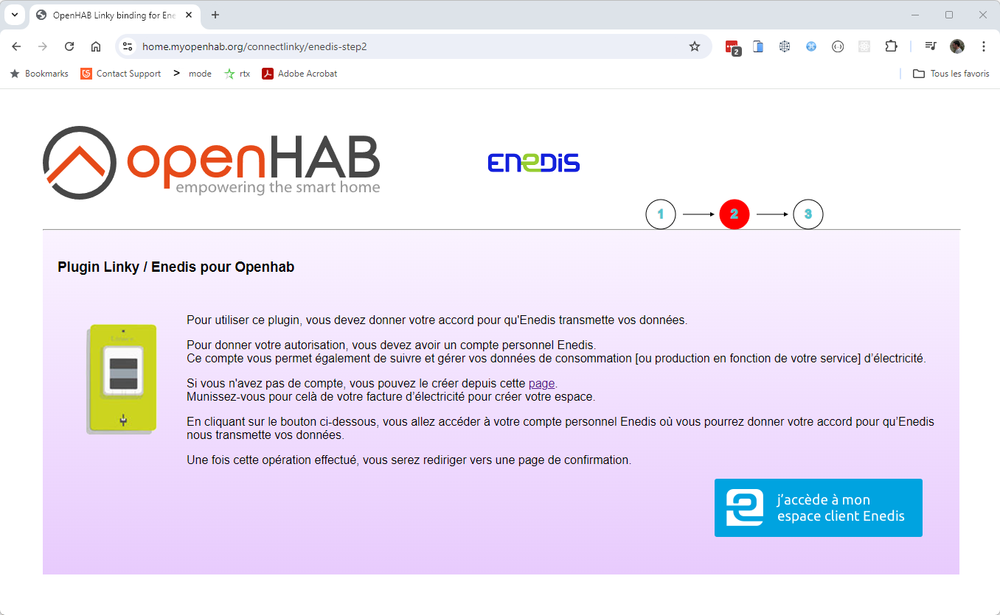
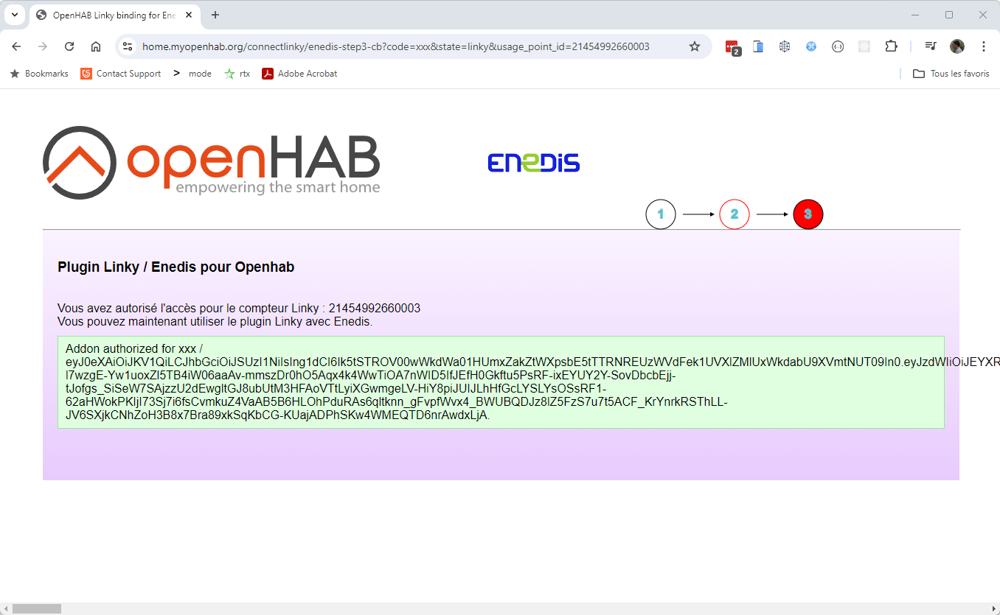

# Linky Binding

This binding uses the API provided by Enedis to retrieve your energy consumption data.
You need to create an Enedis account [here](https://mon-compte-client.enedis.fr/) if you don't have one already.

Please ensure that you have accepted their conditions, and check that you can see graphs on the website.
Especially, check hourly view/graph. Enedis may ask for permission the first time to start collecting hourly data.

The binding will not provide these informations unless this step is ok.

This new binding version is able to use multiple bridge to access the consumption data.
You can use :

- The enedis-web bridge : this one will use the old Enedis API, base on the enedis web site to gather the data.
- The myelectricaldata bridge : this one will use the new Rest Enedis API. We will use the MyElectricalData proxy site to access the data.
- The enedis bridge : this one will also use the new Rest Enedis API, and will directly gather data from Enedis Site.

There is advantage and disadvantage for each method.

-  enedis-web bridge is the old way to go.

## Supported Things

There is one supported thing : the `linky` thing is retrieving the consumption of your home from the [Linky electric meter](https://www.enedis.fr/linky-compteur-communicant).

You can have multiple linky thing in your setup if you have different house / linky linked to your account.


## Discovery

This binding does not provide discovery service.

## Binding Configuration

To retrieve data, Linky thing will be need to be linked to a LinkyBridge. LinkyBridge can be today select between enedis-web, myelectricaldata and enedis.

### enedis-web bridge
If you select enedis-web bridge, you will need :

- To create an Enedis account : https://mon-compte-client.enedis.fr/
- To fill the bridge with you information : username, password, and also InternalAuthId.

      | Parameter      | Description                    |
      |----------------|--------------------------------|
      | username       | Your Enedis platform username. |
      | password       | Your Enedis platform password. |
      | internalAuthId | The internal authID            |

    This version is now compatible with the new version of Enedis WEB API (deployed from june 2020).
    To avoid the captcha login, it is necessary to log before on a classical browser (e.g Chrome, Firefox) and to retrieve the user cookies (internalAuthId).

    Instructions given for Firefox :

    1. Go to <https://mon-compte-client.enedis.fr/>.
    1. Select "Particulier" in the drop down list and click on the "Connexion" button.
    1. You'll be redirected to a page where you'll have to enter you Enedis account email address and check the "Je ne suis pas un robot" checkbox.
    1. Clic on "Suivant".
    1. In the login page, prefilled with your mail address, enter your Enedis account password and click on "Connexion à Espace Client Enedis".
    1. You will be directed to your Enedis account environment. Get back to previous page in you browser.
    1. Disconnect from your Enedis account
    1. Repeat steps 1, 2. You should arrive directly on step 5, then open the developer tool window (F12) and select "Stockage" tab. In the "Cookies" entry, select "https://mon-compte-enedis.fr". You'll find an entry named "internalAuthId", copy this value in your openHAB configuration.


### myelectricaldata bridge

If you select MyElectricalData bridge, you will need :

- To create an Enedis account : https://mon-compte-client.enedis.fr/

Follow these steps to initialize the token. You can access the procedure from the connectlinky page available from your openhab: https://home.myopenhab.org/connectlinky/index.

- to select your provider 

  
<br/>

- To follow the two first step wizard, and click on the "access Enedis" button

  <br/>
  <br/>

- To login to your Enedis Account

  <br/>

- To authorize data collection for your prmId. <br>

If you have multiple linky on your account like me, you will have to repeat the procedure for each linky.
Don't select the two linky in the same procedure, it will not work !

  <br/>

- You will then be redirect to a confirmation page on MyElectricalData web site

  <br/>

- Go back to your openhab with step3 : "connectlinky/myelectricaldata-step3", then select your prmId in combobox, and click "Retrieve Token"

  <br/>

- Last, you will see this confirmation page if everything is everything is ok

  <br/>


If you select enedis bridge, you will need :
- To create an Enedis account : https://mon-compte-client.enedis.fr/

Follow these steps to initialize the token. you can access the procedure from the connectlinky page available from your openhab: https://home.myopenhab.org/connectlinky/index.

- to select your provider 

  <br/>

- To follow the two first step wizard, and click on the "access Enedis" button

  <br/>
  <br/>

- To login to your Enedis Account

  <br/>

- To authorize data collection for your prmId. <br>

If you have multiple linky on your account like me, you will have to repeat the procedure for each linky.
Don't select the two linky in the same procedure, it will not work !

  <br/>

- Last, you will see this confirmation page if everything is everything is ok

  <br/>


## Thing Configuration

The thing has the following configuration parameters:

| Parameter      | Description                                                                                 |
|----------------|---------------------------------------------------------------------------------------------|
| prmId          | The prmId link to the linky Handler.                                                        |
| token          | Optional : need if a token necessary to access this Linky thing (use for MyElectricaldata)  |


## Channels

The information that is retrieved is available as many different groups.

- The Main group will give information about the contract linked to this linky.

You will find the following channel:

| Channel ID                                        | Item Type      | Description                                   |
|---------------------------------------------------|----------------|-----------------------------------------------|
| main#identitiy                                    | String         | The full name of the contract older           |
| main#contractSubscribedPower                      | String         | The subscribed max Power                      |
| main#contractLastActivationDate                   | String         |                                               |
| main#contractDistributionTariff                   | String         |                                               |
| main#contractOffpeakHours                         | String         | The OffPeakHour link to your contract         |
| main#contractLastDistributionTariffChangeDate     | String         |                                               |
| main#contractSegment                              | String         |                                               |
| main#usagePointId                                 | String         |                                               |
| main#usagePointStatus                             | String         |                                               |
| main#usagePointMeterType                          | String         |                                               |
| main#usagePointAddressCity                        | String         |                                               |
| main#usagePointAddressCountry                     | String         |                                               |
| main#usagePointAddressInseeCode                   | String         |                                               |
| main#usagePointAddressPostalCode                  | String         |                                               |
| main#usagePointAddressStreet                      | String         |                                               |
| main#contactMail                                  | String         |                                               |
| main#contactPhone                                 | String         |                                               |


- The tempo group will give information about the tempo day color link to a tempo contract

| Channel ID                                        | Item Type      | Description                                                                |
|---------------------------------------------------|----------------|----------------------------------------------------------------------------|
| tempo#tempoInfoToday                              | String         | The tempo color for the current day                                        |
| tempo#tempoInfoTomorrow                           | String         | The tempo color for the tomorrow                                           |
| tempo#tempoInfoTimeSeries                         | String         | A timeseries channel that will expose full tempo information for one year  |


Using the timeseries channel, you will be able to esealy create a calendar graph to show the tempo calendar.
You will need for this to enable a timeseries persistence framework.
Graph definitions will look like this

```java
config:
  chartType: month
  future: false
  label: Tempo
  period: M
  sidebar: true
slots:
  calendar:
    - component: oh-calendar-axis
      config:
        cellSize: 10
        dayLabel:
          firstDay: 1
          fontSize: 16
          margin: 20
        left: center
        monthLabel:
          color: "#c0c0ff"
          fontSize: 30
          margin: 20
        orient: vertical
        top: middle
        yearLabel:
          color: "#c0c0ff"
          fontSize: 30
          margin: 50
  dataZoom:
    - component: oh-chart-datazoom
      config:
        orient: horizontal
        show: true
        type: slider
  grid: []
  legend:
    - component: oh-chart-legend
      config:
        show: false
  series:
    - component: oh-calendar-series
      config:
        aggregationFunction: average
        calendarIndex: 0
        coordinateSystem: calendar
        item: Linky_Melody_Tempo
        label:
          formatter: =v=> JSON.stringify(v.data[0]).substring(1,11)
          show: true
          smartFormatter: false
        name: Series 1
        service: inmemory
        type: heatmap
  title:
    - component: oh-chart-title
      config:
        show: true
        text: Calendrier Tempo
  toolbox:
    - component: oh-chart-toolbox
      config:
        presetFeatures:
          - saveAsImage
          - restore
          - dataView
          - dataZoom
          - magicType
        show: true
  tooltip:
    - component: oh-chart-tooltip
      config:
        formatter: "{c}"
        show: true
  visualMap:
    - component: oh-chart-visualmap
      config:
        bottom: 0
        calculable: true
        inRange:
          color:
            - "#0000ff"
            - "#ffffff"
            - "#ff0000"
        left: center
        max: 2
        min: 0
        orient: horizontal
        presetPalette: ""
        show: false
        type: continuous
  xAxis: []
  yAxis: []

```

The resulting graph will look like this:


| Channel ID            | Item Type     | Description                           |
|-----------------------|---------------|---------------------------------------|
| daily#yesterday       | Number:Energy | Yesterday energy usage                |
| daily#day-2           | Number:Energy | Day-2 energy usage                    |
| daily#day-3           | Number:Energy | Day-3 energy usage                    |
| daily#consumption     | Number:Energy | timeseries for consumption            |
| daily#power           | Number:Power  | Yesterday's peak power usage          |
| daily#timestamp       | DateTime      | Timestamp of the power peak           |
| daily#power-2         | Number:Power  | Day-2's peak power usage              |
| daily#timestamp-2     | DateTime      | Timestamp Day-2's of the power peak   |
| daily#power-3         | Number:Power  | Day-3's peak power usage              |
| daily#timestamp-3     | DateTime      | Timestamp Day-3's  of the power peak  |
| daily#mawPower        | Number:Power  | timeseries for maxPower               |


| Channel ID            | Item Type     | Description                  |
|-----------------------|---------------|------------------------------|
| weekly#thisWeek       | Number:Energy | Current week energy usage    |
| weekly#lastWeek       | Number:Energy | Last week energy usage       |
| weekly#week-2         | Number:Energy | Last week energy usage       |
| weekly#consumption    | Number:Energy | Last week energy usage       |
| weekly#maxPower       | Number:Energy | Last week energy usage       |


| Channel ID            | Item Type     | Description                  |
|-----------------------|---------------|------------------------------|
| monthly#thisMonth     | Number:Energy | Current month energy usage   |
| monthly#lastMonth     | Number:Energy | Last month energy usage      |
| monthly#month-2       | Number:Energy | Last month energy usage      |
| monthly#consumption   | Number:Energy | Last month energy usage      |
| monthly#maxPower      | Number:Energy | Last month energy usage      |

| Channel ID            | Item Type     | Description                  |
|-----------------------|---------------|------------------------------|
| yearly#thisYear       | Number:Energy | Current year energy usage    |
| yearly#lastYear       | Number:Energy | Last year energy usage       |
| yearly#year-2         | Number:Energy | year-2 energy usage          |
| yearly#consumption    | Number:Energy | Last year energy usage       |
| yearly#maxPower       | Number:Energy | Last year energy usage       |


## Console Commands

The binding provides one specific command you can use in the console.
Enter the command `openhab:linky` to get the usage.

```shell
openhab:linky <thingUID> report <start day> <end day> [<separator>] - report daily consumptions between two dates
```

The command `report` reports in the console the daily consumptions between two dates.
If no dates are provided, the last 7 are considered by default.
Start and end day are formatted yyyy-mm-dd.

Here is an example of command you can run: `openhab:linky linky:linky:local report 2020-11-15 2020-12-15`.

## Docker specificities

In case you are running openHAB inside Docker, the binding will work only if you set the environment variable `CRYPTO_POLICY` to the value "unlimited" as documented [here](https://github.com/openhab/openhab-docker#java-cryptographic-strength-policy).

## Full Example

### Thing

```java
Thing linky:linky:local "Compteur Linky" [ username="example@domaine.fr", password="******", internalAuthId="******" ]
```

### Items

```java
Number:Energy ConsoHier "Conso hier [%.0f %unit%]" <energy> { channel="linky:linky:local:daily#yesterday" }
Number:Energy ConsoSemaineEnCours "Conso cette semaine [%.0f %unit%]" <energy> { channel="linky:linky:local:weekly#thisWeek" }
Number:Energy ConsoSemaineDerniere "Conso semaine dernière [%.0f %unit%]" <energy> { channel="linky:linky:local:weekly#lastWeek" }
Number:Energy ConsoMoisEnCours "Conso ce mois [%.0f %unit%]" <energy> { channel="linky:linky:local:monthly#thisMonth" }
Number:Energy ConsoMoisDernier "Conso mois dernier [%.0f %unit%]" <energy> { channel="linky:linky:local:monthly#lastMonth" }
Number:Energy ConsoAnneeEnCours "Conso cette année [%.0f %unit%]" <energy> { channel="linky:linky:local:yearly#thisYear" }
Number:Energy ConsoAnneeDerniere "Conso année dernière [%.0f %unit%]" <energy> { channel="linky:linky:local:yearly#lastYear" }
```
