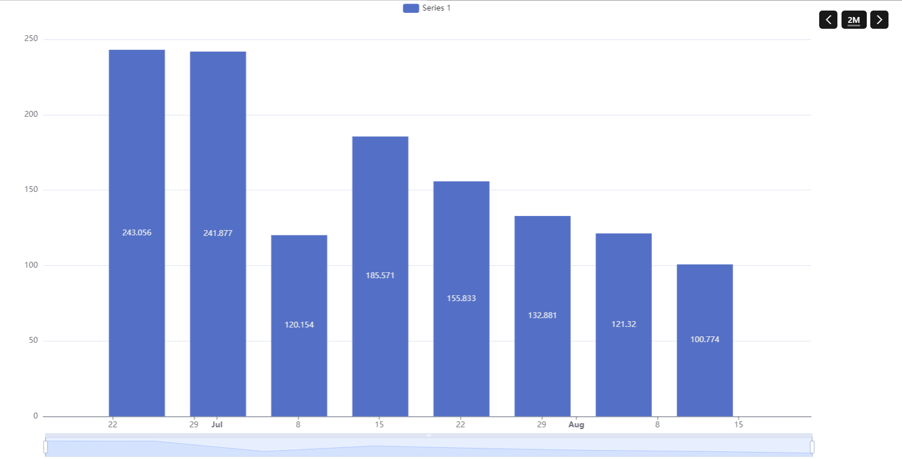
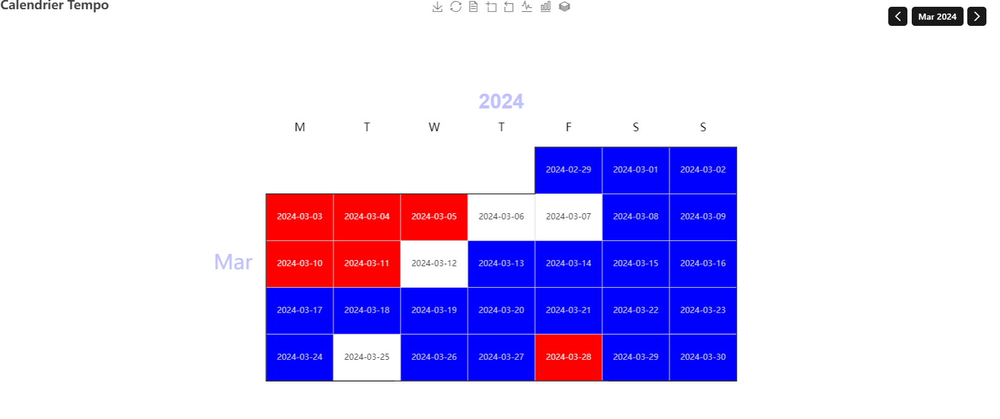

# Linky Binding

This binding enables the exploitation of electricity consumption data, mainly for the French market.
It supports different functionalities:

- Connection to Enedis to retrieve consumption data online.
- Connection to the RTE API to get Tempo Red/White/Blue calendar information.

## Migration

The new binding (as of openHAB 5.0.0) will need some tweaks to your configuration to work.
Mainly the new binding uses Bridge to access Enedis data, so you will have to add this bridge to your configuration.
Step are:

1. before updating to openHAB 5.0, in case you defined your thing with Main UI, backup username, password & internalAuthId configuration parameters as you will need to fill them again.
1. add a bridge definition

    ``` java
    Bridge linky:enedis:local "EnedisWebBridge" [
        username="laurent@clae.net",
        password="Mnbo32tyu123!",
        internalAuthId="eyJhbGciOiJBMTI4S1ciLCJlbmMiOiJBMTI4Q0JDLUhTMjU2In0.u_mxXO7_d4I5bLvJzGtc2MARvpkYv0iM0EsO6a24k-tW9493_Myxwg.LVlfephhGTiCBxii8bRIkA.GOf9Ea8PTGshvkfjl62b6w.hSH97IkmBcEAz2udU-FqQg"] {
       }
    ```

1. Move username, password and internalAuthId configuration parameters from the old linky thing to the bridge thing.
1. Link your old thing to the new created bridge thing:

     ```java
     Thing linky:linky:linkremotemelody "Linky Melody" (linky:enedis:local)
     ```

1. Start using the new channels added by the enhanced binding..
   Old items will work out of the box without the need to relink items to channels.

## Getting Consumption Data Online

The new binding version can use multiple bridges to access consumption data.
You can use :

- The enedis bridge: Uses the old Enedis API, based on the Enedis website, to gather data.
- The myelectricaldata bridge: Uses the new REST Enedis API via the MyElectricalData proxy site to access the data.
- The enedis-api bridge: Also uses the new REST Enedis API, but gathers data directly from the Enedis site.

You first need to create an account at [the Enedis website](https://mon-compte-client.enedis.fr/) if you don't already have one.
Ensure that you have accepted their conditions and check that you can see graphs on the website, especially the hourly view.
 Enedis may require your permission the first time to start collecting hourly data.

The binding will not provide this information unless this step is completed.

Advantage and Disadvantage of Each Method.

- Enedis bridge is the older method.
- MyelectricalData and enedis bridges both use the new API format, making them less prone to changes in website architecture.
- MyelectricalData bridge is managed by a third-party provider but is stable.
- Enedis-api bridge directly connects to Enedis but currently requires a complex registration process with Enedis.
  This limitation will likely be resolved in the near future, making Enedis-api Bridge the preferred method.
  
Be warned that MyElectricalData bridge collect data using MyElectricalData service.
This service will store your enedis information for caching purpose.
This cache is crypted, so it may be a very big concerns, but of course, we don't know the details about this crypting, and if it can be reverse to access your data.

### Bridge Configuration

To retrieve data, the Linky device needs to be linked to a LinkyBridge. The available bridge options are enedis, myelectricaldata, and enedis-api.

#### Enedis Web Bridge

If you select enedis web bridge, you will need:

- To create an Enedis account: <https://mon-compte-client.enedis.fr/>
- To provide your credentials: username, password, and InternalAuthId.

    | Parameter      | Description                     |
    |----------------|---------------------------------|
    | username       | Your Enedis platform username.  |
    | password       | Your Enedis platform password.  |
    | internalAuthId | The internal authentication ID. |

    This version is compatible with the latest Enedis Web API (deployed from June 2020). To bypass the captcha login, log in via a standard browser (e.g., Chrome, Firefox) and retrieve the user cookies (internalAuthId).

    Instructions for Firefox :

    1. Go to <https://mon-compte-client.enedis.fr/>.
    1. Select "Particulier" from the drop down and click "Connexion".
    1. Enter your Enedis account email and check "Je ne suis pas un robot".
    1. Click "Suivant".
    1. Enter your Enedis password and click "Connexion à Espace Client Enedis".
    1. Navigate to your Enedis account environment, then return to the previous page in your browser.
    1. Log out from your Enedis account.
    1. Repeat steps 1-2. This time, open the developer tools window (F12) and select the "Storage" tab.
    1. Under "Cookies", select `https://mon-compte-client.enedis.fr/`. Locate the "internalAuthId" entry and copy its value into your OpenHAB configuration.

    A new timezone parameter has been introduced. If you don't put a value, it will default to the timezone of your openHAB installation.
    This parameter can be useful if you read data from a Linky in a different timezone.

    ```java
    Bridge linky:enedis:local "EnedisWebBridge" [ username="example@domaine.fr", password="******", internalAuthId="******" ]
    ```

#### Myelectricaldata Bridge

If you select MyElectricalData bridge, you will need :

- To create an Enedis account: <https://mon-compte-client.enedis.fr/>
- To follow these steps to initialize the token:
  
  You can access the procedure from the connectlinky page available from your openHAB: <https://home.myopenhab.org/connectlinky/index>.

  You will find screenshot of the procedure in the following directory
  [doc/myelectricaldata/](doc/myelectricaldata/index.md)

  1. Go to the connectlinky page on OpenHAB.
  1. Follow the first two steps of the wizard and click "Access Enedis".
  1. Log into your Enedis account.
  1. Authorize data collection for your PRM ID.
     If you have multiple Linky meters, repeat the procedure for each one separately; selecting multiple meters at once will not work.
  1. You will then be redirect to a confirmation page on MyElectricalData web site
  1. Return to OpenHAB, go to "connectlinky/myelectricaldata-step3", select your PRM ID from the dropdown, and click "Retrieve Token".
  1. A confirmation page will appear if everything is correctly set up.

    ```java
    Bridge linky:my-electrical-data:local "MyElectricalBridge" [  ]
    ```

#### Enedis Bridge

If you select enedis bridge, you will need:

- To create an Enedis account: <https://mon-compte-client.enedis.fr/>
- Follow these steps to initialize the token.
  You can access the procedure from the connectlinky page available from your openHAB: <https://home.myopenhab.org/connectlinky/index>.

    You will find a screenshot of the procedure in the following directory
    [doc/enedis/](doc/enedis/index.md)

    1. Go to the connectlinky page on OpenHAB.
    1. Follow the first two steps of the wizard and click "Access Enedis".
    1. Log into your Enedis account.
    1. Authorize data collection for your PRM ID.
    1. A confirmation page will appear if everything is correctly set up.

    ```java
    Bridge linky:enedis-api:localSB "EnedisBridgeSandbox" [  clientId="myClientId...", clientSecret="myClientSecret..."]  
    ```

### Thing Configuration  

The remote bridge works with Linky devices to retrieve consumption data from a remote API or website.

You can have multiple Linky devices in your setup if you have different houses or multiple Linky meters linked to your account.
To do this, simply create multiple Linky devices and set the prmId to match your meter ID.
You can find the meter ID on the Enedis website or directly on your Linky meter.

You can switch the Linky device from one bridge to another if you experience issues with a particular bridge.
The data retrieved will be almost identical regardless of the bridge you use.
Only a few contract-related items may differ between the web bridge and the API bridge.

The device has the following configuration parameters:

  | Parameter | Description                                                                                         |
  |-----------|-----------------------------------------------------------------------------------------------------|
  | prmId     | The prmId linked to the Linky Handler (optional: if blank first registered meter will be used       |
  | timezone  | The timezone associated with your Point of delivery                                                 |
  | token     | Optional: Required if a token is necessary to access this Linky device (used for MyElectricalData). |

```java
Thing linky:linky:linkyremote "Linky Remote" (linky:enedis:local) [ ]
Thing linky:linky:linkyremotexxxx "Linky Remote xxxx" (linky:enedis:local) [ prmId="xxxx" ]
Thing linky:linky:linkyremotexxxx "Linky Remote xxxx" (linky:enedis-api:local) [ prmId="xxxx" ]
Thing linky:linky:linkyremotexxxx "Linky Remote xxxx" (linky:myelectricaldata:local) [ prmId="xxxx", token="myElectricalDataToken" ]
```

### Thing Channels

The retrieved information is available in multiple groups.

- The daily group will give consumtion information with day granularity

  | Channel ID        | Item Type   | Description                                                                 |
  |-------------------|-------------|-----------------------------------------------------------------------------|
  | daily#yesterday   | consumption | Yesterday energy usage                                                      |
  | daily#day-2       | consumption | Day-2 energy usage                                                          |
  | daily#day-3       | consumption | Day-3 energy usage                                                          |
  | daily#consumption | consumption | timeseries for energy usage  (up to three years will be store if available) |
  | daily#maw-power   | power       | timeseries for max-power usage                                              |
  | daily#power       | power       | Yesterday's peak power usage                                                |
  | daily#timestamp   | timestamp   | Timestamp of the power peak                                                 |
  | daily#power-2     | power       | Day-2's peak power usage                                                    |
  | daily#timestamp-2 | timestamp   | Timestamp Day-2's of the power peak                                         |
  | daily#power-3     | power       | Day-3's peak power usage                                                    |
  | daily#timestamp-3 | timestamp   | Timestamp Day-3's  of the power peak                                        |

- The weekly group will give consumtion information with week granularity

  | Channel ID         | Item Type   | Description                           |
  |--------------------|-------------|---------------------------------------|
  | weekly#thisWeek    | consumption | Current week energy usage             |
  | weekly#lastWeek    | consumption | Last week energy usage                |
  | weekly#week-2      | consumption | Week -2 energy usage                  |
  | weekly#consumption | consumption | timeseries for weeks energy usage     |
  | weekly#max-power   | power       | timeseries for max-power weekly usage |

- The monthly group will give consumtion information with month granularity

  | Channel ID          | Item Type   | Description                            |
  |---------------------|-------------|----------------------------------------|
  | monthly#thisMonth   | consumption | Current month energy usage             |
  | monthly#lastMonth   | consumption | Last month energy usage                |
  | monthly#month-2     | consumption | Month-2 energy usage                   |
  | monthly#consumption | consumption | timeseries for months energy usage     |
  | monthly#max-power   | power       | timeseries for max-power monthly usage |

- The yearly group will give consumtion information with year granularity

  | Channel ID         | Item Type   | Description                           |
  |--------------------|-------------|---------------------------------------|
  | yearly#thisYear    | consumption | Current year energy usage             |
  | yearly#lastYear    | consumption | Last year energy usage                |
  | yearly#year-2      | consumption | year-2 energy usage                   |
  | yearly#consumption | consumption | timeseries for years energy usage     |
  | yearly#max-power   | power       | timeseries for max-power yearly usage |

- The load-curve group will give you access to load curve data with granularity as low as 30mn

  | Channel ID       | Item Type | Description         |
  |------------------|-----------|---------------------|
  | load-curve#power | power     | The load curve data |

- You will also find some Information as properties on the linky things

  | Channel ID                               | Description                                     |
  |------------------------------------------|-------------------------------------------------|
  | identitiy                                | The full name of the contract older             |
  | customerId                               | The internal Enedis customer ID                 |
  | contractSubscribedPower                  | The subscribed max Power                        |
  | contractLastActivationdate               | The contract activation date                    |
  | contractDistributionTariff               | The current applied tarif                       |
  | contractOffpeakHours                     | The OffPeakHour link to your contract           |
  | contractStatus                           | The current contract status                     |
  | contractType                             | The contract type                               |
  | contractLastdistributionTariffChangedate | The date of the last tariff change              |
  | contractSegment                          | The customer segment for this contract          |
  | usagePointId                             | The distribution / usage point uniq indentifier |
  | usagePointStatus                         | The usage point current state                   |
  | usagePointMeterType                      | The usage point meter type                      |
  | usagePointCity                           | The usage point City                            |
  | usagePointCountry                        | The usage point Country                         |
  | usagePointPostalCode                     | The usage point Postal Code                     |
  | usagePointStreet                         | The usage point Address Street                  |
  | contactMail                              | The usage point Contact Mail                    |
  | contactPhone                             | The usage point Contact Phone                   |
  
### Full Example

#### Remote Enedis Web Connection

```java
Bridge linky:enedis:local "EnedisWebBridge" [ username="example@domaine.fr", password="******", internalAuthId="******" ]

Thing linky:linky:linkyremotexxxx "Linky Remote xxxx" (linky:enedis:local) [ prmId="xxxx" ]
```

```java
Number:Energy ConsoHier "Conso hier [%.0f %unit%]" <energy> { channel="linky:linky:linkyremotexxxx:daily#yesterday" }
Number:Energy ConsoSemaineEnCours "Conso cette semaine [%.0f %unit%]" <energy> { channel="linky:linky:linkyremotexxxx:weekly#thisWeek" }
Number:Energy ConsoSemaineDerniere "Conso semaine dernière [%.0f %unit%]" <energy> { channel="linky:linky:linkyremotexxxx:weekly#lastWeek" }
Number:Energy ConsoMoisEnCours "Conso ce mois [%.0f %unit%]" <energy> { channel="linky:linky:linkyremotexxxx:monthly#thisMonth" }
Number:Energy ConsoMoisDernier "Conso mois dernier [%.0f %unit%]" <energy> { channel="linky:linky:linkyremotexxxx:monthly#lastMonth" }
Number:Energy ConsoAnneeEnCours "Conso cette année [%.0f %unit%]" <energy> { channel="linky:linky:linkyremotexxxx:yearly#thisYear" }
Number:Energy ConsoAnneeDerniere "Conso année dernière [%.0f %unit%]" <energy> { channel="linky:linky:linkyremotexxxx:yearly#lastYear" }
```

### Displaying Information Graph

Using the timeseries channel, you will be able to easily create a calendar graph to display the Tempo calendar.
To do this, you need to enable a timeseries persistence framework.
Graph definitions will look like this:



Sample code:

```java
config:
  future: false
  label: Linky Melody Conso Journalière
  order: "110"
  period: 2W
  sidebar: true
slots:
  dataZoom:
    - component: oh-chart-datazoom
      config:
        type: inside
  grid:
    - component: oh-chart-grid
      config:
        containLabel: true
        includeLabels: true
        show: true
  legend:
    - component: oh-chart-legend
      config:
        bottom: 3
        type: scroll
  series:
    - component: oh-time-series
      config:
        areaStyle:
          opacity: 0.2
        gridIndex: 0
        item: Linky_Melody_Daily_Conso_Day
        label:
          formatter: =v=>Number.parseFloat(v.data[1]).toFixed(2) + " Kwh"
          position: inside
          show: true
        markLine:
          data:
            - type: average
        markPoint:
          data:
            - name: min
              type: min
            - name: max
              type: max
          label:
            backgroundColor: auto
        name: Consumption
        noBoundary: true
        noItemState: true
        service: influxdb
        type: bar
        xAxisIndex: 0
        yAxisIndex: 0
  tooltip:
    - component: oh-chart-tooltip
      config:
        confine: true
        smartFormatter: true
  xAxis:
    - component: oh-time-axis
      config:
        gridIndex: 0
        nameLocation: center
        splitNumber: 10
  yAxis:
    - component: oh-value-axis
      config:
        gridIndex: 0
        max: "150"
        min: "0"
        name: kWh
        nameLocation: center
```

## Getting Tempo Calendar Information

### Tempo Thing Channels

- The tempo group will give information about the tempo day color link to a tempo contract

  | Channel ID                                                     | Item Type         | Description                                                                   |
  |----------------------------------------------------------------|-------------------|-------------------------------------------------------------------------------|
  | linky-tempo-calendar#tempo-info-today                          | tempo-value       | The tempo color for the current day                                           |
  | linky-tempo-calendar#tempo-info-tomorrow                       | tempo-value       | The tempo color for the tomorrow                                              |
  | linky-tempo-calendar#tempo-info-timeseries                     | tempo-value       | A timeseries channel that will expose full tempo information for one year     |

### Displaying Tempo Graph

Using the timeseries channel, you will be able to esealy create a calendar graph to show the tempo calendar.
You will need for this to enable a timeseries persistence framework.
Graph definitions will look like this

The resulting graph will look like this:



Sample code:

```java
config:
  chartType: month
  future: false
  label: Tempo
  period: M
  sidebar: true
slots:
  calendar:
    - component: oh-calendar-axis
      config:
        cellSize: 10
        dayLabel:
          firstDay: 1
          fontSize: 16
          margin: 20
        left: center
        monthLabel:
          color: "#c0c0ff"
          fontSize: 30
          margin: 20
        orient: vertical
        top: middle
        yearLabel:
          color: "#c0c0ff"
          fontSize: 30
          margin: 50
  dataZoom:
    - component: oh-chart-datazoom
      config:
        orient: horizontal
        show: true
        type: slider
  grid: []
  legend:
    - component: oh-chart-legend
      config:
        show: false
  series:
    - component: oh-calendar-series
      config:
        aggregationFunction: average
        calendarIndex: 0
        coordinateSystem: calendar
        item: Linky_Melody_Tempo
        label:
          formatter: =v=> JSON.stringify(v.data[0]).substring(1,11)
          show: true
          smartFormatter: false
        name: Series 1
        service: inmemory
        type: heatmap
  title:
    - component: oh-chart-title
      config:
        show: true
        text: Calendrier Tempo
  toolbox:
    - component: oh-chart-toolbox
      config:
        presetFeatures:
          - saveAsImage
          - restore
          - dataView
          - dataZoom
          - magicType
        show: true
  tooltip:
    - component: oh-chart-tooltip
      config:
        formatter: "{c}"
        show: true
  visualMap:
    - component: oh-chart-visualmap
      config:
        bottom: 0
        calculable: true
        inRange:
          color:
            - "#0000ff"
            - "#ffffff"
            - "#ff0000"
        left: center
        max: 2
        min: 0
        orient: horizontal
        presetPalette: ""
        show: false
        type: continuous
  xAxis: []
  yAxis: []

```

## Console Commands

The binding provides one specific command you can use in the console.
Enter the command `openhab:linky` to get the usage.

```shell
openhab:linky <thingUID> report <start day> <end day> [<separator>] - report daily consumptions between two dates
```

The command `report` reports in the console the daily consumptions between two dates.
If no dates are provided, the last 7 are considered by default.
Start and end day are formatted yyyy-mm-dd.

Here is an example of command you can run: `openhab:linky linky:linky:local report 2020-11-15 2020-12-15`.

## Docker Specifics

In case you are running openHAB inside Docker, the binding will work only if you set the environment variable `CRYPTO_POLICY` to the value "unlimited", read [the documentation](https://github.com/openhab/openhab-docker#java-cryptographic-strength-policy) for details.
