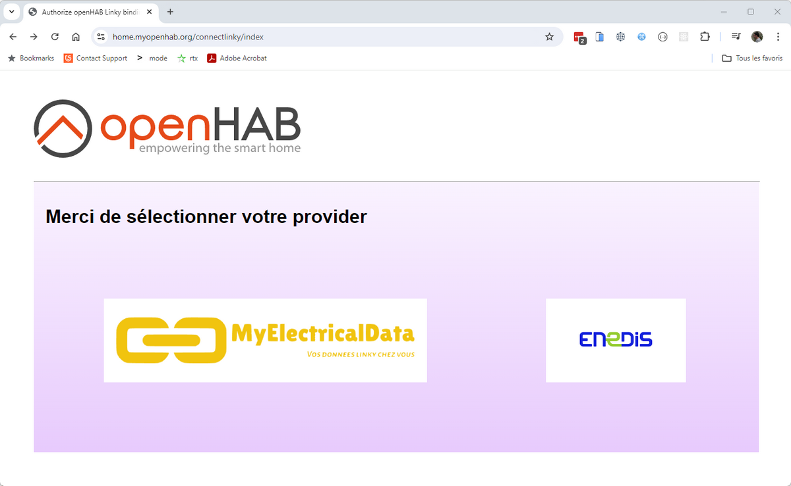

# Linky Binding

This binding enable to exploit data about electricity consumption, mainly for French market.
It supports differents kinds of functionnality:

- Connection to Enedis to retrieve consumption data inline.
- Direction connection to Electricity Meter like Linky Meter to exploit realtime data.
- Connection to data.gouv.fr api to get regulated electricity price.
- Connection to RTE api to get Tempo Red/White/Blue calendar information.

## Getting consumption data online

The new binding version is able to use multiple bridge to access the consumption data.
You can use :

- The enedis-web bridge : this one will use the old Enedis API, base on the enedis web site to gather the data.
- The myelectricaldata bridge : this one will use the new Rest Enedis API. We will use the MyElectricalData proxy site to access the data.
- The enedis bridge : this one will also use the new Rest Enedis API, and will directly gather data from Enedis Site.

You first need to create an Enedis account [here](https://mon-compte-client.enedis.fr/) if you don't have one already.
 Please ensure that you have accepted their conditions, and check that you can see graphs on the website.
Especially, check hourly view/graph. Enedis may ask for permission the first time to start collecting hourly data.

The binding will not provide these informations unless this step is ok.

Advantage and disadvantage of each method.

- Enedis-web bridge is the old way to go.
- MyelectricalData and enedis bridge both use new API format, less prone to change of the web site architecture.
- MyelectricalData bridge is handle by third party provider, but is stable.
- Enedis bridge use direct connection to Enedis, but currently required complex registration step with Enedis.
  this limitation would certainly go away in near feature, that will make Enedis Bridge the preffered way to go sometime in near future.

### Bridge Configuration

To retrieve data, Linky thing will be need to be linked to a LinkyBridge. LinkyBridge can be today select between enedis-web, myelectricaldata and enedis.

#### Enedis-web bridge

If you select enedis-web bridge, you will need :

- To create an Enedis account : https://mon-compte-client.enedis.fr/
- To fill the bridge with you information : username, password, and also InternalAuthId.

      | Parameter      | Description                    |
      |----------------|--------------------------------|
      | username       | Your Enedis platform username. |
      | password       | Your Enedis platform password. |
      | internalAuthId | The internal authID            |

    This version is now compatible with the new version of Enedis WEB API (deployed from june 2020).
    To avoid the captcha login, it is necessary to log before on a classical browser (e.g Chrome, Firefox) and to retrieve the user cookies (internalAuthId).

    Instructions given for Firefox :

    1. Go to <https://mon-compte-client.enedis.fr/>.
    1. Select "Particulier" in the drop down list and click on the "Connexion" button.
    1. You'll be redirected to a page where you'll have to enter you Enedis account email address and check the "Je ne suis pas un robot" checkbox.
    1. Clic on "Suivant".
    1. In the login page, prefilled with your mail address, enter your Enedis account password and click on "Connexion à Espace Client Enedis".
    1. You will be directed to your Enedis account environment. Get back to previous page in you browser.
    1. Disconnect from your Enedis account
    1. Repeat steps 1, 2. You should arrive directly on step 5, then open the developer tool window (F12) and select "Stockage" tab. In the "Cookies" entry, select "https://mon-compte-enedis.fr". You'll find an entry named "internalAuthId", copy this value in your openHAB configuration.


    ```java
    Bridge linky:enedis-web:local "EnedisWebBridge" [ username="example@domaine.fr", password="******", internalAuthId="******" ]
    ```

#### Myelectricaldata bridge

If you select MyElectricalData bridge, you will need :

- To create an Enedis account : https://mon-compte-client.enedis.fr/

- Follow these steps to initialize the token. 
  
  You can access the procedure from the connectlinky page available from your openhab: https://home.myopenhab.org/connectlinky/index.

  1. Select your provider 

      
      <br/>

  2. Follow the two first step wizard, and click on the "access Enedis" button

      <br/>
      <br/>

  3. Login to your Enedis Account

      <br/>

  4. Authorize data collection for your prmId. <br>

     If you have multiple linky on your account like me, you will have to repeat the procedure for each linky.
     Don't select the two linky in the same procedure, it will not work !

     <br/>

  5. You will then be redirect to a confirmation page on MyElectricalData web site

     <br/>

  6. Go back to your openhab with step3 : "connectlinky/myelectricaldata-step3", then select your prmId in combobox, and click "Retrieve Token"

     <br/>

  7. Last, you will see this confirmation page if everything is everything is ok

     <br/>

    ```java
    Bridge linky:my-electrical-data:local "MyElectricalBridge" [  ]
    ```

#### Enedis bridge
If you select enedis bridge, you will need :

- To create an Enedis account : https://mon-compte-client.enedis.fr/

- Follow these steps to initialize the token. you can access the procedure from the connectlinky page available from your openhab: https://home.myopenhab.org/connectlinky/index.

  1. To select your provider 

     

  2. Follow the two first step wizard, and click on the "access Enedis" button

     <br/>
     <br/>

  3. Login to your Enedis Account

     <br/>

  4. Authorize data collection for your prmId. <br>

     If you have multiple linky on your account like me, you will have to repeat the procedure for each linky.
     Don't select the two linky in the same procedure, it will not work !

     <br/>

  5. Last, you will see this confirmation page if everything is everything is ok
 
     <br/>

    ```java
    Bridge linky:enedis:localSB "EnedisBridgeSandbox" [  clientId="myClientId...", clientSecret="myClientSecret..."	]  
    ```

### Thing Configuration  

Remote bridge will function with linky things to retrieve the consumption from remote API or Web Site.

You can have multiple linky thing in your setup if you have different house / linky linked to your account.
For this, juste create multiple linky thing, and set the prmId to match your meterId.
You can find the meterId on the Enedis Web Site, or directly on your linky Meter.

You can switch the linky thing from one bridge to another if you experience troubles with one bridge.
Data will be the quite the same ever bridge you use. 
Only a few items from contract are not the same between web bridge and api bridge.

The thing has the following configuration parameters:

| Parameter      | Description                                                                                 |
|----------------|---------------------------------------------------------------------------------------------|
| prmId          | The prmId link to the linky Handler.                                                        |
| token          | Optional : need if a token necessary to access this Linky thing (use for MyElectricaldata)  |


```java
Thing linky:linky:linkyremotexxxx "Linky Remote xxxx" (linky:enedis-web:local) [ prmId="xxxx" ]
Thing linky:linky:linkyremotexxxx "Linky Remote xxxx" (linky:enedis:local) [ prmId="xxxx" ]
Thing linky:linky:linkyremotexxxx "Linky Remote xxxx" (linky:myelectricaldata:local) [ prmId="xxxx", token="myElectricalDataToken" ]
```

### Thing Channels

The information that is retrieved is available as many different groups.

- The Main group will give information about the contract linked to this linky.

  | Channel ID                                                     | Item Type         | Description                                                                   |
  |----------------------------------------------------------------|-------------------|-------------------------------------------------------------------------------|
  | linky-remote-main#identitiy                                    | info-type         | The full name of the contract older                                           |
  | linky-remote-main#contract-subscribed-power                    | info-type         | The subscribed max Power                                                      |
  | linky-remote-main#contract-last-activationdate                 | info-type         | The contract activation date                                                  |
  | linky-remote-main#contract-distribution-tariff                 | info-type         | The current applied tarif                                                     |
  | linky-remote-main#contract-offpeak-hours                       | info-type         | The OffPeakHour link to your contract                                         |
  | linky-remote-main#contract-status                              | info-type         | The current contract status                                                   |
  | linky-remote-main#contract-type                                | info-type         | The contract type                                                             |
  | linky-remote-main#contract-lastdistribution-tariff-changedate  | info-type         | The date of the last tariff change                                            |
  | linky-remote-main#contract-segment                             | info-type         | The customer segment for this contract                                        |
  | linky-remote-main#usage-point-id                               | info-type         | The distribution / usage point uniq indentifier                               |
  | linky-remote-main#usage-point-status                           | info-type         | The usage point current state                                                 |
  | linky-remote-main#usage-point-meter-type                       | info-type         | The usage point meter type                                                    |
  | linky-remote-main#usage-point-address-city                     | info-type         | The usage point City                                                          |
  | linky-remote-main#usage-point-address-country                  | info-type         | The usage point Country                                                       |
  | linky-remote-main#usage-point-address-insee-code               | info-type         | The usage point Insee Code                                                    |
  | linky-remote-main#usage-point-address-postal-code              | info-type         | The usage point Postal Code                                                   |
  | linky-remote-main#usage-point-address-street                   | info-type         | The usage point Address Street                                                |
  | linky-remote-main#contact-mail                                 | info-type         | The usage point Contact Mail                                                  |
  | linky-remote-main#contact-phone                                | info-type         | The usage point Contact Phone                                                 |

- The linky-remote-daily group will give consumtion information with day granularity

  | Channel ID                                                     | Item Type         | Description                                                                   |
  |----------------------------------------------------------------|-------------------|-------------------------------------------------------------------------------|
  | linky-remote-daily#yesterday                                   | consumption-type  | Yesterday energy usage                                                        |
  | linky-remote-daily#day-2                                       | consumption-type  | Day-2 energy usage                                                            |
  | linky-remote-daily#day-3                                       | consumption-type  | Day-3 energy usage                                                            |
  | linky-remote-daily#consumption                                 | consumption-type  | timeseries for energy usage  (up to three years will be store if available)   |
  | linky-remote-daily#maw-power                                   | power-type        | timeseries for max-power usage                                                |
  | linky-remote-daily#power                                       | power-type        | Yesterday's peak power usage                                                  |
  | linky-remote-daily#timestamp                                   | timestamp-type    | Timestamp of the power peak                                                   |
  | linky-remote-daily#power-2                                     | power-type        | Day-2's peak power usage                                                      |
  | linky-remote-daily#timestamp-2                                 | timestamp-type    | Timestamp Day-2's of the power peak                                           |
  | linky-remote-daily#power-3                                     | power-type        | Day-3's peak power usage                                                      |
  | linky-remote-daily#timestamp-3                                 | timestamp-type    | Timestamp Day-3's  of the power peak                                          |

- The linky-remote-weekly group will give consumtion information with week granularity

  | Channel ID                                                     | Item Type         | Description                                                                   |
  |----------------------------------------------------------------|-------------------|-------------------------------------------------------------------------------|
  | linky-remote-weekly#thisWeek                                   | consumption-type  | Current week energy usage                                                     |
  | linky-remote-weekly#lastWeek                                   | consumption-typey | Last week energy usage                                                        |
  | linky-remote-weekly#week-2                                     | consumption-type  | Week -2 energy usage                                                          |
  | linky-remote-weekly#consumption                                | consumption-type  | timeseries for weeks energy usage                                             |
  | linky-remote-weekly#max-power                                  | power-type        | timeseries for max-power weekly usage                                         |

- The linky-remote-monthly group will give consumtion information with month granularity

  | Channel ID                                                     | Item Type         | Description                                                                   |
  |----------------------------------------------------------------|-------------------|-------------------------------------------------------------------------------|
  | linky-remote-monthly#thisMonth                                 | consumption-type  | Current month energy usage                                                    |
  | linky-remote-monthly#lastMonth                                 | consumption-type  | Last month energy usage                                                       |
  | linky-remote-monthly#month-2                                   | consumption-type  | Month-2 energy usage                                                          |
  | linky-remote-monthly#consumption                               | consumption-type  | timeseries for months energy usage                                            |
  | linky-remote-monthly#max-power                                 | power-type        | timeseries for max-power monthly usage                                        |

- The linky-remote-yearly group will give consumtion information with year granularity

  | Channel ID                                                     | Item Type         | Description                                                                   |
  |----------------------------------------------------------------|-------------------|-------------------------------------------------------------------------------|
  | linky-remote-yearly#thisYear                                   | consumption-type  | Current year energy usage                                                     |
  | linky-remote-yearly#lastYear                                   | consumption-type  | Last year energy usage                                                        |
  | linky-remote-yearly#year-2                                     | consumption-type  | year-2 energy usage                                                           |
  | linky-remote-yearly#consumption                                | consumption-type  | timeseries for years energy usage                                             |
  | linky-remote-yearly#maxPower                                   | power-type        | timeseries for max-power yearly usage                                         |
 
- The linky-remote-load-curve group will give you access to load curve data with granularity as low as 30mn

  | Channel ID                                                     | Item Type         | Description                                                                   |
  |----------------------------------------------------------------|-------------------|-------------------------------------------------------------------------------|
  | linky-remote-load-curve#power                                  | power-type        | The load curve data                                                           |


### Displaying information / Graph

Using the timeseries channel, you will be able to esealy create a calendar graph to show the tempo calendar.
You will need for this to enable a timeseries persistence framework.
Graph definitions will look like this


Sample code : 

```java
config:
  future: false
  label: Linky Melody Conso Journalière
  order: "110"
  period: 2W
  sidebar: true
slots:
  dataZoom:
    - component: oh-chart-datazoom
      config:
        type: inside
  grid:
    - component: oh-chart-grid
      config:
        containLabel: true
        includeLabels: true
        show: true
  legend:
    - component: oh-chart-legend
      config:
        bottom: 3
        type: scroll
  series:
    - component: oh-time-series
      config:
        areaStyle:
          opacity: 0.2
        gridIndex: 0
        item: Linky_Melody_Daily_Conso_Day
        label:
          formatter: =v=>Number.parseFloat(v.data[1]).toFixed(2) + " Kwh"
          position: inside
          show: true
        markLine:
          data:
            - type: average
        markPoint:
          data:
            - name: min
              type: min
            - name: max
              type: max
          label:
            backgroundColor: auto
        name: Consumption
        noBoundary: true
        noItemState: true
        service: influxdb
        type: bar
        xAxisIndex: 0
        yAxisIndex: 0
  tooltip:
    - component: oh-chart-tooltip
      config:
        confine: true
        smartFormatter: true
  xAxis:
    - component: oh-time-axis
      config:
        gridIndex: 0
        nameLocation: center
        splitNumber: 10
  yAxis:
    - component: oh-value-axis
      config:
        gridIndex: 0
        max: "150"
        min: "0"
        name: kWh
        nameLocation: center
```


## Getting consumption data locally

You can also get your consumption data locally directly from your meters (Linky, or either old blue meters).<br/>
More information about Teleinfo protocols can be found at this place : [Teleinfo protocol](https://www.enedis.fr/sites/default/files/Enedis-NOI-CPT_54E.pdf) 

For this, you will need to connect the Teleinfo output to your openhab server.<br/>
This can be done by plugging a Teleinfo modem into the I1 and I2 terminals of your electricity meter.
There's different way to do this, mainly two:

- By direct connection, using a Teleinfo to serial modem converter.
- By remote connection, using an ERL dongle put into your counter.

The avandtage of this method is that you will get realtime information from your meter.
  Direct connection has generally a granularity between 2 to 5 seconds.
  Remmote connection has generally a granularity around 1 minutes.

In comparaison, remote connection using Enedis API will have granularity no less then 30mn, and date is refresh only 1 time a day, so you will display the data only day after they are produced !

With Teleinfo protocol you can read many electrical statistics of your electricity meter: instantaneous power consumption, current price period, meter reading...
These values can be used to
- send your meter reading to your electricity provider with a simple copy/paste,
- improve your rules and minimize electricity costs,
- check if your subscription is relevant for your needs,
- monitor your electricity consumption,

The Teleinfo binding provides support for both single-phase and three-phase connection, ICC evolution and the following pricing modes:
- HCHP mode
- Base mode
- Tempo mode
- EJP mode

### Direction connection

Direct connection can be done using a lot of different way.

A few exemple bellow in the "Tested hardware" section, but there is a lot more of other hardware that can work.<br/>
Virtually, every hardware that expose the Teleinfo frame as a serial transport on openhab server should work.

You can even place the Teleinfo modem apart from your openHAB server by forwarding serial message over network using _ser2net_ like technologies.<br/>
In this case you have to define the serial port of your bridge like this `rfc2217://ip:port`. <br/>
When using _ser2net_ make sure to use _telnet_  instead of _raw_ in the _ser2net_ config file.

### Remote connection

Remote connection can used different technology to transmit the Teleinfo frame.
I've done my test using D2L ERL that use wifi technology to send the frame over a TCP/IP port.
But there is other ERL that use other radio technologies like : 
- 433 Mhz tranmission.
- LoRa or Sigfox long range, low bandwith network.
- KNX technology.
- Zigbee technlogy.

The binding currently address only Wifi / D2L support.
433 Mhz will perhaps be supported at some time in future.
KNX and Zigbee are out of scope as they have their own binding.

## Tic Mode

There is two different TIC mode corresponding to two different frame format.

- The old one is the "Historical" TIC mode.
  In this mode, transmission on serial link are done at 1200 bauds.

- The new one is the "Standard" TIC mode.
  In this mode, transmission on serial link are done at 9600 bauds.
  This mode enable to retrieve more information from the meters.
  This mode is only available on Linky meter.
  With this mode, you will also have faster refresh rate.


The method for changing the TIC mode of a Linky telemeter is explained [here](https://forum.gce-electronics.com/t/comment-passer-un-cpt-linky-en-mode-standard/8206/7).


## Supported Things

There is currently two different bridge support : 
- The Serial bridge for direct connection using a Teleinfo modem.
- The D2L bridge for remote connection over Wifi.

### Bridge Configuration

#### Serial Bridge

      | Parameter                      | Sample         | Description                                                       |
      |--------------------------------|----------------|-------------------------------------------------------------------|
      | serialport                     | /dev/ttyUSB1   | The serial port where you connect the Teleinfo model              |
      | ticMode                        | Standard       | Standard or Historical : must match your meter configuration.     |
      | verifyChecksum                 | true           | If we check the checksum of the Teleinfo frame : default is true  |
      | autoRepairInvalidADPSgroupLine | true           | If we try to repair corrupted frame : default is true             |

Historical TIC mode is the only mode of all telemeters before Linky models and the default mode for Linky telemeters.


```java
Bridge linky:serial:local "SerialBridge" [ 	serialport="/dev/ttyUSB1",	ticMode="STANDARD",	verifyChecksum="true",	autoRepairInvalidADPSgroupLine="true"	]  
```

#### D2L Bridge

      | Parameter                      | Sample         | Description                                                       |
      |--------------------------------|----------------|-------------------------------------------------------------------|
      | listenningPort                 | 7845           | The tcp port we will listen for Teleinfo frame coming from D2L    |

D2L bridge will open a tcp port, listenning on it, and waiting for Teleinfo frame.
If you have multiple meters, you can use a single port for all your meters.
The bridge will decode the ID of the D2L that send the frame, and will dispatch it to the corresponding thing.

```java
Bridge linky:d2l:local "D2lBridge" [ listenningPort="7845"]
```
### Thing Configuration  

There is only one thing type : the linky-local thing.
Channel will be update on first frame received to accomodate your setup:
- Standard or Historical mode.
- 1 phase or 3 phase.
- Tarif : Base, HP/HC, EJP or Tempo.
- Mode : Consummer or producer.
- ICC Evolution.

You have to setup a few parameters in regards to your setup.
Prm ID is mandatory.
Other parameters are only neeed for D2L setup.

| Parameter      | Description                                                                                 |
|----------------|---------------------------------------------------------------------------------------------|
| prmId          | The prmId link to the linky Handler.                                                        |
| id             | The ID of the D2L module                                                                    |
| appKey         | The appKey use to decrypt the D2L traffic                                                   |
| ivKey          | The ivKey use to decrypt the D2L traffic                                                    |


```java
Thing linky:linky-local:linkylocalxx "Linky Local xxx" (linky:d2l:local)	[ prmId="2145499xxx", id="02180yyyy", appKey="myAppKey",	ivKey="myIvKey" ]  
Thing linky:linky-local:linkylocalxx "Linky Local xxx" (linky:serial:local)	[ prmId="2145499xxx"]  
```


## Discovery
This binding provide discovery service only for things.
First configure your bridge (D2L or Serial).
After a few second, you should see your Inbox populated with your different meters.
For D2L connected meters, you will need to fill the appKey and ivKey for decryption.
For direct serial connected meter, you will not need any futher action.


### Thing Channels

#### Historical TIC mode

##### Common channels

| Channel                              | Type                      | Description                                              | Connection   | Mode  |
|--------------------------------------|---------------------------|----------------------------------------------------------|--------------|-------|
| linky-local-historical-base#adco     | string-type               | Subscribed electric current                              | All          | All   |
| linky-local-historical-base#optarif  | string-type               | Subscribed electric current                              | All          | All   |
| linky-local-historical-base#isousc   | power-type                | Subscribed electric current                              | All          | All   |
| linky-local-historical-base#base     | consumption-type          | Total consumed energy                                    | All          | Base  |
| linky-local-historical-base#ptec     | ptecType                  | Current pricing period                                   | All          | All   |
| linky-local-historical-base#iinst    | current-type              | Instantaneous electric current                           | Single-phase | All   |
| linky-local-historical-base#adps     | current-type              | Excess electric current warning                          | Single-phase | All   |
| linky-local-historical-base#imax     | current-type              | Maximum consumed electric current                        | Single-phase | All   |
| linky-local-historical-base#papp     | power-type                | Maximum consumed electric power on all phases            | All          | All   |
| linky-local-historical-base#modetat  | info-type                 | Etat                                                     | All          | All   |

##### 3 Phase channels

| Channel                              | Type                      | Description                                              | Connection   | Mode  |
|--------------------------------------|---------------------------|----------------------------------------------------------|--------------|-------|
| linky-local-historical-3phase#iinst1 | current-type              | Instantaneous electric current on phase 1                | Three-phase  | All   |
| linky-local-historical-3phase#iinst2 | current-type              | Instantaneous electric current on phase 2                | Three-phase  | All   |
| linky-local-historical-3phase#iinst3 | current-type              | Instantaneous electric current on phase 3                | Three-phase  | All   |
| linky-local-historical-3phase#imax1  | current-type              | Maximum consumed electric current on phase 1             | Three-phase  | All   |
| linky-local-historical-3phase#imax2  | current-type              | Maximum consumed electric current on phase 2             | Three-phase  | All   |
| linky-local-historical-3phase#imax3  | current-type              | Maximum consumed electric current on phase 3             | Three-phase  | All   |
| linky-local-historical-3phase#adir1  | current-type              | Excess electric current on phase 1 warning               | Three-phase  | All   |
| linky-local-historical-3phase#adir2  | current-type              | Excess electric current on phase 2 warning               | Three-phase  | All   |
| linky-local-historical-3phase#adir3  | current-type              | Excess electric current on phase 3 warning               | Three-phase  | All   |
| linky-local-historical-3phase#ppot   | info-type                 | Electrical potential presence                            | Three-phase  | All   |

##### HpHc channels

| Channel                              | Type                      | Description                                              | Connection   | Mode  |
|--------------------------------------|---------------------------|----------------------------------------------------------|--------------|-------|
| linky-local-historical-hphc#hhphc    | hhphcType                 | Pricing schedule group                                   | All          | HCHP  |
| linky-local-historical-hphc#hchc     | consumption-type          | Total consumed energy at low rate pricing                | All          | HCHP  |
| linky-local-historical-hphc#hchp     | consumption-type          | Total consumed energy at high rate pricing               | All          | HCHP  |

##### EJP channels

| Channel                              | Type                      | Description                                              | Connection   | Mode  |
|--------------------------------------|---------------------------|----------------------------------------------------------|--------------|-------|
| linky-local-historical-ejp#ejphn     | consumption-type          | Total consumed energy at low rate pricing                | All          | EJP   |
| linky-local-historical-ejp#ejphpm    | consumption-type          | Total consumed energy at high rate pricing               | All          | EJP   |
| linky-local-historical-tempo#pejp    | time-type                 | Prior notice to EJP start                                | All          | EJP   |

##### Tempo channels

| Channel                              | Type                      | Description                                              | Connection   | Mode  |
|--------------------------------------|---------------------------|----------------------------------------------------------|--------------|-------|
| linky-local-historical-tempo#bbrhcjb | consumption-type          | Total consumed energy at low rate pricing on blue days   | All          | Tempo |
| linky-local-historical-tempo#bbrhpjb | consumption-type          | Total consumed energy at high rate pricing on blue days  | All          | Tempo |
| linky-local-historical-tempo#bbrhcjw | consumption-type          | Total consumed energy at low rate pricing on white days  | All          | Tempo |
| linky-local-historical-tempo#bbrhpjw | consumption-type          | Total consumed energy at high rate pricing on white days | All          | Tempo |
| linky-local-historical-tempo#bbrhcjr | consumption-type          | Total consumed energy at low rate pricing on red days    | All          | Tempo |
| linky-local-historical-tempo#bbrhpjr | consumption-type          | Total consumed energy at high rate pricing on red days   | All          | Tempo |
| linky-local-historical-tempo#demain  | couleurDemainType         | Following day color                                      | All          | Tempo |

#### Standard TIC mode

##### Common channels


| Channel                                      | Type                      | Description                                                                 |
|----------------------------------------------|---------------------------|-----------------------------------------------------------------------------|
| linky-local-standard-base#adsc               | string-type               | Second meter address                                                        |
| linky-local-standard-base#vtic               | string-type               | Vtic version                                                                |
| linky-local-standard-base#prm                | string-type               | The prmId                                                                   |
| linky-local-standard-base#date               | datetime-type             | Date and Time                                                               |
| linky-local-standard-base#ngtf               | string-type               | Provider schedule name                                                      |
| linky-local-standard-base#ltarf              | string-type               | Current pricing label                                                       |
| linky-local-standard-base#stge               | string-type               | Registre d'état                                                             |
| linky-local-standard-base#east               | energy-type               | Total active energy withdrawn                                               |
| linky-local-standard-base#easf_XX_           | energy-type               | Active energy withdrawn from provider on index XX, XX in {01,...,10}        |
| linky-local-standard-base#easd_XX_           | energy-type               | Active energy withdrawn from distributor on index XX, XX in {01,...,04}     |
| linky-local-standard-base#irms1              | current-type              | RMS Current on phase 1                                                      |
| linky-local-standard-base#urms1              | potential-type            | RMS Voltage on phase 1                                                      |
| linky-local-standard-base#pref               | power-type                | Reference apparent power                                                    |
| linky-local-standard-base#pcoup              | power-type                | Apparent power rupture capacity                                             |
| linky-local-standard-base#sinsts             | power-type                | Instantaneous withdrawn apparent power                                      |
| linky-local-standard-base#smaxsn             | power-type                | Maximum withdrawn apparent power of the day                                 |
| linky-local-standard-base#smaxsn-date        | datetime-type             | Timestamp of SMAXSN value                                                   |
| linky-local-standard-base#smaxsn-minus1      | power-type                | Maximum withdrawn apparent power of the previous day                        |
| linky-local-standard-base#smaxsn-minus1-date | datetime-type             | Timestamp of SMAXSN-1 value                                                 |
| linky-local-standard-base#ccasn              | power-type                | Active charge point N                                                       |
| linky-local-standard-base#ccasn-date         | datetime-type`            | Timestamp of CCASN value                                                    |
| linky-local-standard-base#ccasn-minus1       | power-type                | Active charge point N-1                                                     |
| linky-local-standard-base#ccasn-minus1-date  | datetime-type             | Timestamp of CCASN-1 value                                                  |
| linky-local-standard-base#umoy1              | potential-type            | Mean Voltage on phase 1                                                     |
| linky-local-standard-base#umoy1-date         | datetime-type             | Timestamp of UMOY1 value                                                    |
| linky-local-standard-base#dpm_X_             | string-type               | Start of mobile peak period X, X in {1,2,3}                                 |
| linky-local-standard-base#dpm-X-date         | datetime-type             | Date of DPMX, X in {1,2,3}                                                  |
| linky-local-standard-base#fpm_X_             | string-type               | End of mobile peak period X, X in {1,2,3}                                   |
| linky-local-standard-base#fpm-X-date         | datetime-type             | Date of FPMX, X in {1,2,3}                                                  |
| linky-local-standard-base#msg1               | string-type               | Short message                                                               |
| linky-local-standard-base#msg2               | string-type               | Very short message                                                          |
| linky-local-standard-base#ntarf              | string-type               | Index of current pricing                                                    |
| linky-local-standard-base#njourf             | string-type               | Number of current provider schedule                                         |
| linky-local-standard-base#njourf-plus1       | string-type               | Number of next day provider schedule                                        |
| linky-local-standard-base#pjourf-plus1       | string-type               | Profile of next day provider schedule                                       |
| linky-local-standard-base#ppointe            | string-type               | Profile of next rush day                                                    |
| linky-local-standard-base#relaisX            | switch-rtpe               | state of relais X, X in {1,...,8}                                           |

##### Three phase only channels


| Channel                                         | Type                      | Description                                                                       |
|-------------------------------------------------|---------------------------|-----------------------------------------------------------------------------------|
| linky-local-standard-3phase#irmsX               | current-type              | RMS Current on phase X, X in {2,3}                                                |
| linky-local-standard-3phase#urmsX               | potential-type            | RMS Voltage on phase X, X in {2,3}                                                |
| linky-local-standard-3phase#umoyX               | potential-type            | Mean Voltage on phase X, X in {2,3}                                               |
| linky-local-standard-3phase#sinstsX             | power-type                | Instantaneous withdrawn apparent power on phase X, X in {1,2,3}                   |
| linky-local-standard-3phase#smaxsnX             | power-type                | Maximum withdrawn apparent power of the day on phase X, X in {1,2,3}              |
| linky-local-standard-3phase#umoyX-date          | datetime-type             | Timestamp of UMOYX value, X in {2,3}                                              |
| linky-local-standard-3phase#smaxsnX-minus1      | power-type                | Maximum withdrawn apparent power on the previous day on phase X, X in {1,2,3}     |
| linky-local-standard-3phase#smaxsX-date         | datetime-type             | Timestamp of SMAXSNX value, X in {1,2,3}                                          |
| linky-local-standard-3phase#smaxsnX-minus1-date | datetime-type             | Timestamp of SMAXSNX-1 value, X in {1,2,3}                                        |

##### Producer only channels


| Channel                                          | Type               | Description                                              |
|--------------------------------------------------|------------------|----------------------------------------------------------|
| linky-local-standard-producer#eait               | energy-type      | Total active energy injected                             |
| linky-local-standard-producer#erqX               | energy-type      | Total reactive energy on index X, X in {1,...,4}         |
| linky-local-standard-producer#sinsti             | power-type       | Instantaneous injected apparent power                    |
| linky-local-standard-producer#smaxin             | power-type       | Maximum injected apparent power of the day               |
| linky-local-standard-producer#smaxin-minus1      | power-type       | Maximum injected apparent power of the previous day      |
| linky-local-standard-producer#ccain              | power-type       | Injected active charge point N                           |
| linky-local-standard-producer#ccain-minus1       | power-type       | Injected active charge point N-1                         |
| linky-local-standard-producer#smaxin-date        | datetime-type    | Timestamp of SMAXIN value                                |
| linky-local-standard-producer#smaxin-minus1-date | datetime-type    | Timestamp of SMAXIN-1 value                              |
| linky-local-standard-producer#ccain-date         | datetime-type    | Timestamp of CCAIN value                                 |
| linky-local-standard-producer#ccain-minus1-date  | datetime-type    | Timestamp of CCAIN-1 value                               |

#### Calculated channels

The binding also offer a number of "calculated" channels.

This channel can be about decoding existing channel to more readable content : this is the case for Relais, Stge State, PjourF & PPointe advice.
This can be also about offering new value like irms1f, sactive, sreactive.

- irms1f is about to give a more precise value of irms1, and is calculated by dividing papp / urms1.
- cosphi is specific channel to feed value of cosphi calculated by external device.
- if cosphi is exposed, sactive / sreactive will give respectivily the Active and Reactive power calculated using Apparent Power and Cosphi.

NB! :<br/>
Cosphi, Active Power and Reactive Power is value that are missing on linky.<br/>
Active power is particulary important because this is the one that is use to calculate the consumption, and so that is billed by your supplier.


| Channel                                          | Type                       | Description                                              |
|--------------------------------------------------|----------------------------|----------------------------------------------------------|
| linky-local-calc#irms1f                          | current-type               | Floating value for Irms1                                 |
| linky-local-calc#power-factor-type               | power-factor-type          | Channel to feed external cosPhi calculation              |
| linky-local-calc#sactive                         | power-type                 | Active power calculate from apparent power and Cosphi    |
| linky-local-calc#sreactive                       | power-type                 | Reactive power calculate from apparent power and Cosphi  |
| linky-local-calc#relais1                         | switch-type                | Current value for Relais 1                               |
| linky-local-calc#relais2                         | switch-type                | Current value for Relais 2                               |
| linky-local-calc#relais3                         | switch-type                | Current value for Relais 3                               |
| linky-local-calc#relais4                         | switch-type                | Current value for Relais 4                               |
| linky-local-calc#relais5                         | switch-type                | Current value for Relais 5                               |
| linky-local-calc#relais6                         | switch-type                | Current value for Relais 6                               |
| linky-local-calc#relais7                         | switch-type                | Current value for Relais 7                               |
| linky-local-calc#relais8                         | switch-type                | Current value for Relais 8                               |
| linky-local-calc#contact-sec                     | contact-type               | Stge decode : contact Sec Value                          |
| linky-local-calc#cutoff-type                     | cutoff-type                | Stge decode : type of cutoff                             |
| linky-local-calc#cache                           | contact-type               | Stge decode : linky cache state                          |
| linky-local-calc#over-voltage                    | over-voltage-state-type    | Stge decode : overvoltage state type                     |
| linky-local-calc#exceeding-power                 | exceeding-power-state-type | Stge decode : exceding power state type                  |
| linky-local-calc#function                        | function-type              | Stge decode : function type                              |
| linky-local-calc#direction                       | direction-type             | Stge decode : direction type                             |
| linky-local-calc#supplier-rate                   | numeric-type               | Stge decode : supplier rate index                        |
| linky-local-calc#distributor-rate                | numeric-type               | Stge decode : distributor rate index                     |
| linky-local-calc#clock                           | contact-type               | Stge decode : clock state                                |
| linky-local-calc#plc                             | plc-type                   | Stge decode : PLC type                                   |
| linky-local-calc#outputcom                       | ouputcom-state-type        | Stge decode : Output com state type                      |
| linky-local-calc#plc-state                       | plc-state-type             | Stge decode : PLC state type                             |
| linky-local-calc#plc-synchro                     | synchro-plc-state-type     | Stge decode : PLC Synchro state type                     |
| linky-local-calc#tempo-today                     | tempo-type                 | Stge decode : Today tempo color                          |
| linky-local-calc#tempo-tomorrow                  | tempo-type                 | Stge decode : Tomorrow tempo color                       |
| linky-local-calc#advice-moving-tips              | moving-tips-type           | Stge decode : Advice of moving tips type                 |
| linky-local-calc#moving-tips                     | moving-tips-type           | Stge decode : Current moving tips type                   |
| linky-local-calc#pjourf1-plus1                   | string-type                | Pjourf decode : Slot 1                                   |
| linky-local-calc#pjourf2-plus1                   | string-type                | Pjourf decode : Slot 2                                   |
| linky-local-calc#pjourf3-plus1                   | string-type                | Pjourf decode : Slot 3                                   |
| linky-local-calc#pjourf4-plus1                   | string-type                | Pjourf decode : Slot 4                                   |
| linky-local-calc#pjourf5-plus1                   | string-type                | Pjourf decode : Slot 5                                   |
| linky-local-calc#pjourf6-plus1                   | string-type                | Pjourf decode : Slot 6                                   |
| linky-local-calc#pjourf7-plus1                   | string-type                | Pjourf decode : Slot 7                                   |
| linky-local-calc#pjourf8-plus1                   | string-type                | Pjourf decode : Slot 8                                   |
| linky-local-calc#ppointe1                        | string-type                | PPointe decode : Slot 1                                  |
| linky-local-calc#ppointe2                        | string-type                | PPointe decode : Slot 2                                  |
| linky-local-calc#ppointe3                        | string-type                | PPointe decode : Slot 3                                  |
| linky-local-calc#ppointe4                        | string-type                | PPointe decode : Slot 4                                  |
| linky-local-calc#ppointe5                        | string-type                | PPointe decode : Slot 5                                  |
| linky-local-calc#ppointe6                        | string-type                | PPointe decode : Slot 6                                  |
| linky-local-calc#ppointe7                        | string-type                | PPointe decode : Slot 7                                  |
| linky-local-calc#ppointe8                        | string-type                | PPointe decode : Slot 8                                  |

How to feed cosphi ?

You will have to create a specific channel Cosphi.
First channel will be the one you get your cosphi from.
Second one, with profile="follow" will feed the cosphi to linky binding.


```java
Number											
	CompteurEDF_xxx_Cosphi
	"Linky Cosphi [%s]"			
	(gLinky)
  [ "Measurement" ]	     
	{ 
		channel="mqtt:topic:local:CompteurPi1:PFac_ComptGenerale",
		channel="linky:linky-local:linkylocalmelody:linky-local-calc#cosphi"[profile="follow"]
  }
```

### Full Example

### Direct local connection, Historical TicMode 

The following `things` file declare a serial USB controller on `/dev/ttyUSB1` with ticMode set to Historical and prmId = 2145499xxx :

```java
Bridge linky:serial:local "SerialBridge" [ serialport="/dev/ttyUSB1", ticMode="HISTORICAL" ] {
    Thing linky:linky-local:linkylocalxx "Linky Local xxx" [ prmId="2145499xxx"]  
}
```

This `items` file links some supported channels to items:

```java
Number:Power TLInfoEDF_PAPP "PAPP" <energy>               { channel="linky:linky-local:linkylocalxxx:linky-local-historical-base#papp"   }
Number:ElectricCurrent TLInfoEDF_ISOUSC "ISOUSC" <energy> { channel="linky:linky-local:linkylocalxxx:linky-local-historical-base#isousc" }
String TLInfoEDF_PTEC "PTEC" <energy>                     { channel="linky:linky-local:linkylocalxxx:linky-local-historical-base#ptec"   }
Number:ElectricCurrent TLInfoEDF_IMAX "IMAX" <energy>     { channel="linky:linky-local:linkylocalxxx:linky-local-historical-base#imax"   }
Number:ElectricCurrent TLInfoEDF_ADPS "ADPS" <energy>     { channel="linky:linky-local:linkylocalxxx:linky-local-historical-base#adps"   }
Number:ElectricCurrent TLInfoEDF_IINST "IINST" <energy>   { channel="linky:linky-local:linkylocalxxx:linky-local-historical-base#iinst"  }
Number:Energy TLInfoEDF_HCHC "HCHC" <energy>              { channel="linky:linky-local:linkylocalxxx:linky-local-historical-hphc#hchc"   }
Number:Energy TLInfoEDF_HCHP "HCHP" <energy>              { channel="linky:linky-local:linkylocalxxx:linky-local-historical-hphc#hchp"   }
String TLInfoEDF_HHPHC "HHPHC" <energy>                   { channel="linky:linky-local:linkylocalxxx:linky-local-historical-hphc#hhphc"  }
```

### D2L Connection, Standard Mode

The following `things` file declare a D2L controller, listenning on port 7845,  with ticMode set to Standard and prmId = 2145499xxx :

```java
Bridge linky:d2l:local "D2lBridge" [ listenningPort="7845" ] {
    Thing linky:linky-local:linkylocalxx "Linky Local xxx" [ prmId="2145499xxx"]  
}
```

This `items` file links some supported channels to items:

```java
Number:Power TLInfoEDF_SINSTS "SINSTS" <energy> ["Measurement","Power"]             { channel="linky:linky-local:linkylocalkerclae:linky-local-standard-base##sinsts"    }
Number:ElectricCurrent TLInfoEDF_PREF "PREF" <energy> ["Measurement","Power"]       { channel="linky:linky-local:linkylocalkerclae:linky-local-standard-base##pref"      }
String TLInfoEDF_LTARF "LTARF" <energy> ["Status"]                                  { channel="linky:linky-local:linkylocalkerclae:linky-local-standard-base#ltarf"      }
Number:ElectricCurrent TLInfoEDF_SMAXSN "SMAXSN" <energy> ["Measurement","Energy"]  { channel="linky:linky-local:linkylocalkerclae:linky-local-standard-base#smaxsn"     }
Number:ElectricCurrent TLInfoEDF_IRMS1 "IRMS1" <energy> ["Measurement","Current"]   { channel="linky:linky-local:linkylocalkerclae:linky-local-standard-base#irms1"      }
Number:Energy TLInfoEDF_EASF01 "EASF01" <energy> ["Measurement","Energy"]           { channel="linky:linky-local:linkylocalkerclae:linky-local-standard-base#easf01"     }
Number:Energy TLInfoEDF_EASF02 "EASF02" <energy> ["Measurement","Energy"]           { channel="linky:linky-local:linkylocalkerclae:linky-local-standard-base#easf02"     }
String TLInfoEDF_NGTF "NGTF" <energy> ["Status"]                                    { channel="linky:linky-local:linkylocalkerclae:linky-local-standard-base#ngtf"       }
DateTime TLInfoEDF_SMAXSN_DATE "SMAXSN_DATE" <energy> ["Measurement","Energy"]      { channel="linky:linky-local:linkylocalkerclae:linky-local-standard-base#smaxsnDate" }
```


### Tested hardware

The Linky binding has been successfully validated with below hardware configuration:

| Wifi interface                      | Power Energy Meter model    | Mode(s)                   | TIC mode   |                                                                                     |
|-------------------------------------|-----------------------------|---------------------------|------------|-------------------------------------------------------------------------------------|
| D2L                                 | Linky                       | Single-phase TEMPO        | Standard   | [(more details)](https://eesmart.fr/modulesd2l/erl-wifi-compteur-linky/)            |


| Serial interface                    | Power Energy Meter model    | Mode(s)                   | TIC mode   |                                                                                     |
|-------------------------------------|-----------------------------|---------------------------|------------|-------------------------------------------------------------------------------------|
| GCE Electronics USB Teleinfo module | Actaris A14C5               | Single-phase HCHP & Base  | Historical | [(more details)](https://gce-electronics.com/fr/usb/655-module-teleinfo-usb.html)   | 
| Cartelectronic USB Teleinfo modem   | Sagem S10C4                 | Single-phase HCHP         | Historical | [(more details)](https://www.cartelectronic.fr/teleinfo-compteur-enedis/17-teleinfo-1-compteur-usb-rail-din-3760313520028.html)                                                                                                                                            |
| GCE Electronics USB Teleinfo module | Linky                       | Single-phase HCHP         | Standard   | [(more details)](https://gce-electronics.com/fr/usb/655-module-teleinfo-usb.html)   |
| Cartelectronic USB Teleinfo modem   | Linky                       | Three-phase TEMPO         | Standard   | [(more details)](https://www.cartelectronic.fr/teleinfo-compteur-enedis/17-teleinfo-1-compteur-usb-rail-din-3760313520028.html)                                                                                                                                            | 

You can also build a Teleinfo modem by yourself (see [this example](http://bernard.lefrancois.free.fr)).

### Verify communication

The good communication can be verified using software like picocom

picocom -b 9600 -d 7 -p e -f n /dev/ttyUSB1 (for Standard mode)
picocom -b 1200 -d 7 -p e -f n /dev/ttyUSB1 (for Historical mode)

After a few seconds, you should see Linky frame displayed in your terminal

```java
ADSC    81187xxxxxx    M
VTIC    02      J
DATE    H250314152111           ;
NGTF         TEMPO              F
LTARF       HP  BLEU            +
EAST    120684765       6
EASF01  083957312       H
EASF02  031765917       J
EASF03  001219877       G
EASF04  002681581       D
EASF05  000607543       ?
EASF06  000452535       ?
EASF07  000000000       (
EASF08  000000000       )
EASF09  000000000       *
EASF10  000000000       "
EASD01  076241272       ?
EASD02  033890466       H
EASD03  003663842       B
EASD04  006889185       P
IRMS1   006     4
URMS1   233     B
PREF    12      B
PCOUP   12      \
SINSTS  01389   [
SMAXSN  H250314052302   07720   8
SMAXSN-1        H250308233739   09340   (
CCASN   H250314150000   05090   >
CCASN-1 H250314143000   06668   *
UMOY1   H250314152000   231     +
STGE    013AC401        R
MSG1    PAS DE          MESSAGE                 <
PRM     2145499yyyyyyyy  4
RELAIS  000     B
NTARF   02      O
NJOURF  00      &
NJOURF+1        00      B
PJOURF+1        00004001 06004002 16004001 NONUTILE NONUTILE NONUTILE NONUTILE NONUTILE NONUTILE NONUTILE NONUTILE      1
```


## Getting electricity pricing

These set of thing provides regulated electricity prices in France (Base, HPHC, Tempo)
This can be used to plan energy consumption, for example to calculate the cheapest period for running a dishwasher or charging an EV.

### Supported Things

The binding offers things for the three usual tariff classes (proposed by example by EDF).

- `base`: This is the basic subscription with a fixed kWh price.
- `hphc`: Alternative subscription with different price in a given hour set (low hours/high hours). Night price get a discount.
- `tempo`: Alternative suscription with different price in regards of day colors and day or night.
    Day colors can be Red, White or Blue. 
    Red day are the one where there is most energy demands in France, and are the most higher price.
    White day are intermediate pricing, for day where energy demands is not almost important as red day.
    Blue day are the one with the lower price.

    Blue day, and in some proportion White day get very interesting discount in regards of base tariff.
    But Red day, in counter part, have very high rate during the daylight.

### Thing Configuration

Things (`base`, `hphc` and `tempo`) only offers the configuration of the power output of the electrical delivery point (Linky terminal).

| Name                  | Type    | Description                                 | Default       | Required |
|-----------------------|---------|---------------------------------------------|---------------|----------|
| puissance             | integer | PDL power output (in kVA)                   | 6             | no       |

### Channels

#### `base` Tariff Thing

All channels are read-only.

  | Channel      | Type               | Description                             | Advanced |
  |--------------|--------------------|-----------------------------------------|----------|
  | fixed-ttc    | Number:Currency    | Yearly fixed price including taxes      | No       |
  | variable-ttc | Number:EnergyPrice | Energy price in €/kWh including taxes   | No       |
  | tariff-start | DateTime           | Beginning date for this tariff          | Yes      |
  | fixed-ht     | Number:Currency    | Yearly fixed price excluding taxes      | Yes      |
  | variable-ht  | Number:EnergyPrice | Energy price in €/kWh excluding taxes   | Yes      |

#### `hphc` Tariff Thing

All channels are read-only.

  | Channel      | Type               | Description                                        | Advanced |
  |--------------|--------------------|----------------------------------------------------|----------|
  | fixed-ttc    | Number:Currency    | Yearly fixed price including taxes                 | No       |
  | hc-ttc       | Number:EnergyPrice | Low hours energy price in €/kWh including taxes    | No       |
  | hp-ttc       | Number:EnergyPrice | High hours energy price in €/kWh including taxes   | No       |
  | tariff-start | DateTime           | Beginning date for this tariff                     | Yes      |
  | fixed-ht     | Number:Currency    | Yearly fixed price excluding taxes                 | Yes      |
  | hc-ht        | Number:EnergyPrice | Low hours energy price in €/kWh excluding taxes    | Yes      |
  | hp-ht        | Number:EnergyPrice | High hours energy price in €/kWh excluding taxes   | Yes      |

#### `tempo` Tariff Thing

  | Channel      | Type               | Description                                                 | Advanced |
  |--------------|--------------------|-------------------------------------------------------------|----------|
  | fixed-ttc    | Number:Currency    | Yearly fixed price including taxes                          | No       |
  | blue-hc-ttc  | Number:EnergyPrice | Low hours blue day energy price in €/kWh including taxes    | No       |
  | blue-hp-ttc  | Number:EnergyPrice | High hours blue day energy price in €/kWh including taxes   | No       |
  | white-hc-ttc | Number:EnergyPrice | Low hours white day energy price in €/kWh including taxes   | No       |
  | white-hp-ttc | Number:EnergyPrice | High hours white day energy price in €/kWh including taxes  | No       |
  | red-hc-ttc   | Number:EnergyPrice | Low hours red day energy price in €/kWh including taxes     | No       |
  | red-hp-ttc   | Number:EnergyPrice | High hours red day energy price in €/kWh including taxes    | No       |
  | tariff-start | DateTime           | Beginning date for this tariff                              | Yes      |
  | fixed-ht     | Number:Currency    | Yearly fixed price excluding taxes                          | Yes      |
  | blue-hc-ht   | Number:EnergyPrice | Low hours blue day energy price in €/kWh excluding taxes    | Yes      |
  | blue-hp-ht   | Number:EnergyPrice | High hours blue day energy price in €/kWh excluding taxes   | Yes      |
  | white-hc-ht  | Number:EnergyPrice | Low hours white day energy price in €/kWh excluding taxes   | Yes      |
  | white-hp-ht  | Number:EnergyPrice | High hours white day energy price in €/kWh excluding taxes  | Yes      |
  | red-hc-ht    | Number:EnergyPrice | Low hours red day energy price in €/kWh excluding taxes     | Yes      |
  | red-hp-ht    | Number:EnergyPrice | High hours red day energy price in €/kWh excluding taxes    | Yes      |


### Full Example

#### Thing Configuration
```java
Thing linky:base:local "Tarification Actuelle Base" [puissance=9]
Thing linky:hphc:local "Tarification Actuelle HP/HC" [puissance=9]
Thing linky:tempo:local "Tarification Actuelle Tempo" [puissance=9]
```

#### Item Configuration
```java
DateTime Tarif_Start { channel="linky:hphc:local:tariff-start" }
Number:Currency Abonnement_Annuel {channel="linky:hphc:local:fixed-ttc"}
Number:EnergyPrice Prix_Heure_Pleine {channel="linky:hphc:local:hp-ttc"}
Number:EnergyPrice Prix_Heure_Creuse {channel="linky:hphc:local:hc-ttc"}
```


## Getting tempo Calendar information

### Thing Channels 

- The tempo group will give information about the tempo day color link to a tempo contract

  | Channel ID                                                     | Item Type         | Description                                                                   |
  |----------------------------------------------------------------|-------------------|-------------------------------------------------------------------------------|
  | linky-tempo-calendar#tempo-info-today                          | tempo-value-type  | The tempo color for the current day                                           |
  | linky-tempo-calendar#tempo-info-tomorrow                       | tempo-value-type  | The tempo color for the tomorrow                                              |
  | linky-tempo-calendar#tempo-info-timeseries                     | tempo-value-type  | A timeseries channel that will expose full tempo information for one year     |

### Displaying information / Graph

Using the timeseries channel, you will be able to esealy create a calendar graph to show the tempo calendar.
You will need for this to enable a timeseries persistence framework.
Graph definitions will look like this

The resulting graph will look like this:


Sample code:

```java
config:
  chartType: month
  future: false
  label: Tempo
  period: M
  sidebar: true
slots:
  calendar:
    - component: oh-calendar-axis
      config:
        cellSize: 10
        dayLabel:
          firstDay: 1
          fontSize: 16
          margin: 20
        left: center
        monthLabel:
          color: "#c0c0ff"
          fontSize: 30
          margin: 20
        orient: vertical
        top: middle
        yearLabel:
          color: "#c0c0ff"
          fontSize: 30
          margin: 50
  dataZoom:
    - component: oh-chart-datazoom
      config:
        orient: horizontal
        show: true
        type: slider
  grid: []
  legend:
    - component: oh-chart-legend
      config:
        show: false
  series:
    - component: oh-calendar-series
      config:
        aggregationFunction: average
        calendarIndex: 0
        coordinateSystem: calendar
        item: Linky_Melody_Tempo
        label:
          formatter: =v=> JSON.stringify(v.data[0]).substring(1,11)
          show: true
          smartFormatter: false
        name: Series 1
        service: inmemory
        type: heatmap
  title:
    - component: oh-chart-title
      config:
        show: true
        text: Calendrier Tempo
  toolbox:
    - component: oh-chart-toolbox
      config:
        presetFeatures:
          - saveAsImage
          - restore
          - dataView
          - dataZoom
          - magicType
        show: true
  tooltip:
    - component: oh-chart-tooltip
      config:
        formatter: "{c}"
        show: true
  visualMap:
    - component: oh-chart-visualmap
      config:
        bottom: 0
        calculable: true
        inRange:
          color:
            - "#0000ff"
            - "#ffffff"
            - "#ff0000"
        left: center
        max: 2
        min: 0
        orient: horizontal
        presetPalette: ""
        show: false
        type: continuous
  xAxis: []
  yAxis: []

```


## Console Commands

The binding provides one specific command you can use in the console.
Enter the command `openhab:linky` to get the usage.

```shell
openhab:linky <thingUID> report <start day> <end day> [<separator>] - report daily consumptions between two dates
```

The command `report` reports in the console the daily consumptions between two dates.
If no dates are provided, the last 7 are considered by default.
Start and end day are formatted yyyy-mm-dd.

Here is an example of command you can run: `openhab:linky linky:linky:local report 2020-11-15 2020-12-15`.

## Docker specificities

In case you are running openHAB inside Docker, the binding will work only if you set the environment variable `CRYPTO_POLICY` to the value "unlimited" as documented [here](https://github.com/openhab/openhab-docker#java-cryptographic-strength-policy).


### Items

```java
Number:Energy ConsoHier "Conso hier [%.0f %unit%]" <energy> { channel="linky:linky:local:daily#yesterday" }
Number:Energy ConsoSemaineEnCours "Conso cette semaine [%.0f %unit%]" <energy> { channel="linky:linky:local:weekly#thisWeek" }
Number:Energy ConsoSemaineDerniere "Conso semaine dernière [%.0f %unit%]" <energy> { channel="linky:linky:local:weekly#lastWeek" }
Number:Energy ConsoMoisEnCours "Conso ce mois [%.0f %unit%]" <energy> { channel="linky:linky:local:monthly#thisMonth" }
Number:Energy ConsoMoisDernier "Conso mois dernier [%.0f %unit%]" <energy> { channel="linky:linky:local:monthly#lastMonth" }
Number:Energy ConsoAnneeEnCours "Conso cette année [%.0f %unit%]" <energy> { channel="linky:linky:local:yearly#thisYear" }
Number:Energy ConsoAnneeDerniere "Conso année dernière [%.0f %unit%]" <energy> { channel="linky:linky:local:yearly#lastYear" }
```
