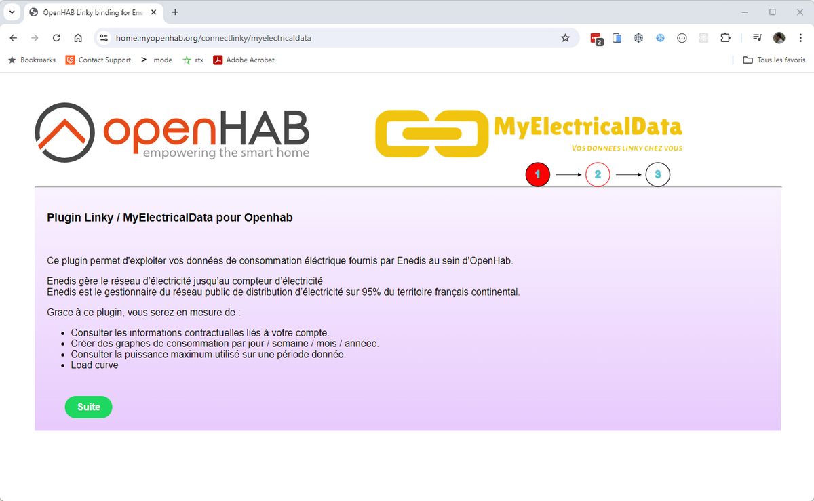
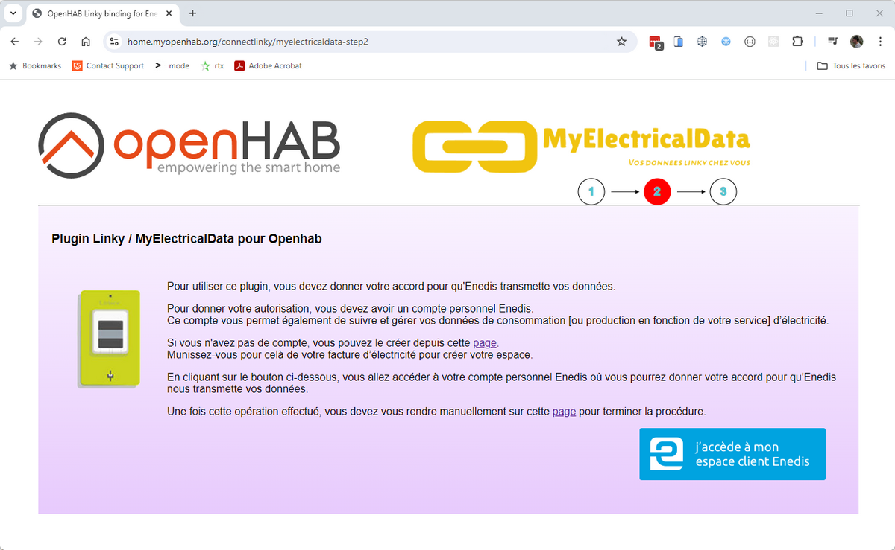
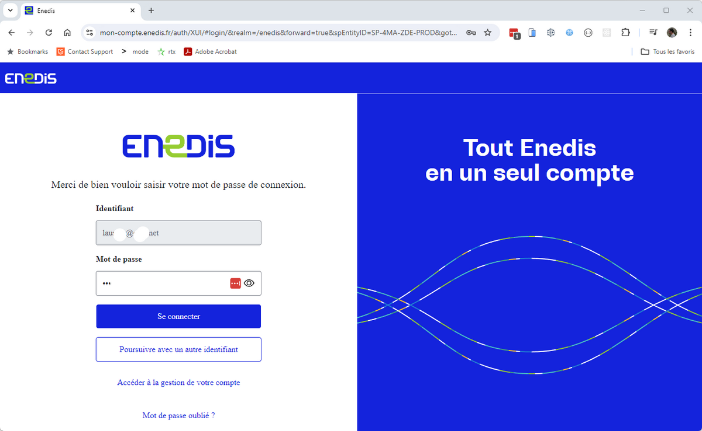
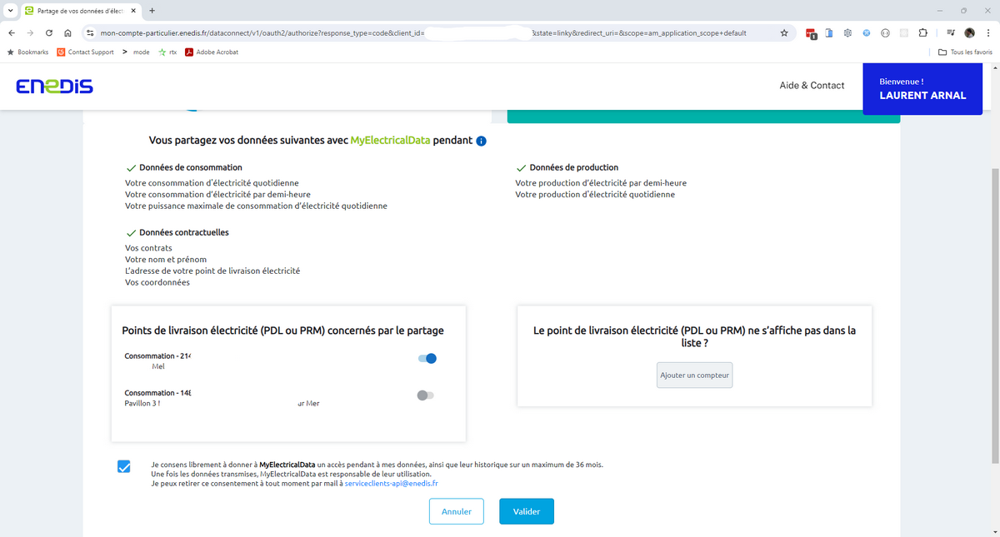
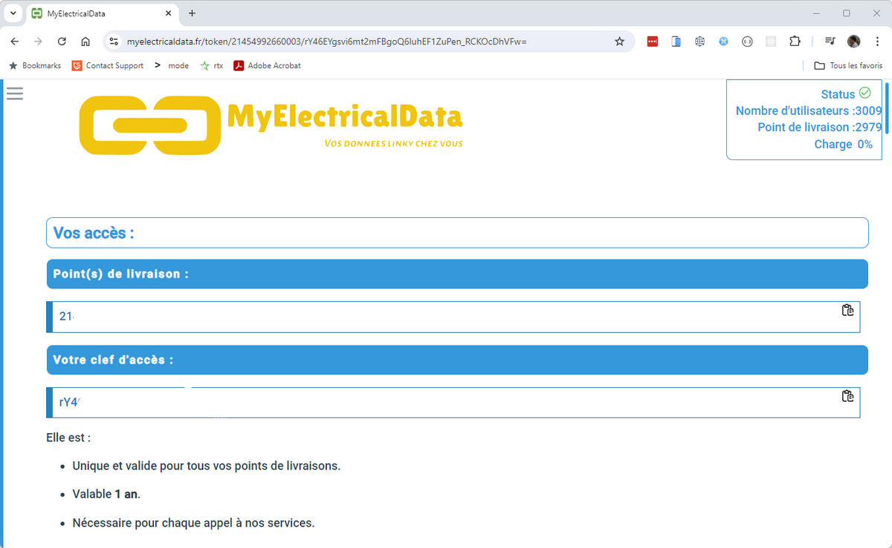
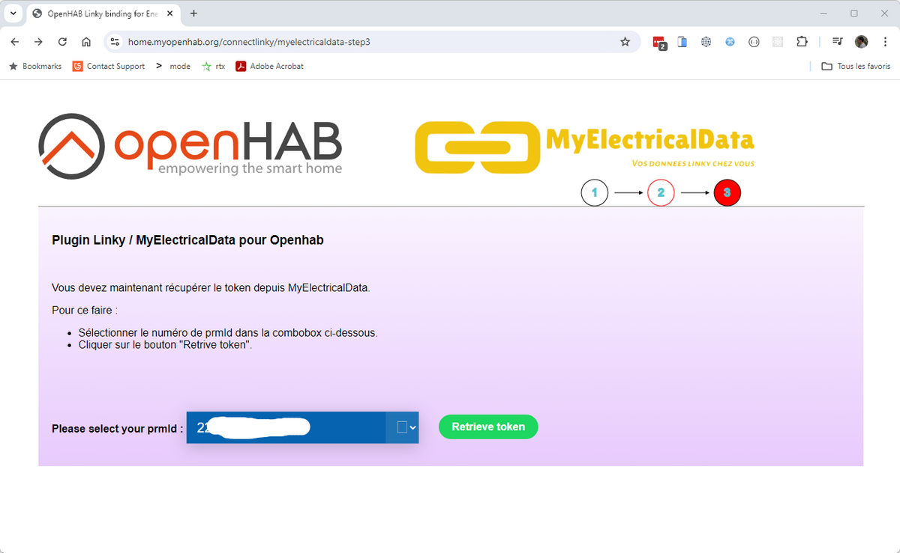
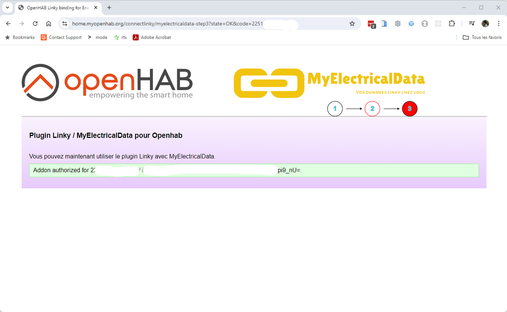

  2. Step 2

       
       

  3. Step 3

       

  4. Step 4

     If you have multiple linky on your account like me, you will have to repeat the procedure for each linky.
     Don't select the two linky in the same procedure, it will not work !

      

  5. Step 5

      

  6. Step 6

      

  7. Step 7

      

