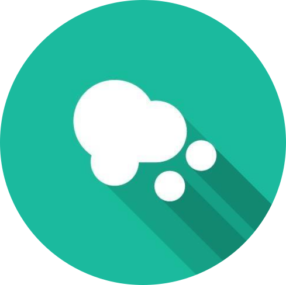

# LuftdatenInfo Binding

_Binding for the Sensor Community [luftdaten.info](https://luftdaten.info/). The community provides instructions to build sensors on your own and they can be integrated into the database._
 
 _With this binding you can integrate your sensor, a sensor nearby or even any sensors you want into openhab_
## Supported Things

_Three Things are supported_
* _Particulate Sensor - measure particulate matter PM2.5 and PM10_
* _Conditions Sensor - measures environment conditions like temperature, humidity and some also provides atmospheric pressure_
* _Noise Sensor - measures noise exposures in the environment_

## Discovery

_There's no auto discovery. See Thing configuration how to setup a Sensor._

## Thing Configuration

_Perform the following steps to get the appropriate Sensor ID_
* _Go to to [luftdaten.info map](https://deutschland.maps.sensor.community/)_
* _Choose your wanted value in bottom list - now only the Sensors are displayed which are supporting this_
* _Click on your / any Sensor and the ID is displayed in the top left corner.Note: Sensor ID is just the number without beginning hash #_
* _Enter this Sensor ID into the thing configuration_

## Channels

### Particulate Sensor 
* PM25 - [ultrafine particulates](https://en.wikipedia.org/wiki/Particulates#Size,_shape_and_solubility_matter) microgram per cubic meter
* PM100 - [coarse particulate matter](https://en.wikipedia.org/wiki/Particulates#Size,_shape_and_solubility_matter) microgram per cubic meter 

### Conditions Sensor 
* Temperature - current temperature in degrees
* Humidity - current humidity percent
* Pressure - Atmospheric Pressure in hpa, not supported by all sensors
* Pressure sea level - Atmospheric Pressure on sea level in hpa, not supported by all sensors

### Noise Sensor 
Currently in [beta phase of the community](https://luftdaten.info/einfuehrung-zum-laermsensor/)
* Noise EQ - average noise in dbA
* Min Noise - minimum noise covered in the last 2.5 minutes in dbA
* Max Noise - maximum noise covered in the last 2.5 minutes in dbA

