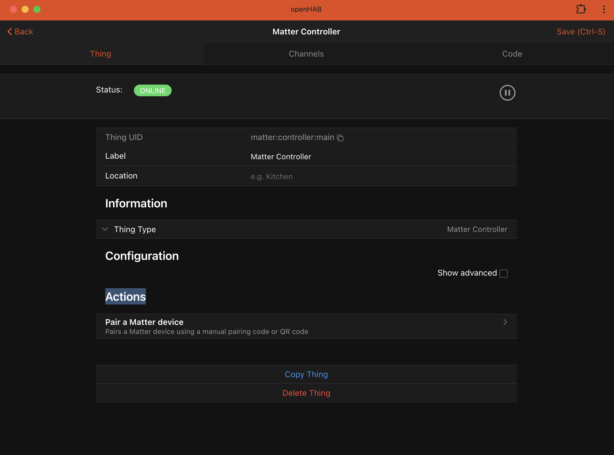
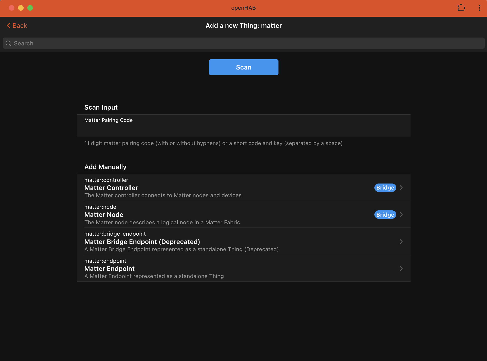
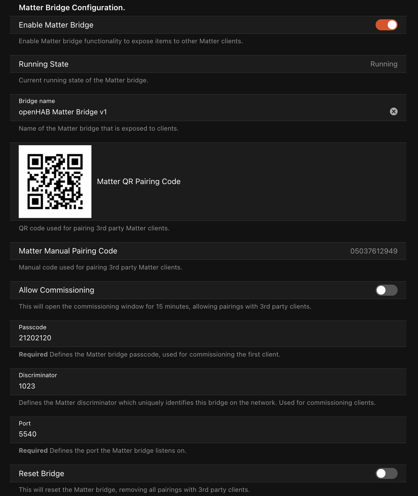
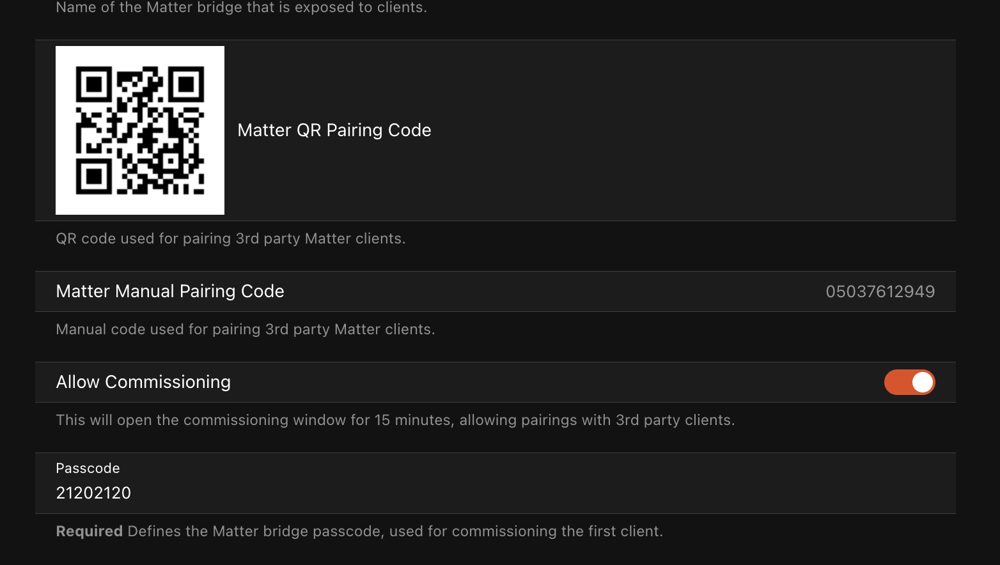

# Matter Binding

The Matter Binding for openHAB allows seamless integration with Matter-compatible devices.

It currently supports version 1.4.1 of the Matter specification and earlier.

## Supported functionality

This binding supports two different types of Matter functionality which operate independently of each other.

- [Matter Client](#matter-client)
  - This allows openHAB to discover and control other Matter devices like lights, thermostats, window coverings, locks, etc...

- [Matter Bridge](#matter-bridge)
  - This allows openHAB to expose items as Matter devices to other Matter clients.
  This allows local control of openHAB devices from other ecosystems like Apple Home, Amazon, and Google Home.

For more information on the Matter specification, see the [Matter Ecosystem Overview](#matter-ecosystem-overview) section at the end of this document.

## Matter.JS Runtime

This binding uses the excellent [matter.js](https://github.com/project-chip/matter.js) implementation of the the Matter 1.4.1 protocol.

As such, this binding requires NodesJS 18+ and will attempt to download and cache an appropriate version when started if a version is not already installed on the system.
Alpine Linux users (typically docker) and those on older Linux distributions will need to install this manually as the official NodeJS versions are not compatible.

## Matter and IPv6

Matter **requires** IPv6 to be enabled and be routable between openHAB and the Matter device.
This means IPv6 needs to be enabled on the host openHAB is running, and the network must be able route IPv6 unicast and multicast messages.
Docker, VLANs, subnets and other configurations can prohibit Matter from working if not configured correctly.

# Matter Client

This describes the Matter controller functionality for discovering and controlling Matter devices.

## Quick Start

1. Install the Matter binding from the openHAB add-on store.
1. Add a Matter "Controller" thing to the inbox using the default settings.
1. Use the "Pair Matter Device" action on the controller thing to pair a device with the controller.
1. Add the discovered device from the inbox as a new "Node" thing.

Note: It is never necessary to remove or delete the "Controller" thing when troubleshooting issues.

## Supported Things

The Matter Binding supports the following types of things:

- `controller`: The main controller that interfaces with Matter devices.
It requires the configuration parameter `nodeId` which sets the local Matter node ID for this controller (must be unique in the fabric).
**This must be added manually.**
- `node`: Represents an individual Node within the Matter network.
The only configuration parameter is `nodeId`.
A standard Node will map Matter endpoints to openHAB channel groups.
**This will be discovered automatically** when a pairing code is used to scan for a device and should not be added manually.
- `endpoint`: Represents an standalone endpoint as a child of a `node` thing. Only Endpoints exposed by Matter bridges will be added as `endpoint` things, otherwise Matter Endpoints are mapped on a `node` thing as channel groups. An `endpoint` thing **will be discovered automatically** when a node is added that has multiple bridged endpoints and should not be added manually.

## Discovery

Matter controllers must be added manually.
Nodes (devices) will be discovered when a `pairCode` is used to search for a device to add.
Bridged endpoints will be added to the inbox once the parent Node is added as a thing.

### Device Pairing: General

The pairing action can be found in the settings of the "Controller" thing under the "Actions" -> "Pair Matter Device"



This action will give feedback on the pairing process, if successful a device will be added to the Inbox.

See [Device Pairing: Code Types](#device-pairing-code-types) for more information on pairing codes and code formats.

The same codes can also be used in the openHAB Thing discovery UI, although feedback is limited and only a single controller is supported.  



### Device Pairing: Code Types

In order to pair (commission in matter terminology) a device, you must have an 11 digit manual pairing code (eg 123-4567-8901 or 12345678901) or a QR Code (eg MT:ABCDEF1234567890123).
If the device has not been paired before, use the code provided by the manufacturer and **ensure the device is in pairing mode**, refer to your devices instructions for pairing for more information.
You can include dashes or omit them in a manual pairing code.

If the device is paired with another Matter ecosystem (Apple, Google, Amazon, etc..) you must use that ecosystem to generate a new pairing code and search for devices.  
The pairing code and device will only be available for commissioning for a limited time.
Refer to the ecosystem that generated the code for the exact duration (typically 5-15 minutes). In this case, openHAB still talks directly to the device and is not associated with that existing ecosystem.

If the device seems to be found in the logs, but can not be added, its possible the device has been already paired.
Hard resetting the device may help this case.
See your device documentation for how to hard reset the device.

### Device Pairing: Thread Devices

Thread devices require a Thread Border Router and a bluetooth enabled device to facilitate the thread joining process (typically a mobile device).
Until there is a supported thread border router integration in openHAB and the openHAB mobile apps, it's strongly recommended to pair the device to a commercial router with thread support first (Apple TV 4k, Google Nest Hub 2, Amazon Gen 4 Echo, etc... ), then generate a matter pairing code using that ecosystem and add the device normally.
This will still allow openHAB to have direct access to the device using only the embedded thread border router and does not interact with the underlying providers home automation stack.

Support for using a OpenThread Border Router has been verified to work and will be coming soon to openHAB, but in some cases requires strong expertise in IPv6 routing as well as support in our mobile clients.

### Enabling IPv6 Thread Connectivity on Linux Hosts

It is important to make sure that Route Announcements (RA) and Route Information Options (RIO) are enabled on your host so that Thread boarder routers can announce routes to the Thread network.
This is done by setting the following sysctl options:

1. `net.ipv6.conf.wlan0.accept_ra` should be at least `1` if ip forwarding is not enabled, and `2` otherwise.
1. `net.ipv6.conf.wlan0.accept_ra_rt_info_max_plen` should not be smaller than `64`.

the `accept_ra` is defaulted to `1` for most distributions.

There may be other network daemons which will override this option (for example, dhcpcd on Raspberry Pi will override accept_ra to 0).

You can check the accept_ra value with:

```shell
$ sudo sysctl -n net.ipv6.conf.wlan0.accept_ra
0
```

And set the value to 1 (or 2 in case IP forwarding is enabled) with:

```shell
$ sudo sysctl -w net.ipv6.conf.wlan0.accept_ra=1
Net.ipv6.conf.wlan0.accept_ra = 1
```

The accept_ra_rt_info_max_plen option on most Linux distributions is default to 0, set it to 64 with:

```shell
$ sudo sysctl -w net.ipv6.conf.wlan0.accept_ra_rt_info_max_plen=64
net.ipv6.conf.wlan0.accept_ra_rt_info_max_plen = 64
```

To make these changes permanent, add the following lines to `/etc/sysctl.conf`:

```ini
net.ipv6.conf.eth0.accept_ra=1
net.ipv6.conf.eth0.accept_ra_rt_info_max_plen=64
```

Raspberry Pi users may need to add the following lines to `/etc/dhcpcd.conf` to prevent dhcpcd from overriding the accept_ra value:

```ini
noipv6
noipv6rs
```

**NOTE:**  Please ensure you use the right interface name for your network interface. The above examples use `wlan0` and `eth0` as examples.
You can find the correct interface name by running `ip a` and looking for the interface that has an IPv6 address assigned to it.

## Thing Configuration

### Controller Thing Configuration

The controller thing must be created manually before devices can be discovered.

| Name   | Type   | Description                            | Default | Required | Advanced |
|--------|--------|----------------------------------------|---------|----------|----------|
| nodeId | number | The matter node ID for this controller | 0       | yes      | no       |

Note: The controller nodeId must not be changed after a controller is created.  

### Node Thing Configuration

Nodes are discovered automatically (see [Discovery](#discovery) for more information) and should not be added manually.

| Name       | Type   | Description                        | Default | Required | Advanced |
|------------|--------|------------------------------------|---------|----------|----------|
| nodeId     | text   | The node ID of the endpoint        | N/A     | yes      | no       |

### Endpoint Thing Configuration

 Endpoints are discovered automatically once their parent Node has been added (see [Discovery](#discovery) for more information) and should not be added manually.

| Name       | Type   | Description                        | Default | Required | Advanced |
|------------|--------|------------------------------------|---------|----------|----------|
| endpointId | number | The endpoint ID within the node    | N/A     | yes      | no       |

## Thing Actions

### Node Thing Actions

| Name                                            | Description                                                                                                                                                                                                                                                               |
|-------------------------------------------------|---------------------------------------------------------------------------------------------------------------------------------------------------------------------------------------------------------------------------------------------------------------------------|
| Decommission Matter node from fabric            | This will remove the device from the Matter fabric. If the device is online and reachable this will attempt to remove the credentials from the device first before removing it from the network. Once a device is removed, this Thing will go offline and can be removed. |
| Generate a new pairing code for a Matter device | Generates a new manual and QR pairing code to be used to pair the Matter device with an external Matter controller                                                                                                                                                        |
| List Connected Matter Fabrics                   | This will list all the Matter fabrics this node belongs to                                                                                                                                                                                                                |
| Remove Connected Matter Fabric                  | This removes a connected Matter fabric from a device. Use the 'List connected Matter fabrics' action to retrieve the fabric index number                                                                                                                                  |

For nodes that contain a Thread Border Router Management Cluster, the following additional actions will be present

| Name                                         | Description                                                                                                                                                                                       |
|----------------------------------------------|---------------------------------------------------------------------------------------------------------------------------------------------------------------------------------------------------|
| Thread: Load external operational dataset    | Updates the local operational dataset configuration from a hex or JSON string for the node. Use the 'Push local operational dataset' action to push the dataset back to the device after loading. |
| Thread: Load operational dataset from device | Updates the local operational dataset configuration from the device.                                                                                                                                                      |
| Thread: Operational Dataset Generator        | Generates a new operational dataset and optionally saves it locally.                                                                                                                              |
| Thread: Push local operational dataset       | Pushes the local operational dataset configuration to the device.                                                                                                                                 |

A Thread operational data set is a hex encoded string which contains a Thread border router's configuration.
Using the same operational data set across multiple Thread border routers allows those routers to form a single network where Thread devices can roam from router to router.
Some Thread border routers allow a "pending" operational dataset to be configured, this allows routers to coordinate the configuration change with current Thread devices without requiring those devices to be reconfigured (live migration).

## Channels

### Controller Channels

Controllers have no channels.

### Node and Bridge Endpoint Channels

Channels are dynamically added based on the endpoint type and matter cluster supported.
Each endpoint is represented as a channel group.
Possible channels include:

## Endpoint Channels

| Channel ID                                                  | Type                     | Label                        | Description                                                                                                                                                                                                                                                          | Category         | ReadOnly | Pattern     |
|-------------------------------------------------------------|--------------------------|------------------------------|----------------------------------------------------------------------------------------------------------------------------------------------------------------------------------------------------------------------------------------------------------------------|------------------|----------|-------------|
| airquality-airquality                                       | Number                   | Air Quality                  | Indicates the currently measured air quality                                                                                                                                                                                                                         |                  | true     |             |
| battery-voltage                                             | Number:ElectricPotential | Battery Voltage              | The current battery voltage                                                                                                                                                                                                                                          | Energy           | true     | %.1f %unit% |
| battery-alarm                                               | String                   | Battery Alarm                | The battery alarm state                                                                                                                                                                                                                                              | Energy           | true     |             |
| powersource-batpercentremaining                             | Number:Dimensionless     | Battery Percent Remaining    | Indicates the estimated percentage of battery charge remaining until the battery will no longer be able to provide power to the Node                                                                                                                                 | Energy           | true     | %d %%       |
| powersource-batchargelevel                                  | Number                   | Battery Charge Level         | Indicates a coarse ranking of the charge level of the battery, used to indicate when intervention is required                                                                                                                                                        | Energy           | true     |             |
| booleanstate-statevalue                                     | Switch                   | Boolean State                | Indicates a boolean state value                                                                                                                                                                                                                                      | Status           | true     |             |
| colorcontrol-color                                          | Color                    | Color                        | The color channel allows to control the color of a light. It is also possible to dim values and switch the light on and off.                                                                                                                                         | ColorLight       |          |             |
| colorcontrol-temperature                                    | Dimmer                   | Color Temperature            | Sets the color temperature of the light                                                                                                                                                                                                                              | ColorLight       |          |             |
| colorcontrol-temperature-abs                                | Number:Temperature       | Color Temperature            | Sets the color temperature of the light in mirek                                                                                                                                                                                                                     | ColorLight       |          | %.0f %unit% |
| doorlock-lockstate                                          | Switch                   | Door Lock State              | Locks and unlocks the door and maintains the lock state                                                                                                                                                                                                              | Door             |          |             |
| fancontrol-fanmode                                          | Number                   | Fan Mode                     | Set the fan mode                                                                                                                                                                                                                                                     | HVAC             |          |             |
| onoffcontrol-onoff                                          | Switch                   | Switch                       | Switches the power on and off                                                                                                                                                                                                                                        | Light            |          |             |
| levelcontrol-level                                          | Dimmer                   | Dimmer                       | Sets the level of the light                                                                                                                                                                                                                                          | Light            |          |             |
| modeselect-mode                                             | Number                   | Mode Select                  | Selection of 1 or more states                                                                                                                                                                                                                                        |                  |          | %d          |
| switch-switch                                               | Number                   | Switch                       | Indication of a switch or remote being activated                                                                                                                                                                                                                     |                  | true     | %d          |
| switch-switchlatched                                        | Trigger                  | Switched Latched Trigger     | This trigger shall indicate the new value of the CurrentPosition attribute as a JSON object, i.e. after the move.                                                                                                                                                    |                  |          |             |
| switch-initialpress                                         | Trigger                  | Initial Press Trigger        | This trigger shall indicate the new value of the CurrentPosition attribute as a JSON object, i.e. while pressed.                                                                                                                                                     |                  |          |             |
| switch-longpress                                            | Trigger                  | Long Press Trigger           | This trigger shall indicate the new value of the CurrentPosition attribute as a JSON object, i.e. while pressed.                                                                                                                                                     |                  |          |             |
| switch-shortrelease                                         | Trigger                  | Short Release Trigger        | This trigger shall indicate the previous value of the CurrentPosition attribute as a JSON object, i.e. just prior to release.                                                                                                                                        |                  |          |             |
| switch-longrelease                                          | Trigger                  | Long Release Trigger         | This trigger shall indicate the previous value of the CurrentPosition attribute as a JSON object, i.e. just prior to release.                                                                                                                                        |                  |          |             |
| switch-multipressongoing                                    | Trigger                  | Multi-Press Ongoing Trigger  | This trigger shall indicate 2 numeric fields as a JSON object. The first is the new value of the CurrentPosition attribute, i.e. while pressed. The second is the multi press code with a value of N when the Nth press of a multi-press sequence has been detected. |                  |          |             |
| switch-multipresscomplete                                   | Trigger                  | Multi-Press Complete Trigger | This trigger shall indicate 2 numeric fields as a JSON object. The first is the new value of the CurrentPosition attribute, i.e. while pressed. The second is how many times the momentary switch has been pressed in a multi-press sequence.                        |                  |          |             |
| thermostat-localtemperature                                 | Number:Temperature       | Local Temperature            | Indicates the local temperature provided by the thermostat                                                                                                                                                                                                           | HVAC             | true     | %.1f %unit% |
| thermostat-outdoortemperature                               | Number:Temperature       | Outdoor Temperature          | Indicates the outdoor temperature provided by the thermostat                                                                                                                                                                                                         | HVAC             | true     | %.1f %unit% |
| thermostat-occupiedheating                                  | Number:Temperature       | Occupied Heating Setpoint    | Set the heating temperature when the room is occupied                                                                                                                                                                                                                | HVAC             |          | %.1f %unit% |
| thermostat-occupiedcooling                                  | Number:Temperature       | Occupied Cooling Setpoint    | Set the cooling temperature when the room is occupied                                                                                                                                                                                                                | HVAC             |          | %.1f %unit% |
| thermostat-unoccupiedheating                                | Number:Temperature       | Unoccupied Heating Setpoint  | Set the heating temperature when the room is unoccupied                                                                                                                                                                                                              | HVAC             |          | %.1f %unit% |
| thermostat-unoccupiedcooling                                | Number:Temperature       | Unoccupied Cooling Setpoint  | Set the cooling temperature when the room is unoccupied                                                                                                                                                                                                              | HVAC             |          | %.1f %unit% |
| thermostat-systemmode                                       | Number                   | System Mode                  | Set the system mode of the thermostat                                                                                                                                                                                                                                | HVAC             |          |             |
| thermostat-runningmode                                      | Number                   | Running Mode                 | The running mode of the thermostat                                                                                                                                                                                                                                   | HVAC             | true     |             |
| windowcovering-lift                                         | Rollershutter            | Window Covering Lift         | Sets the window covering level - supporting open/close and up/down type commands                                                                                                                                                                                     | Blinds           |          | %.0f %%     |
| fancontrol-percent                                          | Dimmer                   | Fan Control Percent          | The current fan speed percentage level                                                                                                                                                                                                                               | HVAC             | true     | %.0f %%     |
| fancontrol-mode                                             | Number                   | Fan Control Mode             | The current mode of the fan                                                                                                                                                                                                                                          | HVAC             |          |             |
| temperaturemeasurement-measuredvalue                        | Number:Temperature       | Temperature                  | The measured temperature                                                                                                                                                                                                                                             | Temperature      | true     | %.1f %unit% |
| occupancysensing-occupied                                   | Switch                   | Occupancy                    | Indicates if an occupancy sensor is triggered                                                                                                                                                                                                                        | Presence         | true     |             |
| relativehumiditymeasurement-measuredvalue                   | Number:Dimensionless     | Humidity                     | The measured humidity                                                                                                                                                                                                                                                | Humidity         | true     | %.0f %%     |
| illuminancemeasurement-measuredvalue                        | Number:Illuminance       | Illuminance                  | The measured illuminance in Lux                                                                                                                                                                                                                                      | Illuminance      | true     | %d %unit%   |
| wifinetworkdiagnostics-rssi                                 | Number:Power             | Signal                       | Wi-Fi signal strength indicator.                                                                                                                                                                                                                                     | QualityOfService | true     | %d %unit%   |
| electricalpowermeasurement-activepower                      | Number:Power             | Active Power                 | The active power measurement in watts                                                                                                                                                                                                                                | Energy           | true     | %.1f %unit% |
| electricalpowermeasurement-activecurrent                    | Number:ElectricCurrent   | Active Current               | The active current measurement in amperes                                                                                                                                                                                                                            | Energy           | true     | %.1f %unit% |
| electricalpowermeasurement-voltage                          | Number:ElectricPotential | Voltage                      | The voltage measurement in volts                                                                                                                                                                                                                                     | Energy           | true     | %.2f %unit% |
| electricalenergymeasurement-energymeasurmement-energy       | Number:Energy            | Energy                       | The measured energy                                                                                                                                                                                                                                                  | Energy           | true     | %.1f %unit% |
| electricalenergymeasurement-cumulativeenergyimported-energy | Number:Energy            | Cumulative Energy Imported   | The cumulative energy imported measurement                                                                                                                                                                                                                           | Energy           | true     | %.1f %unit% |
| electricalenergymeasurement-cumulativeenergyexported-energy | Number:Energy            | Cumulative Energy Exported   | The cumulative energy exported measurement                                                                                                                                                                                                                           | Energy           | true     | %.1f %unit% |
| electricalenergymeasurement-periodicenergyimported-energy   | Number:Energy            | Periodic Energy Imported     | The periodic energy imported measurement                                                                                                                                                                                                                             | Energy           | true     | %.1f %unit% |
| electricalenergymeasurement-periodicenergyexported-energy   | Number:Energy            | Periodic Energy Exported     | The periodic energy exported measurement                                                                                                                                                                                                                             | Energy           | true     | %.1f %unit% |
| rvcrunmode-mode                                             | Number                   | Run Mode                     | Selects the run mode (idle, cleaning, mapping) of the robotic vacuum cleaner                                                                                                                                                                                         |                  |          | %d          |
| rvccleanmode-mode                                           | Number                   | Clean Mode                   | Selects the cleaning mode (vacuum, mop etc.) of the robotic vacuum cleaner                                                                                                                                                                                           |                  |          | %d          |
| rvcoperationalstate-state                                   | Number                   | Operational State            | Reports the operational state of the robotic vacuum cleaner                                                                                                                                                                                                          |                  | true     | %d          |
| rvcoperationalstate-gohome                                  | Switch                   | Go Home                      | Sends the robotic vacuum cleaner back to the dock                                                                                                                                                                                                                    |                  |          |             |
| servicearea-selectedarea                                    | Switch                   | Area Selection               | Toggle to enable a mapped area for cleaning                                                                                                                                                                                                                          |                  |          |             |
| threadnetworkdiagnostics-channel                            | Number                   | Channel                      | The Thread network channel                                                                                                                                                                                                                                           | Network          | true     | %d          |
| threadnetworkdiagnostics-routingrole                        | Number                   | Routing Role                 | The Thread routing role (0=Unspecified, 1=Unassigned, 2=Sleepy End Device, 3=End Device, 4=Reed, 5=Router, 6=Leader)                                                                                                                                                 | Network          | true     | %d          |
| threadnetworkdiagnostics-networkname                        | String                   | Network Name                 | The Thread network name                                                                                                                                                                                                                                              | Network          | true     |             |
| threadnetworkdiagnostics-panid                              | Number                   | PAN ID                       | The Thread network PAN ID                                                                                                                                                                                                                                            | Network          | true     | %d          |
| threadnetworkdiagnostics-extendedpanid                      | Number                   | Extended PAN ID              | The Thread network extended PAN ID                                                                                                                                                                                                                                   | Network          | true     | %d          |
| threadnetworkdiagnostics-rloc16                             | Number                   | RLOC16                       | The Thread network RLOC16 address                                                                                                                                                                                                                                    | Network          | true     | %d          |
| threadborderroutermanagement-borderroutername               | String                   | Border Router Name           | The name of the Thread border router                                                                                                                                                                                                                                 | Network          | true     |             |
| threadborderroutermanagement-borderagentid                  | String                   | Border Agent ID              | The unique identifier of the Thread border agent                                                                                                                                                                                                                     | Network          | true     |             |
| threadborderroutermanagement-threadversion                  | Number                   | Thread Version               | The version of Thread protocol being used                                                                                                                                                                                                                            | Network          | true     | %d          |
| threadborderroutermanagement-interfaceenabled               | Switch                   | Interface Enabled            | Whether the Thread border router interface is enabled                                                                                                                                                                                                                | Network          |          |             |
| threadborderroutermanagement-activedatasettimestamp         | Number                   | Active Dataset Timestamp     | Timestamp of the active Thread network dataset                                                                                                                                                                                                                       | Network          | true     | %d          |
| threadborderroutermanagement-activedataset                  | String                   | Active Dataset               | The active Thread network dataset configuration                                                                                                                                                                                                                      | Network          |          |             |
| threadborderroutermanagement-pendingdatasettimestamp        | Number                   | Pending Dataset Timestamp    | Timestamp of the pending Thread network dataset (only available if PAN change feature is supported)                                                                                                                                                                  | Network          | true     | %d          |
| threadborderroutermanagement-pendingdataset                 | String                   | Pending Dataset              | The pending Thread network dataset configuration (only available if PAN change feature is supported)                                                                                                                                                                 | Network          |          |             |

## Supported Matter Device Types

The following is a list of known Matter device types supported by openHAB as defined in the Matter Device Library Specification Version 1.4.1.
Other device types may be supported, but with limited or missing functionality.

| Device Type Name              | Matter Device ID | Supported Clusters                                                                                     |
|-------------------------------|------------------|--------------------------------------------------------------------------------------------------------|
| Power Source                  | 0x0011           | Power Source (0x002F)                                                                                  |
| Bridged Node                  | 0x0013           | Bridged Device Basic Information (0x0039)                                                              |
| Electrical Sensor             | 0x0510           | Power Topology (0x009C), Electrical Power Measurement (0x0090), Electrical Energy Measurement (0x0091) |
| On/Off Light                  | 0x0100           | On/Off (0x0006)                                                                                        |
| Dimmable Light                | 0x0101           | On/Off (0x0006), Level Control (0x0008)                                                                |
| Color Temperature Light       | 0x010C           | On/Off (0x0006), Level Control (0x0008), Color Control (0x0300)                                        |
| Extended Color Light          | 0x010D           | On/Off (0x0006), Level Control (0x0008), Color Control (0x0300)                                        |
| On/Off Plug-in Unit           | 0x010A           | On/Off (0x0006)                                                                                        |
| Dimmable Plug-In Unit         | 0x010B           | On/Off (0x0006), Level Control (0x0008)                                                                |
| Mounted On/Off Control        | 0x010F           | On/Off (0x0006)                                                                                        |
| Mounted Dimmable Load Control | 0x0110           | On/Off (0x0006), Level Control (0x0008)                                                                |
| On/Off Light Switch           | 0x0103           | On/Off (0x0006)                                                                                        |
| Dimmer Switch                 | 0x0104           | On/Off (0x0006), Level Control (0x0008)                                                                |
| Color Dimmer Switch           | 0x0105           | On/Off (0x0006), Level Control (0x0008), Color Control (0x0300)                                        |
| Generic Switch                | 0x000F           | Switch (0x003B)                                                                                        |
| Contact Sensor                | 0x0015           | Boolean State (0x0045)                                                                                 |
| Light Sensor                  | 0x0106           | Illuminance Measurement (0x0400)                                                                       |
| Occupancy Sensor              | 0x0107           | Occupancy Sensing (0x0406)                                                                             |
| Temperature Sensor            | 0x0302           | Temperature Measurement (0x0402), Identify (0x0003)                                                    |
| Humidity Sensor               | 0x0307           | Relative Humidity Measurement (0x0405)                                                                 |
| On/Off Sensor                 | 0x0850           | On/Off (0x0006)                                                                                        |
| Air Quality Sensor            | 0x002C           | Air Quality (0x005B)                                                                                   |
| Water Freeze Detector         | 0x0041           | Boolean State (0x0045)                                                                                 |
| Water Leak Detector           | 0x0043           | Boolean State (0x0045)                                                                                 |
| Rain Sensor                   | 0x0044           | Boolean State (0x0045)                                                                                 |
| Door Lock                     | 0x000A           | Door Lock (0x0101)                                                                                     |
| Window Covering               | 0x0202           | Window Covering (0x0102)                                                                               |
| Thermostat                    | 0x0301           | Thermostat (0x0201)                                                                                    |
| Fan                           | 0x002B           | Fan Control (0x0202)                                                                                   |
| Air Purifier                  | 0x002D           | Fan Control (0x0202)                                                                                   |
| Robotic Vacuum Cleaner        | 0x0074           | RVC Run Mode (0x0054), RVC Operational State (0x0061), RVC Clean Mode (0x0055), Service Area (0x0150)  |
| Room Air Conditioner          | 0x0072           | On/Off (0x0006), Thermostat (0x0201)                                                                   |
| Solar Power                   | 0x0017           | Electrical Power Measurement (0x0090), Electrical Energy Measurement (0x0091)                          |
| Battery Storage               | 0x0018           | Electrical Power Measurement (0x0090), Electrical Energy Measurement (0x0091), Power Source (0x002F)   |
| Thread Border Router          | 0x0091           | Thread Network Diagnostics (0x0035), Thread Border Router Management (0x0452)                          |

## Full Example

### Thing Configuration

```java
Thing configuration example for the Matter controller:
Thing matter:controller:main [ nodeId="1" ]

Thing configuration example for a Matter node:
Thing matter:node:main:12345678901234567890 [ nodeId="12345678901234567890"]

Thing configuration example for a Matter bridge endpoint:
Thing matter:endpoint:main:12345678901234567890:2 [ endpointId=2]
```

### Item Configuration

```java
Dimmer MyDimmer "My Endpoint Dimmer" { channel="matter:node:main:12345678901234567890:1#levelcontrol-level" }
Dimmer MyBridgedDimmer "My Bridged Dimmer" { channel="matter:endpoint:main:12345678901234567890:2#levelcontrol-level" }

```

### Sitemap Configuration

```perl
Optional Sitemap configuration:
sitemap home label="Home"
{
    Frame label="Matter Devices"
    {
        Dimmer item=MyEndpointDimmer
    }
}
```

# Matter Bridge

openHAB can also expose Items and Item groups as Matter devices to 3rd party Matter clients like Google Home, Apple Home and Amazon Alexa. This allows local control for those ecosystems and can be used instead of cloud based integrations for features like voice assistants.

## Configuration

Note: The openHAB Matter bridge is **unrelated** to the Matter Controller Thing.
Adding, modifying or removing a Matter "Controller" thing, or any Matter "Node" thing **will have no affect on the bridge**.

There are two ways in which to configure the Matter bridge:

1. Using the "Matter Bridge Configuration" settings page (Main UI -> Settings -> Add-on Settings -> Matter Binding) for bridge status, general configuration and pairing 3rd party clients.
1. Adding Matter metadata tags to Groups and Items either through the Main UI or through item files.



The openHAB matter bridge uses metadata tags with the key "matter", similar to the Alexa, Google Assistant and Apple Homekit integrations.
Matter Metadata tag values generally follow the Matter "Device Type" and "Cluster" specification as much as possible.

Items and item groups are initially tagged with a Matter "Device Type", which are Matter designations for common device types like lights, thermostats, locks, window coverings, etc...
For single items, like a light switch or dimmer, simply tagging the item with the Matter device type is enough.

```java
Dimmer MyDimmer "My Dimmer" { matter="DimmableLight" }
```

For more complicated devices, like thermostats, A group item is tagged with the device type, and its child members are tagged with the cluster attribute(s) that it will be associated with.
Multiple attributes use a comma delimited format like `attribute1, attribute2, ... attributeN`.

```java
Group              ThermostatGroup "Thermostat" { matter="Thermostat" }
Number:Temperature ThermostatGroup_Temperature "Temperature" (ThermostatGroup) { matter="thermostat.localTemperature" }
Number:Temperature ThermostatGroup_HeatSetpoint "Heat Setpoint" (ThermostatGroup) { matter="thermostat.occupiedHeatingSetpoint" }
Number:Temperature ThermostatGroup_CoolSetpoint "Cool Setpoint" (ThermostatGroup) { matter="thermostat.occupiedCoolingSetpoint" }
Number             ThermostatGroup_Mode "Mode" (ThermostatGroup) { matter="thermostat.systemMode" [OFF=0, HEAT=1, COOL=2, AUTO=3]}
```

For devices like fans that support groups with multiple items, but you are only using one item to control (like On/Off or Speed), you can tag the regular item with both the device type and the cluster attribute(s) separated by a comma.

```java
Switch TestFanSingleItem "On/Off" { matter="Fan, fanControl.fanMode" }
```

If there are issues starting the bridge, check the status field in the bridge settings page to see if there are any errors.

### Pairing 3rd Party Clients

Pairing codes and other options can be found in the MainUI under "Settings -> Add-on Settings -> Matter Binding"

When the matter bridge starts, if no 3rd party clients are paired, it will automatically open the "Commissioning Window", meaning you can use the QR code or manual pair code found in the bridge settings page to pair a new client like Alexa, Google Home or Apple Home.



Once a client is paired, the bridge will default to having its "Commissioning Window" closed and can not be paired with until the window is opened again in the settings.

To pair additional clients, you can open the commissioning window again in the settings by enabling "Allow Commissioning", clicking save, and then and pair a new client within the 15 minute window using the QR code or manual pair code.

Once a new client is paired, or the 15 minute window expires, the bridge will default to having its "Commissioning Window" closed and can not be paired with until the window is opened again in the settings.

### Resetting the Bridge

If you need to reset the bridge, you can do so by enabling the "Reset Bridge" button in the bridge settings page (advanced options) and clicking save.

Note that this will leave 3rd party clients paired to the bridge still in a "paired" state, and you will need to unpair the now orphaned openHAB Matter bridge in their respective apps.

Resetting the bridge is almost never needed, and should only be used if advised to do so by a developer.

### Device Types

The following is a list of supported Matter device types and their corresponding openHAB item types and tags.

| Type                | Item Type                             | Tag               | Option                                                                          |
|---------------------|---------------------------------------|-------------------|---------------------------------------------------------------------------------|
| OnOff Light         | Switch, Dimmer                        | OnOffLight        |                                                                                 |
| Dimmable Light      | Dimmer                                | DimmableLight     |                                                                                 |
| Color Light         | Color                                 | ColorLight        |                                                                                 |
| On/Off Plug In Unit | Switch, Dimmer                        | OnOffPlugInUnit   |                                                                                 |
| Thermostat          | Group                                 | Thermostat        |                                                                                 |
| Window Covering     | Rollershutter, Dimmer, String, Switch | WindowCovering    | String types: [OPEN="OPEN", CLOSED="CLOSED"], Switch types: [invert=true/false] |
| Temperature Sensor  | Number                                | TemperatureSensor |                                                                                 |
| Humidity Sensor     | Number                                | HumiditySensor    |                                                                                 |
| Occupancy Sensor    | Switch, Contact                       | OccupancySensor   |                                                                                 |
| Contact Sensor      | Switch, Contact                       | ContactSensor     |                                                                                 |
| Door Lock           | Switch                                | DoorLock          |                                                                                 |
| Fan                 | Group, Switch, String, Dimmer         | Fan               |                                                                                 |
| Mode Select         | Number, String, Switch, Rollershutter | ModeSelect        | Requires `modes` option, see below                                              |

### Global Options

- Endpoint Labels
  - By default, the Item label is used as the Matter label but can be overridden by adding a `label` key as a metadata option, either by itself or part of other options required for a device.
  - Example: `[label="My Custom Label"]`
- Fixed Labels
  - Matter has a concept of "Fixed Labels" which allows devices to expose arbitrary label names and values which can be used by clients for tasks like grouping devices in rooms.
  - Example: `[fixedLabels="room=Office, floor=1"]`

### Thermostat group member tags

| Type                | Item Type              | Tag                                | Options                                                                                  |
|---------------------|------------------------|------------------------------------|------------------------------------------------------------------------------------------|
| Current Temperature | Number                 | thermostat.localTemperature        |                                                                                          |
| Outdoor Temperature | Number                 | thermostat.outdoorTemperature      |                                                                                          |
| Heating Setpoint    | Number                 | thermostat.occupiedHeatingSetpoint |                                                                                          |
| Cooling Setpoint    | Number                 | thermostat.occupiedCoolingSetpoint |                                                                                          |
| System Mode         | Number, String, Switch | thermostat.systemMode              | [OFF=0,AUTO=1,COOL=3,HEAT=4,EMERGENCY_HEAT=5,PRECOOLING=6,FAN_ONLY=7,DRY=8,SLEEP=9] |
| Running Mode        | Number, String         | thermostat.runningMode             |                                                                                          |

The following attributes can be set in the options of any thermostat member or on the Group item to set temperature options.

| Setting                              | Description                                                                                     | Value (in 0.01°C) |
|--------------------------------------|-------------------------------------------------------------------------------------------------|-------------------|
| `thermostat-minHeatSetpointLimit`    | The minimum allowable heat setpoint limit.                                                      | 0                 |
| `thermostat-maxHeatSetpointLimit`    | The maximum allowable heat setpoint limit.                                                      | 3500              |
| `thermostat-absMinHeatSetpointLimit` | The absolute minimum heat setpoint limit that cannot be exceeded by the `minHeatSetpointLimit`. | 0                 |
| `thermostat-absMaxHeatSetpointLimit` | The absolute maximum heat setpoint limit that cannot be exceeded by the `maxHeatSetpointLimit`. | 3500              |
| `thermostat-minCoolSetpointLimit`    | The minimum allowable cool setpoint limit.                                                      | 0                 |
| `thermostat-maxCoolSetpointLimit`    | The maximum allowable cool setpoint limit.                                                      | 3500              |
| `thermostat-absMinCoolSetpointLimit` | The absolute minimum cool setpoint limit that cannot be exceeded by the `minCoolSetpointLimit`. | 0                 |
| `thermostat-absMaxCoolSetpointLimit` | The absolute maximum cool setpoint limit that cannot be exceeded by the `maxCoolSetpointLimit`. | 3500              |
| `thermostat-minSetpointDeadBand`     | The minimum deadband (temperature gap) between heating and cooling setpoints.                   | 0                 |

### Fan group member tags

| Type           | Item Type              | Tag                       | Options                                                 |
|----------------|------------------------|---------------------------|---------------------------------------------------------|
| Fan Mode       | Number, String, Switch | fanControl.fanMode        | [OFF=0, LOW=1, MEDIUM=2, HIGH=3, ON=4, AUTO=5, SMART=6] |
| Fan Percentage | Dimmer                 | fanControl.percentSetting |                                                         |
| Fan OnOff      | Switch                 | onOff.onOff               |                                                         |

The following attributes can be set on the Fan Mode item or the Group item to set fan options.

| Setting                      | Description                                                                                              | Value |
|------------------------------|----------------------------------------------------------------------------------------------------------|-------|
| `fanControl-fanModeSequence` | The sequence of fan modes to cycle through.  See [Fan Mode Sequence Options](#fan-mode-sequence-options) | 5     |

#### Fan Mode Sequence Options

| Value | Description       |
|-------|-------------------|
| 0     | OffLowMedHigh     |
| 1     | OffLowHigh        |
| 2     | OffLowMedHighAuto |
| 3     | OffLowHighAuto    |
| 4     | OffHighAuto       |
| 5     | OffHigh           |

### Mode Select options

**`ModeSelect` is considered experimental and is not supported by Apple Home, Google Home and Amazon Alexa (yet).**

<details>
<summary>Mode Select Details</summary>

A `ModeSelect` device exposes a device which responds to user defined selectable modes.
This can be used to model items which may not conform to other devices types.
 
`ModeSelect` items (or groups) must provide a mapping of Matter modes to openHAB state values via the metadata option `modes`.  The format is a comma-separated list where each entry follows:

```
<stateValue>:<label>[:<semanticTag>[:<semanticTag>...]]
```

* `stateValue`  – the exact openHAB state string you will send/receive (e.g. `off`, `auto`, `heat`, '0').
* `label`       – human-readable label presented to Matter clients.
* `semanticTag` – optional semantic hint in `namespace.tag` form (see the [Semantic Tags](#semantic-tags) appendix for valid values).

At least one mode must be supplied.

Example (exposes four modes, 'off', 'next', 'previous' and 'play'):

```java
String  BlueRayPlayer  "BlueRay Player"  { matter="ModeSelect" [
    modes="off:Off:switches.off,next:Next:switches.next,previous:Previous:switches.previous,play:Play:switches.on"
] }
```

A note on semantic tags:

- If used, you can not mix different semantic namespaces as seen in the example above where `switches` is the base namespace being used for all tags.
- These are provided by the Matter spec, but its up to clients (like Apple, Alexa, Google....) to interpret these tags (or not).
- Each ecosystem will likely differ in its use of these tags. 
- They are provided here for maximum flexiblity but are not guarenteed to have any affect.  

</details>

### Bridged Device Examples

```java
Dimmer                TestDimmer               "Test Dimmer [%d%%]"                                                      {matter="DimmableLight" [label="My Custom Dimmer", fixedLabels="room=Bedroom 1, floor=2, direction=up, customLabel=Custom Value"]}

Group                 TestHVAC                 "Thermostat"                             ["HVAC"]                         {matter="Thermostat" [thermostat-minHeatSetpointLimit=0, thermostat-maxHeatSetpointLimit=3500]}
Number:Temperature    TestHVAC_Temperature     "Temperature [%d °F]"      (TestHVAC)    ["Measurement","Temperature"]    {matter="thermostat.localTemperature"}
Number:Temperature    TestHVAC_HeatSetpoint    "Heat Setpoint [%d °F]"    (TestHVAC)    ["Setpoint", "Temperature"]      {matter="thermostat.occupiedHeatingSetpoint"}
Number:Temperature    TestHVAC_CoolSetpoint    "Cool Setpoint [%d °F]"    (TestHVAC)    ["Setpoint", "Temperature"]      {matter="thermostat.occupiedCoolingSetpoint"}
Number                TestHVAC_Mode            "Mode [%s]"                (TestHVAC)    ["Control" ]                     {matter="thermostat.systemMode" [OFF=0, HEAT=1, COOL=2, AUTO=3]}

Switch                TestDoorLock             "Door Lock"                                                               {matter="DoorLock"}
Rollershutter         TestShade                "Window Shade"                                                            {matter="WindowCovering"}
Number:Temperature    TestTemperatureSensor    "Temperature Sensor"                                                      {matter="TemperatureSensor"}
Number                TestHumiditySensor       "Humidity Sensor"                                                         {matter="HumiditySensor"}
Switch                TestOccupancySensor      "Occupancy Sensor"                                                        {matter="OccupancySensor"}

### Fan with group item control
Group                 TestFan                  "Test Fan"                                                                {matter="Fan" [fanControl-fanModeSequence=3]}
Dimmer                TestFanSpeed             "Speed"                    (TestFan)                                      {matter="fanControl.percentSetting"}
Switch                TestFanOnOff             "On/Off"                   (TestFan)                                      {matter="fanControl.fanMode"}
Number                TestFanMode              "Mode"                     (TestFan)                                      {matter="fanControl.fanMode" [OFF=0, LOW=1, MEDIUM=2, HIGH=3, ON=4, AUTO=5, SMART=6]}

### Fan with single item control , so no group item is needed
Switch                TestFanSingleItem         "On/Off"                                                                 {matter="Fan, fanControl.fanMode"}
```

### Bridge FAQ

- Alexa: When pairing, after a minute Alexa reports "Something went wrong"
  - Alexa can take 3-4 seconds per device to process which can take longer then the Alexa UI is willing to wait.
  Eventually the pairing will complete, which for a large number of devices may be a few minutes.
- Alexa: Suddenly stops working and says it could not connect to a device or device not responding.
  - Check the Settings page in the Main UI to confirm the bridge is running
  - Ensure the openHAB item has the proper matter tag, or that the item is being loaded at all (check item file errors)
  - Rarely, you may need to reboot the Alexa device.
  If you have multiple devices and not sure which is the primary matter connection, you may need to reboot all of them.

# Matter Ecosystem Overview

Matter is an open-source connectivity standard for smart home devices, allowing seamless communication between a wide range of devices, controllers, and ecosystems.

Below is a high-level overview of the Matter ecosystem as well as common terminology used in the Matter standard.

## Matter Devices

### Nodes and Endpoints

In the Matter ecosystem, a **node** represents a single device that joins a Matter network and will have a locally routable IPv6 address.
A **node** can have multiple **endpoints**, which are logical representations of specific features or functionalities of the device.
For example, a smart thermostat (node) may have an endpoint for general thermostat control (heating, cooling, current temperature, operating state, etc....) and another endpoint for humidity sensing.
Many devices will only have a single endpoint.
[Matter Bridges](#bridges) will expose multiple endpoints for each device they are bridging, and the bridge itself will be a node.

**Example:**

- A Thermostat node with an endpoint for general temperature control and another endpoint for a remote temperature or humidity sensor.

### Controllers

A **controller** manages the interaction between Matter devices and other parts of the network.
Controllers can send commands, receive updates, and facilitate device communication.
They also handle the commissioning process when new devices are added to the network.

**Example:**

- openHAB or another smart home hub or a smartphone app that manages your smart light bulbs, door locks, and sensors (Google Home, Apple Home, Amazon Alexa, etc...)

### Bridges

A **bridge** is a special type of node that connects non-Matter devices to a Matter network, effectively translating between protocols.
Bridges allow legacy devices to be controlled via the Matter standard.

openHAB fully supports connecting to Matter bridges.
In addition, openHAB has support for running its own Matter bridge service, exposing openHAB items as Matter endpoints to 3rd party systems.
See [Matter Bridge](#matter-bridge) for information on running a Bridge server.

**Example:**

- A bridge that connects Zigbee or Z-Wave devices, making them accessible within a Matter ecosystem. The IKEA Dirigera and Philips Hue Bridge both act as matter bridges and are supported in openHAB.

### Thread Border Routers

A **Thread Border Router** is a device that allows devices connected via Thread (a low-power wireless protocol) to communicate with devices on other networks, such as Wi-Fi or Ethernet.
It facilitates IPv6-based communication between Thread networks and the local IP network.

**Example:**

- An OpenThread Boarder Router (open source) as well as recent versions of Apple TVs, Amazon Echos and Google Nest Hubs all have embedded thread boarder routers.

## IPv6 and Network Connectivity

Matter devices operate over an IPv6 network, and obtaining an IPv6 address is required for communication.
Devices can connect to the network via different interfaces:

### Ethernet

Ethernet-connected Matter devices receive an IPv6 address through standard DHCPv6 or stateless address auto-configuration (SLAAC).

### Wi-Fi

Wi-Fi-enabled Matter devices also receive an IPv6 address using DHCPv6 or SLAAC.
They rely on the existing Wi-Fi infrastructure for communication within the Matter ecosystem.

### Thread

Thread-based Matter devices connect to the network via a **Thread Border Router**.
They receive an IPv6 address from the Thread router.

## IPv6 Requirements

For Matter devices to function correctly, **IPv6 must be enabled** and supported in both the local network (router) and the Matter controllers.
Without IPv6, devices won't be able to communicate properly within the Matter ecosystem.
Ensure that your router has IPv6 enabled and that any Matter controllers (like smart hubs, apps or openHAB) are configured to support IPv6 as well.

**Note:** environments like Docker require special configurations to enable IPv6.

## Matter Commissioning and Pairing Codes

Commissioning a Matter device involves securely adding it to the network using a **pairing code**.
This process ensures that only authorized devices can join the network.

### Pairing Code from the Device

When commissioning a new Matter device, it typically has a printed QR code or numeric pairing code that you scan or enter during setup.
This pairing code allows the controller to establish a secure connection to the device and add it to the network.
Once a device pairing code is in use, it typically can not be used again to pair other controllers.

### Additional Pairing Code from a Controller

If a device has already been commissioned and you want to add it to another Matter controller, the existing controller can generate an additional pairing code.
This is useful when sharing access to a device across multiple hubs or apps.
Apple Home, Google Home, Amazon Alexa and openHAB all support generating pairing codes for existing paired devices.

### Example:

- When setting up a smart lock, you may scan a QR code directly from the lock, or use the 11 digit pairing code printed on it to pair it with openHAB.
- If you later want to control the lock from another app or hub, you would retrieve a new pairing code directly from openHAB.

## Apendixes

### Semantic Tags

| Namespace             | Tag Name         | Key                             |
|-----------------------|------------------|---------------------------------|
| Area                  | Aisle            | area.aisle                      |
| Area                  | Attic            | area.attic                      |
| Area                  | Back Door        | area.back-door                  |
| Area                  | Back Yard        | area.back-yard                  |
| Area                  | Balcony          | area.balcony                    |
| Area                  | Ballroom         | area.ballroom                   |
| Area                  | Bathroom         | area.bathroom                   |
| Area                  | Bedroom          | area.bedroom                    |
| Area                  | Border           | area.border                     |
| Area                  | Boxroom          | area.boxroom                    |
| Area                  | Breakfast Room   | area.breakfast-room             |
| Area                  | Carport          | area.carport                    |
| Area                  | Cellar           | area.cellar                     |
| Area                  | Cloakroom        | area.cloakroom                  |
| Area                  | Closet           | area.closet                     |
| Area                  | Conservatory     | area.conservatory               |
| Area                  | Corridor         | area.corridor                   |
| Area                  | Craft Room       | area.craft-room                 |
| Area                  | Cupboard         | area.cupboard                   |
| Area                  | Deck             | area.deck                       |
| Area                  | Den              | area.den                        |
| Area                  | Dining           | area.dining                     |
| Area                  | Drawing Room     | area.drawing-room               |
| Area                  | Dressing Room    | area.dressing-room              |
| Area                  | Driveway         | area.driveway                   |
| Area                  | Elevator         | area.elevator                   |
| Area                  | Ensuite          | area.ensuite                    |
| Area                  | Entrance         | area.entrance                   |
| Area                  | Entryway         | area.entryway                   |
| Area                  | Family Room      | area.family-room                |
| Area                  | Foyer            | area.foyer                      |
| Area                  | Front Door       | area.front-door                 |
| Area                  | Front Yard       | area.front-yard                 |
| Area                  | Game Room        | area.game-room                  |
| Area                  | Garage           | area.garage                     |
| Area                  | Garage Door      | area.garage-door                |
| Area                  | Garden           | area.garden                     |
| Area                  | Garden Door      | area.garden-door                |
| Area                  | Guest Bathroom   | area.guest-bathroom             |
| Area                  | Guest Bedroom    | area.guest-bedroom              |
| Area                  | Guest Room       | area.guest-room                 |
| Area                  | Gym              | area.gym                        |
| Area                  | Hallway          | area.hallway                    |
| Area                  | Hearth Room      | area.hearth-room                |
| Area                  | Kids Room        | area.kids-room                  |
| Area                  | Kids Bedroom     | area.kids-bedroom               |
| Area                  | Kitchen          | area.kitchen                    |
| Area                  | Laundry Room     | area.laundry-room               |
| Area                  | Lawn             | area.lawn                       |
| Area                  | Library          | area.library                    |
| Area                  | Living Room      | area.living-room                |
| Area                  | Lounge           | area.lounge                     |
| Area                  | Media/TV Room    | area.media-tv-room              |
| Area                  | Mud Room         | area.mud-room                   |
| Area                  | Music Room       | area.music-room                 |
| Area                  | Nursery          | area.nursery                    |
| Area                  | Office           | area.office                     |
| Area                  | Outdoor Kitchen  | area.outdoor-kitchen            |
| Area                  | Outside          | area.outside                    |
| Area                  | Pantry           | area.pantry                     |
| Area                  | Parking Lot      | area.parking-lot                |
| Area                  | Parlor           | area.parlor                     |
| Area                  | Patio            | area.patio                      |
| Area                  | Play Room        | area.play-room                  |
| Area                  | Pool Room        | area.pool-room                  |
| Area                  | Porch            | area.porch                      |
| Area                  | Primary Bathroom | area.primary-bathroom           |
| Area                  | Primary Bedroom  | area.primary-bedroom            |
| Area                  | Ramp             | area.ramp                       |
| Area                  | Reception Room   | area.reception-room             |
| Area                  | Recreation Room  | area.recreation-room            |
| Area                  | Roof             | area.roof                       |
| Area                  | Sauna            | area.sauna                      |
| Area                  | Scullery         | area.scullery                   |
| Area                  | Sewing Room      | area.sewing-room                |
| Area                  | Shed             | area.shed                       |
| Area                  | Side Door        | area.side-door                  |
| Area                  | Side Yard        | area.side-yard                  |
| Area                  | Sitting Room     | area.sitting-room               |
| Area                  | Snug             | area.snug                       |
| Area                  | Spa              | area.spa                        |
| Area                  | Staircase        | area.staircase                  |
| Area                  | Steam Room       | area.steam-room                 |
| Area                  | Storage Room     | area.storage-room               |
| Area                  | Studio           | area.studio                     |
| Area                  | Study            | area.study                      |
| Area                  | Sun Room         | area.sun-room                   |
| Area                  | Swimming Pool    | area.swimming-pool              |
| Area                  | Terrace          | area.terrace                    |
| Area                  | Toilet           | area.toilet                     |
| Area                  | Utility Room     | area.utility-room               |
| Area                  | Ward             | area.ward                       |
| Area                  | Workshop         | area.workshop                   |
| Closure               | Opening          | closure.opening                 |
| Closure               | Closing          | closure.closing                 |
| Closure               | Stop             | closure.stop                    |
| CompassDirection      | Northward        | compassdirection.northward      |
| CompassDirection      | North-Eastward   | compassdirection.north-eastward |
| CompassDirection      | Eastward         | compassdirection.eastward       |
| CompassDirection      | South-Eastward   | compassdirection.south-eastward |
| CompassDirection      | Southward        | compassdirection.southward      |
| CompassDirection      | South-Westward   | compassdirection.south-westward |
| CompassDirection      | Westward         | compassdirection.westward       |
| CompassDirection      | North-Westward   | compassdirection.north-westward |
| CompassLocation       | North            | compasslocation.north           |
| CompassLocation       | North-East       | compasslocation.north-east      |
| CompassLocation       | East             | compasslocation.east            |
| CompassLocation       | South-East       | compasslocation.south-east      |
| CompassLocation       | South            | compasslocation.south           |
| CompassLocation       | South-West       | compasslocation.south-west      |
| CompassLocation       | West             | compasslocation.west            |
| CompassLocation       | North-West       | compasslocation.north-west      |
| Direction             | Upward           | direction.upward                |
| Direction             | Downward         | direction.downward              |
| Direction             | Leftward         | direction.leftward              |
| Direction             | Rightward        | direction.rightward             |
| Direction             | Forward          | direction.forward               |
| Direction             | Backward         | direction.backward              |
| ElectricalMeasurement | DC               | electricalmeasurement.dc        |
| ElectricalMeasurement | AC               | electricalmeasurement.ac        |
| ElectricalMeasurement | ACPhase1         | electricalmeasurement.acphase1  |
| ElectricalMeasurement | ACPhase2         | electricalmeasurement.acphase2  |
| ElectricalMeasurement | ACPhase3         | electricalmeasurement.acphase3  |
| Landmark              | Air Conditioner  | landmark.air-conditioner        |
| Landmark              | Air Purifier     | landmark.air-purifier           |
| Landmark              | Back Door        | landmark.back-door              |
| Landmark              | Bar Stool        | landmark.bar-stool              |
| Landmark              | Bath Mat         | landmark.bath-mat               |
| Landmark              | Bathtub          | landmark.bathtub                |
| Landmark              | Bed              | landmark.bed                    |
| Landmark              | Bookshelf        | landmark.bookshelf              |
| Landmark              | Chair            | landmark.chair                  |
| Landmark              | Christmas Tree   | landmark.christmas-tree         |
| Landmark              | Coat Rack        | landmark.coat-rack              |
| Landmark              | Coffee Table     | landmark.coffee-table           |
| Landmark              | Cooking Range    | landmark.cooking-range          |
| Landmark              | Couch            | landmark.couch                  |
| Landmark              | Countertop       | landmark.countertop             |
| Landmark              | Cradle           | landmark.cradle                 |
| Landmark              | Crib             | landmark.crib                   |
| Landmark              | Desk             | landmark.desk                   |
| Landmark              | Dining Table     | landmark.dining-table           |
| Landmark              | Dishwasher       | landmark.dishwasher             |
| Landmark              | Door             | landmark.door                   |
| Landmark              | Dresser          | landmark.dresser                |
| Landmark              | Laundry Dryer    | landmark.laundry-dryer          |
| Landmark              | Fan              | landmark.fan                    |
| Landmark              | Fireplace        | landmark.fireplace              |
| Landmark              | Freezer          | landmark.freezer                |
| Landmark              | Front Door       | landmark.front-door             |
| Landmark              | High Chair       | landmark.high-chair             |
| Landmark              | Kitchen Island   | landmark.kitchen-island         |
| Landmark              | Lamp             | landmark.lamp                   |
| Landmark              | Litter Box       | landmark.litter-box             |
| Landmark              | Mirror           | landmark.mirror                 |
| Landmark              | Nightstand       | landmark.nightstand             |
| Landmark              | Oven             | landmark.oven                   |
| Landmark              | Pet Bed          | landmark.pet-bed                |
| Landmark              | Pet Bowl         | landmark.pet-bowl               |
| Landmark              | Pet Crate        | landmark.pet-crate              |
| Landmark              | Refrigerator     | landmark.refrigerator           |
| Landmark              | Scratching Post  | landmark.scratching-post        |
| Landmark              | Shoe Rack        | landmark.shoe-rack              |
| Landmark              | Shower           | landmark.shower                 |
| Landmark              | Side Door        | landmark.side-door              |
| Landmark              | Sink             | landmark.sink                   |
| Landmark              | Sofa             | landmark.sofa                   |
| Landmark              | Stove            | landmark.stove                  |
| Landmark              | Table            | landmark.table                  |
| Landmark              | Toilet           | landmark.toilet                 |
| Landmark              | Trash Can        | landmark.trash-can              |
| Landmark              | Laundry Washer   | landmark.laundry-washer         |
| Landmark              | Window           | landmark.window                 |
| Landmark              | Wine Cooler      | landmark.wine-cooler            |
| Laundry               | Normal           | laundry.normal                  |
| Laundry               | Light Dry        | laundry.light-dry               |
| Laundry               | Extra Dry        | laundry.extra-dry               |
| Laundry               | No Dry           | laundry.no-dry                  |
| Level                 | Low              | level.low                       |
| Level                 | Medium           | level.medium                    |
| Level                 | High             | level.high                      |
| Location              | Indoor           | location.indoor                 |
| Location              | Outdoor          | location.outdoor                |
| Location              | Inside           | location.inside                 |
| Location              | Outside          | location.outside                |
| Number                | Zero             | number.zero                     |
| Number                | One              | number.one                      |
| Number                | Two              | number.two                      |
| Number                | Three            | number.three                    |
| Number                | Four             | number.four                     |
| Number                | Five             | number.five                     |
| Number                | Six              | number.six                      |
| Number                | Seven            | number.seven                    |
| Number                | Eight            | number.eight                    |
| Number                | Nine             | number.nine                     |
| Number                | Ten              | number.ten                      |
| Position              | Left             | position.left                   |
| Position              | Right            | position.right                  |
| Position              | Top              | position.top                    |
| Position              | Bottom           | position.bottom                 |
| Position              | Middle           | position.middle                 |
| Position              | Row              | position.row                    |
| Position              | Column           | position.column                 |
| PowerSource           | Unknown          | powersource.unknown             |
| PowerSource           | Grid             | powersource.grid                |
| PowerSource           | Solar            | powersource.solar               |
| PowerSource           | Battery          | powersource.battery             |
| PowerSource           | Ev               | powersource.ev                  |
| Refrigerator          | Refrigerator     | refrigerator.refrigerator       |
| Refrigerator          | Freezer          | refrigerator.freezer            |
| RelativePosition      | Under            | relativeposition.under          |
| RelativePosition      | Next To          | relativeposition.next-to        |
| RelativePosition      | Around           | relativeposition.around         |
| RelativePosition      | On               | relativeposition.on             |
| RelativePosition      | Above            | relativeposition.above          |
| RelativePosition      | Front Of         | relativeposition.front-of       |
| RelativePosition      | Behind           | relativeposition.behind         |
| RoomAirConditioner    | Evaporator       | roomairconditioner.evaporator   |
| RoomAirConditioner    | Condenser        | roomairconditioner.condenser    |
| Switches              | On               | switches.on                     |
| Switches              | Off              | switches.off                    |
| Switches              | Toggle           | switches.toggle                 |
| Switches              | Up               | switches.up                     |
| Switches              | Down             | switches.down                   |
| Switches              | Next             | switches.next                   |
| Switches              | Previous         | switches.previous               |
| Switches              | Enter/OK/Select  | switches.enter-ok-select        |
| Switches              | Custom           | switches.custom                 |
